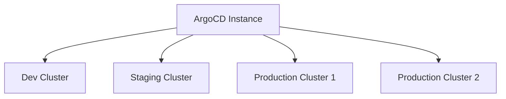
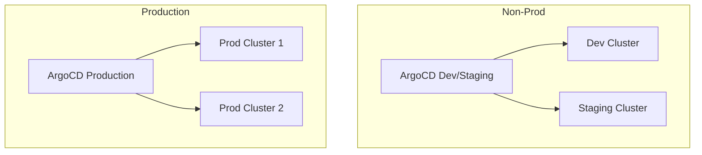
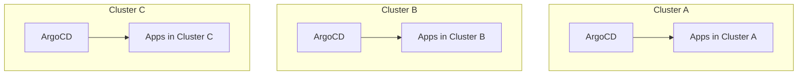

# How Many ArgoCD Instances Should I Run?

Author: [nawazdhandala](https://github.com/nawazdhandala)

Tags: ArgoCD, GitOps, Kubernetes, Architecture, Scaling

Description: Decide whether to run one centralized ArgoCD instance or multiple instances based on team size, cluster count, security requirements, and operational complexity.

---

This question comes up in every organization that grows beyond a couple of Kubernetes clusters. Should you run one ArgoCD instance that manages all clusters? One per cluster? One per team? One per environment? The answer depends on your scale, security requirements, and operational preferences.

Let me walk through the trade-offs and give you practical guidance based on real-world patterns I have seen work.

## Option 1: Single Centralized Instance

One ArgoCD instance manages all clusters and all environments.



**When this works:**
- You have fewer than 10 clusters
- Fewer than 500 Applications total
- A single platform team manages everything
- You want the simplest possible setup

**When this breaks down:**
- Single point of failure for all deployments
- If ArgoCD goes down, no environment can deploy
- Security boundary is weaker (ArgoCD has credentials to all clusters)
- Performance degrades with many Applications

This is the right starting point for most organizations. Do not over-engineer the setup until you actually hit the limits.

## Option 2: One Instance Per Environment

Separate ArgoCD instances for different environments.



**When this works:**
- You need strict environment isolation
- Production deployments require different approval workflows
- Compliance requires separation between environments
- You want to test ArgoCD upgrades in non-prod first

**Trade-offs:**
- Two instances to maintain instead of one
- Configuration needs to be kept in sync between instances
- More operational overhead

This is the most common pattern for organizations with regulatory requirements. The production ArgoCD instance only has production cluster credentials, reducing the blast radius of a compromise.

## Option 3: One Instance Per Cluster (Hub-and-Spoke)

Each cluster runs its own ArgoCD instance that only manages local resources.



**When this works:**
- Each cluster is independent (different teams, different regions)
- You want maximum isolation
- No cross-cluster dependency for deployments
- Edge computing scenarios

**Trade-offs:**
- N instances to manage for N clusters
- No centralized view of all deployments
- More operational overhead per cluster
- Harder to enforce consistent configuration

A variation of this is the hub-and-spoke pattern where a central ArgoCD manages the ArgoCD instances on each cluster:

```yaml
# Central ArgoCD deploys ArgoCD to each cluster
apiVersion: argoproj.io/v1alpha1
kind: Application
metadata:
  name: argocd-cluster-a
  namespace: argocd
spec:
  source:
    repoURL: https://github.com/org/argocd-config.git
    path: argocd-install/cluster-a
  destination:
    server: https://cluster-a-api:6443
    namespace: argocd
```

## Option 4: Per-Team Instances

Different teams get their own ArgoCD instances.

**When this works:**
- Teams need full autonomy over their deployment tool
- Different teams have different deployment workflows
- You want to prevent noisy-neighbor issues

**When this is overkill:**
- Almost always. Use ArgoCD Projects and RBAC instead.

ArgoCD Projects provide team isolation without running separate instances:

```yaml
apiVersion: argoproj.io/v1alpha1
kind: AppProject
metadata:
  name: team-payments
  namespace: argocd
spec:
  sourceRepos:
    - 'https://github.com/org/payments-*'
  destinations:
    - namespace: 'payments-*'
      server: https://kubernetes.default.svc
  roles:
    - name: admin
      policies:
        - p, proj:team-payments:admin, applications, *, team-payments/*, allow
      groups:
        - payments-team
```

## Scaling a Single Instance

Before adding more instances, make sure you have tuned the existing one. ArgoCD can handle a lot more than people think.

### Increase Controller Sharding

The application controller can be sharded across multiple replicas, each handling a subset of Applications:

```yaml
# ArgoCD Helm values
controller:
  replicas: 3
  env:
    - name: ARGOCD_CONTROLLER_REPLICAS
      value: "3"
```

### Increase Repo Server Replicas

The repo server handles manifest generation and can be a bottleneck:

```yaml
repoServer:
  replicas: 3
  resources:
    requests:
      cpu: "1"
      memory: 1Gi
    limits:
      cpu: "2"
      memory: 2Gi
```

### Configure Redis for HA

```yaml
redis-ha:
  enabled: true
  replicas: 3
```

### Tune Reconciliation Intervals

If you do not need instant sync, increasing the reconciliation interval reduces load:

```yaml
# argocd-cm
data:
  timeout.reconciliation: 300s  # 5 minutes instead of default 3
```

### Application Controller Processing Budget

Control how many Applications the controller processes simultaneously:

```yaml
controller:
  env:
    - name: ARGOCD_APPLICATION_CONTROLLER_STATUS_PROCESSORS
      value: "50"
    - name: ARGOCD_APPLICATION_CONTROLLER_OPERATION_PROCESSORS
      value: "25"
```

## Performance Benchmarks

Here are rough numbers based on community reports and my experience:

| Applications | Clusters | Recommended Setup |
|-------------|----------|-------------------|
| 1 to 100 | 1 to 5 | Single instance, default resources |
| 100 to 500 | 5 to 20 | Single instance, scaled resources, controller sharding |
| 500 to 2000 | 20 to 50 | 2 to 3 instances (per environment or region) |
| 2000+ | 50+ | Multiple instances with hub-and-spoke |

These are guidelines, not hard limits. Your mileage varies based on manifest complexity, sync frequency, and cluster size.

## Decision Framework

Ask these questions to decide:

1. **Do you have regulatory requirements for environment separation?**
   - Yes: Separate instances for prod vs non-prod at minimum

2. **Do you have more than 500 Applications?**
   - Yes: Consider sharding or multiple instances

3. **Do different clusters need different ArgoCD versions?**
   - Yes: Per-cluster instances

4. **Do you need a single pane of glass across all clusters?**
   - Yes: Single or centralized instance with multi-cluster support

5. **Is ArgoCD availability critical for all environments?**
   - Yes: At least separate prod and non-prod to avoid blast radius

## My Recommendation

For most organizations:

1. **Start with one instance** managing everything
2. **Split to two instances** (prod and non-prod) when you hit compliance requirements or 300+ Applications
3. **Add regional instances** only when network latency to remote clusters becomes a problem
4. **Never do per-team instances** unless you have a very specific reason - use Projects and RBAC instead

The overhead of managing multiple ArgoCD instances is real. Each instance needs monitoring, backup, upgrades, and operational runbooks. Do not split until the pain of a single instance outweighs the pain of managing multiple ones.

For monitoring your ArgoCD instances at scale, [OneUptime](https://oneuptime.com) can help you track the health, sync status, and performance of each instance from a single dashboard.
