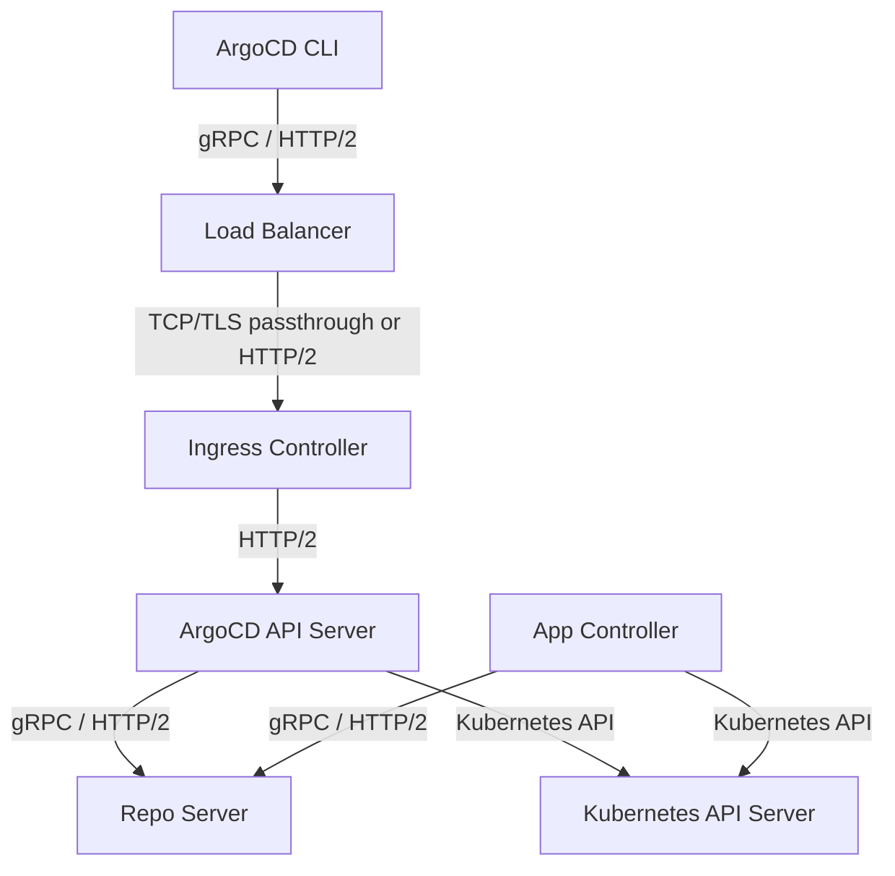

# How to Configure ArgoCD with HTTP/2

Author: [nawazdhandala](https://github.com/nawazdhandala)

Tags: ArgoCD, GitOps, Kubernetes, HTTP/2, Networking

Description: A practical guide to configuring ArgoCD with HTTP/2 for optimal gRPC performance, covering ingress controllers, load balancers, and TLS configuration.

---

ArgoCD exposes a gRPC/REST API through the API server, and the CLI uses native gRPC by default. Since gRPC is built on top of HTTP/2, getting HTTP/2 working correctly through your external network path is essential for native CLI performance. This guide walks through configuring HTTP/2 end-to-end with ArgoCD.

## Why HTTP/2 Matters for ArgoCD

HTTP/2 provides several features that gRPC depends on:

- Multiplexed streams over a single TCP connection
- Binary framing for efficient data transfer
- Full-duplex streaming
- Header compression via HPACK

When any component in the network path downgrades to HTTP/1.1, gRPC connections will fail unless you have gRPC-Web configured as a fallback. Understanding where HTTP/2 is needed and where it can be negotiated helps you build a reliable ArgoCD deployment.


```mermaid
graph TD
    A[ArgoCD CLI] -->|gRPC / HTTP/2| B[Load Balancer]
    B -->|TCP/TLS passthrough or HTTP/2| C[Ingress Controller]
    C -->|HTTP/2| D[ArgoCD API Server]
    D -->|gRPC / HTTP/2| E[Repo Server]
    F[App Controller] -->|gRPC / HTTP/2| E
    D -->|Kubernetes API| G[Kubernetes API Server]
    F -->|Kubernetes API| G
```

## ArgoCD's Internal HTTP/2 Communication

ArgoCD components use gRPC for several internal API calls. The key internal connections include:

- **API Server to Repo Server**: gRPC over HTTP/2 on port 8081
- **Application Controller to Repo Server**: gRPC over HTTP/2 on port 8081
- **Application Controller and API Server to Kubernetes**: Kubernetes API calls, not ArgoCD gRPC

These internal connections typically work without any special configuration because they communicate directly within the cluster. The challenge arises with external access to the API server.

## Configuring NGINX Ingress for HTTP/2

NGINX Ingress Controller supports HTTP/2 backend connections. If you terminate TLS at ingress-nginx, run the ArgoCD API server with TLS disabled (`--insecure` or `server.insecure: "true"`), then tell ingress-nginx which backend protocol to use:

```yaml
# NGINX Ingress with HTTP/2 backend for ArgoCD gRPC

apiVersion: networking.k8s.io/v1
kind: Ingress
metadata:
  name: argocd-server-grpc
  namespace: argocd
  annotations:
    # Tell NGINX the backend speaks gRPC (HTTP/2)
    nginx.ingress.kubernetes.io/backend-protocol: "GRPC"
    nginx.ingress.kubernetes.io/force-ssl-redirect: "true"
spec:
  ingressClassName: nginx
  tls:
    - hosts:
        - grpc.argocd.example.com
      secretName: argocd-ingress-grpc
  rules:
    - host: grpc.argocd.example.com
      http:
        paths:
          - path: /
            pathType: Prefix
            backend:
              service:
                name: argocd-server
                port:
                  name: https
```

For the web UI, you need a separate ingress since ingress-nginx allows only one backend protocol annotation per Ingress object:

```yaml
# NGINX Ingress for ArgoCD Web UI (HTTPS backend)
apiVersion: networking.k8s.io/v1
kind: Ingress
metadata:
  name: argocd-server-https
  namespace: argocd
  annotations:
    nginx.ingress.kubernetes.io/backend-protocol: "HTTP"
    # Important: force SSL redirect
    nginx.ingress.kubernetes.io/force-ssl-redirect: "true"
spec:
  ingressClassName: nginx
  tls:
    - hosts:
        - argocd.example.com
      secretName: argocd-ingress-http
  rules:
    - host: argocd.example.com
      http:
        paths:
          - path: /
            pathType: Prefix
            backend:
              service:
                name: argocd-server
                port:
                  name: http
```

Then configure the CLI to use the gRPC endpoint:

```bash
# Login to ArgoCD using the dedicated gRPC endpoint
argocd login grpc.argocd.example.com
```

## Using SSL Passthrough for Full HTTP/2

SSL passthrough lets the ingress controller forward encrypted traffic directly to ArgoCD without terminating TLS. This preserves HTTP/2 ALPN negotiation end-to-end:

```yaml
# NGINX Ingress with SSL passthrough for ArgoCD
apiVersion: networking.k8s.io/v1
kind: Ingress
metadata:
  name: argocd-server-passthrough
  namespace: argocd
  annotations:
    nginx.ingress.kubernetes.io/force-ssl-redirect: "true"
    # Enable SSL passthrough - the ingress does not terminate TLS
    nginx.ingress.kubernetes.io/ssl-passthrough: "true"
spec:
  ingressClassName: nginx
  rules:
    - host: argocd.example.com
      http:
        paths:
          - path: /
            pathType: Prefix
            backend:
              service:
                name: argocd-server
                port:
                  name: https
```

With SSL passthrough, the ArgoCD server handles TLS termination and ALPN negotiation directly. This is the simplest way to get HTTP/2 working end-to-end, but it means the ingress controller cannot inspect or route traffic based on HTTP headers.

Make sure the NGINX Ingress Controller has SSL passthrough enabled:

```bash
# Check if SSL passthrough is enabled on the NGINX Ingress Controller
kubectl get deploy -n ingress-nginx ingress-nginx-controller \
  -o jsonpath='{.spec.template.spec.containers[0].args}' | tr ',' '\n'

# If not enabled, patch the deployment
kubectl patch deploy -n ingress-nginx ingress-nginx-controller \
  --type=json \
  -p='[{"op":"add","path":"/spec/template/spec/containers/0/args/-","value":"--enable-ssl-passthrough"}]'
```

## Configuring Traefik for HTTP/2

Traefik supports HTTP/2 and works well with ArgoCD. Run the API server with TLS disabled (`--insecure` or `server.insecure: "true"`), then create an IngressRoute:

```yaml
# Traefik IngressRoute for ArgoCD with HTTP/2
apiVersion: traefik.io/v1alpha1
kind: IngressRoute
metadata:
  name: argocd-server
  namespace: argocd
spec:
  entryPoints:
    - websecure
  routes:
    - match: Host(`argocd.example.com`)
      kind: Rule
      services:
        - name: argocd-server
          port: 80
      middlewares: []
    - match: Host(`argocd.example.com`) && Header(`Content-Type`, `application/grpc`)
      kind: Rule
      services:
        - name: argocd-server
          port: 80
          # Enable cleartext HTTP/2 to the backend for gRPC
          scheme: h2c
      middlewares: []
  tls:
    certResolver: letsencrypt
```

For the gRPC route, `h2c` means HTTP/2 cleartext to the backend:

```yaml
# Traefik with h2c for insecure ArgoCD backend
services:
  - name: argocd-server
    port: 80
    scheme: h2c
```

## Configuring Istio for HTTP/2

Istio natively supports HTTP/2 and gRPC. If you terminate TLS at the Istio gateway, run the ArgoCD API server with TLS disabled (`--insecure` or `server.insecure: "true"`), then configure a VirtualService, Gateway, and DestinationRule:

```yaml
# Istio Gateway for ArgoCD
apiVersion: networking.istio.io/v1beta1
kind: Gateway
metadata:
  name: argocd-gateway
  namespace: argocd
spec:
  selector:
    istio: ingressgateway
  servers:
    - port:
        number: 443
        name: https
        protocol: HTTPS
      tls:
        mode: SIMPLE
        credentialName: argocd-tls
      hosts:
        - argocd.example.com
---
# Istio VirtualService for ArgoCD
apiVersion: networking.istio.io/v1beta1
kind: VirtualService
metadata:
  name: argocd-server
  namespace: argocd
spec:
  hosts:
    - argocd.example.com
  gateways:
    - argocd-gateway
  http:
    - match:
        - headers:
            content-type:
              prefix: application/grpc
      route:
        - destination:
            host: argocd-server
            port:
              number: 80
    - route:
        - destination:
            host: argocd-server
            port:
              number: 80
---
# Istio DestinationRule to use HTTP/2 to the backend
apiVersion: networking.istio.io/v1beta1
kind: DestinationRule
metadata:
  name: argocd-server
  namespace: argocd
spec:
  host: argocd-server
  trafficPolicy:
    connectionPool:
      http:
        h2UpgradePolicy: UPGRADE
```

Istio can automatically detect HTTP/2 in sidecars, but gateways forward HTTP requests to backends as HTTP/1.1 unless you explicitly select HTTP/2 or gRPC for the backend service port, or configure the gateway to use the client protocol.

## Configuring AWS Network Load Balancer

AWS NLB operates at Layer 4 (TCP) and passes traffic through without protocol inspection. This preserves HTTP/2:

```yaml
# Kubernetes Service with AWS NLB for ArgoCD
apiVersion: v1
kind: Service
metadata:
  name: argocd-server-nlb
  namespace: argocd
  annotations:
    # Use NLB instead of CLB
    service.beta.kubernetes.io/aws-load-balancer-type: "external"
    service.beta.kubernetes.io/aws-load-balancer-nlb-target-type: "instance"
    # Use external scheme for public access
    service.beta.kubernetes.io/aws-load-balancer-scheme: "internet-facing"
    # Enable cross-zone load balancing
    service.beta.kubernetes.io/aws-load-balancer-attributes: "load_balancing.cross_zone.enabled=true"
spec:
  type: LoadBalancer
  selector:
    app.kubernetes.io/name: argocd-server
  ports:
    - name: https
      port: 443
      targetPort: 8080
      protocol: TCP
```

Since NLB is a TCP load balancer, HTTP/2 negotiation happens directly between the client and ArgoCD server. This is the recommended approach on AWS for full gRPC support.

## Verifying HTTP/2 Connectivity

Test that HTTP/2 is working properly:

```bash
# Test HTTP/2 support using curl
curl -v --http2 https://argocd.example.com/healthz 2>&1 | grep -i "http/2"

# Test gRPC connectivity with grpcurl
grpcurl -insecure argocd.example.com:443 list

# Test with the ArgoCD CLI
argocd login argocd.example.com --insecure
argocd app list
```

## Troubleshooting HTTP/2 Issues

**ALPN negotiation failure**: Ensure your TLS certificates are valid and the server supports ALPN. Check with OpenSSL:

```bash
# Check ALPN negotiation
openssl s_client -connect argocd.example.com:443 -alpn h2 2>/dev/null | grep "ALPN"
```

**Connection drops after 60 seconds**: Some load balancers have idle timeout settings that close connections. Increase the idle timeout or enable keepalive:

```yaml
# NGINX keepalive configuration for gRPC
nginx.ingress.kubernetes.io/proxy-read-timeout: "3600"
nginx.ingress.kubernetes.io/proxy-send-timeout: "3600"
```

**Fallback option**: If HTTP/2 end-to-end proves difficult in your environment, consider using [gRPC-Web](https://oneuptime.com/blog/post/2026-02-26-argocd-grpc-web-server-configuration/view) as a compatible alternative that works over HTTP/1.1.

## Summary

Getting HTTP/2 working with ArgoCD requires attention to every component in the network path - from the client through load balancers and ingress controllers to the ArgoCD server itself. SSL passthrough is the simplest approach, while dedicated gRPC ingress rules give you more control. For environments where HTTP/2 is not feasible, gRPC-Web provides a solid fallback. Choose the approach that best fits your infrastructure.
