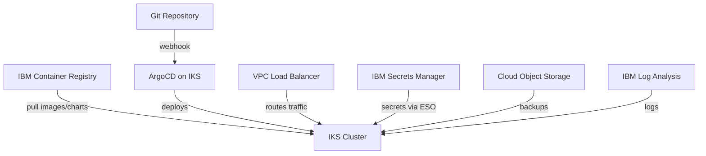

# How to Use ArgoCD with IBM Cloud Kubernetes Service

Author: [nawazdhandala](https://github.com/nawazdhandala)

Tags: ArgoCD, GitOps, Kubernetes, IBM Cloud, IKS

Description: Learn how to deploy ArgoCD on IBM Cloud Kubernetes Service with container registry, secrets manager, and VPC load balancer integration.

---

IBM Cloud Kubernetes Service (IKS) is IBM's managed Kubernetes offering that runs on their global infrastructure. It is particularly popular in enterprise environments where teams already use IBM Cloud services, need access to IBM's AI and data platform, or have compliance requirements that IBM's certifications satisfy. Running ArgoCD on IKS gives you a GitOps workflow integrated with IBM Cloud's ecosystem.

This guide walks through deploying ArgoCD on IKS, integrating it with IBM Cloud Container Registry (ICR), IBM Cloud Secrets Manager, and configuring networking with VPC load balancers.

## Prerequisites

- An IBM Cloud account
- An IKS cluster (VPC or Classic infrastructure)
- IBM Cloud CLI with the Kubernetes Service plugin
- kubectl configured with your IKS cluster

## Step 1: Connect to Your IKS Cluster

```bash
# Login to IBM Cloud
ibmcloud login

# Set the cluster context
ibmcloud ks cluster config --cluster my-iks-cluster

# Verify the connection
kubectl get nodes
```

## Step 2: Install ArgoCD

ArgoCD installs on IKS without modifications.

```bash
# Create namespace and install
kubectl create namespace argocd
kubectl apply -n argocd -f https://raw.githubusercontent.com/argoproj/argo-cd/stable/manifests/install.yaml

# Wait for ready state
kubectl wait --for=condition=Ready pod --all -n argocd --timeout=300s

# Get initial admin password
kubectl -n argocd get secret argocd-initial-admin-secret \
  -o jsonpath="{.data.password}" | base64 -d && echo
```

## Step 3: Expose ArgoCD with IBM Cloud Load Balancer

### For VPC Clusters

VPC clusters on IBM Cloud use VPC load balancers.

```yaml
# argocd-vpc-lb.yaml
apiVersion: v1
kind: Service
metadata:
  name: argocd-server-lb
  namespace: argocd
  annotations:
    # IBM Cloud VPC load balancer annotations
    service.kubernetes.io/ibm-load-balancer-cloud-provider-enable-features: "proxy-protocol"
    service.kubernetes.io/ibm-load-balancer-cloud-provider-ip-type: "public"
    service.kubernetes.io/ibm-load-balancer-cloud-provider-vpc-lb-name: "argocd-lb"
spec:
  type: LoadBalancer
  ports:
    - name: https
      port: 443
      targetPort: 8080
      protocol: TCP
  selector:
    app.kubernetes.io/name: argocd-server
```

### For Classic Infrastructure Clusters

Classic clusters use Cloudflare-based Ingress ALBs that are built in.

```bash
# Check the Ingress subdomain assigned to your cluster
ibmcloud ks cluster get --cluster my-iks-cluster | grep "Ingress Subdomain"
```

Create an ingress rule using the IBM-provided subdomain.

```yaml
# argocd-ingress-classic.yaml
apiVersion: networking.k8s.io/v1
kind: Ingress
metadata:
  name: argocd-server
  namespace: argocd
  annotations:
    nginx.ingress.kubernetes.io/ssl-passthrough: "true"
    nginx.ingress.kubernetes.io/backend-protocol: "HTTPS"
spec:
  ingressClassName: public-iks-k8s-nginx
  rules:
    - host: argocd.my-cluster-xxxx.us-south.containers.appdomain.cloud
      http:
        paths:
          - path: /
            pathType: Prefix
            backend:
              service:
                name: argocd-server
                port:
                  number: 443
```

## Step 4: Integrate with IBM Cloud Container Registry

IBM Cloud Container Registry (ICR) is IBM's managed container image registry with built-in vulnerability scanning.

### Set Up Image Pull Secrets

IKS clusters have a built-in `all-icr-io` image pull secret. Verify it exists.

```bash
# Check for the default ICR pull secret
kubectl get secrets -n default | grep all-icr-io

# Copy the secret to the namespace where your apps will be deployed
kubectl get secret all-icr-io -n default -o yaml | \
  sed 's/namespace: default/namespace: my-app/' | \
  kubectl apply -f -
```

### Configure ArgoCD to Pull Helm Charts from ICR

```yaml
# icr-repo-secret.yaml
apiVersion: v1
kind: Secret
metadata:
  name: icr-helm-repo
  namespace: argocd
  labels:
    argocd.argoproj.io/secret-type: repository
stringData:
  type: helm
  name: icr-charts
  enableOCI: "true"
  # ICR endpoint varies by region
  url: us.icr.io/my-namespace
  username: iamapikey
  password: "<IBM_CLOUD_API_KEY>"
```

### Push Helm Charts to ICR

```bash
# Login to ICR
ibmcloud cr login

# Create a namespace in ICR
ibmcloud cr namespace-add my-charts

# Push a Helm chart
helm push my-chart-1.0.0.tgz oci://us.icr.io/my-charts
```

## Step 5: Integrate with IBM Cloud Secrets Manager

IBM Cloud Secrets Manager stores and manages secrets centrally. Use External Secrets Operator to bridge it with Kubernetes.

### Deploy External Secrets Operator

```yaml
# eso-app.yaml
apiVersion: argoproj.io/v1alpha1
kind: Application
metadata:
  name: external-secrets
  namespace: argocd
spec:
  project: default
  source:
    repoURL: https://charts.external-secrets.io
    chart: external-secrets
    targetRevision: 0.9.x
    helm:
      values: |
        installCRDs: true
  destination:
    server: https://kubernetes.default.svc
    namespace: external-secrets
  syncPolicy:
    automated:
      prune: true
      selfHeal: true
    syncOptions:
      - CreateNamespace=true
```

### Configure the IBM Cloud SecretStore

```yaml
# ibm-secret-store.yaml
apiVersion: external-secrets.io/v1beta1
kind: ClusterSecretStore
metadata:
  name: ibm-secrets-manager
spec:
  provider:
    ibm:
      serviceUrl: https://us-south.secrets-manager.cloud.ibm.com
      auth:
        secretRef:
          secretApiKeySecretRef:
            name: ibm-cloud-creds
            namespace: external-secrets
            key: api-key
```

### Create the IBM Cloud Credentials Secret

```bash
# Create the API key secret for ESO
kubectl create secret generic ibm-cloud-creds \
  --namespace external-secrets \
  --from-literal=api-key="<IBM_CLOUD_API_KEY>"
```

### Reference Secrets in Your Applications

```yaml
# app-external-secret.yaml
apiVersion: external-secrets.io/v1beta1
kind: ExternalSecret
metadata:
  name: my-app-secrets
  namespace: my-app
spec:
  refreshInterval: 5m
  secretStoreRef:
    name: ibm-secrets-manager
    kind: ClusterSecretStore
  target:
    name: my-app-secrets
    creationPolicy: Owner
  data:
    - secretKey: db-password
      remoteRef:
        key: arbitrary/my-app/db-password
        property: payload
    - secretKey: api-key
      remoteRef:
        key: arbitrary/my-app/api-key
        property: payload
```

## Architecture on IBM Cloud



## Step 6: Set Up Logging and Monitoring

IKS integrates with IBM Cloud Logging and Monitoring. Deploy the agents through ArgoCD.

```yaml
# ibm-logging-app.yaml
apiVersion: argoproj.io/v1alpha1
kind: Application
metadata:
  name: ibm-logging-agent
  namespace: argocd
spec:
  project: default
  source:
    repoURL: https://github.com/my-org/cluster-config
    path: logging
    targetRevision: main
  destination:
    server: https://kubernetes.default.svc
    namespace: ibm-observe
  syncPolicy:
    automated:
      prune: true
      selfHeal: true
    syncOptions:
      - CreateNamespace=true
```

## IKS-Specific Tips

### Worker Pool Sizing

For ArgoCD workloads, choose worker pool flavors that balance CPU and memory.

```bash
# List available flavors
ibmcloud ks flavors --zone us-south-1

# Good starting point for ArgoCD
# bx2.4x16 (4 vCPU, 16GB RAM) for small to medium deployments
# bx2.8x32 (8 vCPU, 32GB RAM) for larger deployments
```

### IBM Cloud Satellite

If you need to run ArgoCD across multiple locations including on-premises, IBM Cloud Satellite extends IKS to any infrastructure.

```bash
# List Satellite locations
ibmcloud sat location ls
```

You can register Satellite clusters as ArgoCD targets for unified multi-location deployments.

### VPC Security Groups

Make sure ArgoCD pods can reach external Git repositories and container registries through VPC security groups.

```bash
# List security groups
ibmcloud is security-groups

# Add an outbound rule for HTTPS
ibmcloud is security-group-rule-add <SG_ID> outbound tcp \
  --port-min 443 --port-max 443 --remote 0.0.0.0/0
```

## Troubleshooting on IKS

### Image Pull Errors

ICR requires the `iamapikey` username format for authentication.

```bash
# Verify ICR credentials
ibmcloud cr login
ibmcloud cr images --restrict my-namespace
```

### Load Balancer Provisioning Issues

VPC load balancers require the worker nodes to be in a subnet with a public gateway.

```bash
# Check load balancer status
ibmcloud is load-balancers
kubectl describe svc argocd-server-lb -n argocd
```

### Cluster Add-on Conflicts

IKS has built-in add-ons that may conflict with ArgoCD-managed components. Check for conflicts.

```bash
# List cluster add-ons
ibmcloud ks cluster addon ls --cluster my-iks-cluster
```

## Conclusion

IBM Cloud Kubernetes Service provides a robust, enterprise-grade platform for running ArgoCD. The native integration with IBM Cloud Container Registry, Secrets Manager, and VPC networking makes the setup relatively straightforward. While IKS might not be the first choice for greenfield projects, for organizations already invested in the IBM Cloud ecosystem, it is a natural fit. The combination of ArgoCD's GitOps capabilities with IBM's enterprise features like Satellite for multi-location deployments creates a powerful platform for managing Kubernetes workloads at scale.
