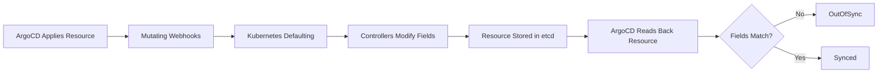

# How to Make ArgoCD Ignore Certain Resource Fields

Author: [nawazdhandala](https://github.com/nawazdhandala)

Tags: ArgoCD, GitOps, Kubernetes, Configuration, Resource Diff

Description: Learn how to configure ArgoCD to ignore specific resource fields during diff comparison, preventing false OutOfSync status from controller-managed fields, defaults, and mutations.

---

One of the most common complaints about ArgoCD is that applications show "OutOfSync" even when no one has changed anything. This happens because Kubernetes controllers, mutating webhooks, and default values modify resources after ArgoCD applies them. ArgoCD detects these changes as drift and reports the application as out of sync. The solution is to tell ArgoCD which fields to ignore. This guide covers every method available for ignoring resource fields.

## Why Fields Change After Apply

When ArgoCD applies a resource, several things can modify it before ArgoCD sees it again.



Common fields that change include:

- **Replicas:** Modified by Horizontal Pod Autoscaler
- **Resource requests/limits:** Modified by Vertical Pod Autoscaler
- **Annotations:** Added by Istio, Linkerd, Vault, cert-manager
- **Labels:** Added by various controllers
- **Default values:** Added by Kubernetes API server (e.g., `terminationGracePeriodSeconds`, `dnsPolicy`)
- **Status fields:** Should never be compared but sometimes are

## Method 1: Per-Application ignoreDifferences

The most common approach. Define fields to ignore in the Application spec.

### Using JSON Pointers

JSON Pointers (RFC 6901) identify specific fields in a JSON document.

```yaml
apiVersion: argoproj.io/v1alpha1
kind: Application
metadata:
  name: my-app
  namespace: argocd
spec:
  source:
    repoURL: https://github.com/org/repo.git
    path: k8s/production
    targetRevision: main
  destination:
    server: https://kubernetes.default.svc
    namespace: production
  ignoreDifferences:
  # Ignore replicas on all Deployments (HPA manages this)
  - group: apps
    kind: Deployment
    jsonPointers:
    - /spec/replicas

  # Ignore a specific annotation on a specific Deployment
  - group: apps
    kind: Deployment
    name: my-specific-deployment
    jsonPointers:
    - /metadata/annotations/sidecar.istio.io~1status

  # Ignore labels on all Services
  - group: ""
    kind: Service
    jsonPointers:
    - /metadata/labels

  # Ignore the caBundle field on MutatingWebhookConfigurations
  - group: admissionregistration.k8s.io
    kind: MutatingWebhookConfiguration
    jsonPointers:
    - /webhooks/0/clientConfig/caBundle
    - /webhooks/1/clientConfig/caBundle
```

Note that `/` in field names must be escaped as `~1` in JSON Pointers. For example, the annotation `sidecar.istio.io/status` becomes `sidecar.istio.io~1status`.

### Using JQ Path Expressions

JQ path expressions are more powerful than JSON Pointers. They support wildcards, array indexing, and conditional matching.

```yaml
ignoreDifferences:
# Ignore resource requests on all containers in all Deployments
- group: apps
  kind: Deployment
  jqPathExpressions:
  - .spec.template.spec.containers[].resources.requests

# Ignore a specific annotation using a pattern
- group: apps
  kind: Deployment
  jqPathExpressions:
  - .metadata.annotations["kubectl.kubernetes.io/last-applied-configuration"]

# Ignore all annotations matching a pattern
- group: apps
  kind: Deployment
  jqPathExpressions:
  - '.metadata.annotations | to_entries | map(select(.key | startswith("sidecar.istio.io"))) | from_entries'

# Ignore init containers added by Vault
- group: apps
  kind: Deployment
  jqPathExpressions:
  - .spec.template.spec.initContainers

# Ignore the status field on any resource
- group: "*"
  kind: "*"
  jqPathExpressions:
  - .status
```

## Method 2: System-Level ignoreDifferences

For rules that should apply to all applications, configure them in the `argocd-cm` ConfigMap.

```yaml
apiVersion: v1
kind: ConfigMap
metadata:
  name: argocd-cm
  namespace: argocd
data:
  # Ignore differences for all Deployments in all applications
  resource.customizations.ignoreDifferences.apps_Deployment: |
    jsonPointers:
    - /spec/replicas
    jqPathExpressions:
    - .spec.template.metadata.annotations["kubectl.kubernetes.io/restartedAt"]

  # Ignore differences for all MutatingWebhookConfigurations
  resource.customizations.ignoreDifferences.admissionregistration.k8s.io_MutatingWebhookConfiguration: |
    jqPathExpressions:
    - .webhooks[]?.clientConfig.caBundle

  # Ignore differences for all resources (use with caution)
  resource.customizations.ignoreDifferences.all: |
    managedFieldsManagers:
    - kube-controller-manager
    - kube-scheduler
    jsonPointers:
    - /status
```

The naming convention for system-level rules is `resource.customizations.ignoreDifferences.<group>_<kind>`. Use `all` for rules that apply to every resource.

### Using managedFieldsManagers

This is the most elegant approach for ignoring fields managed by other controllers. Instead of listing specific fields, you tell ArgoCD to ignore all fields managed by a specific controller.

```yaml
resource.customizations.ignoreDifferences.all: |
  managedFieldsManagers:
  - kube-controller-manager    # Kubernetes built-in controllers
  - cluster-autoscaler         # Cluster autoscaler
  - vpa-recommender            # Vertical Pod Autoscaler
  - hpa-controller             # Horizontal Pod Autoscaler
```

This uses Kubernetes Server-Side Apply field ownership to determine which fields to ignore. The controller name must match the `manager` field in the resource's `.metadata.managedFields`.

```bash
# Find manager names for a specific resource
kubectl get deployment my-app -n production -o json | jq '.metadata.managedFields[].manager'
```

## Method 3: Server-Side Diff

Server-Side Diff offloads the comparison to the Kubernetes API server, which inherently handles defaulting and mutation correctly.

```yaml
# Enable per-application
apiVersion: argoproj.io/v1alpha1
kind: Application
metadata:
  name: my-app
  annotations:
    argocd.argoproj.io/compare-option: ServerSideDiff=true
```

```yaml
# Enable globally
apiVersion: v1
kind: ConfigMap
metadata:
  name: argocd-cm
  namespace: argocd
data:
  controller.diff.server.side: "true"
```

Server-Side Diff resolves most false OutOfSync issues automatically because the API server knows exactly what the resource would look like after defaulting and mutation.

## Method 4: RespectIgnoreDifferences in Sync

By default, `ignoreDifferences` only affects the sync status display. The actual sync operation still applies all fields, which means the "ignored" fields get overwritten on every sync. To make sync respect the ignore rules, enable `RespectIgnoreDifferences`.

```yaml
apiVersion: argoproj.io/v1alpha1
kind: Application
metadata:
  name: my-app
spec:
  ignoreDifferences:
  - group: apps
    kind: Deployment
    jsonPointers:
    - /spec/replicas
  syncPolicy:
    syncOptions:
    # Don't overwrite ignored fields during sync
    - RespectIgnoreDifferences=true
```

This is critical when combining ArgoCD with HPA. Without `RespectIgnoreDifferences`, every sync resets the replica count to the value in Git, overriding the HPA's scaling decision.

## Common Scenarios

### HPA-Managed Replicas

```yaml
ignoreDifferences:
- group: apps
  kind: Deployment
  jsonPointers:
  - /spec/replicas
syncPolicy:
  syncOptions:
  - RespectIgnoreDifferences=true
```

### Istio Sidecar Injection

```yaml
ignoreDifferences:
- group: apps
  kind: Deployment
  jqPathExpressions:
  - .spec.template.metadata.annotations["sidecar.istio.io/status"]
  - .spec.template.metadata.labels["security.istio.io/tlsMode"]
  - .spec.template.spec.containers[] | select(.name == "istio-proxy")
  - .spec.template.spec.initContainers[] | select(.name == "istio-init")
  - .spec.template.spec.volumes[] | select(.name | startswith("istio-"))
```

### Cert-Manager Annotations

```yaml
ignoreDifferences:
- group: networking.k8s.io
  kind: Ingress
  jqPathExpressions:
  - .metadata.annotations["cert-manager.io/issuer-name"]
  - .metadata.annotations["cert-manager.io/issuer-kind"]
```

### VPA-Managed Resources

```yaml
ignoreDifferences:
- group: apps
  kind: Deployment
  jqPathExpressions:
  - .spec.template.spec.containers[].resources
syncPolicy:
  syncOptions:
  - RespectIgnoreDifferences=true
```

## Debugging Ignored Differences

If your ignore rules do not seem to work, debug them step by step.

```bash
# See the current diff
argocd app diff my-app

# Check if the ignore rules are being applied
argocd app get my-app -o yaml | grep -A 20 ignoreDifferences

# Verify the JSON pointer is correct
# Get the live resource and check the path exists
kubectl get deployment my-app -n production -o json | jq '.spec.replicas'
```

Common mistakes include wrong API group names (use empty string `""` for core resources), wrong kind capitalization, and missing `~1` escaping for slashes in annotation names.

## Summary

Start with server-side diff as it handles most cases automatically. For remaining false diffs, use `managedFieldsManagers` to ignore fields by controller ownership. For specific field overrides, use `jqPathExpressions` which are more flexible than JSON Pointers. Always enable `RespectIgnoreDifferences` when the ignored fields are managed by another controller that should retain its values during sync.
