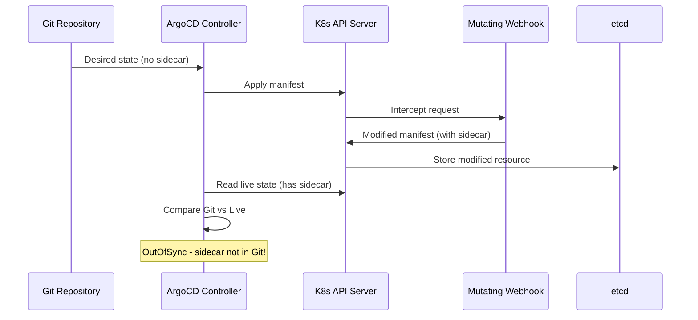

# How to Ignore MutatingWebhook-Injected Fields in ArgoCD

Author: [nawazdhandala](https://github.com/nawazdhandala)

Tags: ArgoCD, GitOps, Kubernetes, Webhooks, Diff Customization

Description: Learn how to configure ArgoCD to ignore fields injected by MutatingWebhookConfigurations so your applications stop showing false OutOfSync status.

---

If you have ever deployed an application with ArgoCD and seen it immediately flip to OutOfSync even though you just synced it, chances are a MutatingWebhook is the culprit. Mutating admission webhooks modify resources as they pass through the Kubernetes API server, injecting sidecar containers, labels, annotations, or entirely new fields that do not exist in your Git manifests. ArgoCD then compares Git state to live state, spots the difference, and reports OutOfSync.

This guide walks you through identifying webhook-injected fields and configuring ArgoCD to ignore them properly.

## What Are MutatingWebhooks?

MutatingAdmissionWebhooks intercept API requests to the Kubernetes API server and modify resources before they are persisted to etcd. Common examples include:

- **Istio sidecar injector** - adds a sidecar container, init containers, and volumes
- **Vault Agent injector** - adds init containers and annotations for secret injection
- **Linkerd proxy injector** - adds proxy containers and configuration volumes
- **AWS App Mesh injector** - adds Envoy sidecar containers
- **OPA/Gatekeeper** - may modify resource metadata



## Identifying Webhook-Injected Fields

Before configuring ignore rules, you need to know exactly what the webhook is adding. Start by checking the diff in ArgoCD.

### Using the CLI

```bash
# View the diff for a specific application
argocd app diff my-app

# Get detailed diff output
argocd app diff my-app --local /path/to/manifests
```

### Using the UI

Navigate to your application in the ArgoCD UI, click on an OutOfSync resource, and open the "Diff" tab. The yellow highlighted lines show what differs between Git and the live cluster.

### Checking What Webhooks Exist

```bash
# List all mutating webhooks in the cluster
kubectl get mutatingwebhookconfigurations

# Inspect a specific webhook to see what resources it targets
kubectl get mutatingwebhookconfiguration istio-sidecar-injector -o yaml
```

The output tells you which resource types and namespaces the webhook targets. This helps you scope your ignore rules correctly.

## Ignoring Istio Sidecar Injector Fields

The Istio sidecar injector is one of the most common sources of diff noise. It adds containers, volumes, init containers, and annotations to every Pod spec.

### Application-Level Configuration

Add `ignoreDifferences` to your ArgoCD Application spec:

```yaml
apiVersion: argoproj.io/v1alpha1
kind: Application
metadata:
  name: my-app
spec:
  source:
    repoURL: https://github.com/myorg/my-app.git
    targetRevision: main
    path: k8s
  destination:
    server: https://kubernetes.default.svc
    namespace: my-app
  ignoreDifferences:
    # Ignore sidecar container injected by Istio
    - group: apps
      kind: Deployment
      jsonPointers:
        - /spec/template/metadata/annotations/sidecar.istio.io~1inject
        - /spec/template/metadata/annotations/sidecar.istio.io~1status
        - /spec/template/metadata/labels/security.istio.io~1tlsMode
    # Ignore init containers and sidecar containers added by Istio
    - group: apps
      kind: Deployment
      jqPathExpressions:
        - .spec.template.spec.initContainers[] | select(.name == "istio-init")
        - .spec.template.spec.containers[] | select(.name == "istio-proxy")
        - .spec.template.spec.volumes[] | select(.name | startswith("istio-"))
```

### Handling Volume Mounts

Istio also injects volume mounts into your existing containers. This requires a more targeted approach:

```yaml
ignoreDifferences:
  - group: apps
    kind: Deployment
    jqPathExpressions:
      # Ignore volume mounts added to existing containers
      - .spec.template.spec.containers[].volumeMounts[] | select(.name | startswith("istio-"))
```

## Ignoring Vault Agent Injector Fields

HashiCorp Vault Agent injector adds init containers, annotations, and sometimes environment variables:

```yaml
ignoreDifferences:
  - group: apps
    kind: Deployment
    jsonPointers:
      - /spec/template/metadata/annotations/vault.hashicorp.com~1agent-inject-status
    jqPathExpressions:
      # Ignore Vault init containers
      - .spec.template.spec.initContainers[] | select(.name == "vault-agent-init")
      # Ignore Vault agent sidecar
      - .spec.template.spec.containers[] | select(.name == "vault-agent")
      # Ignore Vault-related volumes
      - .spec.template.spec.volumes[] | select(.name | startswith("vault-"))
```

## Ignoring Linkerd Proxy Injector Fields

Linkerd injects a proxy sidecar and related configuration:

```yaml
ignoreDifferences:
  - group: apps
    kind: Deployment
    jqPathExpressions:
      - .spec.template.spec.containers[] | select(.name == "linkerd-proxy")
      - .spec.template.spec.initContainers[] | select(.name == "linkerd-init")
      - .spec.template.spec.volumes[] | select(.name | startswith("linkerd-"))
    jsonPointers:
      - /spec/template/metadata/annotations/linkerd.io~1proxy-version
      - /spec/template/metadata/labels/linkerd.io~1proxy-deployment
```

## System-Level Ignore Rules

If a webhook affects resources across your entire cluster, configure the ignore rules at the system level instead of per-application. This goes in the `argocd-cm` ConfigMap:

```yaml
apiVersion: v1
kind: ConfigMap
metadata:
  name: argocd-cm
  namespace: argocd
data:
  resource.customizations.ignoreDifferences.all: |
    jsonPointers:
      - /spec/template/metadata/annotations/sidecar.istio.io~1inject
      - /spec/template/metadata/annotations/sidecar.istio.io~1status
  resource.customizations.ignoreDifferences.apps_Deployment: |
    jqPathExpressions:
      - .spec.template.spec.initContainers[] | select(.name == "istio-init")
      - .spec.template.spec.containers[] | select(.name == "istio-proxy")
```

The key format is `resource.customizations.ignoreDifferences.<group>_<kind>`. Use `all` to apply to every resource type.

## Using RespectIgnoreDifferences with Auto-Sync

When you enable auto-sync with pruning, ArgoCD may try to revert webhook-injected changes. To prevent this, enable the `RespectIgnoreDifferences` sync option:

```yaml
apiVersion: argoproj.io/v1alpha1
kind: Application
metadata:
  name: my-app
spec:
  syncPolicy:
    automated:
      prune: true
      selfHeal: true
    syncOptions:
      - RespectIgnoreDifferences=true
  ignoreDifferences:
    - group: apps
      kind: Deployment
      jqPathExpressions:
        - .spec.template.spec.containers[] | select(.name == "istio-proxy")
```

Without `RespectIgnoreDifferences`, ArgoCD's normalization step still detects changes and self-heal may trigger unnecessary syncs.

## Server-Side Diff for Better Webhook Handling

ArgoCD 2.10+ supports server-side diff, which sends your manifests through the API server's admission pipeline before comparing. This means webhook modifications are already applied to both sides of the diff:

```yaml
apiVersion: argoproj.io/v1alpha1
kind: Application
metadata:
  name: my-app
  annotations:
    # Enable server-side diff
    argocd.argoproj.io/compare-options: ServerSideDiff=true
spec:
  source:
    repoURL: https://github.com/myorg/my-app.git
    targetRevision: main
    path: k8s
  destination:
    server: https://kubernetes.default.svc
    namespace: my-app
```

Server-side diff often eliminates the need for `ignoreDifferences` rules for webhook-injected fields entirely, because the dry-run response already includes those fields. This is the recommended approach for new setups.

For more on server-side diff, see [How to Use Server-Side Diff in ArgoCD](https://oneuptime.com/blog/post/2026-02-09-argocd-server-side-apply/view).

## Debugging Webhook Ignore Rules

If your ignore rules are not working as expected:

```bash
# Check if the webhook is actually modifying your resource
kubectl get deployment my-app -o yaml | grep -A5 "istio"

# Verify the ArgoCD Application has the correct ignoreDifferences
argocd app get my-app -o yaml | grep -A20 "ignoreDifferences"

# Force a hard refresh to clear cached state
argocd app get my-app --hard-refresh

# Check the diff after refreshing
argocd app diff my-app
```

Common mistakes include:

- **Wrong JSON pointer escape**: Slashes in annotation keys must be escaped as `~1`. For example, `sidecar.istio.io/inject` becomes `sidecar.istio.io~1inject`
- **Wrong group/kind**: Make sure you are targeting the right API group. Deployments are in the `apps` group, not the core group
- **Missing jq select**: When ignoring array elements, use `select()` to target specific entries rather than ignoring the entire array

## Best Practices

1. **Start with server-side diff** - It handles most webhook scenarios automatically
2. **Scope rules narrowly** - Only ignore what you need to. Broad ignore rules can mask real drift
3. **Document why** - Add comments in your Application manifests explaining which webhook causes each ignored field
4. **Test after webhook updates** - When you upgrade Istio or Vault, the injected fields may change. Review your ignore rules after upgrades
5. **Monitor for new webhooks** - When teams install new operators with mutating webhooks, existing applications may need updated ignore rules

Webhook-injected fields are one of the most common reasons for false OutOfSync status in ArgoCD. By combining targeted `ignoreDifferences` rules with server-side diff, you can keep your sync status accurate without disabling important mutation logic.
