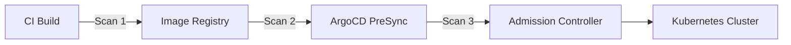

# How to Implement Image Scanning in ArgoCD Pipelines

Author: [nawazdhandala](https://github.com/nawazdhandala)

Tags: ArgoCD, GitOps, Kubernetes, Security, Container Scanning

Description: Learn how to integrate container image scanning into ArgoCD deployment pipelines using PreSync hooks, admission controllers, and CI/CD integration for vulnerability detection.

---

Container image scanning is a critical security practice that should happen before any image reaches your Kubernetes cluster. When using ArgoCD for deployments, you can integrate image scanning at multiple points in the pipeline to catch vulnerabilities before they hit production. This guide covers practical approaches to implementing image scanning within ArgoCD workflows.

## Where to Scan in the ArgoCD Pipeline

There are three main integration points for image scanning with ArgoCD:



1. **CI pipeline** - Scan during image build (before push)
2. **ArgoCD PreSync** - Scan before deployment sync
3. **Admission controller** - Block deployment at the API level

Each layer adds defense in depth. Let's implement all three.

## Scanning During CI with ArgoCD Image Updater

If you use ArgoCD Image Updater to automatically update image tags, add a scanning step that runs before the image is considered for update:

```yaml
# argocd-image-updater annotations on your Application
apiVersion: argoproj.io/v1alpha1
kind: Application
metadata:
  name: my-app
  namespace: argocd
  annotations:
    argocd-image-updater.argoproj.io/image-list: myapp=registry.example.com/myapp
    argocd-image-updater.argoproj.io/myapp.update-strategy: semver
    argocd-image-updater.argoproj.io/myapp.allow-tags: regexp:^v[0-9]+\.[0-9]+\.[0-9]+$
    # Only update to images that pass scanning
    argocd-image-updater.argoproj.io/myapp.pull-secret: pullsecret:argocd/registry-creds
spec:
  # ... application spec
```

The real scanning happens in your CI pipeline. Here is a GitHub Actions example that gates image pushes on scan results:

```yaml
# .github/workflows/build.yaml
name: Build and Scan
on:
  push:
    branches: [main]

jobs:
  build-and-scan:
    runs-on: ubuntu-latest
    steps:
      - uses: actions/checkout@v4

      - name: Build image
        run: docker build -t registry.example.com/myapp:${{ github.sha }} .

      - name: Scan with Trivy
        uses: aquasecurity/trivy-action@master
        with:
          image-ref: registry.example.com/myapp:${{ github.sha }}
          format: 'json'
          output: 'scan-results.json'
          severity: 'CRITICAL,HIGH'
          exit-code: '1'  # Fail the build on CRITICAL or HIGH

      - name: Push image (only if scan passes)
        run: docker push registry.example.com/myapp:${{ github.sha }}
```

## PreSync Image Scanning Hook

For an additional layer of protection, scan images during ArgoCD sync using a PreSync hook:

```yaml
# hooks/image-scan-presync.yaml
apiVersion: batch/v1
kind: Job
metadata:
  name: presync-image-scan
  namespace: default
  annotations:
    argocd.argoproj.io/hook: PreSync
    argocd.argoproj.io/hook-delete-policy: BeforeHookCreation
    argocd.argoproj.io/sync-wave: "-1"
spec:
  template:
    metadata:
      labels:
        app: image-scanner
    spec:
      serviceAccountName: image-scanner
      containers:
        - name: scan
          image: aquasec/trivy:latest
          command:
            - /bin/sh
            - -c
            - |
              # Scan the image that is about to be deployed
              IMAGE="registry.example.com/myapp:v1.5.0"

              echo "Scanning image: $IMAGE"

              # Run Trivy scan
              trivy image \
                --severity CRITICAL,HIGH \
                --exit-code 1 \
                --no-progress \
                --format table \
                "$IMAGE"

              RESULT=$?

              if [ $RESULT -ne 0 ]; then
                echo "CRITICAL/HIGH vulnerabilities found! Blocking deployment."
                exit 1
              fi

              echo "Image scan passed - no critical vulnerabilities found"
          env:
            - name: TRIVY_USERNAME
              valueFrom:
                secretKeyRef:
                  name: registry-creds
                  key: username
            - name: TRIVY_PASSWORD
              valueFrom:
                secretKeyRef:
                  name: registry-creds
                  key: password
      restartPolicy: Never
  backoffLimit: 1
```

If the scan finds CRITICAL or HIGH vulnerabilities, the Job fails, and ArgoCD will not proceed with the sync.

## Dynamic Image Extraction for Scanning

Rather than hardcoding the image in the scan job, extract it dynamically from the manifests being deployed:

```yaml
apiVersion: batch/v1
kind: Job
metadata:
  name: dynamic-image-scan
  annotations:
    argocd.argoproj.io/hook: PreSync
    argocd.argoproj.io/hook-delete-policy: BeforeHookCreation
spec:
  template:
    spec:
      serviceAccountName: image-scanner
      containers:
        - name: scan
          image: aquasec/trivy:latest
          command:
            - /bin/sh
            - -c
            - |
              # Install kubectl
              apk add --no-cache curl
              curl -LO "https://dl.k8s.io/release/stable.txt"
              curl -LO "https://dl.k8s.io/release/$(cat stable.txt)/bin/linux/amd64/kubectl"
              chmod +x kubectl && mv kubectl /usr/local/bin/

              # Extract all images from deployments in the namespace
              IMAGES=$(kubectl get deployments,statefulsets,daemonsets \
                -n default \
                -o jsonpath='{range .items[*]}{range .spec.template.spec.containers[*]}{.image}{"\n"}{end}{end}' \
                2>/dev/null | sort -u)

              FAILED=0

              for IMAGE in $IMAGES; do
                echo "Scanning: $IMAGE"
                trivy image --severity CRITICAL --exit-code 1 --no-progress "$IMAGE"
                if [ $? -ne 0 ]; then
                  echo "CRITICAL vulnerabilities in: $IMAGE"
                  FAILED=1
                fi
              done

              exit $FAILED
      restartPolicy: Never
  backoffLimit: 1
```

## Admission Controller Integration

For the strongest enforcement, deploy an admission controller that checks scan results before allowing pod creation:

```yaml
# Deploy Kyverno policy for image scanning
apiVersion: kyverno.io/v1
kind: ClusterPolicy
metadata:
  name: check-image-vulnerabilities
  annotations:
    policies.kyverno.io/title: Check Image Vulnerabilities
    policies.kyverno.io/description: >-
      Verify that container images have been scanned and have no
      critical vulnerabilities before allowing deployment.
spec:
  validationFailureAction: Enforce
  background: false
  rules:
    - name: check-scan-results
      match:
        any:
          - resources:
              kinds:
                - Pod
      verifyImages:
        - imageReferences:
            - "registry.example.com/*"
          attestations:
            - type: https://cosign.sigstore.dev/attestation/vuln/v1
              conditions:
                - all:
                    - key: "{{ scanner }}"
                      operator: Equals
                      value: "trivy"
                    - key: "{{ result[?(@.severity=='CRITICAL')].count | sum(@) }}"
                      operator: Equals
                      value: 0
              attestors:
                - entries:
                    - keys:
                        publicKeys: |
                          -----BEGIN PUBLIC KEY-----
                          MFkwEwYHKoZIzj0CAQYIKoZIzj0DAQcDQgAE...
                          -----END PUBLIC KEY-----
```

This Kyverno policy checks that every image from your registry has a signed vulnerability attestation with zero critical findings.

## Scan Result Caching

Scanning the same image multiple times wastes resources. Set up a caching layer:

```yaml
# Deploy a Trivy server for centralized scanning with caching
apiVersion: apps/v1
kind: Deployment
metadata:
  name: trivy-server
  namespace: security
spec:
  replicas: 1
  selector:
    matchLabels:
      app: trivy-server
  template:
    metadata:
      labels:
        app: trivy-server
    spec:
      containers:
        - name: trivy
          image: aquasec/trivy:latest
          args:
            - server
            - --listen
            - "0.0.0.0:4954"
            - --cache-backend
            - redis://redis:6379
          ports:
            - containerPort: 4954
          resources:
            requests:
              cpu: 500m
              memory: 1Gi
---
apiVersion: v1
kind: Service
metadata:
  name: trivy-server
  namespace: security
spec:
  selector:
    app: trivy-server
  ports:
    - port: 4954
```

Then update your scan jobs to use the server:

```yaml
command:
  - /bin/sh
  - -c
  - |
    trivy image \
      --server http://trivy-server.security:4954 \
      --severity CRITICAL,HIGH \
      --exit-code 1 \
      "$IMAGE"
```

## Generating Scan Reports

Create reports that persist beyond the scan job:

```yaml
apiVersion: batch/v1
kind: Job
metadata:
  name: scan-report
  annotations:
    argocd.argoproj.io/hook: PostSync
    argocd.argoproj.io/hook-delete-policy: HookSucceeded
spec:
  template:
    spec:
      containers:
        - name: report
          image: aquasec/trivy:latest
          command:
            - /bin/sh
            - -c
            - |
              IMAGE="registry.example.com/myapp:v1.5.0"

              # Generate SARIF report for GitHub Security tab
              trivy image --format sarif -o /reports/scan.sarif "$IMAGE"

              # Generate JSON report for processing
              trivy image --format json -o /reports/scan.json "$IMAGE"

              # Upload to S3 for long-term storage
              aws s3 cp /reports/scan.json \
                s3://security-reports/scans/$(date +%Y/%m/%d)/myapp.json
          volumeMounts:
            - name: reports
              mountPath: /reports
      volumes:
        - name: reports
          emptyDir: {}
      restartPolicy: Never
```

## Monitoring Scan Results

Track scanning metrics over time using [OneUptime](https://oneuptime.com) to get alerts when vulnerability counts spike or when scans start failing.

## Summary

Implementing image scanning in ArgoCD pipelines involves multiple layers: CI-time scanning before images enter the registry, PreSync hooks that scan before ArgoCD deploys, and admission controllers that provide a final enforcement gate. Using a centralized Trivy server with caching reduces scan times, and generating persistent reports gives your security team the audit trail they need. The combination of ArgoCD hooks with admission policies creates a deployment pipeline where vulnerable images simply cannot reach your cluster.
