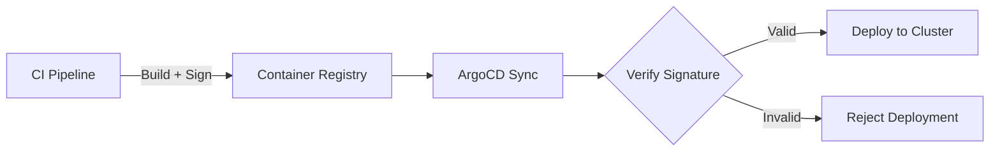

# How to Enforce Image Signing Verification with ArgoCD

Author: [nawazdhandala](https://github.com/nawazdhandala)

Tags: ArgoCD, GitOps, Kubernetes, Security, Image Signing

Description: Learn how to enforce container image signing verification in ArgoCD deployments using Cosign, Sigstore, and admission controllers to ensure only trusted images are deployed.

---

Image signing provides cryptographic proof that a container image was built by a trusted source and has not been tampered with. When combined with ArgoCD, you can create a deployment pipeline that only deploys signed, verified images. This post walks through setting up image signing verification for ArgoCD-managed deployments.

## Why Image Signing Matters

Without image signing, anyone who gains access to your container registry can push a malicious image with a legitimate tag. Your cluster would happily deploy this tampered image. Image signing prevents this by requiring a cryptographic signature that only authorized builders can create.



## Setting Up Cosign

Cosign from the Sigstore project is the standard tool for container image signing. Start by generating a key pair:

```bash
# Generate a cosign key pair
cosign generate-key-pair

# This creates cosign.key (private) and cosign.pub (public)
# Store cosign.key securely - CI pipeline needs it for signing
# Store cosign.pub in your cluster - admission controller needs it for verification
```

For production, use a KMS provider instead of file-based keys:

```bash
# Generate keys using AWS KMS
cosign generate-key-pair --kms awskms:///arn:aws:kms:us-east-1:123456789:key/abc-123

# Or Google Cloud KMS
cosign generate-key-pair --kms gcpkms://projects/my-project/locations/global/keyRings/my-ring/cryptoKeys/my-key
```

## Signing Images in CI

Add image signing to your CI pipeline so every image that reaches your registry is signed:

```yaml
# .github/workflows/build-sign.yaml
name: Build, Scan, and Sign
on:
  push:
    branches: [main]

jobs:
  build:
    runs-on: ubuntu-latest
    steps:
      - uses: actions/checkout@v4

      - name: Install Cosign
        uses: sigstore/cosign-installer@v3

      - name: Login to registry
        run: docker login registry.example.com -u ${{ secrets.REG_USER }} -p ${{ secrets.REG_PASS }}

      - name: Build image
        run: |
          docker build -t registry.example.com/myapp:${{ github.sha }} .
          docker push registry.example.com/myapp:${{ github.sha }}

      - name: Sign image
        env:
          COSIGN_KEY: ${{ secrets.COSIGN_PRIVATE_KEY }}
          COSIGN_PASSWORD: ${{ secrets.COSIGN_PASSWORD }}
        run: |
          # Sign the image by digest for immutability
          DIGEST=$(docker inspect --format='{{index .RepoDigests 0}}' \
            registry.example.com/myapp:${{ github.sha }})

          cosign sign --key env://COSIGN_KEY "$DIGEST"

          echo "Image signed: $DIGEST"

      - name: Attach vulnerability scan attestation
        env:
          COSIGN_KEY: ${{ secrets.COSIGN_PRIVATE_KEY }}
          COSIGN_PASSWORD: ${{ secrets.COSIGN_PASSWORD }}
        run: |
          # Scan and attest results
          trivy image \
            --format cosign-vuln \
            --output scan-results.json \
            registry.example.com/myapp:${{ github.sha }}

          cosign attest --key env://COSIGN_KEY \
            --predicate scan-results.json \
            --type vuln \
            registry.example.com/myapp:${{ github.sha }}
```

## Deploying Signature Verification with Kyverno

Kyverno has built-in image verification capabilities. Deploy it through ArgoCD:

```yaml
# applications/kyverno.yaml
apiVersion: argoproj.io/v1alpha1
kind: Application
metadata:
  name: kyverno
  namespace: argocd
spec:
  project: security
  source:
    repoURL: https://kyverno.github.io/kyverno
    chart: kyverno
    targetRevision: 3.1.0
    helm:
      values: |
        replicaCount: 3
        resources:
          limits:
            memory: 512Mi
          requests:
            cpu: 100m
            memory: 256Mi
        webhookEnabled: true
  destination:
    server: https://kubernetes.default.svc
    namespace: kyverno
  syncPolicy:
    automated:
      selfHeal: true
      prune: true
    syncOptions:
      - CreateNamespace=true
      - ServerSideApply=true
```

## Image Verification Policy

Create a Kyverno policy that requires image signatures:

```yaml
# policies/verify-image-signatures.yaml
apiVersion: kyverno.io/v1
kind: ClusterPolicy
metadata:
  name: verify-image-signatures
  annotations:
    policies.kyverno.io/title: Verify Image Signatures
    policies.kyverno.io/category: Supply Chain Security
    policies.kyverno.io/severity: critical
spec:
  validationFailureAction: Enforce
  webhookTimeoutSeconds: 30
  failurePolicy: Fail
  rules:
    - name: verify-cosign-signature
      match:
        any:
          - resources:
              kinds:
                - Pod
              namespaces:
                - production
                - staging
      verifyImages:
        - imageReferences:
            - "registry.example.com/*"
          attestors:
            - count: 1
              entries:
                - keys:
                    publicKeys: |
                      -----BEGIN PUBLIC KEY-----
                      MFkwEwYHKoZIzj0CAQYIKoZIzj0DAQcDQgAE
                      your-public-key-here
                      -----END PUBLIC KEY-----
                    rekor:
                      url: https://rekor.sigstore.dev
          mutateDigest: true  # Replace tags with digests after verification
          verifyDigest: true  # Ensure digests match
          required: true
```

The `mutateDigest: true` setting is powerful - after verifying the signature, Kyverno replaces the image tag with the verified digest. This prevents TOCTOU (time-of-check-time-of-use) attacks where an image tag could be moved between verification and pull.

## Keyless Signing with Sigstore

For even simpler key management, use Sigstore's keyless signing which ties signatures to CI identities:

```yaml
# In CI pipeline - keyless signing
- name: Sign image (keyless)
  run: |
    COSIGN_EXPERIMENTAL=1 cosign sign \
      --oidc-issuer https://token.actions.githubusercontent.com \
      registry.example.com/myapp:${{ github.sha }}
```

```yaml
# Kyverno policy for keyless verification
apiVersion: kyverno.io/v1
kind: ClusterPolicy
metadata:
  name: verify-keyless-signatures
spec:
  validationFailureAction: Enforce
  rules:
    - name: verify-sigstore-keyless
      match:
        any:
          - resources:
              kinds:
                - Pod
      verifyImages:
        - imageReferences:
            - "registry.example.com/*"
          attestors:
            - count: 1
              entries:
                - keyless:
                    subject: "https://github.com/your-org/*"
                    issuer: "https://token.actions.githubusercontent.com"
                    rekor:
                      url: https://rekor.sigstore.dev
          required: true
```

This approach eliminates the need to manage signing keys entirely. The signature is tied to the GitHub Actions workflow identity.

## ArgoCD PreSync Signature Verification

Add an additional verification layer as an ArgoCD PreSync hook:

```yaml
# hooks/verify-signatures.yaml
apiVersion: batch/v1
kind: Job
metadata:
  name: verify-image-signatures
  annotations:
    argocd.argoproj.io/hook: PreSync
    argocd.argoproj.io/hook-delete-policy: BeforeHookCreation
spec:
  template:
    spec:
      containers:
        - name: verify
          image: bitnami/cosign:latest
          command:
            - /bin/sh
            - -c
            - |
              IMAGES="
              registry.example.com/frontend:v3.2.1
              registry.example.com/backend:v2.8.0
              "

              FAILED=0

              for IMAGE in $IMAGES; do
                echo "Verifying signature for: $IMAGE"

                cosign verify \
                  --key /keys/cosign.pub \
                  "$IMAGE" 2>&1

                if [ $? -ne 0 ]; then
                  echo "FAILED: No valid signature for $IMAGE"
                  FAILED=1
                else
                  echo "PASSED: Valid signature for $IMAGE"
                fi
              done

              if [ "$FAILED" -eq "1" ]; then
                echo "Deployment BLOCKED: Unsigned images detected"
                exit 1
              fi
          volumeMounts:
            - name: cosign-key
              mountPath: /keys
              readOnly: true
      volumes:
        - name: cosign-key
          secret:
            secretName: cosign-public-key
      restartPolicy: Never
  backoffLimit: 1
```

## Store the Public Key as a Secret

```yaml
# secrets/cosign-public-key.yaml (use SealedSecret in production)
apiVersion: v1
kind: Secret
metadata:
  name: cosign-public-key
  namespace: default
type: Opaque
data:
  cosign.pub: <base64-encoded-public-key>
```

## Handling Signature Verification Failures

When ArgoCD encounters a deployment blocked by signature verification, configure proper alerting:

```yaml
apiVersion: v1
kind: ConfigMap
metadata:
  name: argocd-notifications-cm
  namespace: argocd
data:
  template.signature-verification-failed: |
    message: |
      Image signature verification failed for {{.app.metadata.name}}.
      An unsigned or tampered image was detected.
      This is a critical security event - investigate immediately.
    slack:
      attachments: |
        [{
          "color": "#E01E5A",
          "title": "SECURITY: Image Signature Verification Failed",
          "text": "Application: {{.app.metadata.name}}\nNamespace: {{.app.spec.destination.namespace}}"
        }]
```

Monitor signature verification events with [OneUptime](https://oneuptime.com) to track supply chain security incidents.

## Summary

Enforcing image signing verification with ArgoCD involves signing images in CI with Cosign, deploying a verification policy through Kyverno or OPA Gatekeeper, and optionally adding PreSync verification hooks. Keyless signing with Sigstore simplifies key management by tying signatures to CI identities. The `mutateDigest` feature in Kyverno provides an extra layer of protection by replacing tags with verified digests. All policies are managed through ArgoCD in Git, making your supply chain security posture fully auditable and version-controlled.
