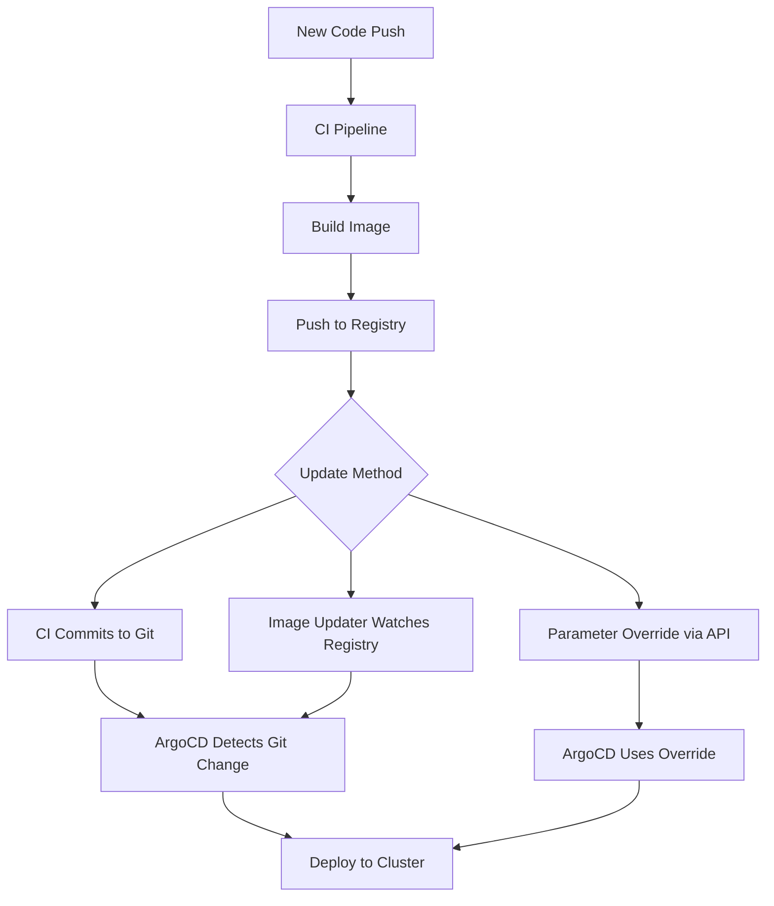

# How to Implement Image Tag Update Workflow with ArgoCD

Author: [nawazdhandala](https://github.com/nawazdhandala)

Tags: ArgoCD, GitOps, Kubernetes, CI/CD, Container Image

Description: Learn how to implement a complete image tag update workflow with ArgoCD that automatically updates Kubernetes deployments when new container images are built in your CI pipeline.

---

One of the most common tasks in a GitOps workflow is updating the container image tag in your Kubernetes manifests after a CI pipeline builds a new image. This sounds simple, but getting it right involves decisions about how to update Git, how to handle concurrent updates, and which tools to use. This guide covers the major approaches and their trade-offs.

## The Image Tag Update Problem

In a GitOps workflow, ArgoCD deploys whatever is defined in Git. When your CI pipeline builds a new container image, you need to update the image reference in your Git-stored manifests. There are three primary approaches:

1. **CI Pipeline Updates Git** - Your CI pipeline commits the new image tag to the manifest repo
2. **ArgoCD Image Updater** - A dedicated tool watches registries and updates Git automatically
3. **Helm/Kustomize Parameter Override** - Use ArgoCD application parameters to override image tags without changing Git



## Approach 1: CI Pipeline Updates Git

This is the most straightforward approach. After building and pushing the image, your CI pipeline clones the manifest repository, updates the image tag, and pushes the change.

### With Plain YAML Manifests

```yaml
# .github/workflows/build-deploy.yml
name: Build and Deploy
on:
  push:
    branches: [main]

jobs:
  build:
    runs-on: ubuntu-latest
    steps:
      - uses: actions/checkout@v4

      - name: Build and push image
        run: |
          IMAGE_TAG="${GITHUB_SHA::7}"
          docker build -t myregistry.com/myapp:$IMAGE_TAG .
          docker push myregistry.com/myapp:$IMAGE_TAG
          echo "IMAGE_TAG=$IMAGE_TAG" >> $GITHUB_ENV

      - name: Update deployment manifest
        run: |
          git clone https://${{ secrets.GH_TOKEN }}@github.com/my-org/k8s-manifests.git
          cd k8s-manifests

          # Use yq for precise YAML editing (better than sed)
          yq eval ".spec.template.spec.containers[0].image = \"myregistry.com/myapp:$IMAGE_TAG\"" \
            -i apps/myapp/deployment.yaml

          git config user.email "ci@example.com"
          git config user.name "CI Bot"
          git add .
          git commit -m "deploy: update myapp to $IMAGE_TAG"
          git push origin main
```

### With Kustomize

Kustomize has native support for image tag updates, making it cleaner:

```bash
# In your CI pipeline
cd k8s-manifests/overlays/production
kustomize edit set image myregistry.com/myapp=myregistry.com/myapp:$IMAGE_TAG
git add kustomization.yaml
git commit -m "deploy: update myapp image to $IMAGE_TAG"
git push
```

The `kustomization.yaml` will be updated like this:

```yaml
# kustomization.yaml
apiVersion: kustomize.config.k8s.io/v1beta1
kind: Kustomization
resources:
  - ../../base
images:
  - name: myregistry.com/myapp
    newTag: "abc1234"  # Updated by CI
```

### With Helm Values

If your deployment uses Helm charts, update the values file:

```bash
# Use yq to update the image tag in values file
yq eval ".image.tag = \"$IMAGE_TAG\"" -i apps/myapp/values-production.yaml
git add apps/myapp/values-production.yaml
git commit -m "deploy: update myapp to $IMAGE_TAG"
git push
```

The values file:

```yaml
# values-production.yaml
image:
  repository: myregistry.com/myapp
  tag: "abc1234"  # Updated by CI
  pullPolicy: IfNotPresent
```

## Approach 2: ArgoCD Image Updater

ArgoCD Image Updater watches container registries and updates Git automatically when new images are available. This removes the need for your CI pipeline to touch the manifest repo.

```yaml
# argocd-application.yaml
apiVersion: argoproj.io/v1alpha1
kind: Application
metadata:
  name: myapp
  namespace: argocd
  annotations:
    # Tell Image Updater to watch this image
    argocd-image-updater.argoproj.io/image-list: myapp=myregistry.com/myapp
    # Use semver to pick the latest version
    argocd-image-updater.argoproj.io/myapp.update-strategy: semver
    argocd-image-updater.argoproj.io/myapp.semver-constraint: ">=1.0.0"
    # Write changes back to Git
    argocd-image-updater.argoproj.io/write-back-method: git
spec:
  source:
    repoURL: https://github.com/my-org/k8s-manifests.git
    targetRevision: main
    path: apps/myapp
  destination:
    server: https://kubernetes.default.svc
    namespace: production
```

For more on ArgoCD Image Updater setup, check out the [Image Updater guide](https://oneuptime.com/blog/post/2026-01-25-image-updater-argocd/view).

## Approach 3: ArgoCD Parameter Override

You can override image tags via the ArgoCD API without changing Git. This is useful for quick deployments but breaks the GitOps principle since Git no longer reflects the actual state.

```bash
# Override the image tag via CLI
argocd app set myapp \
  --helm-set image.tag=$IMAGE_TAG \
  --server $ARGOCD_SERVER \
  --auth-token $ARGOCD_TOKEN

# Or via API
curl -X PATCH \
  -H "Authorization: Bearer $ARGOCD_TOKEN" \
  -H "Content-Type: application/json" \
  "https://$ARGOCD_SERVER/api/v1/applications/myapp" \
  -d '{
    "spec": {
      "source": {
        "helm": {
          "parameters": [
            {"name": "image.tag", "value": "'$IMAGE_TAG'"}
          ]
        }
      }
    }
  }'
```

## Handling Concurrent Updates

When multiple CI pipelines run simultaneously, you may get Git merge conflicts. Here is a retry loop that handles this:

```bash
#!/bin/bash
# update-image-tag.sh - Update image tag with conflict resolution

MANIFEST_REPO="$1"
APP_PATH="$2"
IMAGE="$3"
NEW_TAG="$4"
MAX_RETRIES=5

for attempt in $(seq 1 $MAX_RETRIES); do
  echo "Attempt $attempt of $MAX_RETRIES"

  # Fresh clone each attempt
  rm -rf /tmp/manifests
  git clone "https://$GITHUB_TOKEN@github.com/$MANIFEST_REPO.git" /tmp/manifests
  cd /tmp/manifests

  # Update the image tag
  yq eval ".spec.template.spec.containers[0].image = \"$IMAGE:$NEW_TAG\"" \
    -i "$APP_PATH/deployment.yaml"

  git config user.email "ci@example.com"
  git config user.name "CI Bot"
  git add .
  git commit -m "deploy: update image to $IMAGE:$NEW_TAG"

  # Try to push
  if git push origin main; then
    echo "Successfully updated image tag"
    exit 0
  fi

  echo "Push failed (likely conflict), retrying..."
  sleep $((attempt * 2))
done

echo "Failed to update image tag after $MAX_RETRIES attempts"
exit 1
```

## Complete Workflow Example

Here is a complete GitHub Actions workflow that builds, updates, and verifies:

```yaml
name: Build, Deploy, and Verify
on:
  push:
    branches: [main]

jobs:
  build:
    runs-on: ubuntu-latest
    outputs:
      image-tag: ${{ steps.build.outputs.tag }}
    steps:
      - uses: actions/checkout@v4

      - name: Build and push
        id: build
        run: |
          TAG="${GITHUB_SHA::7}"
          docker build -t myregistry.com/myapp:$TAG .
          docker push myregistry.com/myapp:$TAG
          echo "tag=$TAG" >> $GITHUB_OUTPUT

  update-manifests:
    needs: build
    runs-on: ubuntu-latest
    steps:
      - name: Update manifest repo
        env:
          IMAGE_TAG: ${{ needs.build.outputs.image-tag }}
        run: |
          git clone https://${{ secrets.GH_TOKEN }}@github.com/my-org/k8s-manifests.git
          cd k8s-manifests/overlays/production
          kustomize edit set image myregistry.com/myapp=myregistry.com/myapp:$IMAGE_TAG
          git config user.email "ci@example.com"
          git config user.name "CI Bot"
          git add .
          git commit -m "deploy: update myapp to $IMAGE_TAG"
          git push origin main

  verify-deployment:
    needs: [build, update-manifests]
    runs-on: ubuntu-latest
    steps:
      - name: Wait for ArgoCD sync
        env:
          ARGOCD_SERVER: ${{ secrets.ARGOCD_SERVER }}
          ARGOCD_AUTH_TOKEN: ${{ secrets.ARGOCD_TOKEN }}
        run: |
          curl -sSL -o /usr/local/bin/argocd \
            https://github.com/argoproj/argo-cd/releases/latest/download/argocd-linux-amd64
          chmod +x /usr/local/bin/argocd

          # Refresh to detect the new commit
          argocd app get myapp --refresh --grpc-web

          # Wait for sync and health
          argocd app wait myapp --grpc-web --health --timeout 300
```

## Choosing the Right Approach

| Factor | CI Updates Git | Image Updater | Parameter Override |
|--------|---------------|---------------|-------------------|
| GitOps compliant | Yes | Yes | No |
| Setup complexity | Low | Medium | Low |
| Concurrent safety | Needs handling | Built-in | Built-in |
| Registry watching | No | Yes | No |
| Audit trail in Git | Yes | Yes | No |
| Multi-image support | Manual | Built-in | Manual |

For most teams, the CI-updates-Git approach works well for small numbers of applications. As you scale to dozens of services, ArgoCD Image Updater becomes the better choice because it handles registry watching, concurrency, and multi-image updates automatically.

The image tag update workflow is the glue between your CI and CD processes. Getting it right means your deployments are reliable, auditable, and automated end to end.
