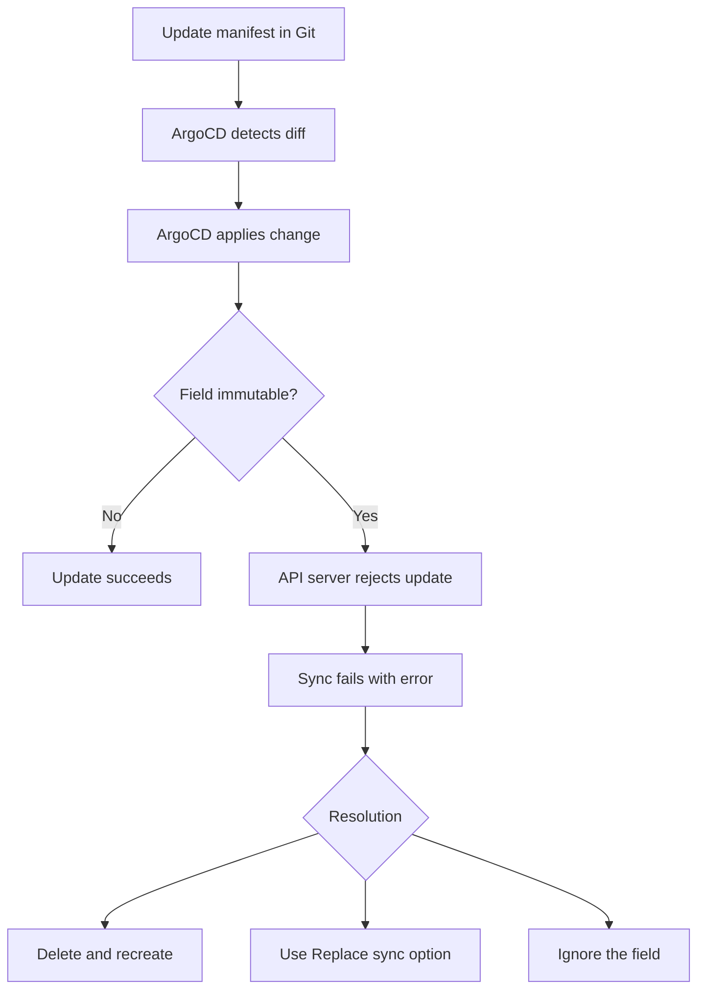

# How to Handle Immutable Field Change Errors in ArgoCD

Author: [nawazdhandala](https://github.com/nawazdhandala)

Tags: ArgoCD, GitOps, Kubernetes, Troubleshooting, Sync

Description: Learn how to resolve immutable field change errors during ArgoCD sync operations when Kubernetes rejects updates to fields that cannot be modified after creation.

---

You update a field in your Git manifest, ArgoCD syncs, and you get an error like `field is immutable` or `spec: Forbidden: updates to spec are forbidden`. This happens because certain Kubernetes fields can only be set during resource creation and cannot be changed afterward. ArgoCD detects the diff and tries to apply the change, but the API server rejects it.

This guide covers which fields are immutable, why they cause sync failures, and how to work around them.

## Understanding Immutable Fields

Kubernetes marks certain fields as immutable. Once a resource is created, these fields cannot be updated through a standard apply or patch operation. You must delete and recreate the resource to change them.



## Common Immutable Fields by Resource Type

### Jobs

Jobs have the most immutable fields. Almost the entire spec is immutable after creation:

```text
spec.template           - Pod template is immutable
spec.selector           - Label selector is immutable
spec.completions        - Cannot change after creation
spec.parallelism        - Can be updated (exception)
spec.backoffLimit       - Cannot change after creation
```

Error message:
```text
The Job "my-job" is invalid: spec.template: Invalid value: ... field is immutable
```

### Services

```text
spec.clusterIP          - Assigned by Kubernetes, cannot be changed
spec.clusterIPs         - Same as above
spec.ipFamilies         - Cannot change after creation
spec.ipFamilyPolicy     - Cannot change after creation (some cases)
spec.type               - Can be changed, but ClusterIP allocation rules apply
```

### PersistentVolumeClaims

```text
spec.accessModes        - Immutable after creation
spec.storageClassName   - Immutable after creation
spec.volumeMode         - Immutable after creation
spec.resources.requests.storage  - Can only increase, not decrease
```

### StatefulSets

```text
spec.selector           - Immutable after creation
spec.volumeClaimTemplates  - Immutable after creation
spec.serviceName        - Immutable after creation
```

### Deployments

```text
spec.selector           - Immutable after creation
```

### ConfigMaps and Secrets (with immutable flag)

```text
immutable               - Once set to true, cannot be changed back
data/stringData         - Cannot be modified when immutable: true
```

### Custom Resources

CRDs can define immutable fields through the `x-kubernetes-validations` or webhook-based validation. Check the operator documentation.

## Solution 1: Use the Replace Sync Option

The `Replace` sync option tells ArgoCD to use `kubectl replace` instead of `kubectl apply`. Replace deletes and recreates the resource, which allows immutable fields to change:

```yaml
apiVersion: argoproj.io/v1alpha1
kind: Application
metadata:
  name: my-app
spec:
  source:
    repoURL: https://github.com/myorg/my-app.git
    targetRevision: main
    path: k8s
  destination:
    server: https://kubernetes.default.svc
    namespace: default
  syncPolicy:
    syncOptions:
      - Replace=true
```

**Warning**: Replace causes a brief downtime because the resource is deleted before being recreated. For Deployments, this means pods are terminated and new ones start. Use this with caution in production.

### Per-Resource Replace

Instead of applying Replace to the entire application, target specific resources using annotations:

```yaml
apiVersion: batch/v1
kind: Job
metadata:
  name: data-migration
  annotations:
    argocd.argoproj.io/sync-options: Replace=true
spec:
  template:
    spec:
      containers:
        - name: migrate
          image: myapp:v1
          command: ["./migrate.sh"]
      restartPolicy: Never
```

This is safer because only the Job uses replace, while other resources in the application use the default apply strategy.

## Solution 2: Delete Before Sync with Sync Waves

Use sync waves to delete the old resource before creating the new one:

```yaml
# First, a PreSync hook to delete the old Job
apiVersion: batch/v1
kind: Job
metadata:
  name: cleanup-old-job
  annotations:
    argocd.argoproj.io/hook: PreSync
    argocd.argoproj.io/hook-delete-policy: BeforeHookCreation
spec:
  template:
    spec:
      serviceAccountName: cleanup-sa
      containers:
        - name: cleanup
          image: bitnami/kubectl:latest
          command:
            - kubectl
            - delete
            - job
            - data-migration
            - --ignore-not-found
      restartPolicy: Never
---
# Then the actual Job
apiVersion: batch/v1
kind: Job
metadata:
  name: data-migration
  annotations:
    argocd.argoproj.io/sync-wave: "1"
spec:
  template:
    spec:
      containers:
        - name: migrate
          image: myapp:v2
          command: ["./migrate.sh"]
      restartPolicy: Never
```

## Solution 3: Use Force Sync for Specific Resources

Force sync deletes the resource before recreating it. Use it from the CLI:

```bash
# Force sync a specific resource
argocd app sync my-app --resource batch/Job/data-migration --force
```

Or from the UI, select the resource, click "Sync," and check the "Force" option.

**Warning**: Force sync causes downtime for the targeted resource.

## Solution 4: Ignore the Immutable Field

If the field change is not actually needed (for example, ArgoCD is trying to set a field that Kubernetes already set to the same value but in a different format), ignore it:

```yaml
ignoreDifferences:
  - group: ""
    kind: Service
    jsonPointers:
      - /spec/clusterIP
      - /spec/clusterIPs
  - group: ""
    kind: PersistentVolumeClaim
    jsonPointers:
      - /spec/volumeMode
```

## Handling Specific Immutable Field Scenarios

### Job Spec Changes

Jobs are the most problematic because nearly everything is immutable. The best pattern is to use unique Job names:

```yaml
apiVersion: batch/v1
kind: Job
metadata:
  # Include a version or hash in the name
  name: data-migration-v2
  annotations:
    argocd.argoproj.io/sync-options: Replace=true
spec:
  template:
    spec:
      containers:
        - name: migrate
          image: myapp:v2
          command: ["./migrate.sh"]
      restartPolicy: Never
```

Or use Jobs as sync hooks, which are automatically cleaned up:

```yaml
apiVersion: batch/v1
kind: Job
metadata:
  name: data-migration
  annotations:
    argocd.argoproj.io/hook: PostSync
    argocd.argoproj.io/hook-delete-policy: BeforeHookCreation
spec:
  template:
    spec:
      containers:
        - name: migrate
          image: myapp:v2
          command: ["./migrate.sh"]
      restartPolicy: Never
```

The `BeforeHookCreation` delete policy ensures the old Job is deleted before a new one is created on the next sync.

### StatefulSet VolumeClaimTemplate Changes

Changing `volumeClaimTemplates` in a StatefulSet requires a complete recreation:

```yaml
apiVersion: apps/v1
kind: StatefulSet
metadata:
  name: my-database
  annotations:
    argocd.argoproj.io/sync-options: Replace=true
spec:
  volumeClaimTemplates:
    - metadata:
        name: data
      spec:
        accessModes: ["ReadWriteOnce"]
        resources:
          requests:
            storage: 20Gi  # Changed from 10Gi
```

**Critical Warning**: Replacing a StatefulSet with `Replace=true` does NOT delete the associated PVCs. The old PVCs remain. You need to handle PVC migration separately.

### Deployment Selector Changes

If you need to change a Deployment's label selector (which is immutable), you cannot simply update it. You need to delete and recreate:

```bash
# Option 1: Delete via ArgoCD CLI
argocd app delete-resource my-app --kind Deployment --resource-name my-app

# Then sync to recreate
argocd app sync my-app

# Option 2: Use Replace on the specific resource
kubectl annotate deployment my-app \
  argocd.argoproj.io/sync-options=Replace=true \
  --overwrite
```

### Service ClusterIP Changes

The `clusterIP` field is always assigned by Kubernetes and should never be in your Git manifests:

```yaml
# Bad - includes clusterIP that will cause conflicts
apiVersion: v1
kind: Service
metadata:
  name: my-service
spec:
  clusterIP: 10.96.0.100    # Remove this!
  selector:
    app: my-app
  ports:
    - port: 80
```

```yaml
# Good - let Kubernetes assign the IP
apiVersion: v1
kind: Service
metadata:
  name: my-service
spec:
  selector:
    app: my-app
  ports:
    - port: 80
```

If you need a stable ClusterIP (rare), use `spec.clusterIP: None` for headless services, or create the service once and ignore the field:

```yaml
ignoreDifferences:
  - group: ""
    kind: Service
    jsonPointers:
      - /spec/clusterIP
      - /spec/clusterIPs
```

## Automating Immutable Field Handling

Create a system-level rule for commonly problematic immutable fields:

```yaml
apiVersion: v1
kind: ConfigMap
metadata:
  name: argocd-cm
  namespace: argocd
data:
  # Jobs always use replace to handle immutable spec
  resource.customizations.ignoreDifferences._Service: |
    jsonPointers:
      - /spec/clusterIP
      - /spec/clusterIPs
```

For Jobs specifically, consider always using the hook pattern or Replace:

```yaml
# In argocd-cm: enable replace for all Jobs
resource.customizations.syncOptions.batch_Job: |
  - Replace=true
```

## Debugging Immutable Field Errors

```bash
# Check the sync error message
argocd app get my-app

# View the sync operation details
argocd app sync my-app --dry-run

# Compare the Git manifest to the live resource
argocd app diff my-app

# Check which fields are different
kubectl diff -f manifest.yaml
```

The error message usually tells you exactly which field is immutable. Use that information to choose the right strategy from the options above.

## Best Practices

1. **Avoid changing immutable fields when possible** - Design your manifests to minimize the need for immutable field changes
2. **Use Replace sparingly** - Only on resources that truly need it, not application-wide
3. **Prefer hooks for Jobs** - Sync hooks with `BeforeHookCreation` naturally handle Job recreation
4. **Never include clusterIP in Git** - Let Kubernetes assign it
5. **Test in staging first** - Replace and force sync can cause downtime
6. **Use unique names for Jobs** - Include a version suffix to avoid immutable field conflicts

For more on sync options, see [How to Customize Diffs in ArgoCD](https://oneuptime.com/blog/post/2026-01-25-customize-diffs-argocd/view).
