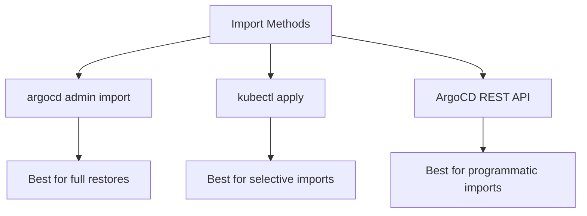

# How to Import ArgoCD Applications During Recovery

Author: [nawazdhandala](https://github.com/nawazdhandala)

Tags: ArgoCD, GitOps, Kubernetes, Disaster Recovery, Import

Description: Learn how to import ArgoCD applications from backup files during disaster recovery with strategies for ordering, conflict resolution, and validation.

---

When disaster strikes - whether it is a cluster failure, an accidental namespace deletion, or a migration to new infrastructure - you need to import your ArgoCD applications quickly and reliably. The import process is more than just running `kubectl apply`; it requires careful ordering, conflict handling, and validation to ensure applications come back healthy.

## Import Methods Overview

There are three main approaches to importing ArgoCD applications:



## Method 1: argocd admin import

The simplest approach for a full restore:

```bash
# Import from a backup created with argocd admin export
argocd admin import -n argocd < argocd-backup.yaml
```

This command handles the ordering automatically - it imports projects before applications, and resolves dependencies correctly.

## Method 2: kubectl apply

For selective or incremental imports:

```bash
# Import a single application
kubectl apply -f my-app.yaml -n argocd

# Import all applications from a directory
kubectl apply -f ./argocd-apps-export/ -n argocd

# Import with server-side apply (handles conflicts better)
kubectl apply -f ./argocd-apps-export/ -n argocd --server-side
```

## Method 3: REST API Import

For programmatic imports from CI/CD or custom tools:

```bash
# Import an application via API
APP_SPEC=$(cat my-app.json)

curl -s -k -H "Authorization: Bearer $ARGOCD_TOKEN" \
  -X POST "https://argocd.example.com/api/v1/applications?upsert=true" \
  -H "Content-Type: application/json" \
  -d "$APP_SPEC"
```

## Import Ordering

The order of imports matters. Follow this sequence:

1. **ConfigMaps** - ArgoCD configuration
2. **Secrets** - Repository and cluster credentials
3. **AppProjects** - Projects must exist before applications
4. **Applications** - The application definitions
5. **ApplicationSets** - These generate applications, so import last

```bash
#!/bin/bash
# ordered-import.sh - Import ArgoCD resources in the correct order

BACKUP_DIR="$1"
NAMESPACE="${2:-argocd}"

echo "=== Phase 1: ConfigMaps ==="
for f in "$BACKUP_DIR"/cm-*.yaml; do
  [ -f "$f" ] && kubectl apply -f "$f" -n "$NAMESPACE"
done

echo ""
echo "=== Phase 2: Secrets ==="
for f in "$BACKUP_DIR"/secrets-*.yaml; do
  [ -f "$f" ] && kubectl apply -f "$f" -n "$NAMESPACE"
done

# Restart ArgoCD to pick up new config and credentials
echo ""
echo "=== Restarting ArgoCD ==="
kubectl rollout restart deployment argocd-server -n "$NAMESPACE"
kubectl rollout restart deployment argocd-repo-server -n "$NAMESPACE"
sleep 15

echo ""
echo "=== Phase 3: Projects ==="
if [ -f "$BACKUP_DIR/projects.yaml" ]; then
  kubectl apply -f "$BACKUP_DIR/projects.yaml" -n "$NAMESPACE"
fi

echo ""
echo "=== Phase 4: Applications ==="
if [ -f "$BACKUP_DIR/applications.yaml" ]; then
  kubectl apply -f "$BACKUP_DIR/applications.yaml" -n "$NAMESPACE"
elif [ -d "$BACKUP_DIR/applications" ]; then
  kubectl apply -f "$BACKUP_DIR/applications/" -n "$NAMESPACE"
fi

echo ""
echo "=== Phase 5: ApplicationSets ==="
if [ -f "$BACKUP_DIR/applicationsets.yaml" ]; then
  kubectl apply -f "$BACKUP_DIR/applicationsets.yaml" -n "$NAMESPACE"
fi
```

## Handling Import Conflicts

### Already Exists Errors

When importing to an instance that already has some applications:

```bash
# Option 1: Use --server-side with force-conflicts
kubectl apply -f applications.yaml -n argocd \
  --server-side --force-conflicts

# Option 2: Delete and recreate (use with caution)
kubectl delete -f applications.yaml -n argocd --ignore-not-found
kubectl apply -f applications.yaml -n argocd

# Option 3: Use the API with upsert
for file in argocd-apps-export/*.yaml; do
  APP_JSON=$(python3 -c "
import yaml, json, sys
with open('$file') as f:
    doc = yaml.safe_load(f)
    print(json.dumps(doc))
  ")

  curl -s -k -H "Authorization: Bearer $ARGOCD_TOKEN" \
    -X POST "https://argocd.example.com/api/v1/applications?upsert=true" \
    -H "Content-Type: application/json" \
    -d "$APP_JSON"
done
```

### Version Mismatch Errors

If the backup was from a different ArgoCD version:

```bash
# Check the API version in the backup
grep "apiVersion" applications.yaml | sort -u

# If necessary, update the API version
sed -i 's|apiVersion: argoproj.io/v1alpha1|apiVersion: argoproj.io/v1alpha1|' applications.yaml
```

## Selective Import

Import only specific applications or projects:

```bash
#!/bin/bash
# selective-import.sh - Import specific applications

BACKUP_DIR="$1"
shift
APPS_TO_IMPORT="$@"  # Pass app names as arguments

if [ -z "$APPS_TO_IMPORT" ]; then
  echo "Usage: $0 <backup-dir> <app1> <app2> ..."
  exit 1
fi

for APP_NAME in $APPS_TO_IMPORT; do
  APP_FILE="$BACKUP_DIR/${APP_NAME}.yaml"

  if [ -f "$APP_FILE" ]; then
    echo "Importing: $APP_NAME"
    kubectl apply -f "$APP_FILE" -n argocd
  else
    echo "Not found: $APP_FILE (skipping)"
  fi
done
```

### Import by Label

```bash
# Import only applications with a specific label from the backup
python3 << 'SCRIPT'
import yaml
import subprocess
import sys

with open("applications-backup.yaml") as f:
    docs = list(yaml.safe_load_all(f))

target_label = {"team": "backend"}

for doc in docs:
    if doc is None:
        continue
    labels = doc.get("metadata", {}).get("labels", {})
    if all(labels.get(k) == v for k, v in target_label.items()):
        name = doc["metadata"]["name"]
        print(f"Importing: {name}")
        yaml_str = yaml.dump(doc)
        result = subprocess.run(
            ["kubectl", "apply", "-n", "argocd", "-f", "-"],
            input=yaml_str.encode(),
            capture_output=True
        )
        if result.returncode == 0:
            print(f"  Success")
        else:
            print(f"  Error: {result.stderr.decode()}")
SCRIPT
```

## Batch Import with Progress Tracking

For large imports with many applications:

```bash
#!/bin/bash
# batch-import.sh - Import applications with progress and error tracking

BACKUP_DIR="$1"
NAMESPACE="${2:-argocd}"
ERRORS=()
SUCCESS=0
TOTAL=0

# Count total applications
TOTAL=$(ls "$BACKUP_DIR"/*.yaml 2>/dev/null | wc -l | tr -d ' ')
CURRENT=0

echo "Importing $TOTAL applications..."
echo ""

for file in "$BACKUP_DIR"/*.yaml; do
  [ -f "$file" ] || continue
  CURRENT=$((CURRENT + 1))
  APP_NAME=$(basename "$file" .yaml)

  printf "[%3d/%3d] %s... " "$CURRENT" "$TOTAL" "$APP_NAME"

  OUTPUT=$(kubectl apply -f "$file" -n "$NAMESPACE" 2>&1)
  if [ $? -eq 0 ]; then
    echo "OK"
    SUCCESS=$((SUCCESS + 1))
  else
    echo "FAILED"
    ERRORS+=("$APP_NAME: $OUTPUT")
  fi
done

echo ""
echo "=== Import Summary ==="
echo "Total: $TOTAL"
echo "Success: $SUCCESS"
echo "Failed: ${#ERRORS[@]}"

if [ ${#ERRORS[@]} -gt 0 ]; then
  echo ""
  echo "=== Failed Imports ==="
  for err in "${ERRORS[@]}"; do
    echo "  - $err"
  done
fi
```

## Post-Import Validation

After importing, validate that everything is correct:

```bash
#!/bin/bash
# validate-import.sh - Validate imported applications

NAMESPACE="${1:-argocd}"

echo "=== Validating ArgoCD Import ==="
echo ""

# Check application count
APP_COUNT=$(kubectl get applications.argoproj.io -n "$NAMESPACE" --no-headers | wc -l | tr -d ' ')
echo "Applications: $APP_COUNT"

# Check for applications that cannot connect to their repositories
echo ""
echo "Checking repository connectivity..."
REPO_ERRORS=$(kubectl get applications.argoproj.io -n "$NAMESPACE" -o json | \
  jq -r '.items[] | select(.status.conditions[]? | .type == "ComparisonError") |
    "\(.metadata.name): \(.status.conditions[0].message)"')

if [ -n "$REPO_ERRORS" ]; then
  echo "Applications with repository errors:"
  echo "$REPO_ERRORS"
else
  echo "All repositories accessible"
fi

# Check sync status
echo ""
echo "Sync status distribution:"
kubectl get applications.argoproj.io -n "$NAMESPACE" -o json | \
  jq -r '.items[].status.sync.status' | sort | uniq -c | sort -rn

# Check health status
echo ""
echo "Health status distribution:"
kubectl get applications.argoproj.io -n "$NAMESPACE" -o json | \
  jq -r '.items[].status.health.status' | sort | uniq -c | sort -rn

# List applications that need attention
echo ""
echo "Applications needing attention:"
kubectl get applications.argoproj.io -n "$NAMESPACE" -o json | \
  jq -r '.items[] |
    select(.status.health.status != "Healthy" or .status.sync.status != "Synced") |
    "  \(.metadata.name): sync=\(.status.sync.status), health=\(.status.health.status)"'
```

## Triggering Initial Sync After Import

Imported applications may need an initial sync to reconcile:

```bash
# Trigger sync for all imported applications
for APP in $(kubectl get applications.argoproj.io -n argocd -o name); do
  NAME=$(basename "$APP")
  echo "Syncing: $NAME"
  argocd app sync "$NAME" --async 2>/dev/null || echo "  (sync failed, will retry)"
done
```

Importing ArgoCD applications during recovery requires careful ordering, conflict resolution, and post-import validation. Follow the phased import approach - ConfigMaps and Secrets first, then Projects, then Applications - to avoid dependency errors. Always validate after import and be prepared to troubleshoot repository connectivity and credential issues that are common after cross-cluster recovery.
