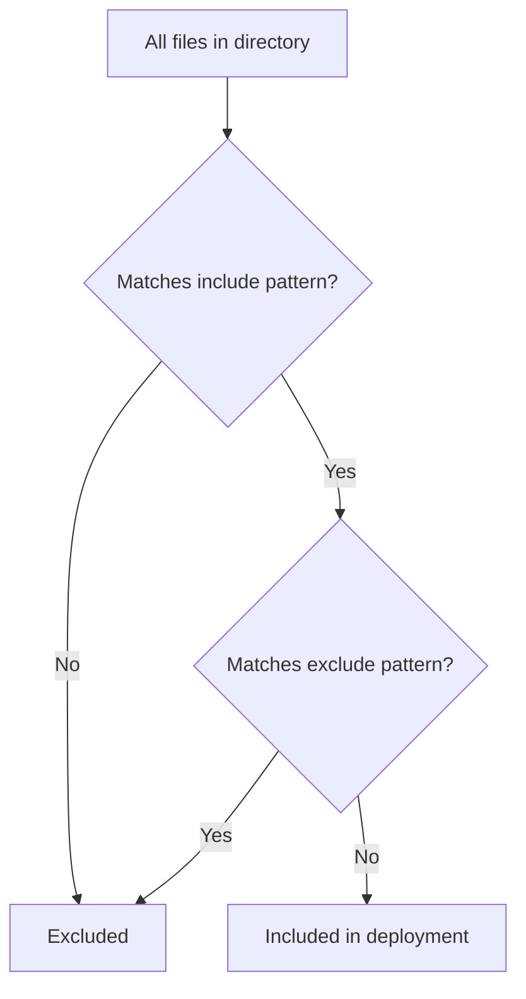

# How to Include or Exclude Files in ArgoCD Directory Source

Author: [nawazdhandala](https://github.com/nawazdhandala)

Tags: ArgoCD, GitOps, Kubernetes, Configuration, Directory Management

Description: Learn how to use include and exclude glob patterns in ArgoCD directory sources to control exactly which YAML files are deployed from your Git repository.

---

When you point an ArgoCD Application at a directory, it reads every YAML and JSON file it finds. That is usually fine, but sometimes your directory contains files you do not want deployed - test fixtures, documentation, examples, or environment-specific configs that belong to a different cluster. ArgoCD provides `include` and `exclude` glob patterns to give you precise control over which files are processed.

## The Default Behavior

Without any include or exclude configuration, ArgoCD reads all files matching these extensions in the specified directory:

- `.yaml`
- `.yml`
- `.json`

Files with other extensions (`.md`, `.txt`, `.sh`) are automatically ignored. Hidden files starting with `.` are also skipped.

## Using the Include Pattern

The `include` field specifies a glob pattern that files must match to be included. Only files matching this pattern are processed:

```yaml
# argocd-app-include.yaml - Only deploy specific files
apiVersion: argoproj.io/v1alpha1
kind: Application
metadata:
  name: my-app
  namespace: argocd
spec:
  project: default
  source:
    repoURL: https://github.com/your-org/k8s-manifests.git
    targetRevision: main
    path: apps/my-app
    directory:
      include: '*.yaml'  # Only include .yaml files, skip .yml and .json
  destination:
    server: https://kubernetes.default.svc
    namespace: default
```

The include pattern supports standard glob syntax:

```yaml
# Include only specific file patterns
directory:
  include: 'deploy-*.yaml'  # Only files starting with "deploy-"

# Include files matching a set of patterns
directory:
  include: '{deployment,service,ingress}.yaml'  # Only these three files

# Include all YAML variants
directory:
  include: '*.{yaml,yml}'
```

## Using the Exclude Pattern

The `exclude` field specifies a glob pattern for files to skip. Files matching this pattern are not processed even if they match the include pattern:

```yaml
# Exclude test and example files
spec:
  source:
    path: apps/my-app
    directory:
      exclude: 'test-*.yaml'  # Skip any file starting with "test-"
```

```yaml
# Exclude multiple patterns
directory:
  exclude: '{test-*,example-*,*-dev.yaml}'
```

## Combining Include and Exclude

When both `include` and `exclude` are specified, ArgoCD first applies the include filter, then removes files matching the exclude pattern:

```yaml
# Include all YAML files but exclude test files
spec:
  source:
    path: apps/my-app
    directory:
      include: '*.yaml'
      exclude: '{test-*,*_test.yaml,example-*}'
```

Here is the filtering logic:



## Practical Use Cases

### Separating Environment Configs

You can keep environment-specific files in the same directory and use include patterns to deploy only what belongs to each environment:

```
apps/my-api/
  base-deployment.yaml
  base-service.yaml
  staging-config.yaml
  production-config.yaml
  staging-ingress.yaml
  production-ingress.yaml
```

```yaml
# Staging Application - include base files and staging-specific files
apiVersion: argoproj.io/v1alpha1
kind: Application
metadata:
  name: my-api-staging
  namespace: argocd
spec:
  project: default
  source:
    repoURL: https://github.com/your-org/k8s-manifests.git
    targetRevision: main
    path: apps/my-api
    directory:
      include: '{base-*,staging-*}.yaml'
  destination:
    server: https://kubernetes.default.svc
    namespace: staging
```

```yaml
# Production Application - include base files and production-specific files
apiVersion: argoproj.io/v1alpha1
kind: Application
metadata:
  name: my-api-production
  namespace: argocd
spec:
  project: default
  source:
    repoURL: https://github.com/your-org/k8s-manifests.git
    targetRevision: main
    path: apps/my-api
    directory:
      include: '{base-*,production-*}.yaml'
  destination:
    server: https://production-cluster.example.com
    namespace: production
```

### Excluding CRDs from Regular Deployments

If your directory contains CRD definitions that should only be installed once (not with every app sync), exclude them:

```yaml
# App deployment - excludes CRDs
spec:
  source:
    path: apps/operator
    directory:
      exclude: 'crd-*.yaml'

---
# Separate CRD-only application
spec:
  source:
    path: apps/operator
    directory:
      include: 'crd-*.yaml'
```

### Keeping Documentation Alongside Manifests

Some teams keep README files or runbook notes in the same directory as manifests. Since ArgoCD ignores `.md` files by default, this usually works fine. But if you have `.json` documentation files, exclude them:

```yaml
directory:
  exclude: '{docs-*,*-schema.json,README*}'
```

### Excluding Generated or Temporary Files

If your CI pipeline generates files in the same directory:

```yaml
directory:
  exclude: '{*.generated.yaml,*.bak,*.tmp}'
```

## Include and Exclude with Recursive Directories

When combined with `recurse: true`, the include and exclude patterns apply to files at all levels of the directory tree, not just the top level:

```yaml
spec:
  source:
    path: apps/platform
    directory:
      recurse: true
      include: '*.yaml'
      exclude: '{test-*,*_test.yaml}'
```

With this configuration and a directory like:

```
apps/platform/
  backend/
    deployment.yaml      # Included
    service.yaml         # Included
    test-backend.yaml    # Excluded by pattern
  frontend/
    deployment.yaml      # Included
    service.yaml         # Included
    example-config.yaml  # Included (does not match exclude)
  tests/
    test-e2e.yaml        # Excluded by pattern
```

Note that the exclude pattern matches on the filename only, not the full path. So `test-*` excludes any file starting with `test-` regardless of which subdirectory it is in.

## Glob Pattern Reference

ArgoCD uses Go's `filepath.Match` glob syntax with some extensions:

| Pattern | Matches |
|---|---|
| `*` | Any sequence of characters in a filename |
| `?` | Any single character |
| `[abc]` | Any character in the set |
| `[a-z]` | Any character in the range |
| `{a,b,c}` | Any of the comma-separated patterns |
| `*.yaml` | All files ending in `.yaml` |
| `deploy-*` | All files starting with `deploy-` |
| `app-?.yaml` | `app-1.yaml`, `app-a.yaml`, etc. |

Important: the glob patterns match **filenames only**, not full paths. You cannot use patterns like `backend/*.yaml` to match files specifically in the `backend` subdirectory.

## Verifying Your Patterns

Before deploying, verify that your include and exclude patterns produce the expected results:

```bash
# View the manifests ArgoCD will apply
argocd app manifests my-app

# Count how many resources will be deployed
argocd app manifests my-app | grep -c "^apiVersion:"

# Get the app details to see the source configuration
argocd app get my-app -o yaml | grep -A 5 directory

# Compare with what is in Git
git ls-tree -r --name-only HEAD apps/my-app/
```

If the manifest count does not match your expectations, check:

1. The include pattern is not too restrictive
2. The exclude pattern is not too broad
3. Files have the correct extensions
4. With recursion enabled, files in subdirectories are also filtered

## Common Mistakes

**Excluding too much with broad patterns** - A pattern like `*-config*` might match files you intended to keep. Be specific.

**Forgetting curly braces for multiple patterns** - Use `{pattern1,pattern2}` to match multiple patterns. Without braces, only one pattern is used.

**Assuming path-based matching** - Patterns match filenames, not directory paths. You cannot use `/backend/` in a pattern.

**Not accounting for .yml vs .yaml** - If your team uses both extensions, make sure your include pattern covers both: `*.{yaml,yml}`.

For more on directory-based deployments, see our guide on [deploying plain YAML manifests with ArgoCD](https://oneuptime.com/blog/post/2026-02-26-argocd-deploy-plain-yaml-manifests/view) and [directory recursion](https://oneuptime.com/blog/post/2026-02-26-argocd-directory-recursion/view).
