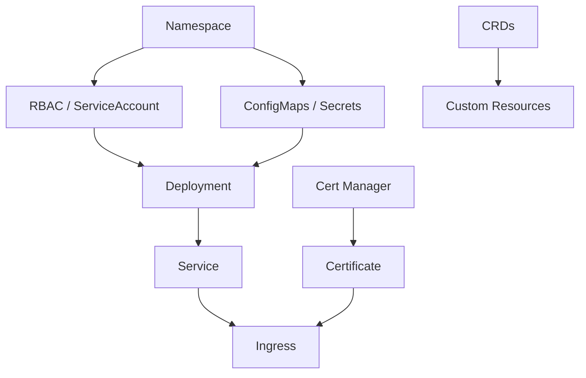
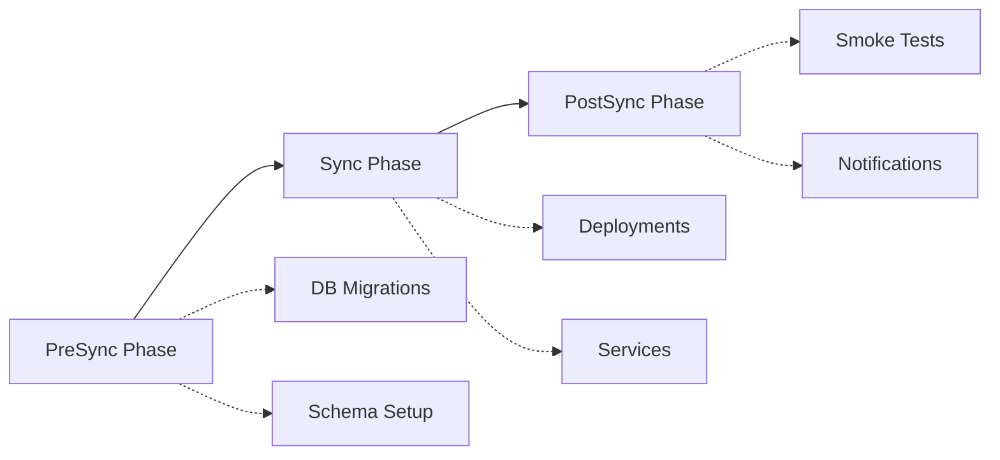

# How to Handle Infrastructure Dependencies with ArgoCD

Author: [nawazdhandala](https://github.com/nawazdhandala)

Tags: ArgoCD, GitOps, Kubernetes, Infrastructure, Sync Waves

Description: Learn how to manage complex infrastructure dependencies in ArgoCD using sync waves, sync phases, health checks, and ApplicationSet ordering to deploy resources in the correct sequence.

---

Infrastructure has dependencies. You cannot create a database before the VPC exists. You cannot deploy an application before its namespace, config maps, and secrets are ready. You cannot configure ingress before the ingress controller is installed. ArgoCD provides several mechanisms to handle these ordering requirements, but using them effectively requires understanding how they interact.

This guide covers sync waves, sync phases, resource health checks, and multi-Application dependency patterns to ensure your infrastructure deploys in the right order.

## Understanding the Dependency Challenge

Consider a typical application stack:



Without explicit ordering, ArgoCD applies all resources simultaneously. This works surprisingly often because Kubernetes has built-in retry logic. But when it fails, it fails in confusing ways - resources are "healthy" but missing dependencies, or they enter crash loops waiting for resources that have not been created yet.

## Sync Waves: Ordering Within an Application

Sync waves control the order in which resources within a single ArgoCD Application are applied. Resources with lower wave numbers are applied first.

```yaml
# Wave -1: Namespace must exist before anything else
apiVersion: v1
kind: Namespace
metadata:
  name: my-app
  annotations:
    argocd.argoproj.io/sync-wave: "-1"

---
# Wave 0: Secrets and ConfigMaps (default wave)
apiVersion: v1
kind: Secret
metadata:
  name: db-credentials
  namespace: my-app
  annotations:
    argocd.argoproj.io/sync-wave: "0"
type: Opaque
data:
  password: cGFzc3dvcmQ=

---
# Wave 0: ConfigMap
apiVersion: v1
kind: ConfigMap
metadata:
  name: app-config
  namespace: my-app
  annotations:
    argocd.argoproj.io/sync-wave: "0"
data:
  DATABASE_HOST: "postgres.my-app.svc"

---
# Wave 1: Database deployment
apiVersion: apps/v1
kind: Deployment
metadata:
  name: postgres
  namespace: my-app
  annotations:
    argocd.argoproj.io/sync-wave: "1"
spec:
  replicas: 1
  selector:
    matchLabels:
      app: postgres
  template:
    metadata:
      labels:
        app: postgres
    spec:
      containers:
        - name: postgres
          image: postgres:16
          envFrom:
            - secretRef:
                name: db-credentials

---
# Wave 1: Database service
apiVersion: v1
kind: Service
metadata:
  name: postgres
  namespace: my-app
  annotations:
    argocd.argoproj.io/sync-wave: "1"
spec:
  selector:
    app: postgres
  ports:
    - port: 5432

---
# Wave 2: Application deployment (depends on database)
apiVersion: apps/v1
kind: Deployment
metadata:
  name: api-service
  namespace: my-app
  annotations:
    argocd.argoproj.io/sync-wave: "2"
spec:
  replicas: 3
  selector:
    matchLabels:
      app: api-service
  template:
    metadata:
      labels:
        app: api-service
    spec:
      containers:
        - name: api
          image: myregistry.io/api-service:latest
          envFrom:
            - configMapRef:
                name: app-config

---
# Wave 3: Ingress (depends on service being ready)
apiVersion: networking.k8s.io/v1
kind: Ingress
metadata:
  name: api-ingress
  namespace: my-app
  annotations:
    argocd.argoproj.io/sync-wave: "3"
spec:
  ingressClassName: nginx
  rules:
    - host: api.example.com
      http:
        paths:
          - path: /
            pathType: Prefix
            backend:
              service:
                name: api-service
                port:
                  number: 8080
```

ArgoCD processes waves sequentially: it applies all wave -1 resources, waits for them to be healthy, then applies wave 0, waits for health, and so on.

## Sync Phases: PreSync, Sync, and PostSync

Sync phases provide three distinct execution stages:



```yaml
# PreSync: Run database migration before deploying
apiVersion: batch/v1
kind: Job
metadata:
  name: db-migrate
  annotations:
    argocd.argoproj.io/hook: PreSync
    argocd.argoproj.io/hook-delete-policy: BeforeHookCreation
spec:
  template:
    spec:
      restartPolicy: Never
      containers:
        - name: migrate
          image: myregistry.io/db-migrations:latest
          command: ["./migrate", "up"]
          env:
            - name: DATABASE_URL
              valueFrom:
                secretKeyRef:
                  name: db-credentials
                  key: url
```

## Multi-Application Dependencies

When infrastructure spans multiple ArgoCD Applications, you need to coordinate between them. There are several approaches:

### Approach 1: Health-Based Dependencies

ArgoCD Applications report their health status. Use this to chain Applications:

```yaml
# Infrastructure Application (deploys first)
apiVersion: argoproj.io/v1alpha1
kind: Application
metadata:
  name: infrastructure
  namespace: argocd
  annotations:
    argocd.argoproj.io/sync-wave: "0"
spec:
  project: default
  source:
    repoURL: https://github.com/myorg/gitops.git
    path: infrastructure
  destination:
    server: https://kubernetes.default.svc

---
# Application deployment (depends on infrastructure)
apiVersion: argoproj.io/v1alpha1
kind: Application
metadata:
  name: api-service
  namespace: argocd
  annotations:
    argocd.argoproj.io/sync-wave: "1"
spec:
  project: default
  source:
    repoURL: https://github.com/myorg/gitops.git
    path: apps/api-service
  destination:
    server: https://kubernetes.default.svc
    namespace: default
```

When these Applications are managed by a parent App of Apps, the sync waves ensure infrastructure is healthy before application deployment begins.

### Approach 2: ApplicationSet with Progressive Sync

ApplicationSet's progressive sync feature rolls out changes to Applications sequentially:

```yaml
apiVersion: argoproj.io/v1alpha1
kind: ApplicationSet
metadata:
  name: platform-apps
  namespace: argocd
spec:
  generators:
    - list:
        elements:
          - name: cert-manager
            path: infrastructure/cert-manager
            wave: "0"
          - name: ingress-nginx
            path: infrastructure/ingress-nginx
            wave: "1"
          - name: monitoring
            path: infrastructure/monitoring
            wave: "2"
          - name: api-service
            path: apps/api-service
            wave: "3"
          - name: frontend
            path: apps/frontend
            wave: "3"
  strategy:
    type: RollingSync
    rollingSync:
      steps:
        - matchExpressions:
            - key: wave
              operator: In
              values:
                - "0"
        - matchExpressions:
            - key: wave
              operator: In
              values:
                - "1"
        - matchExpressions:
            - key: wave
              operator: In
              values:
                - "2"
        - matchExpressions:
            - key: wave
              operator: In
              values:
                - "3"
  template:
    metadata:
      name: "{{name}}"
      labels:
        wave: "{{wave}}"
    spec:
      project: default
      source:
        repoURL: https://github.com/myorg/gitops.git
        targetRevision: main
        path: "{{path}}"
      destination:
        server: https://kubernetes.default.svc
```

### Approach 3: Init Containers for Runtime Dependencies

When ArgoCD ordering is not enough, use init containers to wait for dependencies at runtime:

```yaml
apiVersion: apps/v1
kind: Deployment
metadata:
  name: api-service
spec:
  template:
    spec:
      initContainers:
        # Wait for database to accept connections
        - name: wait-for-db
          image: busybox:1.36
          command:
            - sh
            - -c
            - |
              until nc -z postgres.my-app.svc 5432; do
                echo "Waiting for database..."
                sleep 2
              done
              echo "Database is ready"
        # Wait for Redis
        - name: wait-for-redis
          image: busybox:1.36
          command:
            - sh
            - -c
            - |
              until nc -z redis.my-app.svc 6379; do
                echo "Waiting for Redis..."
                sleep 2
              done
      containers:
        - name: api
          image: myregistry.io/api-service:latest
```

## Custom Health Checks

ArgoCD uses health checks to determine when a resource is ready before proceeding to the next sync wave. You can add custom health checks for CRDs:

```yaml
# In argocd-cm ConfigMap
apiVersion: v1
kind: ConfigMap
metadata:
  name: argocd-cm
  namespace: argocd
data:
  resource.customizations.health.myorg.io_Database: |
    hs = {}
    if obj.status ~= nil then
      if obj.status.ready == true then
        hs.status = "Healthy"
        hs.message = "Database is ready"
      elseif obj.status.phase == "Provisioning" then
        hs.status = "Progressing"
        hs.message = "Database is being provisioned"
      else
        hs.status = "Degraded"
        hs.message = obj.status.message or "Unknown error"
      end
    else
      hs.status = "Progressing"
      hs.message = "Waiting for status"
    end
    return hs
```

This is critical for Crossplane resources, Cert Manager certificates, and any custom resources that have their own provisioning lifecycle.

## Common Dependency Patterns

### CRD Before Custom Resource

```yaml
# Wave -5: Install the CRD
apiVersion: apiextensions.k8s.io/v1
kind: CustomResourceDefinition
metadata:
  annotations:
    argocd.argoproj.io/sync-wave: "-5"
# ...

---
# Wave 0: Create instances of the CRD
apiVersion: myorg.io/v1
kind: MyCustomResource
metadata:
  annotations:
    argocd.argoproj.io/sync-wave: "0"
```

### Operator Before Operand

```yaml
# Wave -3: Cert Manager operator
apiVersion: argoproj.io/v1alpha1
kind: Application
metadata:
  name: cert-manager
  annotations:
    argocd.argoproj.io/sync-wave: "-3"

---
# Wave 0: Certificates (need the operator running)
apiVersion: argoproj.io/v1alpha1
kind: Application
metadata:
  name: certificates
  annotations:
    argocd.argoproj.io/sync-wave: "0"
```

## Debugging Dependency Issues

When sync waves are not working as expected:

```bash
# Check which wave a resource is in
kubectl get all -n my-app -o json | \
  jq '.items[] | {name: .metadata.name, wave: .metadata.annotations["argocd.argoproj.io/sync-wave"]}'

# Check resource health status
argocd app get my-app --show-operation

# View sync operation details
argocd app sync my-app --dry-run
```

For more on ArgoCD sync hooks and phases, see our guide on [ArgoCD resource hooks](https://oneuptime.com/blog/post/2026-01-25-resource-hooks-argocd/view). Monitor your infrastructure deployment pipeline with OneUptime to track sync times, failure rates, and dependency bottlenecks.

## Best Practices

1. **Use negative waves for prerequisites** - Namespaces, CRDs, and operators should use negative sync waves (-5, -3, -1).
2. **Keep waves coarse** - Use 3 to 5 waves, not 20. Too many waves make syncs slow.
3. **Add init containers as a safety net** - Sync waves handle ordering at deploy time. Init containers handle ordering at runtime.
4. **Define custom health checks for CRDs** - Without them, ArgoCD cannot wait for custom resources to be ready.
5. **Test dependency ordering in staging** - Break things intentionally to verify the ordering works.
6. **Document your dependency graph** - Use Mermaid diagrams in your repo to document what depends on what.
7. **Prefer explicit over implicit** - Always annotate sync waves, even when using the default (0). It makes the intent clear.

Managing infrastructure dependencies in ArgoCD requires combining multiple mechanisms - sync waves for ordering, health checks for readiness, and init containers for runtime safety. Get the combination right, and your infrastructure deploys reliably every time.
