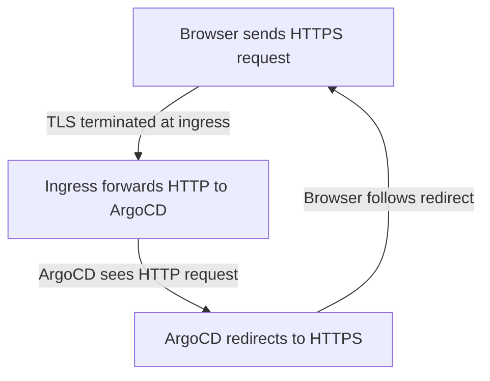

# How to Fix ArgoCD Ingress Redirect Loop Issues

Author: [nawazdhandala](https://github.com/nawazdhandala)

Tags: ArgoCD, GitOps, Kubernetes, Troubleshooting, Ingress

Description: Diagnose and fix redirect loop issues when accessing ArgoCD through an ingress controller, covering TLS mismatches and proxy configuration.

---

A redirect loop when accessing ArgoCD through an ingress is one of the most common and annoying issues during setup. Your browser shows "too many redirects" or "ERR_TOO_MANY_REDIRECTS", and nothing loads. This happens because ArgoCD and the ingress controller are both trying to redirect traffic, creating an infinite cycle. This guide explains exactly why it happens and how to fix it for every scenario.

## Understanding the Redirect Loop

The redirect loop happens because of a conflict between ArgoCD's built-in HTTPS redirect and the ingress controller's HTTPS redirect. Here is the cycle:



1. The browser sends an HTTPS request to the ingress
2. The ingress terminates TLS and forwards plain HTTP to ArgoCD
3. ArgoCD sees an HTTP request and redirects the browser to HTTPS
4. The browser follows the redirect and sends HTTPS to the ingress again
5. Repeat forever

## The Root Cause

ArgoCD server, by default, serves HTTPS and redirects HTTP requests to HTTPS. When an ingress controller terminates TLS, it forwards plain HTTP to ArgoCD. ArgoCD sees HTTP and responds with a redirect to HTTPS. The ingress processes the redirect and sends back HTTP to ArgoCD, creating the loop.

## Fix 1: Enable Insecure Mode (Recommended)

The most common fix. Tell ArgoCD to stop redirecting HTTP to HTTPS:

```yaml
apiVersion: v1
kind: ConfigMap
metadata:
  name: argocd-cmd-params-cm
  namespace: argocd
data:
  server.insecure: "true"
```

```bash
kubectl apply -f argocd-cmd-params-cm.yaml
kubectl rollout restart deployment argocd-server -n argocd
```

Then configure your ingress with HTTP backend:

```yaml
apiVersion: networking.k8s.io/v1
kind: Ingress
metadata:
  name: argocd-server-ingress
  namespace: argocd
  annotations:
    nginx.ingress.kubernetes.io/backend-protocol: "HTTP"
    nginx.ingress.kubernetes.io/force-ssl-redirect: "true"
spec:
  ingressClassName: nginx
  rules:
    - host: argocd.example.com
      http:
        paths:
          - path: /
            pathType: Prefix
            backend:
              service:
                name: argocd-server
                port:
                  number: 80
  tls:
    - hosts:
        - argocd.example.com
      secretName: argocd-server-tls
```

## Fix 2: Use HTTPS Backend Protocol

If you do not want to run ArgoCD in insecure mode, tell the ingress to send HTTPS to the backend:

```yaml
annotations:
  # Tell Nginx to use HTTPS when talking to ArgoCD
  nginx.ingress.kubernetes.io/backend-protocol: "HTTPS"
```

And point to port 443:

```yaml
backend:
  service:
    name: argocd-server
    port:
      number: 443
```

This makes the ingress send HTTPS to ArgoCD, so ArgoCD sees HTTPS and does not redirect. The downside is that the ingress needs to handle the TLS certificate verification with the backend (or skip it).

## Fix 3: Use TLS Passthrough

With passthrough, the ingress does not terminate TLS at all. Traffic goes encrypted directly to ArgoCD:

```yaml
annotations:
  nginx.ingress.kubernetes.io/ssl-passthrough: "true"
```

No redirect loop because ArgoCD handles the original HTTPS request directly. See our [TLS passthrough guide](https://oneuptime.com/blog/post/2026-02-26-argocd-tls-passthrough/view) for details.

## Fix 4: Configure X-Forwarded-Proto Header

Some ingress controllers send an `X-Forwarded-Proto` header that tells the backend what protocol the original request used. If ArgoCD respects this header, it will not redirect when it sees `X-Forwarded-Proto: https`.

For Nginx Ingress:

```yaml
annotations:
  nginx.ingress.kubernetes.io/use-forwarded-headers: "true"
```

Check if this resolves the issue before trying insecure mode. Not all ArgoCD versions handle this header consistently.

## Fixing for Specific Ingress Controllers

### Nginx Ingress

```yaml
annotations:
  nginx.ingress.kubernetes.io/backend-protocol: "HTTP"
  nginx.ingress.kubernetes.io/force-ssl-redirect: "true"
  # Do NOT add ssl-redirect: "true" AND force-ssl-redirect simultaneously
  # Pick one approach
```

And ensure ArgoCD has `server.insecure: "true"`.

### Traefik

```yaml
# Use IngressRoute instead of Ingress
apiVersion: traefik.io/v1alpha1
kind: IngressRoute
metadata:
  name: argocd-server
  namespace: argocd
spec:
  entryPoints:
    - websecure
  routes:
    - kind: Rule
      match: Host(`argocd.example.com`)
      services:
        - name: argocd-server
          port: 80
  tls:
    certResolver: letsencrypt
```

With ArgoCD in insecure mode and Traefik serving on the `websecure` entrypoint, there is no redirect loop.

### AWS ALB

```yaml
annotations:
  alb.ingress.kubernetes.io/backend-protocol: HTTP
  alb.ingress.kubernetes.io/listen-ports: '[{"HTTPS": 443}]'
  alb.ingress.kubernetes.io/ssl-redirect: "443"
```

ALB handles HTTP to HTTPS redirect at the load balancer level, and always sends HTTP to the backend. ArgoCD must be in insecure mode.

### GCE Ingress

```yaml
# Use FrontendConfig for HTTPS redirect
apiVersion: networking.gke.io/v1beta1
kind: FrontendConfig
metadata:
  name: argocd-frontend
  namespace: argocd
spec:
  redirectToHttps:
    enabled: true
```

GCE always sends HTTP to the backend. ArgoCD must be in insecure mode.

## Debugging the Redirect Loop

If you are not sure where the redirect is coming from, trace it:

```bash
# Follow redirects and show each step
curl -vL https://argocd.example.com 2>&1 | grep -E "< HTTP|< Location"

# Check just the first redirect
curl -I http://argocd.example.com
curl -I https://argocd.example.com

# Check what the backend returns directly (bypass ingress)
kubectl port-forward svc/argocd-server -n argocd 8080:80
curl -I http://localhost:8080
# If this returns a redirect to HTTPS, ArgoCD is causing the loop
```

## Checking ArgoCD's Current Mode

```bash
# Check if insecure mode is set
kubectl get configmap argocd-cmd-params-cm -n argocd -o yaml

# Check the server args
kubectl get deployment argocd-server -n argocd -o jsonpath='{.spec.template.spec.containers[0].args}'

# Check the server logs for mode indication
kubectl logs -n argocd -l app.kubernetes.io/name=argocd-server | head -5
```

## Redirect Loop After Upgrading ArgoCD

If the redirect loop started after an ArgoCD upgrade, the ConfigMap might have been reset. Check and reapply:

```bash
# Verify the ConfigMap still has insecure mode
kubectl get configmap argocd-cmd-params-cm -n argocd -o jsonpath='{.data.server\.insecure}'

# If empty or missing, reapply
kubectl patch configmap argocd-cmd-params-cm -n argocd --type merge \
  -p '{"data":{"server.insecure":"true"}}'
kubectl rollout restart deployment argocd-server -n argocd
```

## Quick Decision Matrix

| Your Setup | Fix |
|-----------|-----|
| Ingress with TLS termination | Set `server.insecure: "true"` |
| TLS passthrough | Keep ArgoCD in secure mode |
| Cloud load balancer (ALB, GCE) | Set `server.insecure: "true"` |
| Cloudflare Tunnel | Set `server.insecure: "true"` |
| Direct access (no proxy) | Keep ArgoCD in secure mode |
| Reverse proxy (HAProxy, etc.) | Set `server.insecure: "true"` |

The general rule: if something else terminates TLS before ArgoCD, set insecure mode. If ArgoCD handles TLS itself, leave it in secure mode.

For more on ArgoCD networking, see [configuring ArgoCD with TLS termination](https://oneuptime.com/blog/post/2026-02-26-argocd-tls-termination-load-balancer/view) and [configuring ArgoCD server as insecure](https://oneuptime.com/blog/post/2026-02-26-argocd-server-insecure-mode/view).
