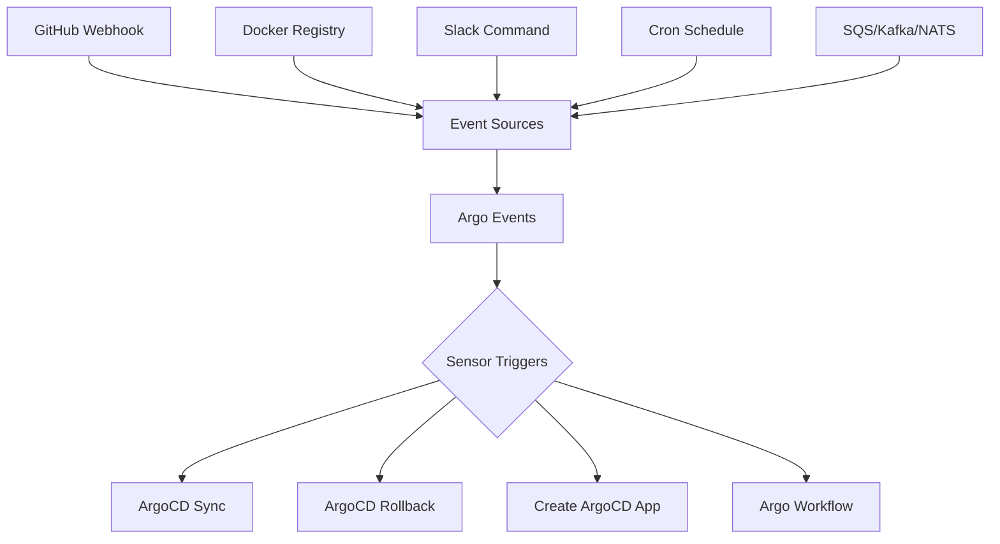

# How to Integrate ArgoCD with Argo Events

Author: [nawazdhandala](https://github.com/nawazdhandala)

Tags: ArgoCD, GitOps, Kubernetes, Argo Events, Event-Driven

Description: Learn how to integrate ArgoCD with Argo Events to build event-driven GitOps workflows that automatically trigger deployments, syncs, and rollbacks based on external events.

---

ArgoCD watches Git repositories and syncs cluster state. But what if you need to trigger ArgoCD actions based on external events - a new container image pushed to a registry, a message on a queue, a webhook from your CI system, or a scheduled cron event? Argo Events bridges this gap. It captures events from virtually any source and triggers ArgoCD operations in response, enabling fully event-driven GitOps workflows.

## What Argo Events Brings to ArgoCD

ArgoCD on its own is poll-based. It periodically checks Git repositories for changes (every 3 minutes by default). Argo Events makes your GitOps pipeline reactive:

- **Instant deployments** triggered by Git push webhooks instead of waiting for ArgoCD to poll
- **Image-driven deployments** triggered when new images are pushed to a registry
- **Cross-system coordination** triggered by messages from SQS, Kafka, NATS, or other message systems
- **Scheduled operations** like nightly syncs to non-production environments
- **Approval-gated deployments** triggered by Slack commands or API calls



## Installing Argo Events

```bash
# Create namespace
kubectl create namespace argo-events

# Install Argo Events
kubectl apply -n argo-events -f https://raw.githubusercontent.com/argoproj/argo-events/stable/manifests/install.yaml

# Install the EventBus (NATS-based message bus)
kubectl apply -n argo-events -f https://raw.githubusercontent.com/argoproj/argo-events/stable/examples/eventbus/native.yaml
```

## Core Concepts

Argo Events has three main components:

- **EventSource** - Connects to external event producers (webhooks, queues, schedules)
- **EventBus** - Internal message bus that routes events from sources to sensors
- **Sensor** - Evaluates event conditions and triggers actions (like ArgoCD syncs)

## Triggering ArgoCD Sync on Git Push

The most common integration: sync ArgoCD immediately when code is pushed instead of waiting for the polling interval.

### Step 1: Create the EventSource

```yaml
apiVersion: argoproj.io/v1alpha1
kind: EventSource
metadata:
  name: github-eventsource
  namespace: argo-events
spec:
  service:
    ports:
      - port: 12000
        targetPort: 12000
  github:
    app-repo:
      repositories:
        - owner: my-org
          names:
            - my-app
            - my-api
      webhook:
        endpoint: /github
        port: "12000"
        method: POST
      events:
        - push
        - pull_request
      apiToken:
        name: github-token
        key: token
      webhookSecret:
        name: github-token
        key: webhook-secret
```

### Step 2: Create the Sensor

```yaml
apiVersion: argoproj.io/v1alpha1
kind: Sensor
metadata:
  name: argocd-sync-sensor
  namespace: argo-events
spec:
  dependencies:
    - name: github-push
      eventSourceName: github-eventsource
      eventName: app-repo
      filters:
        data:
          # Only trigger on pushes to main branch
          - path: body.ref
            type: string
            value:
              - "refs/heads/main"
  triggers:
    - template:
        name: sync-argocd
        http:
          url: http://argocd-server.argocd.svc.cluster.local/api/v1/applications/my-app/sync
          method: POST
          headers:
            Content-Type: application/json
            Authorization: "Bearer $ARGOCD_TOKEN"
          payload:
            - src:
                dependencyName: github-push
                dataKey: body.after
              dest: revision
          secureHeaders:
            - name: Authorization
              valueFrom:
                secretKeyRef:
                  name: argocd-token
                  key: token
```

### Step 3: Expose the EventSource Webhook

Create a Service and Ingress to receive GitHub webhooks:

```yaml
apiVersion: networking.k8s.io/v1
kind: Ingress
metadata:
  name: github-webhook-ingress
  namespace: argo-events
  annotations:
    nginx.ingress.kubernetes.io/ssl-redirect: "true"
spec:
  rules:
    - host: webhooks.mycompany.com
      http:
        paths:
          - path: /github
            pathType: Prefix
            backend:
              service:
                name: github-eventsource-eventsource-svc
                port:
                  number: 12000
```

## Triggering ArgoCD on New Container Images

Deploy automatically when a new image is pushed to your registry:

```yaml
# EventSource watching a Docker registry
apiVersion: argoproj.io/v1alpha1
kind: EventSource
metadata:
  name: docker-registry
  namespace: argo-events
spec:
  webhook:
    image-push:
      endpoint: /docker
      port: "13000"
      method: POST

---
# Sensor that triggers ArgoCD sync
apiVersion: argoproj.io/v1alpha1
kind: Sensor
metadata:
  name: image-deploy-sensor
  namespace: argo-events
spec:
  dependencies:
    - name: new-image
      eventSourceName: docker-registry
      eventName: image-push
      filters:
        data:
          - path: body.repository.repo_name
            type: string
            value:
              - "my-org/my-app"
  triggers:
    - template:
        name: update-and-sync
        argoWorkflow:
          operation: submit
          source:
            resource:
              apiVersion: argoproj.io/v1alpha1
              kind: Workflow
              metadata:
                generateName: update-image-
                namespace: argo
              spec:
                entrypoint: update
                arguments:
                  parameters:
                    - name: image-tag
                      value: ""
                templates:
                  - name: update
                    inputs:
                      parameters:
                        - name: image-tag
                    container:
                      image: alpine/git:latest
                      command: [sh, -c]
                      args:
                        - |
                          git clone https://$(GIT_TOKEN)@github.com/my-org/manifests.git /tmp/repo
                          cd /tmp/repo
                          sed -i "s|image: my-org/my-app:.*|image: my-org/my-app:{{inputs.parameters.image-tag}}|" \
                            apps/my-app/deployment.yaml
                          git add . && git commit -m "Update image to {{inputs.parameters.image-tag}}"
                          git push origin main
                      env:
                        - name: GIT_TOKEN
                          valueFrom:
                            secretKeyRef:
                              name: git-credentials
                              key: token
          parameters:
            - src:
                dependencyName: new-image
                dataKey: body.push_data.tag
              dest: spec.arguments.parameters.0.value
```

## Scheduled ArgoCD Operations

Run periodic syncs or refreshes using a cron EventSource:

```yaml
apiVersion: argoproj.io/v1alpha1
kind: EventSource
metadata:
  name: cron-source
  namespace: argo-events
spec:
  calendar:
    nightly-sync:
      # Every night at 2 AM UTC
      schedule: "0 2 * * *"
      timezone: "UTC"
    weekly-refresh:
      # Every Monday at 6 AM UTC
      schedule: "0 6 * * 1"
      timezone: "UTC"

---
apiVersion: argoproj.io/v1alpha1
kind: Sensor
metadata:
  name: scheduled-sync-sensor
  namespace: argo-events
spec:
  dependencies:
    - name: nightly
      eventSourceName: cron-source
      eventName: nightly-sync
  triggers:
    - template:
        name: sync-staging
        http:
          url: http://argocd-server.argocd.svc.cluster.local/api/v1/applications/staging-app/sync
          method: POST
          headers:
            Content-Type: application/json
          payload:
            - src:
                dependencyName: nightly
                value: '{"prune": true}'
              dest: ""
          secureHeaders:
            - name: Authorization
              valueFrom:
                secretKeyRef:
                  name: argocd-token
                  key: token
```

## Event-Driven Rollbacks

Automatically roll back ArgoCD applications when monitoring systems detect issues:

```yaml
apiVersion: argoproj.io/v1alpha1
kind: Sensor
metadata:
  name: rollback-sensor
  namespace: argo-events
spec:
  dependencies:
    - name: alert-fired
      eventSourceName: prometheus-webhook
      eventName: critical-alert
      filters:
        data:
          - path: body.alerts.0.labels.app
            type: string
            value:
              - "my-app"
          - path: body.alerts.0.status
            type: string
            value:
              - "firing"
  triggers:
    - template:
        name: rollback-app
        http:
          url: http://argocd-server.argocd.svc.cluster.local/api/v1/applications/my-app/rollback
          method: POST
          headers:
            Content-Type: application/json
          payload:
            - src:
                dependencyName: alert-fired
                value: '{"id": 0}'
              dest: ""
          secureHeaders:
            - name: Authorization
              valueFrom:
                secretKeyRef:
                  name: argocd-token
                  key: token
```

## RBAC for Argo Events to ArgoCD Communication

Create a dedicated ArgoCD account for Argo Events:

```yaml
# argocd-cm ConfigMap
data:
  accounts.argo-events: apiKey

# argocd-rbac-cm ConfigMap
data:
  policy.csv: |
    p, argo-events, applications, sync, */*, allow
    p, argo-events, applications, get, */*, allow
```

Generate the API token:

```bash
# Generate token for the argo-events account
argocd account generate-token --account argo-events

# Store it as a Kubernetes secret
kubectl create secret generic argocd-token -n argo-events \
  --from-literal=token="Bearer <generated-token>"
```

## Best Practices

1. **Use webhook secrets** to verify event authenticity and prevent unauthorized triggers.
2. **Filter events carefully** in sensors to avoid triggering on irrelevant events.
3. **Use RBAC** to limit what Argo Events can do in ArgoCD - only grant sync permissions, not delete.
4. **Monitor sensor logs** to catch trigger failures early.
5. **Set up dead-letter queues** for events that fail to trigger successfully.
6. **Combine with Argo Workflows** for complex multi-step operations that go beyond simple sync.

Argo Events transforms ArgoCD from a poll-based system into a reactive, event-driven deployment platform. Whether you need instant deployments on Git push, image-triggered rollouts, or scheduled syncs, the combination of Argo Events and ArgoCD gives you the building blocks. For the full CI/CD picture, see [How to Integrate ArgoCD with Argo Workflows](https://oneuptime.com/blog/post/2026-02-26-argocd-integrate-argo-workflows/view).
