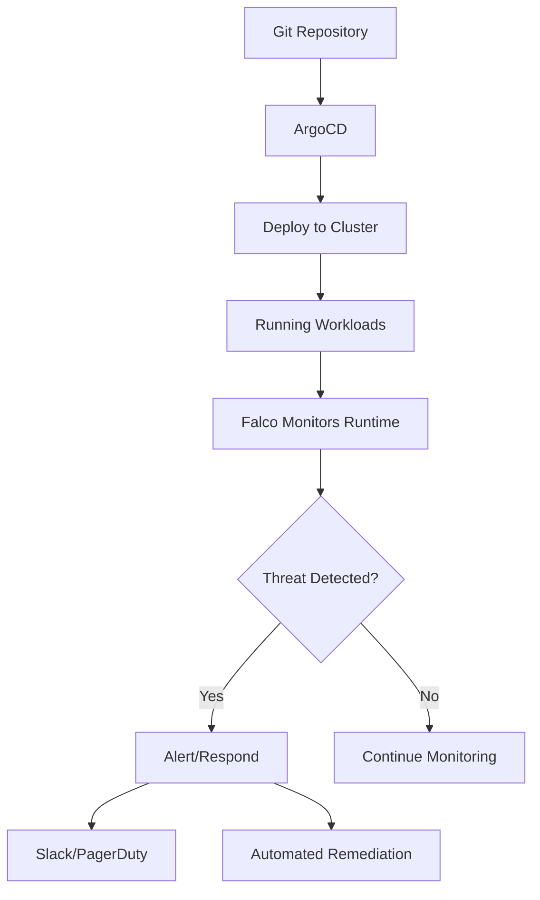

# How to Integrate ArgoCD with Falco for Security

Author: [nawazdhandala](https://github.com/nawazdhandala)

Tags: ArgoCD, GitOps, Kubernetes, Falco, Security

Description: Learn how to integrate ArgoCD with Falco for runtime security monitoring, deploying Falco rules through GitOps, and building automated security response workflows in Kubernetes.

---

Falco is the cloud-native runtime security tool that detects unexpected behavior in your Kubernetes workloads. It monitors system calls, Kubernetes audit events, and cloud provider logs in real time. When managed through ArgoCD, your Falco deployment and security rules become part of your GitOps workflow - version-controlled, peer-reviewed, and consistently deployed. This guide covers the complete integration.

## What Falco Adds to Your ArgoCD Workflow

ArgoCD ensures your cluster matches your Git repository. Falco ensures your running workloads behave as expected at runtime. Together they cover two critical security dimensions:

- **ArgoCD** prevents configuration drift and unauthorized changes to resource definitions
- **Falco** detects runtime anomalies like shell access to containers, unexpected network connections, or privilege escalation



## Deploying Falco with ArgoCD

Install Falco using the official Helm chart through ArgoCD:

```yaml
apiVersion: argoproj.io/v1alpha1
kind: Application
metadata:
  name: falco
  namespace: argocd
spec:
  project: security
  source:
    repoURL: https://falcosecurity.github.io/charts
    chart: falco
    targetRevision: 4.0.0
    helm:
      values: |
        driver:
          kind: modern_ebpf  # Use eBPF instead of kernel module
        falcosidekick:
          enabled: true
          config:
            slack:
              webhookurl: ""  # Configure via secret
              channel: "#security-alerts"
              minimumpriority: "warning"
            webhook:
              address: "http://security-responder.security.svc:8080/falco"
        tty: true
        resources:
          requests:
            cpu: 100m
            memory: 512Mi
          limits:
            memory: 1Gi
        falco:
          grpc:
            enabled: true
          grpc_output:
            enabled: true
          json_output: true
          log_level: info
  destination:
    server: https://kubernetes.default.svc
    namespace: falco
  syncPolicy:
    automated:
      prune: true
    syncOptions:
      - CreateNamespace=true
```

## Managing Falco Rules through GitOps

Store custom Falco rules in your Git repository and deploy them as ConfigMaps:

```yaml
# Git: security/falco-rules/custom-rules.yaml
apiVersion: v1
kind: ConfigMap
metadata:
  name: falco-custom-rules
  namespace: falco
  labels:
    app.kubernetes.io/name: falco
data:
  custom-rules.yaml: |
    # Detect shell access to production containers
    - rule: Shell in Production Container
      desc: Detect shell access to containers in production namespaces
      condition: >
        spawned_process and
        container and
        proc.name in (bash, sh, zsh, dash, ksh) and
        k8s.ns.name in (production, payments, orders)
      output: >
        Shell opened in production container
        (user=%user.name command=%proc.cmdline
        container=%container.name namespace=%k8s.ns.name
        pod=%k8s.pod.name image=%container.image.repository)
      priority: WARNING
      tags: [container, shell, production]

    # Detect unauthorized network connections
    - rule: Unexpected Outbound Connection
      desc: Detect outbound connections to unexpected destinations
      condition: >
        outbound and
        container and
        k8s.ns.name in (production) and
        not (fd.sip in (10.0.0.0/8, 172.16.0.0/12, 192.168.0.0/16))
      output: >
        Unexpected outbound connection from production
        (command=%proc.cmdline connection=%fd.name
        container=%container.name namespace=%k8s.ns.name)
      priority: NOTICE
      tags: [network, production]

    # Detect privilege escalation
    - rule: Container Privilege Escalation
      desc: Detect attempts to escalate privileges in containers
      condition: >
        spawned_process and
        container and
        (proc.name in (sudo, su) or
        proc.cmdline contains "nsenter" or
        proc.cmdline contains "chroot")
      output: >
        Privilege escalation attempt in container
        (user=%user.name command=%proc.cmdline
        container=%container.name pod=%k8s.pod.name)
      priority: CRITICAL
      tags: [container, privilege]

    # Detect sensitive file access
    - rule: Read Sensitive Files in Container
      desc: Detect reading of sensitive files like /etc/shadow
      condition: >
        open_read and
        container and
        (fd.name in (/etc/shadow, /etc/passwd, /etc/sudoers) or
        fd.directory in (/root/.ssh, /home/*/.ssh))
      output: >
        Sensitive file read in container
        (file=%fd.name command=%proc.cmdline
        container=%container.name)
      priority: WARNING
      tags: [container, filesystem, sensitive]

    # Detect crypto mining
    - rule: Crypto Mining Detected
      desc: Detect cryptocurrency mining processes
      condition: >
        spawned_process and
        container and
        (proc.name in (xmrig, minerd, minergate, cpuminer) or
        proc.cmdline contains "stratum+tcp" or
        proc.cmdline contains "cryptonight")
      output: >
        Crypto mining detected
        (command=%proc.cmdline container=%container.name
        namespace=%k8s.ns.name pod=%k8s.pod.name)
      priority: CRITICAL
      tags: [container, crypto, mining]
```

Deploy the custom rules through ArgoCD:

```yaml
apiVersion: argoproj.io/v1alpha1
kind: Application
metadata:
  name: falco-custom-rules
  namespace: argocd
  annotations:
    argocd.argoproj.io/sync-wave: "1"  # After Falco is installed
spec:
  project: security
  source:
    repoURL: https://github.com/my-org/platform-security.git
    targetRevision: main
    path: security/falco-rules
  destination:
    server: https://kubernetes.default.svc
    namespace: falco
  syncPolicy:
    automated:
      prune: true
```

## Connecting Falco Alerts to ArgoCD Workflows

Use Falcosidekick to trigger automated responses when Falco detects threats:

```yaml
# Falcosidekick configuration in Falco Helm values
falcosidekick:
  enabled: true
  config:
    # Alert channels
    slack:
      webhookurl: ""
      channel: "#security-incidents"
      minimumpriority: "warning"

    # Trigger Argo Workflows for automated response
    webhook:
      address: "http://argo-events-webhook.argo-events.svc:12000/falco"
      minimumpriority: "critical"
```

Create an Argo Events sensor that responds to Falco alerts:

```yaml
apiVersion: argoproj.io/v1alpha1
kind: EventSource
metadata:
  name: falco-alerts
  namespace: argo-events
spec:
  webhook:
    falco:
      endpoint: /falco
      port: "12000"
      method: POST

---
apiVersion: argoproj.io/v1alpha1
kind: Sensor
metadata:
  name: falco-response
  namespace: argo-events
spec:
  dependencies:
    - name: falco-critical
      eventSourceName: falco-alerts
      eventName: falco
      filters:
        data:
          - path: body.priority
            type: string
            value:
              - "Critical"
  triggers:
    - template:
        name: quarantine-pod
        argoWorkflow:
          operation: submit
          source:
            resource:
              apiVersion: argoproj.io/v1alpha1
              kind: Workflow
              metadata:
                generateName: quarantine-
                namespace: argo
              spec:
                entrypoint: quarantine
                arguments:
                  parameters:
                    - name: pod-name
                      value: ""
                    - name: namespace
                      value: ""
                templates:
                  - name: quarantine
                    inputs:
                      parameters:
                        - name: pod-name
                        - name: namespace
                    container:
                      image: bitnami/kubectl:latest
                      command: [sh, -c]
                      args:
                        - |
                          # Apply a network policy to isolate the pod
                          kubectl label pod {{inputs.parameters.pod-name}} \
                            -n {{inputs.parameters.namespace}} \
                            quarantine=true --overwrite

                          echo "Pod quarantined: {{inputs.parameters.pod-name}}"
          parameters:
            - src:
                dependencyName: falco-critical
                dataKey: body.output_fields.k8s.pod.name
              dest: spec.arguments.parameters.0.value
            - src:
                dependencyName: falco-critical
                dataKey: body.output_fields.k8s.ns.name
              dest: spec.arguments.parameters.1.value
```

## Monitoring Falco Health with ArgoCD

Configure ArgoCD to check Falco DaemonSet health:

```yaml
# argocd-cm ConfigMap
data:
  resource.customizations.health.apps_DaemonSet: |
    hs = {}
    if obj.status ~= nil then
      if obj.status.desiredNumberScheduled == obj.status.numberReady then
        hs.status = "Healthy"
        hs.message = "All Falco pods are running"
      elseif obj.status.numberReady > 0 then
        hs.status = "Progressing"
        hs.message = tostring(obj.status.numberReady) .. "/" .. tostring(obj.status.desiredNumberScheduled) .. " pods ready"
      else
        hs.status = "Degraded"
        hs.message = "No Falco pods are ready"
      end
    end
    return hs
```

## Falco Metrics in Prometheus

Falco exposes Prometheus metrics for monitoring:

```yaml
apiVersion: monitoring.coreos.com/v1
kind: ServiceMonitor
metadata:
  name: falco
  namespace: falco
spec:
  selector:
    matchLabels:
      app.kubernetes.io/name: falco
  endpoints:
    - port: metrics
      interval: 30s
```

Key metrics to monitor:

```promql
# Alert rate by priority
rate(falco_events_total[5m])

# Critical alerts
rate(falco_events_total{priority="Critical"}[5m])

# Rules with most alerts
topk(10, sum by (rule) (rate(falco_events_total[1h])))
```

## Best Practices

1. **Use eBPF driver** (`modern_ebpf`) for better performance and fewer kernel compatibility issues.
2. **Start with default rules** and add custom rules incrementally based on your threat model.
3. **Review rule changes through PRs** to prevent overly noisy or missing detection rules.
4. **Route critical alerts** to PagerDuty or similar, not just Slack.
5. **Automate responses** for well-understood threats using Argo Events and Workflows.
6. **Monitor Falco itself** - a failing Falco DaemonSet means blind spots in your security.
7. **Test rules in staging** before deploying to production to avoid false positives.

Falco with ArgoCD gives you GitOps-managed runtime security. Your detection rules go through the same PR review process as your application code, ensuring security policies are transparent, auditable, and consistently deployed. For complementary vulnerability scanning, see [How to Integrate ArgoCD with Trivy](https://oneuptime.com/blog/post/2026-02-26-argocd-integrate-trivy/view).
