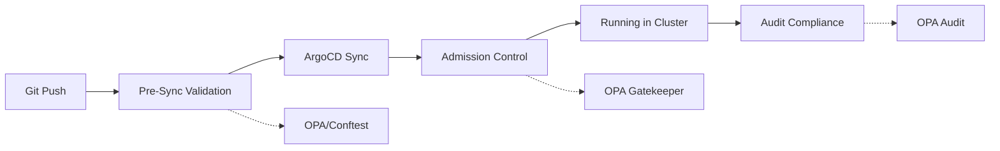

# How to Integrate ArgoCD with Open Policy Agent (OPA)

Author: [nawazdhandala](https://github.com/nawazdhandala)

Tags: ArgoCD, GitOps, Kubernetes, OPA, Policy Enforcement

Description: Learn how to integrate ArgoCD with Open Policy Agent to enforce deployment policies, validate Kubernetes manifests before sync, and implement policy-as-code in your GitOps workflow.

---

Open Policy Agent (OPA) is the de facto standard for policy enforcement in Kubernetes. When combined with ArgoCD, OPA ensures that every resource ArgoCD deploys complies with your organization's policies - security constraints, resource limits, naming conventions, and compliance requirements. This guide shows you how to integrate OPA with ArgoCD at multiple enforcement points.

## Where OPA Fits in the ArgoCD Pipeline

There are three places to enforce OPA policies in an ArgoCD workflow:



1. **Pre-sync** - Validate manifests before ArgoCD applies them (using Conftest or custom resource hooks)
2. **Admission** - OPA Gatekeeper rejects non-compliant resources at the Kubernetes API level
3. **Audit** - OPA Gatekeeper continuously audits running resources for policy violations

## Deploying OPA Gatekeeper with ArgoCD

First, manage OPA Gatekeeper itself through ArgoCD:

```yaml
apiVersion: argoproj.io/v1alpha1
kind: Application
metadata:
  name: gatekeeper
  namespace: argocd
spec:
  project: infrastructure
  source:
    repoURL: https://open-policy-agent.github.io/gatekeeper/charts
    chart: gatekeeper
    targetRevision: 3.14.0
    helm:
      values: |
        replicas: 3
        audit:
          replicas: 1
          resources:
            limits:
              memory: 512Mi
            requests:
              cpu: 100m
              memory: 256Mi
        controllerManager:
          resources:
            limits:
              memory: 512Mi
            requests:
              cpu: 100m
              memory: 256Mi
  destination:
    server: https://kubernetes.default.svc
    namespace: gatekeeper-system
  syncPolicy:
    automated:
      prune: true
    syncOptions:
      - CreateNamespace=true
```

## Managing Constraint Templates in Git

Store your OPA constraint templates in Git and deploy them through ArgoCD:

```yaml
# Git: policies/templates/required-labels.yaml
apiVersion: templates.gatekeeper.sh/v1
kind: ConstraintTemplate
metadata:
  name: k8srequiredlabels
spec:
  crd:
    spec:
      names:
        kind: K8sRequiredLabels
      validation:
        openAPIV3Schema:
          type: object
          properties:
            labels:
              type: array
              items:
                type: string
  targets:
    - target: admission.k8s.gatekeeper.sh
      rego: |
        package k8srequiredlabels

        violation[{"msg": msg}] {
          provided := {label | input.review.object.metadata.labels[label]}
          required := {label | label := input.parameters.labels[_]}
          missing := required - provided
          count(missing) > 0
          msg := sprintf("Missing required labels: %v", [missing])
        }

---
# Git: policies/templates/container-limits.yaml
apiVersion: templates.gatekeeper.sh/v1
kind: ConstraintTemplate
metadata:
  name: k8scontainerlimits
spec:
  crd:
    spec:
      names:
        kind: K8sContainerLimits
      validation:
        openAPIV3Schema:
          type: object
          properties:
            cpu:
              type: string
            memory:
              type: string
  targets:
    - target: admission.k8s.gatekeeper.sh
      rego: |
        package k8scontainerlimits

        violation[{"msg": msg}] {
          container := input.review.object.spec.template.spec.containers[_]
          not container.resources.limits.cpu
          msg := sprintf("Container %v has no CPU limit", [container.name])
        }

        violation[{"msg": msg}] {
          container := input.review.object.spec.template.spec.containers[_]
          not container.resources.limits.memory
          msg := sprintf("Container %v has no memory limit", [container.name])
        }

---
# Git: policies/templates/no-latest-tag.yaml
apiVersion: templates.gatekeeper.sh/v1
kind: ConstraintTemplate
metadata:
  name: k8snolatestimage
spec:
  crd:
    spec:
      names:
        kind: K8sNoLatestImage
  targets:
    - target: admission.k8s.gatekeeper.sh
      rego: |
        package k8snolatestimage

        violation[{"msg": msg}] {
          container := input.review.object.spec.template.spec.containers[_]
          endswith(container.image, ":latest")
          msg := sprintf("Container %v uses ':latest' tag. Use a specific version.", [container.name])
        }

        violation[{"msg": msg}] {
          container := input.review.object.spec.template.spec.containers[_]
          not contains(container.image, ":")
          msg := sprintf("Container %v has no image tag. Use a specific version.", [container.name])
        }
```

## Deploying Constraints through ArgoCD

Create constraint instances that reference the templates:

```yaml
# Git: policies/constraints/require-labels.yaml
apiVersion: constraints.gatekeeper.sh/v1beta1
kind: K8sRequiredLabels
metadata:
  name: require-team-label
spec:
  match:
    kinds:
      - apiGroups: ["apps"]
        kinds: ["Deployment", "StatefulSet"]
    namespaces:
      - "production"
      - "staging"
    excludedNamespaces:
      - "kube-system"
      - "argocd"
      - "gatekeeper-system"
  parameters:
    labels:
      - "team"
      - "environment"

---
# Git: policies/constraints/container-limits.yaml
apiVersion: constraints.gatekeeper.sh/v1beta1
kind: K8sContainerLimits
metadata:
  name: require-container-limits
spec:
  enforcementAction: deny  # or "warn" or "dryrun"
  match:
    kinds:
      - apiGroups: ["apps"]
        kinds: ["Deployment", "StatefulSet"]
    namespaces:
      - "production"
  parameters:
    cpu: "2"
    memory: "4Gi"

---
# Git: policies/constraints/no-latest.yaml
apiVersion: constraints.gatekeeper.sh/v1beta1
kind: K8sNoLatestImage
metadata:
  name: no-latest-images
spec:
  enforcementAction: deny
  match:
    kinds:
      - apiGroups: ["apps"]
        kinds: ["Deployment", "StatefulSet", "DaemonSet"]
    excludedNamespaces:
      - "kube-system"
```

Create an ArgoCD application to manage all policies:

```yaml
apiVersion: argoproj.io/v1alpha1
kind: Application
metadata:
  name: opa-policies
  namespace: argocd
  annotations:
    argocd.argoproj.io/sync-wave: "1"  # After Gatekeeper is installed
spec:
  project: infrastructure
  source:
    repoURL: https://github.com/my-org/platform-config.git
    targetRevision: main
    path: policies
  destination:
    server: https://kubernetes.default.svc
  syncPolicy:
    automated:
      prune: true
    syncOptions:
      - CreateNamespace=false
```

## Sync Order: Gatekeeper Before Policies Before Apps

Use ArgoCD sync waves to ensure proper ordering:

```yaml
# Wave -1: Gatekeeper CRDs and controller
# Wave 0: Constraint Templates
# Wave 1: Constraints
# Wave 2: Application workloads
```

This prevents ArgoCD from trying to create constraints before the templates exist, or deploying workloads before policies are in place.

## Handling Sync Failures Due to Policy Violations

When OPA Gatekeeper rejects a resource during ArgoCD sync, you will see a sync failure:

```bash
# Check sync status
argocd app get my-app

# The sync error will show the OPA violation
# Example output:
# CONDITION  MESSAGE
# SyncError  admission webhook "validation.gatekeeper.sh" denied the request:
#            [require-team-label] Missing required labels: {"team"}
```

To fix the violation, update the resource in Git to comply with the policy, then sync again.

## Pre-Sync Validation with Conftest

For faster feedback, validate manifests before ArgoCD even tries to sync. Use a PreSync hook:

```yaml
apiVersion: batch/v1
kind: Job
metadata:
  name: policy-check
  annotations:
    argocd.argoproj.io/hook: PreSync
    argocd.argoproj.io/hook-delete-policy: HookSucceeded
spec:
  template:
    spec:
      containers:
        - name: conftest
          image: openpolicyagent/conftest:latest
          command: [sh, -c]
          args:
            - |
              # Clone the repo and run conftest
              git clone https://github.com/my-org/my-app.git /tmp/repo
              cd /tmp/repo
              conftest test k8s/ --policy policies/ --output json
          env:
            - name: GIT_TOKEN
              valueFrom:
                secretKeyRef:
                  name: git-credentials
                  key: token
      restartPolicy: Never
  backoffLimit: 0
```

## Custom Health Checks for OPA Resources

Tell ArgoCD how to assess the health of Gatekeeper resources:

```yaml
# argocd-cm ConfigMap
data:
  resource.customizations.health.constraints.gatekeeper.sh_K8sRequiredLabels: |
    hs = {}
    if obj.status ~= nil and obj.status.totalViolations ~= nil then
      if obj.status.totalViolations == 0 then
        hs.status = "Healthy"
        hs.message = "No violations"
      else
        hs.status = "Degraded"
        hs.message = tostring(obj.status.totalViolations) .. " violations found"
      end
    else
      hs.status = "Progressing"
      hs.message = "Audit not yet complete"
    end
    return hs

  resource.customizations.health.templates.gatekeeper.sh_ConstraintTemplate: |
    hs = {}
    if obj.status ~= nil and obj.status.created then
      hs.status = "Healthy"
      hs.message = "Template created and ready"
    else
      hs.status = "Progressing"
      hs.message = "Template not yet ready"
    end
    return hs
```

## Best Practices

1. **Start with `dryrun` enforcement** before switching to `deny` to assess impact.
2. **Exclude system namespaces** from constraints to avoid blocking critical infrastructure.
3. **Use sync waves** to deploy templates before constraints, and constraints before workloads.
4. **Version your policies** alongside your application code in Git.
5. **Monitor constraint violations** through Gatekeeper metrics in Prometheus.
6. **Test policies in CI** using Conftest before they reach the cluster.

OPA Gatekeeper with ArgoCD gives you policy-as-code that is version-controlled, automatically deployed, and continuously enforced. For a lighter-weight alternative, see [How to Integrate ArgoCD with Kyverno](https://oneuptime.com/blog/post/2026-02-26-argocd-integrate-kyverno/view).
