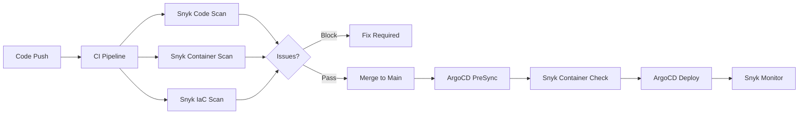

# How to Integrate ArgoCD with Snyk for Security Scanning

Author: [nawazdhandala](https://github.com/nawazdhandala)

Tags: ArgoCD, GitOps, Kubernetes, Snyk, Security

Description: Learn how to integrate ArgoCD with Snyk for container image scanning, IaC security testing, dependency vulnerability detection, and continuous monitoring in your GitOps pipeline.

---

Snyk is a developer-first security platform that finds and fixes vulnerabilities in code, dependencies, containers, and infrastructure as code. Integrating Snyk with ArgoCD adds security gates to your GitOps deployment pipeline, catching vulnerabilities in container images and Kubernetes configurations before they reach production. This guide covers practical integration patterns.

## Where Snyk Fits in the ArgoCD Pipeline

Snyk provides multiple scanning capabilities relevant to ArgoCD workflows:

- **Container scanning** - Detects vulnerabilities in container images before deployment
- **IaC scanning** - Validates Kubernetes manifests, Helm charts, and Kustomize overlays
- **Open source scanning** - Finds vulnerable dependencies in your application code
- **License compliance** - Checks open source license compatibility



## Pre-Sync Container Scanning with Snyk

Use an ArgoCD PreSync hook to scan images before deployment:

```yaml
apiVersion: batch/v1
kind: Job
metadata:
  name: snyk-container-scan
  annotations:
    argocd.argoproj.io/hook: PreSync
    argocd.argoproj.io/hook-delete-policy: BeforeHookCreation
spec:
  template:
    spec:
      containers:
        - name: snyk
          image: snyk/snyk:docker
          command: [sh, -c]
          args:
            - |
              echo "Scanning container images with Snyk..."

              # Authenticate with Snyk
              snyk auth $SNYK_TOKEN

              # Scan the container image
              snyk container test my-org/my-app:v2.1.0 \
                --severity-threshold=high \
                --json > /tmp/scan-result.json

              SCAN_EXIT=$?

              if [ $SCAN_EXIT -ne 0 ]; then
                echo "=== Vulnerabilities Found ==="
                cat /tmp/scan-result.json | \
                  jq '.vulnerabilities[] | {title: .title, severity: .severity, package: .packageName, version: .version}'
                echo "Deployment blocked due to high/critical vulnerabilities."
                exit 1
              fi

              echo "Container scan passed. No high/critical vulnerabilities found."

              # Monitor the image for future vulnerabilities
              snyk container monitor my-org/my-app:v2.1.0 \
                --project-name="my-app-production"
          env:
            - name: SNYK_TOKEN
              valueFrom:
                secretKeyRef:
                  name: snyk-credentials
                  key: token
          resources:
            requests:
              cpu: 200m
              memory: 512Mi
            limits:
              memory: 1Gi
      restartPolicy: Never
  backoffLimit: 0
```

## IaC Scanning of Kubernetes Manifests

Scan your Kubernetes manifests for security misconfigurations:

```yaml
apiVersion: batch/v1
kind: Job
metadata:
  name: snyk-iac-scan
  annotations:
    argocd.argoproj.io/hook: PreSync
    argocd.argoproj.io/hook-delete-policy: BeforeHookCreation
spec:
  template:
    spec:
      containers:
        - name: snyk
          image: snyk/snyk:linux
          command: [sh, -c]
          args:
            - |
              # Clone the manifests repository
              git clone https://github.com/my-org/k8s-manifests.git /tmp/manifests
              cd /tmp/manifests

              # Authenticate
              snyk auth $SNYK_TOKEN

              # Scan Kubernetes manifests
              snyk iac test ./apps/my-app/ \
                --severity-threshold=high \
                --report

              SCAN_EXIT=$?

              if [ $SCAN_EXIT -ne 0 ]; then
                echo "IaC security issues found! Fix before deploying."
                exit 1
              fi

              echo "IaC scan passed."
          env:
            - name: SNYK_TOKEN
              valueFrom:
                secretKeyRef:
                  name: snyk-credentials
                  key: token
      restartPolicy: Never
  backoffLimit: 0
```

Common issues Snyk IaC detects in Kubernetes manifests:

- Containers running as root
- Missing security contexts
- Excessive capabilities
- Missing resource limits
- Writable root filesystems
- Host network or PID namespace sharing

## Deploying the Snyk Controller with ArgoCD

The Snyk Controller (snyk-monitor) runs in your cluster and continuously scans workload images:

```yaml
apiVersion: argoproj.io/v1alpha1
kind: Application
metadata:
  name: snyk-monitor
  namespace: argocd
spec:
  project: security
  source:
    repoURL: https://snyk.github.io/kubernetes-monitor
    chart: snyk-monitor
    targetRevision: 2.0.0
    helm:
      values: |
        clusterName: production-cluster
        policyOrgs: my-org-id
        resources:
          requests:
            cpu: 100m
            memory: 256Mi
          limits:
            memory: 512Mi
        # Namespaces to monitor
        scope: |
          - production
          - staging
  destination:
    server: https://kubernetes.default.svc
    namespace: snyk-monitor
  syncPolicy:
    automated:
      prune: true
    syncOptions:
      - CreateNamespace=true
```

Create the required secret:

```bash
# Create Snyk monitor secret
kubectl create secret generic snyk-monitor -n snyk-monitor \
  --from-literal=dockercfg.json='{}' \
  --from-literal=integrationId=$SNYK_INTEGRATION_ID
```

## Snyk Policy Configuration in Git

Store Snyk policies in your GitOps repository:

```yaml
# Git: security/snyk-policy/.snyk
# Snyk policy file - controls how vulnerabilities are handled
version: v1.25.0
ignore:
  # Ignore a specific vulnerability (with expiry)
  SNYK-PYTHON-CRYPTOGRAPHY-6126975:
    - '*':
        reason: 'No fix available, risk accepted until Q2 2026'
        expires: 2026-06-30T00:00:00.000Z

  # Ignore a vulnerability in a specific package
  SNYK-GOLANG-GOLANGORGXCRYPTO-5962134:
    - 'golang.org/x/crypto':
        reason: 'Not exploitable in our usage pattern'
        expires: 2026-04-01T00:00:00.000Z

patch: {}
```

## Multi-Image Scanning Pipeline

For applications with multiple microservices:

```yaml
apiVersion: batch/v1
kind: Job
metadata:
  name: snyk-multi-scan
  annotations:
    argocd.argoproj.io/hook: PreSync
    argocd.argoproj.io/hook-delete-policy: BeforeHookCreation
spec:
  template:
    spec:
      containers:
        - name: snyk
          image: snyk/snyk:docker
          command: [sh, -c]
          args:
            - |
              snyk auth $SNYK_TOKEN
              FAILED=0

              # Define images and their project names
              declare -A IMAGES
              IMAGES=(
                ["my-org/frontend:v3.0.0"]="frontend-prod"
                ["my-org/api:v2.5.0"]="api-prod"
                ["my-org/worker:v1.8.0"]="worker-prod"
              )

              for IMAGE in "${!IMAGES[@]}"; do
                PROJECT=${IMAGES[$IMAGE]}
                echo "=== Scanning $IMAGE ==="

                snyk container test "$IMAGE" \
                  --severity-threshold=critical \
                  --project-name="$PROJECT"

                if [ $? -ne 0 ]; then
                  echo "CRITICAL vulnerabilities in $IMAGE"
                  FAILED=1
                else
                  # Monitor for future vulnerabilities
                  snyk container monitor "$IMAGE" \
                    --project-name="$PROJECT"
                fi
              done

              if [ $FAILED -ne 0 ]; then
                exit 1
              fi

              echo "All images passed Snyk scanning."
          env:
            - name: SNYK_TOKEN
              valueFrom:
                secretKeyRef:
                  name: snyk-credentials
                  key: token
      restartPolicy: Never
  backoffLimit: 0
```

## Integrating Snyk with ArgoCD Notifications

Alert when Snyk finds new vulnerabilities in monitored projects:

```yaml
# Use a webhook trigger from Snyk to Argo Events
apiVersion: argoproj.io/v1alpha1
kind: EventSource
metadata:
  name: snyk-webhook
  namespace: argo-events
spec:
  webhook:
    snyk-alerts:
      endpoint: /snyk
      port: "14000"
      method: POST

---
apiVersion: argoproj.io/v1alpha1
kind: Sensor
metadata:
  name: snyk-alert-handler
  namespace: argo-events
spec:
  dependencies:
    - name: new-vuln
      eventSourceName: snyk-webhook
      eventName: snyk-alerts
      filters:
        data:
          - path: body.newIssues
            type: string
            comparator: ">"
            value:
              - "0"
  triggers:
    - template:
        name: notify-slack
        http:
          url: https://hooks.slack.com/services/YOUR/WEBHOOK/URL
          method: POST
          payload:
            - src:
                dependencyName: new-vuln
                dataTemplate: |
                  {"text": "New Snyk vulnerability found in project {{ .Input.body.project.name }}. {{ .Input.body.newIssues | len }} new issues detected."}
              dest: ""
```

## Comparing Snyk and Trivy

| Feature | Snyk | Trivy |
|---------|------|-------|
| Container scanning | Yes | Yes |
| IaC scanning | Yes | Yes |
| License compliance | Yes | Limited |
| Fix suggestions | Yes, with PRs | No |
| Continuous monitoring | Yes (SaaS) | Via operator |
| Pricing | Freemium | Open source |
| Dependency scanning | Yes (deep) | Basic |
| CI integration | Extensive | Good |

Many teams use both: Trivy for open-source, fast-feedback scanning and Snyk for deeper analysis and its fix suggestion capabilities.

## Best Practices

1. **Set severity thresholds** appropriate for each environment - `critical` for production, `high` for staging.
2. **Use `snyk monitor`** after successful scans to track images for newly discovered vulnerabilities.
3. **Store Snyk policies in Git** alongside your application manifests for version control.
4. **Use project names** consistently to group related scan results in the Snyk dashboard.
5. **Set expiry dates** on vulnerability ignores to force periodic review.
6. **Combine with Trivy** for defense in depth - different scanners catch different issues.
7. **Integrate Snyk webhooks** with Argo Events for automated response to new vulnerabilities.

Snyk integrated with ArgoCD provides a comprehensive security layer for your GitOps pipeline. For complementary open-source scanning, see [How to Integrate ArgoCD with Trivy](https://oneuptime.com/blog/post/2026-02-26-argocd-integrate-trivy/view). For runtime security, see [How to Integrate ArgoCD with Falco](https://oneuptime.com/blog/post/2026-02-26-argocd-integrate-falco/view).
