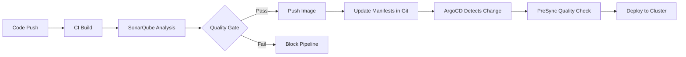

# How to Integrate ArgoCD with SonarQube for Code Quality

Author: [nawazdhandala](https://github.com/nawazdhandala)

Tags: ArgoCD, GitOps, Kubernetes, SonarQube, Code Quality

Description: Learn how to integrate ArgoCD with SonarQube to enforce code quality gates before deployments, deploy SonarQube through GitOps, and build quality-aware deployment pipelines.

---

SonarQube is the leading platform for continuous code quality and security analysis. It detects bugs, code smells, security vulnerabilities, and coverage gaps in your codebase. Integrating SonarQube with ArgoCD creates a deployment pipeline where code quality gates must pass before ArgoCD deploys changes to your cluster. This guide covers deploying SonarQube through ArgoCD and building quality-gated deployment workflows.

## The Integration Architecture

SonarQube and ArgoCD serve different stages of the delivery pipeline:



SonarQube runs during CI to analyze code before images are built. ArgoCD can optionally check the SonarQube quality gate status in a PreSync hook as an additional safety net.

## Deploying SonarQube with ArgoCD

Run SonarQube on Kubernetes, managed through ArgoCD:

```yaml
apiVersion: argoproj.io/v1alpha1
kind: Application
metadata:
  name: sonarqube
  namespace: argocd
spec:
  project: tooling
  source:
    repoURL: https://SonarSource.github.io/helm-chart-sonarqube
    chart: sonarqube
    targetRevision: 10.3.0
    helm:
      values: |
        replicaCount: 1
        persistence:
          enabled: true
          size: 20Gi
          storageClass: gp3
        postgresql:
          enabled: true
          persistence:
            enabled: true
            size: 10Gi
        resources:
          requests:
            cpu: 400m
            memory: 2Gi
          limits:
            memory: 4Gi
        ingress:
          enabled: true
          hosts:
            - name: sonarqube.mycompany.com
              path: /
          annotations:
            kubernetes.io/ingress.class: nginx
            cert-manager.io/cluster-issuer: letsencrypt
          tls:
            - secretName: sonarqube-tls
              hosts:
                - sonarqube.mycompany.com
        sonarProperties:
          sonar.forceAuthentication: true
  destination:
    server: https://kubernetes.default.svc
    namespace: sonarqube
  syncPolicy:
    automated:
      prune: true
    syncOptions:
      - CreateNamespace=true
  ignoreDifferences:
    - group: apps
      kind: Deployment
      jsonPointers:
        - /spec/replicas
```

## Quality Gate PreSync Hook

Create an ArgoCD PreSync hook that checks SonarQube quality gate status before deploying:

```yaml
apiVersion: batch/v1
kind: Job
metadata:
  name: sonarqube-quality-gate-check
  annotations:
    argocd.argoproj.io/hook: PreSync
    argocd.argoproj.io/hook-delete-policy: BeforeHookCreation
spec:
  template:
    spec:
      containers:
        - name: quality-check
          image: curlimages/curl:latest
          command: [sh, -c]
          args:
            - |
              echo "Checking SonarQube quality gate for project: my-app"

              # Query the quality gate status
              RESPONSE=$(curl -s -u "${SONAR_TOKEN}:" \
                "${SONAR_HOST}/api/qualitygates/project_status?projectKey=my-app")

              STATUS=$(echo $RESPONSE | grep -o '"status":"[^"]*"' | head -1 | cut -d'"' -f4)

              echo "Quality Gate Status: $STATUS"

              if [ "$STATUS" != "OK" ]; then
                echo "Quality gate FAILED. Details:"
                echo $RESPONSE | python3 -m json.tool 2>/dev/null || echo $RESPONSE

                # Get specific conditions that failed
                echo ""
                echo "=== Failed Conditions ==="
                curl -s -u "${SONAR_TOKEN}:" \
                  "${SONAR_HOST}/api/qualitygates/project_status?projectKey=my-app" | \
                  python3 -c "
              import json, sys
              data = json.load(sys.stdin)
              for cond in data.get('projectStatus', {}).get('conditions', []):
                  if cond['status'] != 'OK':
                      print(f\"  {cond['metricKey']}: {cond['actualValue']} (threshold: {cond['errorThreshold']})\")" 2>/dev/null

                echo ""
                echo "Deployment blocked. Fix code quality issues before deploying."
                exit 1
              fi

              echo "Quality gate passed. Proceeding with deployment."
          env:
            - name: SONAR_HOST
              value: "https://sonarqube.mycompany.com"
            - name: SONAR_TOKEN
              valueFrom:
                secretKeyRef:
                  name: sonarqube-credentials
                  key: token
      restartPolicy: Never
  backoffLimit: 0
```

## SonarQube Analysis in CI with ArgoCD Workflow

Integrate SonarQube analysis into an Argo Workflows CI pipeline:

```yaml
apiVersion: argoproj.io/v1alpha1
kind: WorkflowTemplate
metadata:
  name: ci-with-sonarqube
  namespace: argo
spec:
  entrypoint: pipeline
  arguments:
    parameters:
      - name: repo
        value: https://github.com/my-org/my-app.git
      - name: branch
        value: main
  volumeClaimTemplates:
    - metadata:
        name: workspace
      spec:
        accessModes: ["ReadWriteOnce"]
        resources:
          requests:
            storage: 5Gi

  templates:
    - name: pipeline
      dag:
        tasks:
          - name: checkout
            template: git-clone
          - name: build
            template: build-app
            dependencies: [checkout]
          - name: test
            template: run-tests
            dependencies: [build]
          - name: sonar-scan
            template: sonarqube-analysis
            dependencies: [test]
          - name: quality-gate
            template: check-quality-gate
            dependencies: [sonar-scan]
          - name: build-image
            template: docker-build
            dependencies: [quality-gate]
          - name: update-manifests
            template: update-git
            dependencies: [build-image]

    - name: git-clone
      container:
        image: alpine/git:latest
        command: [sh, -c]
        args:
          - |
            git clone {{workflow.parameters.repo}} /workspace/source
            cd /workspace/source && git checkout {{workflow.parameters.branch}}
        volumeMounts:
          - name: workspace
            mountPath: /workspace

    - name: build-app
      container:
        image: maven:3.9-eclipse-temurin-17
        command: [sh, -c]
        args:
          - |
            cd /workspace/source
            mvn clean compile -DskipTests
        volumeMounts:
          - name: workspace
            mountPath: /workspace

    - name: run-tests
      container:
        image: maven:3.9-eclipse-temurin-17
        command: [sh, -c]
        args:
          - |
            cd /workspace/source
            mvn test
        volumeMounts:
          - name: workspace
            mountPath: /workspace

    - name: sonarqube-analysis
      container:
        image: sonarsource/sonar-scanner-cli:latest
        command: [sh, -c]
        args:
          - |
            cd /workspace/source
            sonar-scanner \
              -Dsonar.projectKey=my-app \
              -Dsonar.sources=src/main \
              -Dsonar.tests=src/test \
              -Dsonar.java.binaries=target/classes \
              -Dsonar.host.url=$SONAR_HOST \
              -Dsonar.token=$SONAR_TOKEN \
              -Dsonar.qualitygate.wait=false
        env:
          - name: SONAR_HOST
            value: "https://sonarqube.mycompany.com"
          - name: SONAR_TOKEN
            valueFrom:
              secretKeyRef:
                name: sonarqube-credentials
                key: token
        volumeMounts:
          - name: workspace
            mountPath: /workspace

    - name: check-quality-gate
      container:
        image: curlimages/curl:latest
        command: [sh, -c]
        args:
          - |
            # Wait for analysis to be processed
            sleep 10

            # Check quality gate
            STATUS=""
            RETRIES=30
            while [ $RETRIES -gt 0 ]; do
              RESPONSE=$(curl -s -u "${SONAR_TOKEN}:" \
                "${SONAR_HOST}/api/qualitygates/project_status?projectKey=my-app")
              STATUS=$(echo $RESPONSE | grep -o '"status":"[^"]*"' | head -1 | cut -d'"' -f4)

              if [ "$STATUS" = "OK" ]; then
                echo "Quality gate passed!"
                exit 0
              elif [ "$STATUS" = "ERROR" ]; then
                echo "Quality gate FAILED!"
                echo $RESPONSE
                exit 1
              fi

              echo "Analysis still processing... ($RETRIES retries left)"
              sleep 10
              RETRIES=$((RETRIES - 1))
            done

            echo "Quality gate check timed out"
            exit 1
        env:
          - name: SONAR_HOST
            value: "https://sonarqube.mycompany.com"
          - name: SONAR_TOKEN
            valueFrom:
              secretKeyRef:
                name: sonarqube-credentials
                key: token

    - name: docker-build
      container:
        image: gcr.io/kaniko-project/executor:latest
        args:
          - "--dockerfile=/workspace/source/Dockerfile"
          - "--context=/workspace/source"
          - "--destination=my-org/my-app:{{workflow.parameters.branch}}-{{workflow.uid}}"
        volumeMounts:
          - name: workspace
            mountPath: /workspace

    - name: update-git
      container:
        image: alpine/git:latest
        command: [sh, -c]
        args:
          - |
            git clone https://$(GIT_TOKEN)@github.com/my-org/k8s-manifests.git /tmp/manifests
            cd /tmp/manifests
            NEW_TAG="{{workflow.parameters.branch}}-{{workflow.uid}}"
            sed -i "s|image: my-org/my-app:.*|image: my-org/my-app:${NEW_TAG}|" \
              apps/my-app/deployment.yaml
            git config user.email "ci@company.com"
            git config user.name "CI"
            git add . && git commit -m "Update my-app to ${NEW_TAG}"
            git push origin main
        env:
          - name: GIT_TOKEN
            valueFrom:
              secretKeyRef:
                name: git-credentials
                key: token
```

## Displaying Quality Metrics in ArgoCD

While ArgoCD does not natively display SonarQube metrics, you can add quality information as annotations:

```yaml
apiVersion: argoproj.io/v1alpha1
kind: Application
metadata:
  name: my-app
  namespace: argocd
  annotations:
    # Add SonarQube project link for easy access
    link.argocd.argoproj.io/sonarqube: >-
      https://sonarqube.mycompany.com/dashboard?id=my-app
spec:
  # ...
```

This adds a clickable link in the ArgoCD UI that takes you directly to the SonarQube project dashboard.

## Configuring Quality Gates

Define quality gates in SonarQube through the API (useful for automation):

```bash
# Create a custom quality gate
curl -s -u "$SONAR_TOKEN:" \
  -X POST "$SONAR_HOST/api/qualitygates/create" \
  -d "name=Production Gate"

# Add conditions
GATE_ID=$(curl -s -u "$SONAR_TOKEN:" \
  "$SONAR_HOST/api/qualitygates/show?name=Production%20Gate" | \
  jq -r '.id')

# No new critical bugs
curl -s -u "$SONAR_TOKEN:" \
  -X POST "$SONAR_HOST/api/qualitygates/create_condition" \
  -d "gateId=$GATE_ID&metric=new_bugs&op=GT&error=0"

# Coverage must be above 80%
curl -s -u "$SONAR_TOKEN:" \
  -X POST "$SONAR_HOST/api/qualitygates/create_condition" \
  -d "gateId=$GATE_ID&metric=new_coverage&op=LT&error=80"

# No new security hotspots
curl -s -u "$SONAR_TOKEN:" \
  -X POST "$SONAR_HOST/api/qualitygates/create_condition" \
  -d "gateId=$GATE_ID&metric=new_security_hotspots&op=GT&error=0"
```

## Best Practices

1. **Run SonarQube analysis in CI** before image builds, not just as a PreSync check.
2. **Use the PreSync hook as a safety net** to catch cases where CI quality gates were bypassed.
3. **Deploy SonarQube with persistent storage** - losing analysis history defeats the purpose.
4. **Set quality gates appropriate for each project** - one size does not fit all.
5. **Monitor SonarQube resource usage** - analysis can be memory-intensive.
6. **Integrate quality gate status** into your PR workflow so developers get feedback early.
7. **Back up SonarQube data** using Velero or database backups managed through ArgoCD.

SonarQube with ArgoCD ensures that only code meeting your quality standards gets deployed. The quality gate acts as a deployment gatekeeper, preventing regressions before they reach production. For security-focused scanning, see [How to Integrate ArgoCD with Snyk](https://oneuptime.com/blog/post/2026-02-26-argocd-integrate-snyk/view) and [How to Integrate ArgoCD with Trivy](https://oneuptime.com/blog/post/2026-02-26-argocd-integrate-trivy/view).
