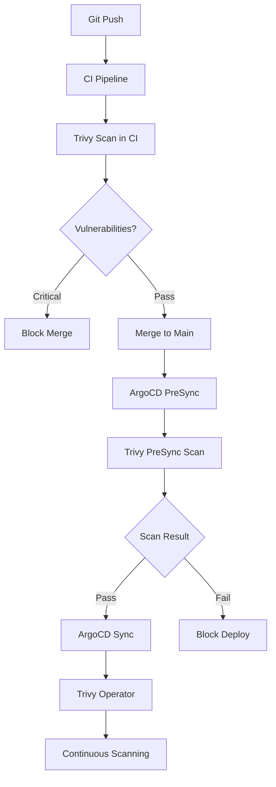

# How to Integrate ArgoCD with Trivy for Vulnerability Scanning

Author: [nawazdhandala](https://github.com/nawazdhandala)

Tags: ArgoCD, GitOps, Kubernetes, Trivy, Security

Description: Learn how to integrate ArgoCD with Trivy for automated vulnerability scanning of container images, Kubernetes manifests, and IaC templates as part of your GitOps deployment pipeline.

---

Trivy is a comprehensive security scanner that detects vulnerabilities in container images, file systems, Git repositories, and Kubernetes configurations. Integrating Trivy with ArgoCD lets you catch security issues before they reach your cluster - and continuously monitor running workloads for newly discovered vulnerabilities. This guide covers multiple integration patterns from pre-sync scanning to continuous monitoring with Trivy Operator.

## Integration Approaches

There are three ways to integrate Trivy with ArgoCD:

1. **Pre-sync scanning** - Scan container images before ArgoCD deploys them using resource hooks
2. **Trivy Operator** - Deploy the Trivy Operator through ArgoCD for continuous in-cluster scanning
3. **CI pipeline scanning** - Scan in your CI pipeline before manifests reach the GitOps repository



## Pre-Sync Vulnerability Scanning

Use an ArgoCD PreSync hook to scan container images before deployment:

```yaml
apiVersion: batch/v1
kind: Job
metadata:
  name: trivy-presync-scan
  annotations:
    argocd.argoproj.io/hook: PreSync
    argocd.argoproj.io/hook-delete-policy: BeforeHookCreation
spec:
  template:
    spec:
      containers:
        - name: trivy
          image: aquasec/trivy:latest
          command: [sh, -c]
          args:
            - |
              echo "Scanning container images for vulnerabilities..."

              # Scan the application image
              trivy image --severity CRITICAL,HIGH \
                --exit-code 1 \
                --no-progress \
                --format table \
                my-org/my-app:v2.1.0

              SCAN_RESULT=$?

              if [ $SCAN_RESULT -ne 0 ]; then
                echo "CRITICAL or HIGH vulnerabilities found! Blocking deployment."
                exit 1
              fi

              echo "Image scan passed. No critical vulnerabilities found."
          resources:
            requests:
              cpu: 200m
              memory: 512Mi
            limits:
              memory: 1Gi
      restartPolicy: Never
  backoffLimit: 0
```

For applications with multiple images, scan them all:

```yaml
apiVersion: batch/v1
kind: Job
metadata:
  name: trivy-multi-image-scan
  annotations:
    argocd.argoproj.io/hook: PreSync
    argocd.argoproj.io/hook-delete-policy: BeforeHookCreation
spec:
  template:
    spec:
      containers:
        - name: trivy
          image: aquasec/trivy:latest
          command: [sh, -c]
          args:
            - |
              FAILED=0

              # List of images to scan
              IMAGES="
                my-org/frontend:v3.0.0
                my-org/backend:v2.5.0
                my-org/worker:v1.8.0
              "

              for IMAGE in $IMAGES; do
                echo "=== Scanning $IMAGE ==="
                trivy image --severity CRITICAL \
                  --exit-code 1 \
                  --no-progress \
                  "$IMAGE"

                if [ $? -ne 0 ]; then
                  echo "FAILED: $IMAGE has critical vulnerabilities"
                  FAILED=1
                fi
              done

              if [ $FAILED -ne 0 ]; then
                echo "One or more images have critical vulnerabilities. Blocking deployment."
                exit 1
              fi

              echo "All images passed vulnerability scanning."
      restartPolicy: Never
  backoffLimit: 0
```

## Deploying Trivy Operator with ArgoCD

The Trivy Operator runs continuously in your cluster, scanning workloads and generating vulnerability reports as Kubernetes custom resources:

```yaml
apiVersion: argoproj.io/v1alpha1
kind: Application
metadata:
  name: trivy-operator
  namespace: argocd
spec:
  project: security
  source:
    repoURL: https://aquasecurity.github.io/helm-charts
    chart: trivy-operator
    targetRevision: 0.20.0
    helm:
      values: |
        trivy:
          severity: CRITICAL,HIGH,MEDIUM
          ignoreUnfixed: true
          resources:
            requests:
              cpu: 100m
              memory: 128Mi
            limits:
              memory: 512Mi
        operator:
          scanJobsConcurrentLimit: 5
          vulnerabilityScannerEnabled: true
          configAuditScannerEnabled: true
          rbacAssessmentScannerEnabled: true
          exposedSecretScannerEnabled: true
          scanJobTimeout: 10m
        compliance:
          failEntriesLimit: 10
  destination:
    server: https://kubernetes.default.svc
    namespace: trivy-system
  syncPolicy:
    automated:
      prune: true
    syncOptions:
      - CreateNamespace=true
```

## Viewing Trivy Operator Reports

Once deployed, the Trivy Operator creates VulnerabilityReport resources:

```bash
# List all vulnerability reports
kubectl get vulnerabilityreports -A

# Get detailed report for a specific workload
kubectl get vulnerabilityreport -n production \
  -l trivy-operator.resource.name=my-app -o yaml

# Summary of critical vulnerabilities across the cluster
kubectl get vulnerabilityreports -A -o json | \
  jq '[.items[] | {
    namespace: .metadata.namespace,
    resource: .metadata.labels["trivy-operator.resource.name"],
    critical: .report.summary.criticalCount,
    high: .report.summary.highCount
  }] | sort_by(.critical) | reverse | .[:10]'
```

## Custom Health Checks for Trivy Resources

Tell ArgoCD how to assess the health of vulnerability reports:

```yaml
# argocd-cm ConfigMap
data:
  resource.customizations.health.aquasecurity.github.io_VulnerabilityReport: |
    hs = {}
    if obj.report ~= nil and obj.report.summary ~= nil then
      if obj.report.summary.criticalCount > 0 then
        hs.status = "Degraded"
        hs.message = tostring(obj.report.summary.criticalCount) .. " critical vulnerabilities"
      elseif obj.report.summary.highCount > 5 then
        hs.status = "Degraded"
        hs.message = tostring(obj.report.summary.highCount) .. " high vulnerabilities"
      else
        hs.status = "Healthy"
        hs.message = "No critical vulnerabilities"
      end
    else
      hs.status = "Progressing"
      hs.message = "Scan in progress"
    end
    return hs

  resource.customizations.health.aquasecurity.github.io_ConfigAuditReport: |
    hs = {}
    if obj.report ~= nil and obj.report.summary ~= nil then
      if obj.report.summary.criticalCount > 0 then
        hs.status = "Degraded"
        hs.message = tostring(obj.report.summary.criticalCount) .. " critical misconfigurations"
      else
        hs.status = "Healthy"
        hs.message = "Configuration audit passed"
      end
    else
      hs.status = "Progressing"
    end
    return hs
```

## Scanning Kubernetes Manifests

Trivy can also scan your Kubernetes manifests for misconfigurations before ArgoCD deploys them:

```yaml
apiVersion: batch/v1
kind: Job
metadata:
  name: trivy-config-scan
  annotations:
    argocd.argoproj.io/hook: PreSync
    argocd.argoproj.io/hook-delete-policy: BeforeHookCreation
spec:
  template:
    spec:
      containers:
        - name: trivy
          image: aquasec/trivy:latest
          command: [sh, -c]
          args:
            - |
              # Clone the manifests repository
              git clone https://github.com/my-org/k8s-manifests.git /tmp/manifests
              cd /tmp/manifests

              # Scan Kubernetes manifests for misconfigurations
              trivy config --severity CRITICAL,HIGH \
                --exit-code 1 \
                --format table \
                ./apps/my-app/

              if [ $? -ne 0 ]; then
                echo "Configuration issues found! Review and fix before deploying."
                exit 1
              fi

              echo "Configuration scan passed."
      restartPolicy: Never
  backoffLimit: 0
```

## Alerting on Vulnerability Discoveries

Configure ArgoCD notifications to alert when Trivy finds new vulnerabilities:

```yaml
# Using Prometheus alerts from Trivy Operator metrics
apiVersion: monitoring.coreos.com/v1
kind: PrometheusRule
metadata:
  name: trivy-alerts
  namespace: trivy-system
spec:
  groups:
    - name: trivy.rules
      rules:
        - alert: CriticalVulnerabilityFound
          expr: >
            sum by (namespace, resource_name) (
              trivy_image_vulnerabilities{severity="Critical"}
            ) > 0
          for: 5m
          labels:
            severity: critical
          annotations:
            summary: "Critical vulnerability in {{ $labels.resource_name }}"
            description: "Resource {{ $labels.resource_name }} in {{ $labels.namespace }} has critical vulnerabilities."

        - alert: HighVulnerabilityCount
          expr: >
            sum by (namespace, resource_name) (
              trivy_image_vulnerabilities{severity="High"}
            ) > 10
          for: 1h
          labels:
            severity: warning
          annotations:
            summary: "High vulnerability count in {{ $labels.resource_name }}"
```

## Ignoring Known Vulnerabilities

Create a Trivy ignore file in your Git repository for known false positives:

```yaml
# .trivyignore in your application repo
# CVE-2023-xxxx - False positive, not applicable to our use case
CVE-2023-12345
# CVE-2023-xxxx - Accepted risk, patched in next major version
CVE-2023-67890
```

Reference it in your scan job:

```yaml
args:
  - |
    trivy image --severity CRITICAL,HIGH \
      --ignorefile /config/.trivyignore \
      --exit-code 1 \
      my-org/my-app:v2.1.0
```

## Best Practices

1. **Scan in CI first** to catch vulnerabilities before they reach the GitOps repository.
2. **Use PreSync hooks** as a safety net to prevent deploying known vulnerable images.
3. **Deploy Trivy Operator** for continuous monitoring of running workloads.
4. **Set appropriate severity thresholds** - blocking on CRITICAL is common, blocking on MEDIUM may be too strict.
5. **Use `--ignore-unfixed`** to skip vulnerabilities with no available fix.
6. **Monitor scan job performance** - image scanning can be slow for large images.
7. **Cache Trivy databases** to speed up repeated scans.
8. **Alert on new critical vulnerabilities** rather than reviewing scan reports manually.

Trivy integrated with ArgoCD creates a multi-layered vulnerability defense for your Kubernetes workloads. For runtime security monitoring that complements Trivy's static analysis, see [How to Integrate ArgoCD with Falco](https://oneuptime.com/blog/post/2026-02-26-argocd-integrate-falco/view).
