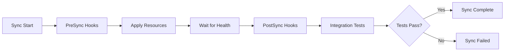

# How to Run Integration Tests After ArgoCD Deployment

Author: [nawazdhandala](https://github.com/nawazdhandala)

Tags: ArgoCD, GitOps, Kubernetes, Testing, CI/CD

Description: Learn how to run integration tests automatically after ArgoCD deployments using PostSync hooks, Kubernetes Jobs, and test frameworks to validate your services in production-like environments.

---

Deploying your application is only half the battle. The real question is whether your services actually work together once they land in the cluster. Integration tests catch the problems that unit tests miss - broken service-to-service communication, misconfigured environment variables, database connection failures, and API contract violations.

ArgoCD gives you a clean mechanism for running integration tests right after a sync completes: PostSync hooks. In this post, I will walk you through setting up automated integration tests that run every time ArgoCD deploys your application.

## Why Run Integration Tests After Deployment

Unit tests validate individual components. Integration tests validate how those components work together. In a Kubernetes environment, there are dozens of things that can go wrong between "the container starts" and "the system works":

- Service DNS resolution might fail
- ConfigMaps or Secrets might be misconfigured
- Database migrations might not have completed
- Upstream services might be unreachable
- Network policies might block traffic

Running integration tests after deployment catches these issues before users do.

## How ArgoCD PostSync Hooks Work

ArgoCD resource hooks let you execute Kubernetes resources at specific points during the sync lifecycle. The PostSync hook runs after all resources have been successfully synced and are healthy.

Here is the basic flow:



The key annotations you need are:

```yaml
argocd.argoproj.io/hook: PostSync
argocd.argoproj.io/hook-delete-policy: HookSucceeded
```

## Setting Up a Basic Integration Test Job

Let's start with a straightforward integration test that validates your API endpoints are responding correctly.

Create a file called `integration-test-job.yaml` in your GitOps repository:

```yaml
apiVersion: batch/v1
kind: Job
metadata:
  name: integration-tests
  annotations:
    # Run after all resources are synced and healthy
    argocd.argoproj.io/hook: PostSync
    # Clean up after successful test run
    argocd.argoproj.io/hook-delete-policy: HookSucceeded
spec:
  backoffLimit: 0
  ttlSecondsAfterFinished: 300
  template:
    spec:
      restartPolicy: Never
      containers:
        - name: integration-tests
          image: curlimages/curl:8.5.0
          command:
            - /bin/sh
            - -c
            - |
              echo "Running integration tests..."

              # Test API health endpoint
              echo "Testing API health..."
              response=$(curl -s -o /dev/null -w "%{http_code}" \
                http://api-service.default.svc.cluster.local:8080/health)
              if [ "$response" != "200" ]; then
                echo "FAIL: API health check returned $response"
                exit 1
              fi
              echo "PASS: API health check"

              # Test database connectivity through API
              echo "Testing database connectivity..."
              response=$(curl -s -o /dev/null -w "%{http_code}" \
                http://api-service.default.svc.cluster.local:8080/api/v1/status)
              if [ "$response" != "200" ]; then
                echo "FAIL: Database connectivity test returned $response"
                exit 1
              fi
              echo "PASS: Database connectivity"

              # Test inter-service communication
              echo "Testing service-to-service communication..."
              response=$(curl -s \
                http://api-service.default.svc.cluster.local:8080/api/v1/ping-worker)
              if echo "$response" | grep -q "pong"; then
                echo "PASS: Worker service reachable"
              else
                echo "FAIL: Worker service unreachable"
                exit 1
              fi

              echo "All integration tests passed!"
```

This Job runs inside the cluster, so it has direct access to service DNS names. It tests health endpoints, database connectivity, and inter-service communication.

## Using a Dedicated Test Container

For more complex integration tests, you want a proper test framework. Here is an example using a custom test container with pytest:

```yaml
apiVersion: batch/v1
kind: Job
metadata:
  name: integration-tests-pytest
  annotations:
    argocd.argoproj.io/hook: PostSync
    argocd.argoproj.io/hook-delete-policy: HookSucceeded
spec:
  backoffLimit: 1
  ttlSecondsAfterFinished: 600
  template:
    spec:
      restartPolicy: Never
      containers:
        - name: tests
          # Your custom test image with test dependencies
          image: myregistry.io/integration-tests:latest
          env:
            - name: API_BASE_URL
              value: "http://api-service.default.svc.cluster.local:8080"
            - name: AUTH_SERVICE_URL
              value: "http://auth-service.default.svc.cluster.local:8081"
            - name: DB_HOST
              valueFrom:
                secretKeyRef:
                  name: db-credentials
                  key: host
          command:
            - pytest
            - /tests/integration/
            - -v
            - --junitxml=/tmp/results.xml
          volumeMounts:
            - name: test-results
              mountPath: /tmp
      volumes:
        - name: test-results
          emptyDir: {}
```

Your Dockerfile for the test image would look like this:

```dockerfile
FROM python:3.12-slim

WORKDIR /tests
COPY requirements.txt .
RUN pip install -r requirements.txt

COPY integration/ integration/

# Default command runs all integration tests
CMD ["pytest", "integration/", "-v"]
```

And a sample integration test file:

```python
# integration/test_api_endpoints.py
import requests
import os
import pytest

API_BASE = os.environ.get("API_BASE_URL", "http://localhost:8080")

class TestAPIEndpoints:
    def test_health_endpoint(self):
        """Verify the API health endpoint returns 200."""
        response = requests.get(f"{API_BASE}/health", timeout=10)
        assert response.status_code == 200
        data = response.json()
        assert data["status"] == "healthy"

    def test_create_and_retrieve_resource(self):
        """Test basic CRUD operations work end-to-end."""
        # Create a resource
        payload = {"name": "test-resource", "type": "integration-test"}
        create_resp = requests.post(
            f"{API_BASE}/api/v1/resources",
            json=payload,
            timeout=10
        )
        assert create_resp.status_code == 201
        resource_id = create_resp.json()["id"]

        # Retrieve it back
        get_resp = requests.get(
            f"{API_BASE}/api/v1/resources/{resource_id}",
            timeout=10
        )
        assert get_resp.status_code == 200
        assert get_resp.json()["name"] == "test-resource"

    def test_authentication_flow(self):
        """Verify the auth service integration works."""
        auth_url = os.environ.get("AUTH_SERVICE_URL")
        # Get a test token
        token_resp = requests.post(
            f"{auth_url}/token",
            json={"client_id": "test", "client_secret": "test-secret"},
            timeout=10
        )
        assert token_resp.status_code == 200
        token = token_resp.json()["access_token"]

        # Use it to access a protected endpoint
        headers = {"Authorization": f"Bearer {token}"}
        protected_resp = requests.get(
            f"{API_BASE}/api/v1/protected",
            headers=headers,
            timeout=10
        )
        assert protected_resp.status_code == 200
```

## Handling Test Timeouts and Retries

Integration tests can be flaky, especially right after deployment when services are still warming up. Add a wait-for-ready script and configure appropriate timeouts:

```yaml
apiVersion: batch/v1
kind: Job
metadata:
  name: integration-tests
  annotations:
    argocd.argoproj.io/hook: PostSync
    argocd.argoproj.io/hook-delete-policy: HookSucceeded
spec:
  # Allow one retry
  backoffLimit: 1
  # Kill test if it takes more than 10 minutes
  activeDeadlineSeconds: 600
  template:
    spec:
      restartPolicy: Never
      initContainers:
        # Wait for the API to be ready before running tests
        - name: wait-for-api
          image: busybox:1.36
          command:
            - sh
            - -c
            - |
              echo "Waiting for API to be ready..."
              for i in $(seq 1 60); do
                if wget -q -O /dev/null http://api-service:8080/health 2>/dev/null; then
                  echo "API is ready after ${i}s"
                  exit 0
                fi
                sleep 1
              done
              echo "API did not become ready in 60s"
              exit 1
      containers:
        - name: tests
          image: myregistry.io/integration-tests:latest
          env:
            - name: API_BASE_URL
              value: "http://api-service.default.svc.cluster.local:8080"
          command:
            - pytest
            - /tests/integration/
            - -v
            - --timeout=30
```

The `initContainer` waits up to 60 seconds for the API to respond before the test container starts. The `activeDeadlineSeconds` ensures the entire Job does not run forever.

## Managing Hook Delete Policies

ArgoCD provides three delete policies for hooks:

- `HookSucceeded` - Delete the resource after it succeeds
- `HookFailed` - Delete the resource after it fails
- `BeforeHookCreation` - Delete any existing resource before creating a new one

For integration tests, you usually want `BeforeHookCreation` combined with `HookSucceeded`:

```yaml
annotations:
  argocd.argoproj.io/hook: PostSync
  argocd.argoproj.io/hook-delete-policy: BeforeHookCreation,HookSucceeded
```

This approach deletes old test Jobs before creating new ones (preventing name conflicts) and cleans up successful runs. Failed test Jobs stick around so you can inspect the logs.

## Collecting Test Results

To make test results visible outside the Job, send them to an external system:

```yaml
containers:
  - name: tests
    image: myregistry.io/integration-tests:latest
    command:
      - sh
      - -c
      - |
        # Run tests and capture exit code
        pytest /tests/integration/ -v --junitxml=/tmp/results.xml
        TEST_EXIT=$?

        # Upload results to your CI system or S3
        curl -X POST \
          -H "Authorization: Bearer $RESULTS_TOKEN" \
          -F "file=@/tmp/results.xml" \
          https://your-ci-system.com/api/test-results

        # Send Slack notification on failure
        if [ $TEST_EXIT -ne 0 ]; then
          curl -X POST "$SLACK_WEBHOOK_URL" \
            -H "Content-Type: application/json" \
            -d "{\"text\": \"Integration tests failed after deployment in $NAMESPACE\"}"
        fi

        exit $TEST_EXIT
    env:
      - name: SLACK_WEBHOOK_URL
        valueFrom:
          secretKeyRef:
            name: slack-webhook
            key: url
      - name: RESULTS_TOKEN
        valueFrom:
          secretKeyRef:
            name: ci-credentials
            key: token
```

## Organizing Tests with Sync Waves

If you have multiple test stages, use sync waves to run them in order:

```yaml
# First: Smoke tests (quick validation)
apiVersion: batch/v1
kind: Job
metadata:
  name: smoke-tests
  annotations:
    argocd.argoproj.io/hook: PostSync
    argocd.argoproj.io/sync-wave: "1"
    argocd.argoproj.io/hook-delete-policy: BeforeHookCreation,HookSucceeded
# ...

---
# Second: Full integration tests (comprehensive)
apiVersion: batch/v1
kind: Job
metadata:
  name: full-integration-tests
  annotations:
    argocd.argoproj.io/hook: PostSync
    argocd.argoproj.io/sync-wave: "2"
    argocd.argoproj.io/hook-delete-policy: BeforeHookCreation,HookSucceeded
# ...
```

Sync wave "1" runs first. Only after it succeeds does sync wave "2" execute.

## Monitoring Integration Test Results

To track test outcomes over time, integrate with your monitoring stack. For more on monitoring ArgoCD deployments, see our guide on [ArgoCD notifications](https://oneuptime.com/blog/post/2026-02-09-argocd-notifications-slack-email/view).

You can also use OneUptime to monitor the health of your deployed services and get alerts when integration tests fail repeatedly, catching regressions before they impact users.

## Best Practices

1. **Keep tests focused** - Integration tests should validate service boundaries, not replicate unit tests
2. **Set timeouts** - Always configure `activeDeadlineSeconds` on your test Jobs
3. **Use init containers** - Wait for dependencies to be ready before running tests
4. **Clean up test data** - Create test data with identifiable prefixes and clean up after
5. **Version your test image** - Tag test images alongside application images for consistency
6. **Do not test everything** - Focus on critical paths and known failure modes
7. **Make tests idempotent** - Tests should produce the same result regardless of how many times they run

Running integration tests as PostSync hooks turns every ArgoCD deployment into a validated deployment. You catch issues early, build confidence in your GitOps workflow, and reduce the time between "deployed" and "verified working."
