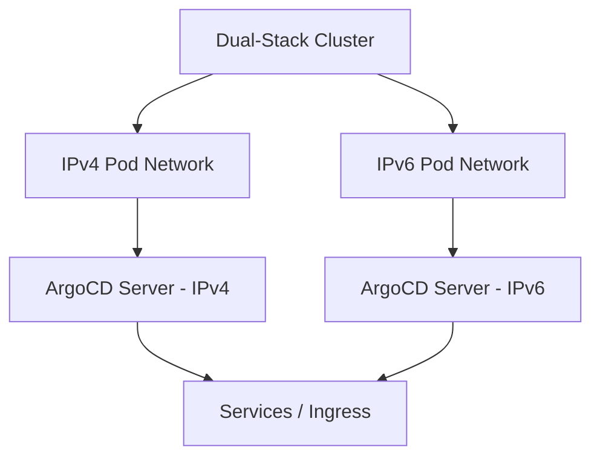

# How to Configure ArgoCD with IPv6

Author: [nawazdhandala](https://github.com/nawazdhandala)

Tags: ArgoCD, GitOps, Kubernetes, IPv6, Networking

Description: A step-by-step guide to configuring ArgoCD in IPv6 and dual-stack Kubernetes clusters, covering service configuration, DNS, and troubleshooting.

---

As Kubernetes clusters increasingly adopt IPv6 and dual-stack networking, ArgoCD needs to be configured to work correctly in these environments. Whether you are running a pure IPv6 cluster, a dual-stack setup, or managing remote clusters with different IP families, this guide covers everything you need to know.

## Understanding IPv6 in Kubernetes

Kubernetes has supported dual-stack networking since version 1.23 as a stable feature. In a dual-stack cluster, pods and services can have both IPv4 and IPv6 addresses. ArgoCD components need to bind to the correct addresses and communicate properly across both IP families.



## Configuring the Kubernetes Cluster for Dual-Stack

Before configuring ArgoCD, make sure your cluster supports dual-stack. Check the cluster CIDR configuration:

```bash
# Check if the cluster is configured for dual-stack
kubectl get nodes -o jsonpath='{.items[0].spec.podCIDRs}'

# Check if services support dual-stack
kubectl get svc kubernetes -o jsonpath='{.spec.ipFamilyPolicy}'
```

If your cluster uses kubeadm, the cluster configuration should include both IPv4 and IPv6 CIDRs:

```yaml
# kubeadm cluster config with dual-stack
apiVersion: kubeadm.k8s.io/v1beta3
kind: ClusterConfiguration
networking:
  podSubnet: "10.244.0.0/16,fd00:10:244::/48"
  serviceSubnet: "10.96.0.0/12,fd00:10:96::/108"
```

## Configuring ArgoCD Services for IPv6

ArgoCD services need to be configured with the correct IP family policy. For a dual-stack deployment, set the services to prefer dual-stack or require dual-stack:

```yaml
# ArgoCD server service with dual-stack support
apiVersion: v1
kind: Service
metadata:
  name: argocd-server
  namespace: argocd
spec:
  # PreferDualStack assigns both IPv4 and IPv6 if available
  ipFamilyPolicy: PreferDualStack
  # Order determines which family is preferred
  ipFamilies:
    - IPv6
    - IPv4
  selector:
    app.kubernetes.io/name: argocd-server
  ports:
    - name: http
      port: 80
      targetPort: 8080
    - name: https
      port: 443
      targetPort: 8080
```

Apply the same configuration to other ArgoCD services:

```yaml
# ArgoCD repo server service with dual-stack
apiVersion: v1
kind: Service
metadata:
  name: argocd-repo-server
  namespace: argocd
spec:
  ipFamilyPolicy: PreferDualStack
  ipFamilies:
    - IPv6
    - IPv4
  selector:
    app.kubernetes.io/name: argocd-repo-server
  ports:
    - name: server
      port: 8081
      targetPort: 8081
---
# ArgoCD application controller metrics with dual-stack
apiVersion: v1
kind: Service
metadata:
  name: argocd-metrics
  namespace: argocd
spec:
  ipFamilyPolicy: PreferDualStack
  ipFamilies:
    - IPv6
    - IPv4
  selector:
    app.kubernetes.io/name: argocd-application-controller
  ports:
    - name: metrics
      port: 8082
      targetPort: 8082
```

If you are using the ArgoCD Helm chart, configure it in values:

```yaml
# Helm values for dual-stack ArgoCD services
server:
  service:
    ipFamilyPolicy: PreferDualStack
    ipFamilies:
      - IPv6
      - IPv4

repoServer:
  service:
    ipFamilyPolicy: PreferDualStack
    ipFamilies:
      - IPv6
      - IPv4

controller:
  service:
    ipFamilyPolicy: PreferDualStack
    ipFamilies:
      - IPv6
      - IPv4
```

## Configuring ArgoCD Server to Listen on IPv6

ArgoCD server binds to `0.0.0.0` by default, which only listens on IPv4. For IPv6, you need to configure it to listen on `::` or both:

```yaml
# ArgoCD server deployment with IPv6 listening
apiVersion: apps/v1
kind: Deployment
metadata:
  name: argocd-server
  namespace: argocd
spec:
  template:
    spec:
      containers:
        - name: argocd-server
          command:
            - argocd-server
            # Listen on all interfaces (IPv4 and IPv6)
            - --address
            - "::"
```

The `::` address tells the server to listen on all IPv6 addresses, which on most systems also includes IPv4 through IPv4-mapped IPv6 addresses.

## DNS Configuration for IPv6

For external access, configure DNS with AAAA records:

```bash
# DNS records for ArgoCD with IPv6
# A record for IPv4
argocd.example.com.    IN    A       203.0.113.10
# AAAA record for IPv6
argocd.example.com.    IN    AAAA    2001:db8::1
```

When using external-dns with Kubernetes, annotate your ingress or service:

```yaml
# External-dns annotations for dual-stack
metadata:
  annotations:
    external-dns.alpha.kubernetes.io/hostname: argocd.example.com
    # external-dns will create both A and AAAA records
    # when the service has both IPv4 and IPv6 addresses
```

## Configuring Ingress for IPv6

NGINX Ingress Controller supports IPv6 natively. Ensure the controller is configured to listen on IPv6:

```yaml
# NGINX Ingress Controller with IPv6 support
apiVersion: apps/v1
kind: Deployment
metadata:
  name: ingress-nginx-controller
  namespace: ingress-nginx
spec:
  template:
    spec:
      containers:
        - name: controller
          args:
            - /nginx-ingress-controller
            # Enable IPv6 in NGINX
            - --enable-ipv6
```

The ingress resource itself does not need any IPv6-specific configuration:

```yaml
# Standard ingress works with IPv6
apiVersion: networking.k8s.io/v1
kind: Ingress
metadata:
  name: argocd-server
  namespace: argocd
  annotations:
    nginx.ingress.kubernetes.io/backend-protocol: "HTTPS"
spec:
  ingressClassName: nginx
  tls:
    - hosts:
        - argocd.example.com
      secretName: argocd-tls
  rules:
    - host: argocd.example.com
      http:
        paths:
          - path: /
            pathType: Prefix
            backend:
              service:
                name: argocd-server
                port:
                  number: 443
```

## Managing IPv6 Remote Clusters

When adding remote clusters to ArgoCD that use IPv6 addresses, you need to ensure the API server URL uses the correct format:

```bash
# Add a remote cluster with an IPv6 API server address
# Note: IPv6 addresses in URLs must be enclosed in square brackets
argocd cluster add my-ipv6-cluster \
  --server https://[2001:db8::1]:6443 \
  --name production-ipv6

# List clusters to verify
argocd cluster list
```

If the kubeconfig uses IPv6 addresses, ArgoCD will pick them up automatically:

```yaml
# kubeconfig with IPv6 cluster endpoint
apiVersion: v1
kind: Config
clusters:
  - cluster:
      server: https://[2001:db8:1::100]:6443
      certificate-authority-data: <base64-cert>
    name: ipv6-cluster
```

## Pure IPv6 Clusters

For clusters running only IPv6 (no dual-stack), all ArgoCD components must be configured for IPv6-only:

```yaml
# Helm values for IPv6-only ArgoCD deployment
server:
  service:
    ipFamilyPolicy: SingleStack
    ipFamilies:
      - IPv6
  extraArgs:
    - --address
    - "::"

repoServer:
  service:
    ipFamilyPolicy: SingleStack
    ipFamilies:
      - IPv6

controller:
  service:
    ipFamilyPolicy: SingleStack
    ipFamilies:
      - IPv6

redis:
  service:
    ipFamilyPolicy: SingleStack
    ipFamilies:
      - IPv6
```

Make sure Redis is also configured to bind to IPv6:

```yaml
# Redis configuration for IPv6
redis:
  extraArgs:
    - --bind
    - "::1"
    - --protected-mode
    - "no"
```

## Troubleshooting IPv6 Issues

**ArgoCD server not reachable over IPv6**: Check that the pod has an IPv6 address:

```bash
# Check pod IPv6 addresses
kubectl get pods -n argocd -o wide
kubectl exec -n argocd deploy/argocd-server -- ip addr show
```

**Service not resolving to IPv6**: Verify the service has an IPv6 ClusterIP:

```bash
# Check service cluster IPs
kubectl get svc -n argocd argocd-server -o jsonpath='{.spec.clusterIPs}'
```

**Remote cluster connection failures over IPv6**: Check network policies and firewall rules that might block IPv6 traffic:

```bash
# Test IPv6 connectivity from the ArgoCD pod
kubectl exec -n argocd deploy/argocd-server -- \
  curl -6 -k https://[2001:db8::1]:6443/healthz
```

**DNS resolution issues**: Verify both A and AAAA records are resolving:

```bash
# Check DNS resolution
dig argocd.example.com AAAA +short
dig argocd.example.com A +short
```

## Network Policies for IPv6

If you use network policies, ensure they account for IPv6 CIDR ranges:

```yaml
# Network policy with IPv6 CIDR
apiVersion: networking.k8s.io/v1
kind: NetworkPolicy
metadata:
  name: argocd-server-ipv6
  namespace: argocd
spec:
  podSelector:
    matchLabels:
      app.kubernetes.io/name: argocd-server
  ingress:
    - from:
        - ipBlock:
            cidr: 2001:db8::/32
      ports:
        - port: 8080
          protocol: TCP
```

## Summary

Running ArgoCD in IPv6 or dual-stack environments requires attention to service configuration, server binding addresses, DNS records, and network policies. Use `PreferDualStack` for maximum compatibility, or `SingleStack` with IPv6 for pure IPv6 environments. The key settings are the service `ipFamilyPolicy`, the server `--address` flag, and proper DNS records for external access. For related networking configurations, see our guide on [configuring ArgoCD firewall rules](https://oneuptime.com/blog/post/2026-02-26-argocd-firewall-rules/view).
