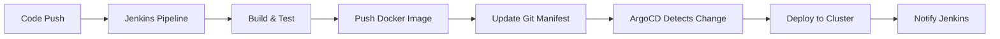

# How to Create a Complete Jenkins + ArgoCD Pipeline

Author: [nawazdhandala](https://github.com/nawazdhandala)

Tags: ArgoCD, GitOps, Kubernetes, Jenkins, CI/CD

Description: Learn how to build a complete CI/CD pipeline combining Jenkins for continuous integration with ArgoCD for GitOps-based continuous deployment to Kubernetes.

---

Jenkins is the most widely used CI server, running in thousands of organizations. Combining it with ArgoCD gives you a clean separation: Jenkins handles building, testing, and packaging your application, while ArgoCD handles deploying it to Kubernetes. This lets teams keep their existing Jenkins investment while adopting GitOps for deployments.

This guide covers building a production Jenkins + ArgoCD pipeline.

## Architecture

The pipeline separates CI (Jenkins) from CD (ArgoCD) with a Git commit as the handoff point:



## Jenkinsfile

Here is the complete Jenkinsfile for the application repository:

```groovy
// Jenkinsfile
pipeline {
    agent {
        kubernetes {
            yaml '''
            apiVersion: v1
            kind: Pod
            spec:
              containers:
              - name: docker
                image: docker:24-dind
                securityContext:
                  privileged: true
                volumeMounts:
                - name: docker-socket
                  mountPath: /var/run/docker.sock
              - name: tools
                image: alpine:3.19
                command: ['sleep', 'infinity']
              volumes:
              - name: docker-socket
                emptyDir: {}
            '''
        }
    }

    environment {
        REGISTRY = 'ghcr.io'
        IMAGE_NAME = 'myorg/api-service'
        DEPLOYMENT_REPO = 'https://github.com/myorg/k8s-deployments.git'
        IMAGE_TAG = "${env.GIT_COMMIT?.take(7) ?: 'latest'}"
    }

    stages {
        stage('Test') {
            steps {
                container('tools') {
                    sh '''
                        apk add --no-cache nodejs npm
                        npm ci
                        npm run test
                        npm run lint
                    '''
                }
            }
            post {
                always {
                    junit 'test-results/*.xml'
                }
            }
        }

        stage('Security Scan') {
            steps {
                container('tools') {
                    sh '''
                        apk add --no-cache curl
                        curl -sSfL https://raw.githubusercontent.com/aquasecurity/trivy/main/contrib/install.sh | sh -s -- -b /usr/local/bin
                        trivy fs --exit-code 1 --severity HIGH,CRITICAL .
                    '''
                }
            }
        }

        stage('Build and Push Image') {
            when {
                branch 'main'
            }
            steps {
                container('docker') {
                    withCredentials([usernamePassword(
                        credentialsId: 'ghcr-credentials',
                        usernameVariable: 'REGISTRY_USER',
                        passwordVariable: 'REGISTRY_PASS'
                    )]) {
                        sh '''
                            docker login ${REGISTRY} -u ${REGISTRY_USER} -p ${REGISTRY_PASS}

                            docker build \
                                -t ${REGISTRY}/${IMAGE_NAME}:${IMAGE_TAG} \
                                -t ${REGISTRY}/${IMAGE_NAME}:latest \
                                .

                            docker push ${REGISTRY}/${IMAGE_NAME}:${IMAGE_TAG}
                            docker push ${REGISTRY}/${IMAGE_NAME}:latest
                        '''
                    }
                }
            }
        }

        stage('Update Deployment Manifest') {
            when {
                branch 'main'
            }
            steps {
                container('tools') {
                    withCredentials([sshUserPrivateKey(
                        credentialsId: 'deployment-repo-key',
                        keyFileVariable: 'SSH_KEY'
                    )]) {
                        sh '''
                            apk add --no-cache git openssh-client sed

                            # Configure SSH
                            mkdir -p ~/.ssh
                            cp ${SSH_KEY} ~/.ssh/id_rsa
                            chmod 600 ~/.ssh/id_rsa
                            ssh-keyscan github.com >> ~/.ssh/known_hosts

                            # Clone and update deployment repo
                            git clone ${DEPLOYMENT_REPO} deployment-repo
                            cd deployment-repo

                            # Update image tag
                            sed -i "s|image: ${REGISTRY}/${IMAGE_NAME}:.*|image: ${REGISTRY}/${IMAGE_NAME}:${IMAGE_TAG}|" \
                                apps/api-service/deployment.yaml

                            # Commit and push
                            git config user.name "Jenkins CI"
                            git config user.email "jenkins@myorg.com"
                            git add .
                            git commit -m "Deploy api-service ${IMAGE_TAG}

                            Jenkins Build: ${BUILD_URL}
                            Git Commit: ${GIT_COMMIT}"
                            git push origin main
                        '''
                    }
                }
            }
        }
    }

    post {
        success {
            slackSend(
                channel: '#deployments',
                color: 'good',
                message: "api-service ${IMAGE_TAG} deployed successfully"
            )
        }
        failure {
            slackSend(
                channel: '#deployments',
                color: 'danger',
                message: "api-service deployment failed: ${BUILD_URL}"
            )
        }
    }
}
```

## Deploying Jenkins on Kubernetes with ArgoCD

You can even deploy Jenkins itself through ArgoCD:

```yaml
# jenkins-app.yaml
apiVersion: argoproj.io/v1alpha1
kind: Application
metadata:
  name: jenkins
  namespace: argocd
spec:
  project: platform
  source:
    repoURL: https://charts.jenkins.io
    chart: jenkins
    targetRevision: 4.12.0
    helm:
      values: |
        controller:
          image: jenkins/jenkins
          tag: lts-jdk17
          resources:
            requests:
              cpu: 500m
              memory: 1Gi
            limits:
              cpu: "2"
              memory: 4Gi
          installPlugins:
            - kubernetes:4029.v5712230ccb_f8
            - workflow-aggregator:596.v8c21c963d92d
            - git:5.2.1
            - docker-workflow:572.v950f58993843
            - configuration-as-code:1775.v810dc950b_514
          JCasC:
            configScripts:
              welcome-message: |
                jenkins:
                  systemMessage: "Jenkins managed by ArgoCD"
          ingress:
            enabled: true
            hostName: jenkins.internal.example.com

        agent:
          enabled: true
          image: jenkins/inbound-agent
          tag: latest
          resources:
            requests:
              cpu: 200m
              memory: 256Mi

        persistence:
          enabled: true
          size: 50Gi
          storageClass: gp3
  destination:
    server: https://kubernetes.default.svc
    namespace: jenkins
  syncPolicy:
    automated:
      selfHeal: true
    syncOptions:
      - CreateNamespace=true
```

## ArgoCD Application for the Deployed Service

```yaml
# argocd/api-service-app.yaml
apiVersion: argoproj.io/v1alpha1
kind: Application
metadata:
  name: api-service
  namespace: argocd
spec:
  project: applications
  source:
    repoURL: https://github.com/myorg/k8s-deployments.git
    path: apps/api-service
    targetRevision: main
  destination:
    server: https://kubernetes.default.svc
    namespace: production
  syncPolicy:
    automated:
      selfHeal: true
      prune: true
    retry:
      limit: 3
      backoff:
        duration: 5s
        factor: 2
        maxDuration: 3m
```

## Jenkins Shared Library for ArgoCD

Create a shared library so all Jenkins pipelines can update ArgoCD deployments consistently:

```groovy
// vars/deployToArgoCD.groovy
def call(Map config) {
    def registry = config.registry ?: 'ghcr.io'
    def imageName = config.imageName
    def imageTag = config.imageTag
    def deploymentRepo = config.deploymentRepo
    def deploymentPath = config.deploymentPath
    def credentialsId = config.credentialsId ?: 'deployment-repo-key'

    withCredentials([sshUserPrivateKey(
        credentialsId: credentialsId,
        keyFileVariable: 'SSH_KEY'
    )]) {
        sh """
            mkdir -p ~/.ssh
            cp ${SSH_KEY} ~/.ssh/id_rsa
            chmod 600 ~/.ssh/id_rsa
            ssh-keyscan github.com >> ~/.ssh/known_hosts

            git clone ${deploymentRepo} deployment-repo
            cd deployment-repo

            sed -i "s|image: ${registry}/${imageName}:.*|image: ${registry}/${imageName}:${imageTag}|" \
                ${deploymentPath}/deployment.yaml

            git config user.name "Jenkins CI"
            git config user.email "jenkins@myorg.com"
            git add .
            git commit -m "Deploy ${imageName} ${imageTag}"
            git push origin main
        """
    }
}
```

Usage in any Jenkinsfile:

```groovy
stage('Deploy') {
    steps {
        deployToArgoCD(
            imageName: 'myorg/api-service',
            imageTag: env.GIT_COMMIT.take(7),
            deploymentRepo: 'git@github.com:myorg/k8s-deployments.git',
            deploymentPath: 'apps/api-service'
        )
    }
}
```

## Webhook Integration

Configure Jenkins to notify ArgoCD for immediate sync after pushing the manifest update:

```groovy
stage('Trigger ArgoCD Sync') {
    steps {
        withCredentials([string(credentialsId: 'argocd-token', variable: 'ARGOCD_TOKEN')]) {
            sh '''
                curl -X POST \
                    https://argocd.example.com/api/v1/applications/api-service/sync \
                    -H "Authorization: Bearer ${ARGOCD_TOKEN}" \
                    -H "Content-Type: application/json" \
                    -d '{"revision": "main"}'
            '''
        }
    }
}
```

## Multi-Branch Pipeline Strategy

Handle different branches deploying to different environments:

```groovy
stage('Deploy') {
    steps {
        script {
            def targetEnv = ''
            switch(env.BRANCH_NAME) {
                case 'main':
                    targetEnv = 'production'
                    break
                case 'develop':
                    targetEnv = 'staging'
                    break
                case ~/^feature\/.*/:
                    targetEnv = "preview-${env.BRANCH_NAME.replace('feature/', '')}"
                    break
                default:
                    echo "No deployment for branch ${env.BRANCH_NAME}"
                    return
            }

            deployToArgoCD(
                imageName: 'myorg/api-service',
                imageTag: env.GIT_COMMIT.take(7),
                deploymentRepo: 'git@github.com:myorg/k8s-deployments.git',
                deploymentPath: "apps/api-service/overlays/${targetEnv}"
            )
        }
    }
}
```

## Summary

Jenkins + ArgoCD lets you keep your existing CI investment while adopting GitOps for deployments. Jenkins builds, tests, and pushes images, then commits the new image tag to the deployment repository. ArgoCD picks up the change and deploys to Kubernetes. A shared library standardizes the handoff across all your Jenkins pipelines, and webhook integration ensures fast sync times. This pattern gives you the flexibility of Jenkins with the reliability of GitOps.
