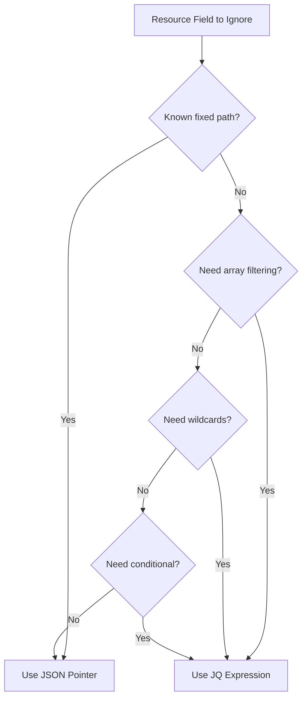

# How to Use JQ Path Expressions for Diff Customization in ArgoCD

Author: [nawazdhandala](https://github.com/nawazdhandala)

Tags: ArgoCD, GitOps, Kubernetes, jq, Diff Customization

Description: Learn how to use JQ path expressions in ArgoCD ignoreDifferences for advanced field matching with wildcards, conditionals, and array filtering.

---

JSON Pointers work well for simple, known paths, but they fall apart when you need to match array elements by name, use wildcards, or apply conditional logic. That is where JQ path expressions come in. ArgoCD supports a subset of JQ syntax in its `jqPathExpressions` field, giving you powerful pattern matching for diff customization.

This guide covers JQ expression syntax, practical patterns, and real-world examples for ArgoCD diff customization.

## Why JQ Path Expressions?

Consider this scenario: Istio injects a sidecar container into your Deployment. You want to ignore that specific container in the diff. With JSON Pointers, you would need to know the exact array index:

```yaml
# Fragile - what if container order changes?
jsonPointers:
  - /spec/template/spec/containers/1
```

With JQ, you can select by name:

```yaml
# Robust - matches by container name regardless of position
jqPathExpressions:
  - .spec.template.spec.containers[] | select(.name == "istio-proxy")
```



## JQ Expression Syntax Basics

### Object Access

Use dot notation to access object properties:

```
.metadata.name                          -> metadata.name
.spec.template.spec                     -> nested object
.metadata.annotations                   -> annotations object
```

### Array Iteration

Use `[]` to iterate over all elements in an array:

```
.spec.template.spec.containers[]        -> each container
.spec.template.spec.volumes[]           -> each volume
.status.conditions[]                    -> each condition
```

### Array Filtering with select()

Use `select()` to filter array elements by a condition:

```
.spec.template.spec.containers[] | select(.name == "sidecar")
.status.conditions[] | select(.type == "Ready")
.spec.template.spec.volumes[] | select(.name | startswith("vault-"))
```

### Nested Field Access After Filter

Chain field access after filtering:

```
# Select a container and then ignore just its resources
.spec.template.spec.containers[] | select(.name == "app") | .resources

# Select a volume and ignore its entire spec
.spec.template.spec.volumes[] | select(.name == "config") | .configMap
```

## Using JQ Expressions in ArgoCD

### Application-Level Configuration

```yaml
apiVersion: argoproj.io/v1alpha1
kind: Application
metadata:
  name: my-app
spec:
  source:
    repoURL: https://github.com/myorg/my-app.git
    targetRevision: main
    path: k8s
  destination:
    server: https://kubernetes.default.svc
    namespace: default
  ignoreDifferences:
    - group: apps
      kind: Deployment
      jqPathExpressions:
        # Ignore Istio sidecar container
        - .spec.template.spec.containers[] | select(.name == "istio-proxy")
        # Ignore Istio init container
        - .spec.template.spec.initContainers[] | select(.name == "istio-init")
        # Ignore volumes starting with "istio-"
        - .spec.template.spec.volumes[] | select(.name | startswith("istio-"))
```

### System-Level Configuration

```yaml
apiVersion: v1
kind: ConfigMap
metadata:
  name: argocd-cm
  namespace: argocd
data:
  resource.customizations.ignoreDifferences.apps_Deployment: |
    jqPathExpressions:
      - .spec.template.spec.containers[] | select(.name == "istio-proxy")
      - .spec.template.spec.initContainers[] | select(.name == "istio-init")
```

## Practical JQ Expression Patterns

### Ignoring Sidecar Containers by Name

```yaml
jqPathExpressions:
  # Istio sidecar
  - .spec.template.spec.containers[] | select(.name == "istio-proxy")
  # Vault agent sidecar
  - .spec.template.spec.containers[] | select(.name == "vault-agent")
  # Linkerd proxy
  - .spec.template.spec.containers[] | select(.name == "linkerd-proxy")
```

### Ignoring Init Containers by Name Pattern

```yaml
jqPathExpressions:
  # Any init container with "istio" in the name
  - .spec.template.spec.initContainers[] | select(.name | contains("istio"))
  # Any init container starting with "vault-"
  - .spec.template.spec.initContainers[] | select(.name | startswith("vault-"))
```

### Ignoring Specific Volume Mounts

```yaml
jqPathExpressions:
  # Volume mounts in any container that start with "istio-"
  - .spec.template.spec.containers[].volumeMounts[] | select(.name | startswith("istio-"))
  # Volume mounts with a specific mount path
  - .spec.template.spec.containers[].volumeMounts[] | select(.mountPath == "/etc/istio/proxy")
```

### Ignoring Container Resources

```yaml
jqPathExpressions:
  # Resources for all containers (VPA manages these)
  - .spec.template.spec.containers[].resources
  # Resources for a specific container only
  - .spec.template.spec.containers[] | select(.name == "app") | .resources
  # Only resource requests (keep limits from Git)
  - .spec.template.spec.containers[].resources.requests
```

### Ignoring Annotations by Pattern

```yaml
jqPathExpressions:
  # Annotations with a specific prefix
  - .metadata.annotations | to_entries[] | select(.key | startswith("cert-manager.io/"))
  # Pod template annotations with specific prefix
  - .spec.template.metadata.annotations | to_entries[] | select(.key | startswith("sidecar.istio.io/"))
```

### Ignoring Labels by Pattern

```yaml
jqPathExpressions:
  # Labels added by a specific operator
  - .metadata.labels | to_entries[] | select(.key | startswith("kyverno.io/"))
  # Pod template labels
  - .spec.template.metadata.labels | to_entries[] | select(.key | startswith("security.istio.io/"))
```

### Ignoring Environment Variables

```yaml
jqPathExpressions:
  # Env vars injected by an operator into a specific container
  - .spec.template.spec.containers[] | select(.name == "app") | .env[] | select(.name | startswith("VAULT_"))
  # All env vars with a specific prefix across all containers
  - .spec.template.spec.containers[].env[] | select(.name | startswith("INJECTED_"))
```

### Ignoring Status Conditions

```yaml
ignoreDifferences:
  - group: cert-manager.io
    kind: Certificate
    jqPathExpressions:
      # Ignore specific condition types
      - .status.conditions[] | select(.type == "Ready")
      - .status.conditions[] | select(.type == "Issuing")
```

## String Matching Functions

JQ provides several string matching functions:

```yaml
jqPathExpressions:
  # Exact match
  - .spec.template.spec.containers[] | select(.name == "sidecar")

  # Starts with
  - .spec.template.spec.volumes[] | select(.name | startswith("istio-"))

  # Ends with
  - .spec.template.spec.volumes[] | select(.name | endswith("-token"))

  # Contains
  - .spec.template.spec.containers[] | select(.name | contains("proxy"))

  # Regular expression (test)
  - .spec.template.spec.volumes[] | select(.name | test("^istio-.*-volume$"))
```

## Combining Multiple Conditions

Use `and` or `or` to combine conditions:

```yaml
jqPathExpressions:
  # Container that is both named "sidecar" and has a specific image prefix
  - .spec.template.spec.containers[] | select(.name == "sidecar" and (.image | startswith("istio/")))

  # Volumes that match either pattern
  - .spec.template.spec.volumes[] | select(.name | startswith("istio-") or startswith("envoy-"))
```

## Debugging JQ Expressions

### Test Locally with jq

Before adding JQ expressions to ArgoCD, test them against your actual resources:

```bash
# Get the resource as JSON
kubectl get deployment my-app -o json > /tmp/deploy.json

# Test your JQ expression
cat /tmp/deploy.json | jq '.spec.template.spec.containers[] | select(.name == "istio-proxy")'

# Test annotation pattern matching
cat /tmp/deploy.json | jq '.metadata.annotations | to_entries[] | select(.key | startswith("sidecar.istio.io/"))'
```

### Verify in ArgoCD

```bash
# Hard refresh to apply new rules
argocd app get my-app --hard-refresh

# Check the diff
argocd app diff my-app
```

### Common JQ Mistakes

1. **Missing quotes around strings**: `select(.name == istio-proxy)` should be `select(.name == "istio-proxy")`
2. **Using brackets for object access**: `.spec["template"]` is valid JQ but may not work in ArgoCD - use `.spec.template`
3. **Forgetting the pipe**: `.spec.template.spec.containers[] select(...)` needs a pipe: `.spec.template.spec.containers[] | select(...)`
4. **Using unsupported JQ features**: ArgoCD supports a subset of JQ. Complex operations like `reduce`, `group_by`, or user-defined functions may not work

## JQ Expressions vs JSON Pointers

Use JSON Pointers when:
- The path is simple and fixed (e.g., `/spec/replicas`)
- You are targeting a known annotation or label
- You do not need array filtering

Use JQ expressions when:
- You need to match array elements by name or value
- You need wildcard or pattern matching
- You need to ignore dynamically injected fields
- The array index may change between deployments

Both can coexist in the same `ignoreDifferences` entry, so use each where it makes sense.

For more on JSON Pointer syntax, see [How to Use JSONPointers for Diff Customization](https://oneuptime.com/blog/post/2026-02-26-argocd-jsonpointers-diff-customization/view). For system-level configuration, see [How to Configure System-Level Diff Defaults](https://oneuptime.com/blog/post/2026-02-26-argocd-system-level-diff-defaults/view).
