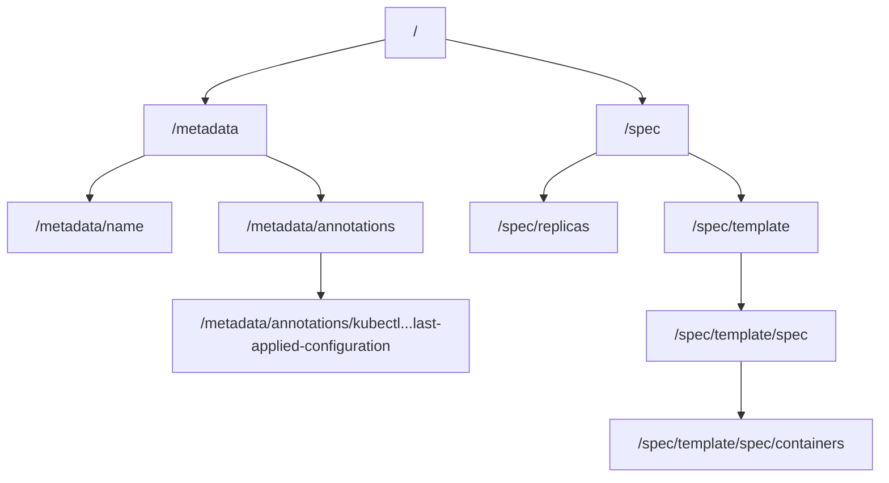

# How to Use JSONPointers for Diff Customization in ArgoCD

Author: [nawazdhandala](https://github.com/nawazdhandala)

Tags: ArgoCD, GitOps, Kubernetes, JSON Pointer, Diff Customization

Description: Learn how to use JSON Pointer expressions in ArgoCD ignoreDifferences to precisely target fields you want excluded from diff comparisons.

---

JSON Pointers are one of the primary mechanisms ArgoCD provides for specifying which fields to ignore in diff comparisons. They follow RFC 6901, a standard for identifying specific values within a JSON document. When you need to tell ArgoCD "ignore this exact field," JSON Pointers give you a concise and predictable syntax.

This guide covers JSON Pointer syntax, common patterns, escape rules, and practical examples for ArgoCD diff customization.

## What Is a JSON Pointer?

A JSON Pointer is a string that identifies a specific location in a JSON document. It uses forward slashes to navigate through the object hierarchy.

Given this Kubernetes resource:

```yaml
apiVersion: apps/v1
kind: Deployment
metadata:
  name: my-app
  annotations:
    kubectl.kubernetes.io/last-applied-configuration: "{...}"
spec:
  replicas: 3
  template:
    spec:
      containers:
        - name: app
          image: myapp:v1
```

The JSON Pointer `/spec/replicas` points to the value `3`. The pointer `/metadata/annotations` points to the entire annotations object.



## JSON Pointer Syntax Rules

### Basic Navigation

Each segment after a `/` is a key in the JSON object:

```text
/spec/replicas              -> spec.replicas
/metadata/name              -> metadata.name
/spec/template/spec         -> spec.template.spec
```

### Array Index Access

Use numeric indices to access array elements:

```text
/spec/template/spec/containers/0         -> first container
/spec/template/spec/containers/0/image   -> first container's image
/spec/template/spec/containers/1/name    -> second container's name
```

### Escape Characters

JSON Pointer defines two escape sequences:

- `~0` represents the literal character `~`
- `~1` represents the literal character `/`

This is critical for Kubernetes annotations and labels that contain slashes:

```text
# Annotation key: sidecar.istio.io/inject
# JSON Pointer: /metadata/annotations/sidecar.istio.io~1inject

# Annotation key: app.kubernetes.io/name
# JSON Pointer: /metadata/annotations/app.kubernetes.io~1name

# Label key: some~label
# JSON Pointer: /metadata/labels/some~0label
```

## Using JSON Pointers in ArgoCD

### Application-Level ignoreDifferences

```yaml
apiVersion: argoproj.io/v1alpha1
kind: Application
metadata:
  name: my-app
spec:
  source:
    repoURL: https://github.com/myorg/my-app.git
    targetRevision: main
    path: k8s
  destination:
    server: https://kubernetes.default.svc
    namespace: default
  ignoreDifferences:
    - group: apps
      kind: Deployment
      jsonPointers:
        - /spec/replicas
        - /metadata/annotations/kubectl.kubernetes.io~1last-applied-configuration
```

### Targeting Specific Resources

Add a `name` or `namespace` field to narrow the scope:

```yaml
ignoreDifferences:
  # Only ignore replicas on this specific Deployment
  - group: apps
    kind: Deployment
    name: my-api-server
    namespace: production
    jsonPointers:
      - /spec/replicas
```

### System-Level Configuration

Configure JSON Pointer ignores globally in the `argocd-cm` ConfigMap:

```yaml
apiVersion: v1
kind: ConfigMap
metadata:
  name: argocd-cm
  namespace: argocd
data:
  # Apply to all Deployments in the apps group
  resource.customizations.ignoreDifferences.apps_Deployment: |
    jsonPointers:
      - /spec/replicas
  # Apply to all resources of any kind
  resource.customizations.ignoreDifferences.all: |
    jsonPointers:
      - /metadata/annotations/kubectl.kubernetes.io~1last-applied-configuration
```

## Common JSON Pointer Patterns

### Ignoring Metadata Fields

```yaml
jsonPointers:
  # Last applied configuration annotation
  - /metadata/annotations/kubectl.kubernetes.io~1last-applied-configuration
  # Resource version (changes on every update)
  - /metadata/resourceVersion
  # Generation counter
  - /metadata/generation
  # UID
  - /metadata/uid
  # Creation timestamp
  - /metadata/creationTimestamp
  # Managed fields (field ownership tracking)
  - /metadata/managedFields
```

### Ignoring Deployment Fields

```yaml
jsonPointers:
  # Replica count (managed by HPA)
  - /spec/replicas
  # Deployment status (should not appear in desired state, but sometimes does)
  - /status
```

### Ignoring Service Fields

```yaml
ignoreDifferences:
  - group: ""
    kind: Service
    jsonPointers:
      # ClusterIP assigned by Kubernetes
      - /spec/clusterIP
      - /spec/clusterIPs
      # Session affinity config added by default
      - /spec/sessionAffinity
```

### Ignoring ConfigMap Data Keys

```yaml
ignoreDifferences:
  - group: ""
    kind: ConfigMap
    name: my-config
    jsonPointers:
      # Ignore a specific key in the data section
      - /data/generated-config.yaml
```

### Ignoring CRD Fields

```yaml
ignoreDifferences:
  - group: cert-manager.io
    kind: Certificate
    jsonPointers:
      # Ignore status conditions set by cert-manager
      - /status
      # Ignore last transition timestamps
      - /status/conditions
```

## JSON Pointer Limitations

JSON Pointers have important limitations you should understand:

### No Wildcards

You cannot use wildcards to match multiple fields. This does NOT work:

```yaml
# WRONG - wildcards are not supported
jsonPointers:
  - /spec/template/spec/containers/*/resources
```

For wildcard-like matching, use JQ path expressions instead:

```yaml
jqPathExpressions:
  - .spec.template.spec.containers[].resources
```

### No Conditional Matching

You cannot match based on field values. This does NOT work:

```yaml
# WRONG - cannot select by value
jsonPointers:
  - /spec/template/spec/containers[name=istio-proxy]
```

Again, use JQ for value-based selection:

```yaml
jqPathExpressions:
  - .spec.template.spec.containers[] | select(.name == "istio-proxy")
```

### Array Index Fragility

Using numeric array indices is brittle. If the order of containers changes, your pointer may target the wrong container:

```yaml
# Fragile - depends on container ordering
jsonPointers:
  - /spec/template/spec/containers/1/resources

# Better - use JQ with selection
jqPathExpressions:
  - .spec.template.spec.containers[] | select(.name == "sidecar") | .resources
```

## When to Use JSON Pointers vs JQ Expressions

| Scenario | Use JSON Pointer | Use JQ |
|----------|-----------------|--------|
| Single known field | Yes | Overkill |
| Annotation with slashes | Yes | Also works |
| Array element by index | Fragile | Preferred |
| Array element by name | No | Yes |
| Wildcard matching | No | Yes |
| Conditional ignoring | No | Yes |
| Simple top-level fields | Yes | Overkill |

## Debugging JSON Pointer Issues

### Verify the Pointer is Correct

Use `kubectl` and `jq` to test your pointer against the actual resource:

```bash
# Get the resource as JSON
kubectl get deployment my-app -o json > /tmp/deploy.json

# Test the JSON pointer manually
# For /spec/replicas:
cat /tmp/deploy.json | jq '.spec.replicas'

# For /metadata/annotations/kubectl.kubernetes.io~1last-applied-configuration:
cat /tmp/deploy.json | jq '.metadata.annotations["kubectl.kubernetes.io/last-applied-configuration"]'
```

### Check the ArgoCD Diff After Adding Pointers

```bash
# Hard refresh to pick up new ignore rules
argocd app get my-app --hard-refresh

# Check if the diff is clean now
argocd app diff my-app
```

### Common Mistakes

1. **Forgetting to escape slashes**: `/metadata/annotations/app.kubernetes.io/name` should be `/metadata/annotations/app.kubernetes.io~1name`
2. **Using dot notation**: `/spec.replicas` is wrong. Use `/spec/replicas`
3. **Including the leading slash**: Every JSON pointer must start with `/`
4. **Wrong API group**: Deployments use group `apps`, not empty string. Services use empty string `""`, not `core`

## Combining JSON Pointers with Other Strategies

JSON Pointers work alongside other diff customization methods:

```yaml
ignoreDifferences:
  - group: apps
    kind: Deployment
    # Use JSON pointers for simple, known fields
    jsonPointers:
      - /spec/replicas
      - /metadata/annotations/kubectl.kubernetes.io~1last-applied-configuration
    # Use JQ for complex matching
    jqPathExpressions:
      - .spec.template.spec.containers[] | select(.name == "istio-proxy")
    # Use managed fields for operator-owned fields
    managedFieldsManagers:
      - kube-controller-manager
```

JSON Pointers are the simplest and most readable option for targeting known, fixed paths in your Kubernetes resources. Use them when you know exactly which field to ignore and the path does not involve array element selection by name. For more advanced scenarios, see [How to Use JQ Path Expressions for Diff Customization](https://oneuptime.com/blog/post/2026-02-26-argocd-jq-path-diff-customization/view).
