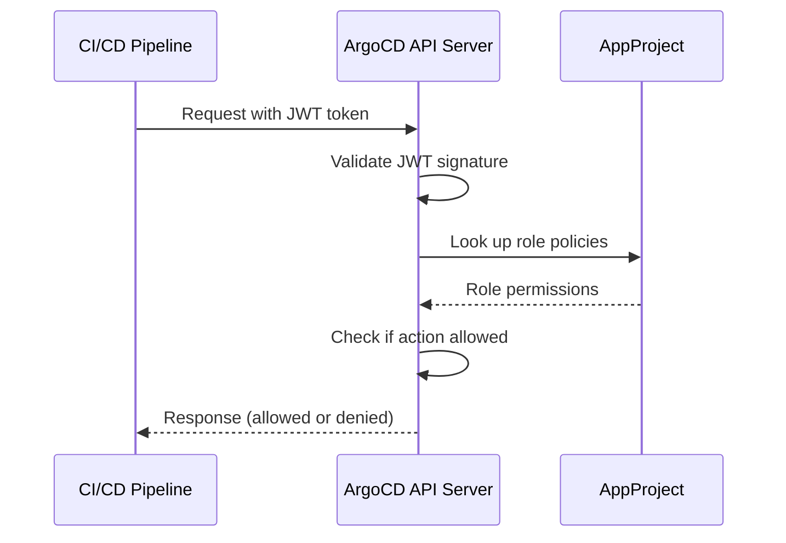

# How to Generate JWT Tokens for Project Roles in ArgoCD

Author: [nawazdhandala](https://github.com/nawazdhandala)

Tags: ArgoCD, GitOps, Kubernetes, Security, CI/CD

Description: Learn how to generate, manage, and use JWT tokens for ArgoCD project roles to enable secure programmatic access for CI/CD pipelines, automation scripts, and service accounts.

---

When you need CI/CD pipelines or automation scripts to interact with ArgoCD, you cannot use SSO login - those tools need a token. ArgoCD project roles can generate JWT (JSON Web Token) tokens that grant the exact permissions defined in the role's policies. This is the recommended way to give machines access to ArgoCD.

This guide covers generating JWT tokens, configuring them for CI/CD, managing their lifecycle, and handling token rotation.

## How JWT Tokens Work in ArgoCD

JWT tokens in ArgoCD are tied to project roles. When a token is generated for a role, it inherits all the permissions defined in that role's policies. The token can then be used with the ArgoCD CLI or API to perform operations.



## Step 1: Create a Project Role

Before generating a token, you need a role defined in the project:

```yaml
apiVersion: argoproj.io/v1alpha1
kind: AppProject
metadata:
  name: backend
  namespace: argocd
spec:
  description: "Backend team project"

  sourceRepos:
    - "https://github.com/my-org/backend-*"

  destinations:
    - server: "https://kubernetes.default.svc"
      namespace: "backend-*"

  roles:
    - name: ci-deployer
      description: "CI/CD pipeline token for automated deployments"
      policies:
        - p, proj:backend:ci-deployer, applications, get, backend/*, allow
        - p, proj:backend:ci-deployer, applications, sync, backend/*, allow
        - p, proj:backend:ci-deployer, applications, action/*, backend/*, allow
```

Apply this configuration:

```bash
kubectl apply -f backend-project.yaml
```

Or create the role via CLI:

```bash
# Create the role
argocd proj role create backend ci-deployer \
  --description "CI/CD pipeline token"

# Add policies
argocd proj role add-policy backend ci-deployer \
  -a get -p allow -o "backend/*"

argocd proj role add-policy backend ci-deployer \
  -a sync -p allow -o "backend/*"
```

## Step 2: Generate a JWT Token

### Generate a Token with No Expiration

```bash
# Generate a token for the ci-deployer role
TOKEN=$(argocd proj role create-token backend ci-deployer)
echo $TOKEN
```

This creates a token that never expires. While convenient, long-lived tokens are a security risk if compromised.

### Generate a Token with Expiration

```bash
# Token that expires in 24 hours (86400 seconds)
TOKEN=$(argocd proj role create-token backend ci-deployer --expires-in 86400s)

# Token that expires in 30 days
TOKEN=$(argocd proj role create-token backend ci-deployer --expires-in 720h)

# Token that expires in 1 year
TOKEN=$(argocd proj role create-token backend ci-deployer --expires-in 8760h)
```

### Generate a Token with a Custom ID

Custom IDs help you track which token is which:

```bash
# Generate with a descriptive token ID
TOKEN=$(argocd proj role create-token backend ci-deployer --token-id "github-actions-prod-2024")
```

## Step 3: Use the Token

### With the ArgoCD CLI

```bash
# Set the token as an environment variable
export ARGOCD_AUTH_TOKEN=$TOKEN

# Now CLI commands use the token for authentication
argocd app list --project backend
argocd app sync backend-api
argocd app get backend-api
```

### With the ArgoCD API

```bash
# List applications via API
curl -s https://argocd.example.com/api/v1/applications \
  -H "Authorization: Bearer $TOKEN" | jq '.items[].metadata.name'

# Sync an application via API
curl -X POST https://argocd.example.com/api/v1/applications/backend-api/sync \
  -H "Authorization: Bearer $TOKEN" \
  -H "Content-Type: application/json" \
  -d '{}'

# Get application status
curl -s https://argocd.example.com/api/v1/applications/backend-api \
  -H "Authorization: Bearer $TOKEN" | jq '.status.sync.status'
```

## Configuring CI/CD Pipelines

### GitHub Actions

```yaml
# .github/workflows/deploy.yaml
name: Deploy to Kubernetes
on:
  push:
    branches: [main]

jobs:
  deploy:
    runs-on: ubuntu-latest
    steps:
      - name: Install ArgoCD CLI
        run: |
          curl -sSL -o /usr/local/bin/argocd \
            https://github.com/argoproj/argo-cd/releases/latest/download/argocd-linux-amd64
          chmod +x /usr/local/bin/argocd

      - name: Sync ArgoCD Application
        env:
          ARGOCD_AUTH_TOKEN: ${{ secrets.ARGOCD_TOKEN }}
          ARGOCD_SERVER: argocd.example.com
        run: |
          argocd app sync backend-api \
            --server $ARGOCD_SERVER \
            --grpc-web

          # Wait for sync to complete
          argocd app wait backend-api \
            --server $ARGOCD_SERVER \
            --grpc-web \
            --timeout 300
```

### GitLab CI

```yaml
# .gitlab-ci.yml
deploy:
  stage: deploy
  image: argoproj/argocd:latest
  script:
    - argocd app sync backend-api
        --server $ARGOCD_SERVER
        --auth-token $ARGOCD_TOKEN
        --grpc-web
    - argocd app wait backend-api
        --server $ARGOCD_SERVER
        --auth-token $ARGOCD_TOKEN
        --grpc-web
        --timeout 300
  variables:
    ARGOCD_SERVER: argocd.example.com
  only:
    - main
```

### Jenkins Pipeline

```groovy
pipeline {
    agent any
    environment {
        ARGOCD_AUTH_TOKEN = credentials('argocd-token')
        ARGOCD_SERVER = 'argocd.example.com'
    }
    stages {
        stage('Deploy') {
            steps {
                sh '''
                    argocd app sync backend-api \
                        --server $ARGOCD_SERVER \
                        --grpc-web

                    argocd app wait backend-api \
                        --server $ARGOCD_SERVER \
                        --grpc-web \
                        --timeout 300
                '''
            }
        }
    }
}
```

## Managing Token Lifecycle

### List Active Tokens

```bash
# List all tokens for a role
argocd proj role get backend ci-deployer

# Output shows token IDs and their creation/expiry times
```

### Revoke a Token

```bash
# Revoke by token ID
argocd proj role delete-token backend ci-deployer <token-id>
```

### Revoke All Tokens for a Role

To revoke all tokens, delete and recreate the role:

```bash
# Delete the role (revokes all tokens)
argocd proj role delete backend ci-deployer

# Recreate the role
argocd proj role create backend ci-deployer \
  --description "CI/CD pipeline token"

# Re-add policies
argocd proj role add-policy backend ci-deployer \
  -a get -p allow -o "backend/*"
argocd proj role add-policy backend ci-deployer \
  -a sync -p allow -o "backend/*"

# Generate a new token
TOKEN=$(argocd proj role create-token backend ci-deployer)
```

## Token Rotation Strategy

For production environments, implement a token rotation strategy:

### Manual Rotation

1. Generate a new token
2. Update the token in your CI/CD secret store
3. Verify the new token works
4. Revoke the old token

```bash
# Step 1: Generate new token
NEW_TOKEN=$(argocd proj role create-token backend ci-deployer --token-id "rotate-$(date +%Y%m%d)")

# Step 2: Update in GitHub Actions (or equivalent)
gh secret set ARGOCD_TOKEN --body "$NEW_TOKEN" --repo my-org/backend-api

# Step 3: Verify
ARGOCD_AUTH_TOKEN=$NEW_TOKEN argocd app list --project backend --server argocd.example.com

# Step 4: Revoke old token
argocd proj role delete-token backend ci-deployer <old-token-id>
```

### Automated Rotation with Short-Lived Tokens

For maximum security, generate short-lived tokens on each CI run:

```yaml
# GitHub Actions with short-lived token generation
# This requires a separate long-lived "token generator" credential
- name: Generate short-lived ArgoCD token
  env:
    ARGOCD_AUTH_TOKEN: ${{ secrets.ARGOCD_TOKEN_GENERATOR }}
  run: |
    # Generate a token that expires in 10 minutes
    SHORT_TOKEN=$(argocd proj role create-token backend ci-deployer \
      --server argocd.example.com \
      --grpc-web \
      --expires-in 600s)
    echo "::add-mask::$SHORT_TOKEN"
    echo "DEPLOY_TOKEN=$SHORT_TOKEN" >> $GITHUB_ENV
```

## Security Best Practices

1. **Always set expiration**: Use `--expires-in` to create tokens that automatically expire.

2. **Principle of least privilege**: Only grant the minimum permissions needed:

```yaml
# Bad: too broad
policies:
  - p, proj:backend:ci-deployer, applications, *, backend/*, allow

# Good: only what the pipeline needs
policies:
  - p, proj:backend:ci-deployer, applications, get, backend/*, allow
  - p, proj:backend:ci-deployer, applications, sync, backend/api-service, allow
```

3. **Separate tokens per pipeline**: Create different roles for different pipelines:

```yaml
roles:
  - name: api-deployer
    policies:
      - p, proj:backend:api-deployer, applications, sync, backend/api-service, allow
  - name: worker-deployer
    policies:
      - p, proj:backend:worker-deployer, applications, sync, backend/worker-service, allow
```

4. **Store tokens securely**: Never commit tokens to Git. Use your CI/CD platform's secret management.

5. **Audit token usage**: Monitor ArgoCD server logs for token-based authentication events.

## Troubleshooting

**"permission denied" with valid token**: Check that the role's policies match the action you are attempting:

```bash
# Verify the role's policies
argocd proj role get backend ci-deployer
```

**"token is expired"**: Generate a new token. Check the expiration with:

```bash
# Decode the JWT to see expiration
echo $TOKEN | cut -d'.' -f2 | base64 -d 2>/dev/null | jq '.exp | todate'
```

**"project role not found"**: Ensure the role exists in the AppProject spec and the project has been applied.

## Summary

JWT tokens for project roles are the right way to give CI/CD pipelines access to ArgoCD. Create roles with minimal permissions, generate tokens with expiration dates, store them in your CI/CD platform's secret store, and implement a rotation strategy. For the highest security, use short-lived tokens generated at the start of each pipeline run.
