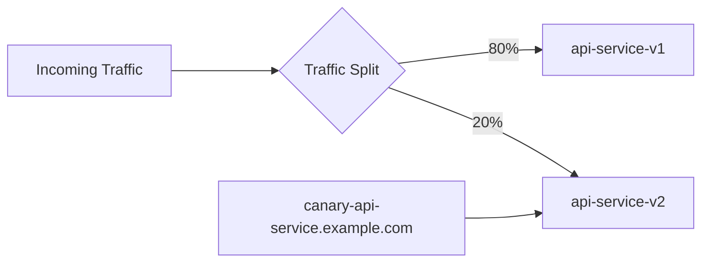

# How to Deploy Knative Services with ArgoCD

Author: [nawazdhandala](https://github.com/nawazdhandala)

Tags: ArgoCD, GitOps, Kubernetes, Knative, Serverless

Description: Learn how to deploy and manage Knative serverless services using ArgoCD GitOps workflows including serving configuration, autoscaling, and traffic splitting.

---

Knative brings serverless capabilities to Kubernetes - your services scale to zero when idle and scale up automatically when traffic arrives. Managing Knative services through ArgoCD gives you the best of both worlds: serverless simplicity with GitOps control. Every service configuration, revision, and traffic split lives in Git.

This guide covers deploying Knative itself and managing Knative Services through ArgoCD.

## Installing Knative with ArgoCD

Knative has two main components: Serving (for running services) and Eventing (for event-driven architectures). Install both through ArgoCD.

First, the Knative Serving CRDs and core components:

```yaml
# knative-serving-app.yaml
apiVersion: argoproj.io/v1alpha1
kind: Application
metadata:
  name: knative-serving
  namespace: argocd
  annotations:
    argocd.argoproj.io/sync-wave: "0"
spec:
  project: serverless
  source:
    repoURL: https://github.com/myorg/k8s-platform.git
    path: knative/serving
    targetRevision: main
  destination:
    server: https://kubernetes.default.svc
    namespace: knative-serving
  syncPolicy:
    automated:
      selfHeal: true
    syncOptions:
      - CreateNamespace=true
      - ServerSideApply=true
```

In your Git repository, store the Knative installation manifests:

```yaml
# knative/serving/serving-crds.yaml
# Download from: https://github.com/knative/serving/releases/download/knative-v1.13.0/serving-crds.yaml
# Store in Git for version control

---
# knative/serving/serving-core.yaml
# Download from: https://github.com/knative/serving/releases/download/knative-v1.13.0/serving-core.yaml
```

Install the networking layer (using Kourier as a lightweight option):

```yaml
# knative-kourier-app.yaml
apiVersion: argoproj.io/v1alpha1
kind: Application
metadata:
  name: knative-kourier
  namespace: argocd
  annotations:
    argocd.argoproj.io/sync-wave: "1"
spec:
  project: serverless
  source:
    repoURL: https://github.com/myorg/k8s-platform.git
    path: knative/kourier
    targetRevision: main
  destination:
    server: https://kubernetes.default.svc
    namespace: knative-serving
  syncPolicy:
    automated:
      selfHeal: true
```

Configure Knative to use Kourier:

```yaml
# knative/serving/config-network.yaml
apiVersion: v1
kind: ConfigMap
metadata:
  name: config-network
  namespace: knative-serving
data:
  ingress-class: kourier.ingress.networking.knative.dev
```

## Deploying Your First Knative Service

A Knative Service is simpler than a standard Deployment + Service + HPA combo. Here is a basic example:

```yaml
# services/production/hello-service.yaml
apiVersion: serving.knative.dev/v1
kind: Service
metadata:
  name: hello
  namespace: production
  labels:
    app: hello
spec:
  template:
    metadata:
      annotations:
        # Scale down to zero after 5 minutes of inactivity
        autoscaling.knative.dev/scale-to-zero-pod-retention-period: "5m"
        # Use 10 concurrent requests per pod as scaling target
        autoscaling.knative.dev/target: "10"
    spec:
      containers:
        - image: ghcr.io/myorg/hello-service:v1.2.0
          ports:
            - containerPort: 8080
          env:
            - name: LOG_LEVEL
              value: info
          resources:
            requests:
              cpu: 100m
              memory: 128Mi
            limits:
              cpu: 500m
              memory: 256Mi
          readinessProbe:
            httpGet:
              path: /healthz
              port: 8080
            initialDelaySeconds: 3
```

Manage this through an ArgoCD Application:

```yaml
# knative-services-app.yaml
apiVersion: argoproj.io/v1alpha1
kind: Application
metadata:
  name: knative-services
  namespace: argocd
spec:
  project: applications
  source:
    repoURL: https://github.com/myorg/k8s-services.git
    path: services/production
    targetRevision: main
  destination:
    server: https://kubernetes.default.svc
    namespace: production
  syncPolicy:
    automated:
      selfHeal: true
      prune: true
```

## Traffic Splitting Between Revisions

One of Knative's best features is traffic splitting between revisions. This is perfect for canary deployments:

```yaml
# services/production/api-service.yaml
apiVersion: serving.knative.dev/v1
kind: Service
metadata:
  name: api-service
  namespace: production
spec:
  template:
    metadata:
      name: api-service-v2
      annotations:
        autoscaling.knative.dev/target: "50"
        autoscaling.knative.dev/min-scale: "2"
        autoscaling.knative.dev/max-scale: "20"
    spec:
      containers:
        - image: ghcr.io/myorg/api-service:v2.0.0
          ports:
            - containerPort: 8080
          resources:
            requests:
              cpu: 200m
              memory: 256Mi
  traffic:
    # Send 80% to the previous stable revision
    - revisionName: api-service-v1
      percent: 80
    # Send 20% to the new revision
    - revisionName: api-service-v2
      percent: 20
    # Tag the new revision for direct testing
    - revisionName: api-service-v2
      tag: canary
```

The tagged revision gets its own URL (e.g., `canary-api-service.production.example.com`) for direct testing.

Here is the traffic flow:



## Autoscaling Configuration

Knative's autoscaler is powerful but needs tuning. Manage the global configuration through ArgoCD:

```yaml
# knative/serving/config-autoscaler.yaml
apiVersion: v1
kind: ConfigMap
metadata:
  name: config-autoscaler
  namespace: knative-serving
data:
  # Scale to zero after this period of inactivity
  scale-to-zero-grace-period: "30s"

  # How quickly to scale up
  stable-window: "60s"
  panic-window-percentage: "10.0"
  panic-threshold-percentage: "200.0"

  # Concurrency target
  container-concurrency-target-default: "100"

  # Max scale limit (safety valve)
  max-scale-limit: "50"

  # Enable scale to zero
  enable-scale-to-zero: "true"
```

Per-service autoscaling overrides go in the service annotation:

```yaml
apiVersion: serving.knative.dev/v1
kind: Service
metadata:
  name: high-traffic-service
spec:
  template:
    metadata:
      annotations:
        # Use RPS-based scaling instead of concurrency
        autoscaling.knative.dev/metric: rps
        autoscaling.knative.dev/target: "200"
        # Never scale to zero - always keep 3 pods
        autoscaling.knative.dev/min-scale: "3"
        autoscaling.knative.dev/max-scale: "100"
        # Scale up aggressively
        autoscaling.knative.dev/window: "30s"
    spec:
      containers:
        - image: ghcr.io/myorg/high-traffic:v1.0.0
          ports:
            - containerPort: 8080
```

## Knative Eventing with ArgoCD

Deploy event-driven architectures alongside your serving components:

```yaml
# knative-eventing-app.yaml
apiVersion: argoproj.io/v1alpha1
kind: Application
metadata:
  name: knative-eventing
  namespace: argocd
spec:
  project: serverless
  source:
    repoURL: https://github.com/myorg/k8s-platform.git
    path: knative/eventing
    targetRevision: main
  destination:
    server: https://kubernetes.default.svc
    namespace: knative-eventing
  syncPolicy:
    automated:
      selfHeal: true
    syncOptions:
      - CreateNamespace=true
      - ServerSideApply=true
```

Create event sources and triggers:

```yaml
# services/production/order-events.yaml
apiVersion: sources.knative.dev/v1
kind: ApiServerSource
metadata:
  name: order-events
  namespace: production
spec:
  serviceAccountName: event-watcher
  mode: Resource
  resources:
    - apiVersion: v1
      kind: Event
      controller: true
  sink:
    ref:
      apiVersion: serving.knative.dev/v1
      kind: Service
      name: order-processor
---
apiVersion: eventing.knative.dev/v1
kind: Trigger
metadata:
  name: order-created-trigger
  namespace: production
spec:
  broker: default
  filter:
    attributes:
      type: order.created
  subscriber:
    ref:
      apiVersion: serving.knative.dev/v1
      kind: Service
      name: order-processor
```

## Custom Health Checks

ArgoCD does not understand Knative resource health by default. Add custom health checks:

```yaml
# In argocd-cm ConfigMap
resource.customizations.health.serving.knative.dev_Service: |
  hs = {}
  if obj.status ~= nil then
    if obj.status.conditions ~= nil then
      for _, condition in ipairs(obj.status.conditions) do
        if condition.type == "Ready" then
          if condition.status == "True" then
            hs.status = "Healthy"
            hs.message = condition.message or "Service is ready"
            return hs
          elseif condition.status == "False" then
            hs.status = "Degraded"
            hs.message = condition.message or "Service is not ready"
            return hs
          end
        end
      end
    end
  end
  hs.status = "Progressing"
  hs.message = "Waiting for service to become ready"
  return hs
```

## Domain Configuration

Configure custom domains for your Knative services:

```yaml
# knative/serving/config-domain.yaml
apiVersion: v1
kind: ConfigMap
metadata:
  name: config-domain
  namespace: knative-serving
data:
  # Default domain for all services
  example.com: ""

  # Specific domain for production namespace
  prod.example.com: |
    selector:
      serving.knative.dev/visibility: cluster-local
```

## Summary

Knative with ArgoCD gives you serverless workloads managed through GitOps. Your services automatically scale to zero when idle and scale up when traffic arrives, while ArgoCD ensures every configuration change - traffic splits, autoscaling settings, and event triggers - goes through your Git workflow. The combination delivers developer-friendly serverless with production-grade operational control.
