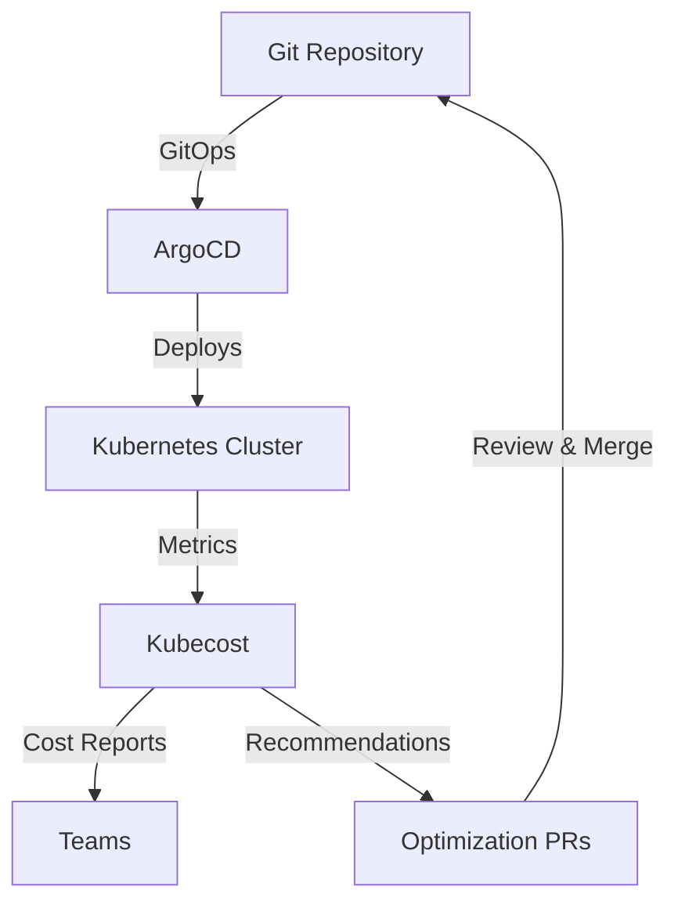

# How to Use Kubecost with ArgoCD for Cost Visibility

Author: [nawazdhandala](https://github.com/nawazdhandala)

Tags: ArgoCD, GitOps, Kubernetes, Kubecost, FinOps

Description: Learn how to integrate Kubecost with ArgoCD for real-time cost visibility, allocation reports, and automated cost optimization recommendations.

---

Kubecost is the leading open-source tool for Kubernetes cost monitoring. It provides real-time cost allocation, savings recommendations, and cost anomaly detection. When combined with ArgoCD, you get a powerful feedback loop: ArgoCD deploys resources through GitOps, and Kubecost measures the cost impact. This guide covers deploying Kubecost with ArgoCD, configuring cost allocation, and building actionable cost workflows.

## Why Kubecost with ArgoCD

Kubecost and ArgoCD complement each other naturally:

- Kubecost measures what resources actually cost
- ArgoCD controls what resources are deployed
- Together, they create a closed-loop cost optimization system



## Deploying Kubecost with ArgoCD

Deploy Kubecost itself through ArgoCD for a fully GitOps-managed cost monitoring stack:

```yaml
# ArgoCD Application for Kubecost
apiVersion: argoproj.io/v1alpha1
kind: Application
metadata:
  name: kubecost
  namespace: argocd
spec:
  project: platform
  source:
    repoURL: https://kubecost.github.io/cost-analyzer/
    chart: cost-analyzer
    targetRevision: 2.1.0
    helm:
      values: |
        # Basic Kubecost configuration
        global:
          prometheus:
            # Use existing Prometheus if available
            fqdn: http://prometheus-server.monitoring.svc.cluster.local
            enabled: false
          grafana:
            enabled: false
            proxy: false

        # Cost allocation settings
        kubecostModel:
          # Enable allocation API
          allocateIdle: true
          # Cloud provider pricing
          cloudCost:
            enabled: true
            # AWS pricing
            provider: aws
            region: us-east-1

        # Savings recommendations
        savings:
          enabled: true

        # Network cost monitoring
        networkCosts:
          enabled: true

        # Labels for ArgoCD applications
        kubecostProductConfigs:
          # Map ArgoCD labels to Kubecost allocation
          labelMappingConfigs:
            enabled: true
            owner_label: "team"
            product_label: "service"
            environment_label: "environment"
            department_label: "business-unit"
  destination:
    server: https://kubernetes.default.svc
    namespace: kubecost
  syncPolicy:
    automated:
      selfHeal: true
      prune: true
    syncOptions:
      - CreateNamespace=true
```

## Configuring Label-Based Cost Allocation

Kubecost allocates costs based on Kubernetes labels. Configure it to use the same labels ArgoCD applies:

```yaml
# Kubecost label mapping configuration
# values.yaml for Kubecost Helm chart
kubecostProductConfigs:
  labelMappingConfigs:
    enabled: true
    # Map these labels to Kubecost allocation dimensions
    owner_label: "team"
    product_label: "service"
    environment_label: "environment"
    department_label: "cost-center"
    # Namespace-based fallback
    namespace_external_label: "team"

  # Configure allocation for shared resources
  sharedCosts:
    # Split shared namespace costs proportionally
    shareNamespaces:
      - kube-system
      - ingress-nginx
      - monitoring
    # Share by weighted allocation
    shareBy: "weighted"
```

ArgoCD applications should use matching labels (as described in the cost allocation labels guide):

```yaml
# ArgoCD Application with Kubecost-compatible labels
apiVersion: argoproj.io/v1alpha1
kind: Application
metadata:
  name: payment-service
  namespace: argocd
spec:
  source:
    path: k8s/production
    kustomize:
      commonLabels:
        team: payments
        service: payment-api
        environment: production
        cost-center: CC-1234
```

## Querying Kubecost API for ArgoCD Applications

Kubecost provides an API for programmatic cost queries. Use it to get costs per ArgoCD application:

```bash
# Get cost allocation for the last 7 days, grouped by ArgoCD application label
curl -s "http://kubecost.kubecost.svc.cluster.local:9090/model/allocation" \
  --data-urlencode 'window=7d' \
  --data-urlencode 'aggregate=label:app.kubernetes.io/instance' \
  --data-urlencode 'idle=true' \
  --data-urlencode 'accumulate=true' | jq '.data[0]'

# Get cost per team
curl -s "http://kubecost.kubecost.svc.cluster.local:9090/model/allocation" \
  --data-urlencode 'window=7d' \
  --data-urlencode 'aggregate=label:team' \
  --data-urlencode 'idle=true' | jq '.data[0]'

# Get savings recommendations
curl -s "http://kubecost.kubecost.svc.cluster.local:9090/model/savings/requestSizing" \
  --data-urlencode 'window=7d' \
  --data-urlencode 'targetCPUUtilization=0.7' \
  --data-urlencode 'targetMemoryUtilization=0.8' | jq '.[] | {container, recommendedRequest, currentRequest, monthlySavings}'
```

## Building a Cost Report Pipeline

Create an automated pipeline that generates cost reports per ArgoCD application:

```python
# kubecost_report.py - Generate cost reports for ArgoCD applications
import requests
import json
from datetime import datetime

KUBECOST_URL = "http://kubecost.kubecost.svc.cluster.local:9090"
ARGOCD_URL = "https://argocd.example.com"

def get_allocation_by_app(window="30d"):
    """Get cost allocation grouped by ArgoCD application."""
    resp = requests.get(
        f"{KUBECOST_URL}/model/allocation",
        params={
            "window": window,
            "aggregate": "label:app.kubernetes.io/instance",
            "idle": "true",
            "accumulate": "true"
        }
    )
    return resp.json()["data"][0]

def get_savings_recommendations():
    """Get right-sizing recommendations."""
    resp = requests.get(
        f"{KUBECOST_URL}/model/savings/requestSizing",
        params={
            "window": "7d",
            "targetCPUUtilization": "0.7",
            "targetMemoryUtilization": "0.8"
        }
    )
    return resp.json()

def generate_report():
    """Generate a comprehensive cost report."""
    allocations = get_allocation_by_app()
    recommendations = get_savings_recommendations()

    report = {
        "generated_at": datetime.utcnow().isoformat(),
        "period": "30 days",
        "applications": [],
        "total_cost": 0,
        "total_potential_savings": 0
    }

    for app_name, data in allocations.items():
        if app_name == "__idle__":
            continue

        app_cost = data.get("totalCost", 0)
        report["total_cost"] += app_cost

        report["applications"].append({
            "name": app_name,
            "total_cost": round(app_cost, 2),
            "cpu_cost": round(data.get("cpuCost", 0), 2),
            "memory_cost": round(data.get("ramCost", 0), 2),
            "storage_cost": round(data.get("pvCost", 0), 2),
            "network_cost": round(data.get("networkCost", 0), 2),
            "cpu_efficiency": round(data.get("cpuEfficiency", 0) * 100, 1),
            "memory_efficiency": round(data.get("ramEfficiency", 0) * 100, 1)
        })

    # Sort by cost descending
    report["applications"].sort(key=lambda x: x["total_cost"], reverse=True)

    return report

if __name__ == "__main__":
    report = generate_report()
    print(json.dumps(report, indent=2))
```

## Creating Kubecost-Informed ArgoCD Dashboards

Build a Grafana dashboard that combines ArgoCD and Kubecost data:

```yaml
# Prometheus recording rules for Kubecost + ArgoCD correlation
apiVersion: monitoring.coreos.com/v1
kind: PrometheusRule
metadata:
  name: kubecost-argocd-rules
  namespace: monitoring
spec:
  groups:
    - name: kubecost-argocd
      rules:
        # Cost per ArgoCD application from Kubecost
        - record: kubecost_argocd_app_monthly_cost
          expr: |
            sum by (label_app_kubernetes_io_instance) (
              kubecost_allocation_cpu_cost_total
              + kubecost_allocation_memory_cost_total
              + kubecost_allocation_pv_cost_total
            ) * 730  # Hours in a month

        # Efficiency per ArgoCD application
        - record: kubecost_argocd_app_cpu_efficiency
          expr: |
            avg by (label_app_kubernetes_io_instance) (
              kubecost_allocation_cpu_usage_average
              / kubecost_allocation_cpu_request_average
            )
```

## Automated Right-Sizing with GitOps

Use Kubecost recommendations to create automated right-sizing PRs:

```bash
#!/bin/bash
# auto-rightsize.sh
# Creates PRs with Kubecost right-sizing recommendations

KUBECOST_URL="http://kubecost.kubecost.svc.cluster.local:9090"

# Get right-sizing recommendations
RECOMMENDATIONS=$(curl -s "$KUBECOST_URL/model/savings/requestSizing" \
  --data-urlencode 'window=14d' \
  --data-urlencode 'targetCPUUtilization=0.7' \
  --data-urlencode 'targetMemoryUtilization=0.8')

echo "$RECOMMENDATIONS" | jq -c '.[]' | while read rec; do
  CONTAINER=$(echo "$rec" | jq -r '.containerName')
  NAMESPACE=$(echo "$rec" | jq -r '.namespace')
  CONTROLLER=$(echo "$rec" | jq -r '.controllerName')
  REC_CPU=$(echo "$rec" | jq -r '.recommendedRequest.cpu')
  REC_MEM=$(echo "$rec" | jq -r '.recommendedRequest.memory')
  SAVINGS=$(echo "$rec" | jq -r '.monthlySavings')

  if (( $(echo "$SAVINGS > 10" | bc -l) )); then
    echo "Potential savings: \$$SAVINGS/month for $NAMESPACE/$CONTROLLER/$CONTAINER"
    echo "  Recommended CPU: ${REC_CPU}m, Memory: ${REC_MEM}Mi"
    # Create a Git branch and PR with the recommendation
    # ... implementation depends on your repo structure ...
  fi
done
```

## Kubecost Alerts for ArgoCD Applications

Configure Kubecost alerts that trigger when application costs exceed thresholds:

```yaml
# Kubecost alert configuration
# values.yaml for Kubecost Helm chart
kubecostProductConfigs:
  alertConfigs:
    enabled: true
    alerts:
      # Alert when any application exceeds $500/month
      - type: budget
        threshold: 500
        window: 30d
        aggregation: "label:app.kubernetes.io/instance"
        slackWebhookUrl: "https://hooks.slack.com/services/xxx"

      # Alert on cost anomalies
      - type: anomaly
        window: 7d
        aggregation: "label:team"
        baselineWindow: 30d
        relativeThreshold: 0.3  # 30% increase
        slackWebhookUrl: "https://hooks.slack.com/services/xxx"

      # Alert on low efficiency
      - type: efficiency
        efficiencyThreshold: 0.3  # Below 30% efficiency
        window: 7d
        aggregation: "label:app.kubernetes.io/instance"
        slackWebhookUrl: "https://hooks.slack.com/services/xxx"
```

## Multi-Cluster Cost Aggregation

If you manage multiple clusters with ArgoCD, configure Kubecost for multi-cluster cost aggregation:

```yaml
# Kubecost primary cluster configuration
kubecostProductConfigs:
  clusterName: "production-us-east"
  # Enable multi-cluster federation
  federatedETL:
    enabled: true
    primary: true
    # S3 bucket for cost data aggregation
    federatedStore:
      type: S3
      bucket: kubecost-federation
      region: us-east-1
```

Deploy Kubecost agents on each cluster through ArgoCD ApplicationSets:

```yaml
# ApplicationSet to deploy Kubecost on all managed clusters
apiVersion: argoproj.io/v1alpha1
kind: ApplicationSet
metadata:
  name: kubecost-agents
  namespace: argocd
spec:
  generators:
    - clusters:
        selector:
          matchLabels:
            kubecost: enabled
  template:
    metadata:
      name: "kubecost-{{name}}"
    spec:
      source:
        repoURL: https://kubecost.github.io/cost-analyzer/
        chart: cost-analyzer
        helm:
          values: |
            kubecostProductConfigs:
              clusterName: "{{name}}"
              federatedETL:
                enabled: true
                primary: false
      destination:
        server: "{{server}}"
        namespace: kubecost
```

## Summary

Kubecost and ArgoCD together create a complete FinOps workflow for Kubernetes. Deploy Kubecost through ArgoCD for GitOps management, configure label-based allocation to match your ArgoCD labeling strategy, use the Kubecost API for automated reporting, and leverage right-sizing recommendations to continuously optimize spending. The key is connecting Kubecost's cost intelligence to ArgoCD's deployment control through automated workflows. For related FinOps topics, see our guides on [implementing cost allocation labels](https://oneuptime.com/blog/post/2026-02-26-argocd-cost-allocation-labels/view) and [resource right-sizing policies](https://oneuptime.com/blog/post/2026-02-26-argocd-resource-right-sizing-policies/view).
