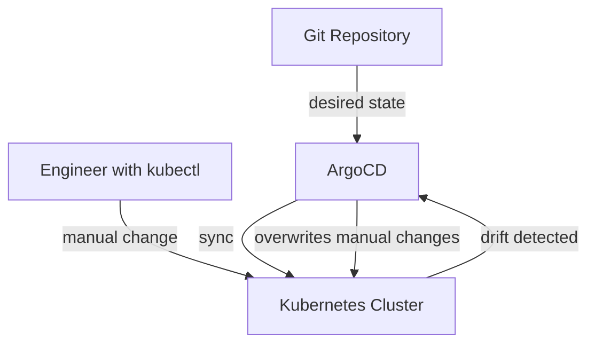
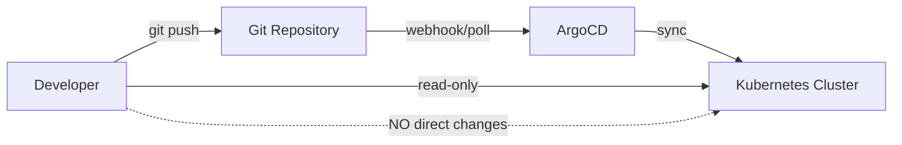

# How to Handle kubectl vs ArgoCD Applying Same Resources

Author: [nawazdhandala](https://github.com/nawazdhandala)

Tags: ArgoCD, GitOps, Kubernetes, kubectl, Troubleshooting

Description: Learn how to handle conflicts when both kubectl and ArgoCD manage the same Kubernetes resources, including drift detection, ownership disputes, and workflow best practices.

---

One of the most common pain points teams face when adopting ArgoCD is the transition period where engineers still use kubectl to make direct changes to resources that ArgoCD also manages. This dual-management scenario creates drift, sync conflicts, and confusion about what the "true" state of a resource is. This guide walks through the problems and solutions.

## The Core Problem

ArgoCD follows the GitOps principle: Git is the source of truth. When ArgoCD sees that the live cluster state differs from what is in Git, it reports the application as OutOfSync and (if auto-sync is enabled) reverts the change.

When someone runs `kubectl apply` or `kubectl edit` on a resource ArgoCD manages, they are creating a competing source of truth. Now the cluster has changes that are not in Git, and ArgoCD will either flag them as drift or overwrite them on the next sync.



## How ArgoCD Detects Drift

ArgoCD continuously compares the live state of resources against the desired state defined in Git. By default, the application controller polls every 3 minutes. When it detects differences, it marks the application as OutOfSync.

The diff engine is sophisticated. It normalizes both the desired and live states before comparison, stripping out default values, server-managed fields, and other noise. But manual kubectl changes show up clearly as unintended drift.

You can see what changed with the ArgoCD CLI.

```bash
# Show the diff between Git and live state
argocd app diff my-app

# Show detailed diff with full resource contents
argocd app diff my-app --local ./manifests/
```

## Scenario 1: Emergency kubectl Changes

Sometimes you need to make an emergency change - a critical hotfix that cannot wait for the Git workflow. Here is how to handle it safely.

### Step 1: Disable Auto-Sync Temporarily

```bash
# Disable auto-sync so ArgoCD does not revert your change
argocd app set my-app --sync-policy none
```

### Step 2: Make the Emergency Change

```bash
# Apply the emergency fix
kubectl set image deployment/my-app app=myimage:hotfix-v1 -n production
```

### Step 3: Immediately Backport to Git

Create a PR with the same change to your Git repository. Once merged, re-enable auto-sync.

```bash
# Re-enable auto-sync after the Git change is merged
argocd app set my-app --sync-policy automated
```

### Step 4: Verify Sync Status

```bash
# Confirm the app is synced after the Git change merges
argocd app get my-app
```

## Scenario 2: Self-Healing Mode

If auto-sync with self-healing is enabled, ArgoCD will automatically revert any kubectl changes within seconds to minutes.

```yaml
apiVersion: argoproj.io/v1alpha1
kind: Application
metadata:
  name: my-app
  namespace: argocd
spec:
  project: default
  source:
    repoURL: https://github.com/org/repo.git
    targetRevision: main
    path: manifests
  destination:
    server: https://kubernetes.default.svc
    namespace: production
  syncPolicy:
    automated:
      # Self-heal means ArgoCD reverts manual changes
      selfHeal: true
      prune: true
```

With self-healing enabled, running `kubectl scale deployment my-app --replicas=5` will be reverted back to whatever replica count is in Git. This is actually the desired behavior in most production environments - it prevents configuration drift.

For more on self-healing, see [ArgoCD self-healing applications](https://oneuptime.com/blog/post/2026-01-25-self-healing-applications-argocd/view).

## Scenario 3: Shared Ownership of Fields

Sometimes you genuinely need both ArgoCD and another controller to manage different parts of the same resource. For example, ArgoCD manages the container spec while an HPA manages replicas.

```yaml
apiVersion: argoproj.io/v1alpha1
kind: Application
metadata:
  name: my-app
  namespace: argocd
spec:
  project: default
  source:
    repoURL: https://github.com/org/repo.git
    targetRevision: main
    path: manifests
  destination:
    server: https://kubernetes.default.svc
    namespace: production
  ignoreDifferences:
    # Let HPA manage replicas
    - group: apps
      kind: Deployment
      jsonPointers:
        - /spec/replicas
    # Let external-dns manage these annotations
    - group: ""
      kind: Service
      jsonPointers:
        - /metadata/annotations/external-dns.alpha.kubernetes.io~1hostname
  syncPolicy:
    syncOptions:
      - RespectIgnoreDifferences=true
```

## Preventing Unauthorized kubectl Changes

The best solution is to prevent direct kubectl changes on ArgoCD-managed resources entirely.

### Use RBAC to Restrict Write Access

```yaml
# Role that only allows read access to ArgoCD-managed namespaces
apiVersion: rbac.authorization.k8s.io/v1
kind: Role
metadata:
  name: viewer
  namespace: production
rules:
  - apiGroups: ["*"]
    resources: ["*"]
    verbs: ["get", "list", "watch"]
  # Allow exec into pods for debugging only
  - apiGroups: [""]
    resources: ["pods/exec", "pods/log"]
    verbs: ["create", "get"]
```

### Use ArgoCD RBAC for Application-Level Control

```csv
# argocd-rbac-cm - restrict who can trigger syncs
p, role:developer, applications, get, */*, allow
p, role:developer, applications, sync, */*, deny
p, role:developer, logs, get, */*, allow
p, role:sre, applications, *, */*, allow
g, dev-team, role:developer
g, sre-team, role:sre
```

### Set Up OPA or Kyverno Policies

Use a policy engine to warn or block changes to ArgoCD-managed resources.

```yaml
# Kyverno policy to warn when modifying ArgoCD-managed resources
apiVersion: kyverno.io/v1
kind: ClusterPolicy
metadata:
  name: warn-argocd-managed
spec:
  validationFailureAction: Audit
  rules:
    - name: check-argocd-labels
      match:
        any:
          - resources:
              kinds:
                - Deployment
                - Service
                - ConfigMap
      preconditions:
        all:
          # Only apply to resources ArgoCD manages
          - key: "{{ request.object.metadata.labels.\"app.kubernetes.io/managed-by\" || '' }}"
            operator: Equals
            value: "argocd"
      validate:
        message: >
          This resource is managed by ArgoCD. Make changes through Git instead.
          Repository: Check the ArgoCD dashboard for the source repo.
        deny:
          conditions:
            all:
              # Block if the user is not the ArgoCD service account
              - key: "{{ request.userInfo.username }}"
                operator: NotEquals
                value: "system:serviceaccount:argocd:argocd-application-controller"
```

## Reconciling After Dual Management

If you have resources that were managed by both kubectl and ArgoCD, here is how to bring them back into a clean state.

### Step 1: Check Current Drift

```bash
# List all applications with drift
argocd app list -o wide | grep OutOfSync

# Get detailed diff for a specific app
argocd app diff my-app
```

### Step 2: Decide Which State Wins

If the live state has important changes that should be preserved, export it and commit to Git.

```bash
# Export the live state of a resource
kubectl get deployment my-app -n production -o yaml > deployment-live.yaml

# Clean up the export (remove runtime fields)
# Remove: status, managedFields, resourceVersion, uid, creationTimestamp
# Keep: spec, metadata.name, metadata.namespace, metadata.labels, metadata.annotations
```

If Git should win, simply sync.

```bash
# Force Git state onto the cluster
argocd app sync my-app --force --prune
```

### Step 3: Clean Up Annotations

Remove the `last-applied-configuration` annotation that kubectl leaves behind.

```bash
kubectl annotate deployment my-app \
  kubectl.kubernetes.io/last-applied-configuration- \
  -n production
```

## Setting Up a Proper Workflow

The long-term solution is establishing a workflow where kubectl is only used for reading and debugging, never for making changes.



Key rules for the team:

1. All changes go through Git pull requests
2. kubectl is for debugging only - `kubectl get`, `kubectl logs`, `kubectl exec`
3. Emergency changes follow the disable-sync, fix, backport, re-enable workflow
4. Self-healing is enabled on all production applications
5. RBAC restricts write access to the ArgoCD service account

## Summary

The conflict between kubectl and ArgoCD boils down to a question of authority. In a GitOps workflow, Git is the authority, and ArgoCD is the enforcer. Allow kubectl for reading and debugging, but route all changes through Git. Use self-healing to automatically revert unauthorized changes, RBAC to restrict direct access, and policy engines to add an extra safety layer. For the transition period, `ignoreDifferences` and careful drift reconciliation help bridge the gap between the old and new workflows.
