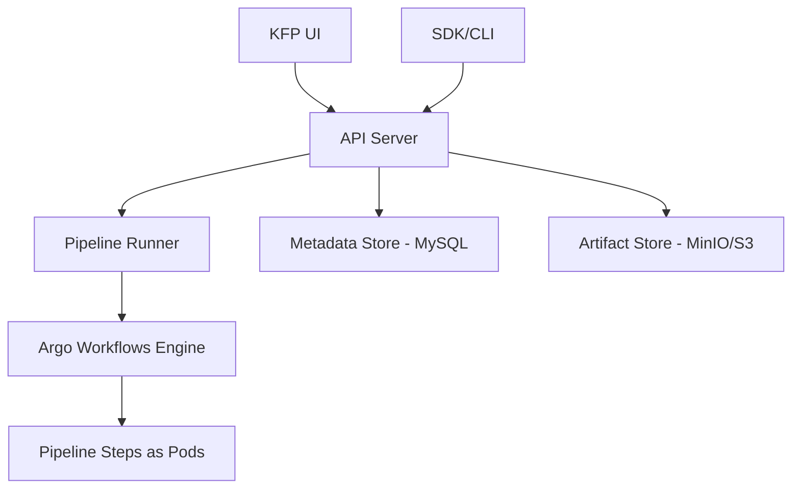

# How to Manage Kubeflow Pipelines with ArgoCD

Author: [nawazdhandala](https://github.com/nawazdhandala)

Tags: ArgoCD, GitOps, Kubernetes, Kubeflow, MLOps

Description: Learn how to deploy and manage Kubeflow Pipelines on Kubernetes using ArgoCD for GitOps-driven ML infrastructure, including pipeline definitions, experiments, and component management.

---

Kubeflow Pipelines is one of the most popular platforms for orchestrating machine learning workflows on Kubernetes. But installing and maintaining Kubeflow has always been painful - it involves dozens of components, CRDs, and configuration files that need to be deployed in the right order. ArgoCD tames this complexity by managing the entire Kubeflow Pipelines stack through GitOps, giving you reproducible installations, easy upgrades, and rollback capability.

This guide covers deploying Kubeflow Pipelines with ArgoCD and managing ML pipeline infrastructure through GitOps.

## Kubeflow Pipelines Architecture

Kubeflow Pipelines consists of several components:



Each of these components needs to be deployed and configured correctly. ArgoCD manages them all through a structured GitOps repository.

## Deploying Kubeflow Pipelines Standalone

If you do not need the full Kubeflow platform, you can deploy just the Pipelines component:

```yaml
# ArgoCD Application for Kubeflow Pipelines
apiVersion: argoproj.io/v1alpha1
kind: Application
metadata:
  name: kubeflow-pipelines
  namespace: argocd
spec:
  project: ml-platform
  source:
    repoURL: https://github.com/myorg/ml-platform-gitops.git
    targetRevision: main
    path: kubeflow-pipelines/base
  destination:
    server: https://kubernetes.default.svc
    namespace: kubeflow
  syncPolicy:
    automated:
      prune: true
      selfHeal: true
    syncOptions:
      - CreateNamespace=true
      - ServerSideApply=true
```

## Organizing the GitOps Repository

Structure your Kubeflow Pipelines manifests with Kustomize:

```text
ml-platform-gitops/
  kubeflow-pipelines/
    base/
      kustomization.yaml
      namespace.yaml
      pipeline-install/         # KFP manifests
        kustomization.yaml
      argo-workflows/           # Workflow engine
        kustomization.yaml
      mysql/                    # Metadata store
        kustomization.yaml
      minio/                    # Artifact store
        kustomization.yaml
    overlays/
      staging/
        kustomization.yaml
        patches/
      production/
        kustomization.yaml
        patches/
```

The base `kustomization.yaml`:

```yaml
# kubeflow-pipelines/base/kustomization.yaml
apiVersion: kustomize.config.k8s.io/v1beta1
kind: Kustomization

namespace: kubeflow

resources:
  - namespace.yaml
  - pipeline-install/
  - argo-workflows/
  - mysql/
  - minio/
```

## Installing Pipeline Dependencies

### MySQL for Metadata Store

```yaml
# kubeflow-pipelines/base/mysql/deployment.yaml
apiVersion: apps/v1
kind: Deployment
metadata:
  name: mysql
  namespace: kubeflow
  annotations:
    argocd.argoproj.io/sync-wave: "0"
spec:
  replicas: 1
  selector:
    matchLabels:
      app: mysql
  template:
    metadata:
      labels:
        app: mysql
    spec:
      containers:
        - name: mysql
          image: mysql:8.0
          ports:
            - containerPort: 3306
          env:
            - name: MYSQL_ROOT_PASSWORD
              valueFrom:
                secretKeyRef:
                  name: mysql-credentials
                  key: root-password
            - name: MYSQL_DATABASE
              value: mlpipeline
          resources:
            requests:
              cpu: 500m
              memory: 1Gi
            limits:
              cpu: "1"
              memory: 2Gi
          volumeMounts:
            - name: mysql-data
              mountPath: /var/lib/mysql
      volumes:
        - name: mysql-data
          persistentVolumeClaim:
            claimName: mysql-pvc
---
apiVersion: v1
kind: Service
metadata:
  name: mysql
  namespace: kubeflow
spec:
  selector:
    app: mysql
  ports:
    - port: 3306
---
apiVersion: v1
kind: PersistentVolumeClaim
metadata:
  name: mysql-pvc
  namespace: kubeflow
spec:
  accessModes:
    - ReadWriteOnce
  resources:
    requests:
      storage: 50Gi
  storageClassName: gp3
```

### MinIO for Artifact Storage

```yaml
# kubeflow-pipelines/base/minio/deployment.yaml
apiVersion: apps/v1
kind: Deployment
metadata:
  name: minio
  namespace: kubeflow
  annotations:
    argocd.argoproj.io/sync-wave: "0"
spec:
  replicas: 1
  selector:
    matchLabels:
      app: minio
  template:
    metadata:
      labels:
        app: minio
    spec:
      containers:
        - name: minio
          image: minio/minio:RELEASE.2024-01-01T00-00-00Z
          args:
            - server
            - /data
            - --console-address
            - ":9001"
          ports:
            - containerPort: 9000
              name: api
            - containerPort: 9001
              name: console
          env:
            - name: MINIO_ROOT_USER
              valueFrom:
                secretKeyRef:
                  name: minio-credentials
                  key: accesskey
            - name: MINIO_ROOT_PASSWORD
              valueFrom:
                secretKeyRef:
                  name: minio-credentials
                  key: secretkey
          resources:
            requests:
              cpu: 250m
              memory: 512Mi
          volumeMounts:
            - name: minio-data
              mountPath: /data
      volumes:
        - name: minio-data
          persistentVolumeClaim:
            claimName: minio-pvc
---
apiVersion: v1
kind: Service
metadata:
  name: minio-service
  namespace: kubeflow
spec:
  selector:
    app: minio
  ports:
    - name: api
      port: 9000
    - name: console
      port: 9001
```

## Installing Argo Workflows Engine

Kubeflow Pipelines uses Argo Workflows as its execution engine:

```yaml
# kubeflow-pipelines/base/argo-workflows/installation.yaml
apiVersion: argoproj.io/v1alpha1
kind: Application
metadata:
  name: argo-workflows
  namespace: argocd
  annotations:
    argocd.argoproj.io/sync-wave: "1"
spec:
  project: ml-platform
  source:
    repoURL: https://argoproj.github.io/argo-helm
    chart: argo-workflows
    targetRevision: 0.40.0
    helm:
      values: |
        controller:
          containerRuntimeExecutor: emissary
          workflowNamespaces:
            - kubeflow
          resources:
            requests:
              cpu: 250m
              memory: 256Mi
        server:
          enabled: false
  destination:
    server: https://kubernetes.default.svc
    namespace: argo
  syncPolicy:
    automated:
      prune: true
      selfHeal: true
    syncOptions:
      - CreateNamespace=true
```

## Installing KFP API Server

```yaml
# kubeflow-pipelines/base/pipeline-install/api-server.yaml
apiVersion: apps/v1
kind: Deployment
metadata:
  name: ml-pipeline
  namespace: kubeflow
  annotations:
    argocd.argoproj.io/sync-wave: "2"
spec:
  replicas: 1
  selector:
    matchLabels:
      app: ml-pipeline
  template:
    metadata:
      labels:
        app: ml-pipeline
    spec:
      serviceAccountName: ml-pipeline
      containers:
        - name: ml-pipeline-api-server
          image: gcr.io/ml-pipeline/api-server:2.0.5
          ports:
            - containerPort: 8888
              name: http
            - containerPort: 8887
              name: grpc
          env:
            - name: DBCONFIG_DBNAME
              value: mlpipeline
            - name: DBCONFIG_USER
              value: root
            - name: DBCONFIG_PASSWORD
              valueFrom:
                secretKeyRef:
                  name: mysql-credentials
                  key: root-password
            - name: DBCONFIG_HOST
              value: mysql.kubeflow.svc
            - name: DBCONFIG_PORT
              value: "3306"
            - name: OBJECTSTORECONFIG_BUCKETNAME
              value: mlpipeline
            - name: OBJECTSTORECONFIG_HOST
              value: minio-service.kubeflow.svc
            - name: OBJECTSTORECONFIG_PORT
              value: "9000"
            - name: OBJECTSTORECONFIG_SECURE
              value: "false"
            - name: OBJECTSTORECONFIG_ACCESSKEY
              valueFrom:
                secretKeyRef:
                  name: minio-credentials
                  key: accesskey
            - name: OBJECTSTORECONFIG_SECRETACCESSKEY
              valueFrom:
                secretKeyRef:
                  name: minio-credentials
                  key: secretkey
          resources:
            requests:
              cpu: 250m
              memory: 512Mi
          readinessProbe:
            httpGet:
              path: /apis/v2beta1/healthz
              port: 8888
            initialDelaySeconds: 10
---
apiVersion: v1
kind: Service
metadata:
  name: ml-pipeline
  namespace: kubeflow
spec:
  selector:
    app: ml-pipeline
  ports:
    - name: http
      port: 8888
    - name: grpc
      port: 8887
```

## KFP UI Dashboard

```yaml
# kubeflow-pipelines/base/pipeline-install/ui.yaml
apiVersion: apps/v1
kind: Deployment
metadata:
  name: ml-pipeline-ui
  namespace: kubeflow
  annotations:
    argocd.argoproj.io/sync-wave: "3"
spec:
  replicas: 1
  selector:
    matchLabels:
      app: ml-pipeline-ui
  template:
    metadata:
      labels:
        app: ml-pipeline-ui
    spec:
      containers:
        - name: ml-pipeline-ui
          image: gcr.io/ml-pipeline/frontend:2.0.5
          ports:
            - containerPort: 3000
          env:
            - name: ML_PIPELINE_SERVICE_HOST
              value: ml-pipeline.kubeflow.svc
            - name: ML_PIPELINE_SERVICE_PORT
              value: "8888"
          resources:
            requests:
              cpu: 100m
              memory: 256Mi
---
apiVersion: v1
kind: Service
metadata:
  name: ml-pipeline-ui
  namespace: kubeflow
spec:
  selector:
    app: ml-pipeline-ui
  ports:
    - port: 3000
---
apiVersion: networking.k8s.io/v1
kind: Ingress
metadata:
  name: ml-pipeline-ui
  namespace: kubeflow
spec:
  ingressClassName: nginx
  rules:
    - host: pipelines.ml.example.com
      http:
        paths:
          - path: /
            pathType: Prefix
            backend:
              service:
                name: ml-pipeline-ui
                port:
                  number: 3000
```

## Environment-Specific Configuration

Use Kustomize overlays for environment-specific settings:

```yaml
# kubeflow-pipelines/overlays/production/kustomization.yaml
apiVersion: kustomize.config.k8s.io/v1beta1
kind: Kustomization

resources:
  - ../../base

patches:
  # Use managed MySQL (Cloud SQL / RDS) in production
  - target:
      kind: Deployment
      name: mysql
    patch: |
      $patch: delete
      apiVersion: apps/v1
      kind: Deployment
      metadata:
        name: mysql

  # Scale API server in production
  - target:
      kind: Deployment
      name: ml-pipeline
    patch: |
      - op: replace
        path: /spec/replicas
        value: 2
      - op: replace
        path: /spec/template/spec/containers/0/env/3/value
        value: "cloud-sql-proxy.kubeflow.svc"

  # Use S3 instead of MinIO in production
  - target:
      kind: Deployment
      name: minio
    patch: |
      $patch: delete
      apiVersion: apps/v1
      kind: Deployment
      metadata:
        name: minio
```

## Managing Pipeline Definitions in Git

Store pipeline definitions alongside your infrastructure. When a data scientist updates a pipeline definition, ArgoCD deploys it:

```yaml
# pipelines/training-pipeline.yaml
apiVersion: v1
kind: ConfigMap
metadata:
  name: training-pipeline-v3
  namespace: kubeflow
  labels:
    pipeline: training
    version: "3"
data:
  pipeline.yaml: |
    # Compiled KFP pipeline YAML
    apiVersion: argoproj.io/v1alpha1
    kind: Workflow
    metadata:
      generateName: training-pipeline-
    spec:
      entrypoint: training-pipeline
      templates:
        - name: training-pipeline
          dag:
            tasks:
              - name: data-preprocessing
                template: preprocess
              - name: model-training
                template: train
                dependencies: [data-preprocessing]
              - name: model-evaluation
                template: evaluate
                dependencies: [model-training]
              - name: model-deployment
                template: deploy
                dependencies: [model-evaluation]
```

## RBAC for Data Scientists

Configure ArgoCD RBAC to let data scientists manage their pipeline resources without full cluster access:

```yaml
# ArgoCD RBAC policy
apiVersion: v1
kind: ConfigMap
metadata:
  name: argocd-rbac-cm
  namespace: argocd
data:
  policy.csv: |
    # Data scientists can view and sync ML pipeline applications
    p, role:data-scientist, applications, get, ml-platform/*, allow
    p, role:data-scientist, applications, sync, ml-platform/*, allow
    p, role:data-scientist, applications, action/*, ml-platform/*, allow
    p, role:data-scientist, logs, get, ml-platform/*, allow

    # Map OIDC groups
    g, data-science-team, role:data-scientist
```

For deploying ML model servers alongside your Kubeflow pipelines, see our guide on [ML model serving with ArgoCD](https://oneuptime.com/blog/post/2026-02-26-argocd-ml-model-serving/view). Use OneUptime to monitor your Kubeflow Pipelines infrastructure, track pipeline execution times, and alert on failures.

## Best Practices

1. **Use sync waves** - Deploy dependencies (MySQL, MinIO) before KFP components.
2. **Separate infrastructure from pipelines** - Keep Kubeflow installation separate from pipeline definitions.
3. **Use managed services in production** - Replace MinIO with S3 and MySQL with Cloud SQL/RDS.
4. **Set resource limits** - Pipeline steps can consume unpredictable resources. Always set limits.
5. **Version pipeline definitions** - Store compiled pipeline YAML in Git with version labels.
6. **Limit namespace access** - Use Kubeflow profiles and ArgoCD RBAC to restrict data scientist access.
7. **Monitor pipeline failures** - Set up alerts for pipeline failures, not just infrastructure failures.
8. **Back up metadata** - The MySQL metadata store contains pipeline run history. Back it up regularly.

ArgoCD brings GitOps discipline to Kubeflow Pipelines, making ML infrastructure as manageable and reproducible as application deployments. Every component is versioned, every change is auditable, and rollbacks are straightforward.
