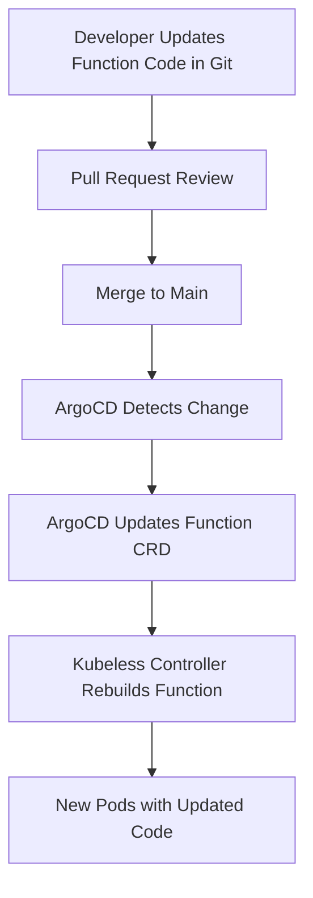

# How to Deploy Kubeless Functions with ArgoCD

Author: [nawazdhandala](https://github.com/nawazdhandala)

Tags: ArgoCD, GitOps, Kubernetes, Kubeless, Serverless

Description: Learn how to deploy and manage Kubeless serverless functions using ArgoCD GitOps workflows including function configuration, triggers, and runtime management.

---

Kubeless is a Kubernetes-native serverless framework that lets you deploy functions without needing to build container images. You write your function code, declare it as a Kubernetes custom resource, and Kubeless handles the runtime. Managing Kubeless through ArgoCD means your functions, triggers, and configurations are all version-controlled and automatically deployed.

While Kubeless is now in maintenance mode, many teams still run it in production. This guide covers managing Kubeless workloads through ArgoCD.

## Installing Kubeless with ArgoCD

Deploy the Kubeless controller and its CRDs through ArgoCD:

```yaml
# kubeless-platform-app.yaml
apiVersion: argoproj.io/v1alpha1
kind: Application
metadata:
  name: kubeless
  namespace: argocd
spec:
  project: serverless
  source:
    repoURL: https://github.com/myorg/k8s-platform.git
    path: kubeless/install
    targetRevision: main
  destination:
    server: https://kubernetes.default.svc
    namespace: kubeless
  syncPolicy:
    automated:
      selfHeal: true
    syncOptions:
      - CreateNamespace=true
      - ServerSideApply=true
```

Store the Kubeless manifests in your Git repository:

```yaml
# kubeless/install/kubeless-controller.yaml
apiVersion: apps/v1
kind: Deployment
metadata:
  name: kubeless-controller-manager
  namespace: kubeless
  labels:
    kubeless: controller
spec:
  selector:
    matchLabels:
      kubeless: controller
  template:
    metadata:
      labels:
        kubeless: controller
    spec:
      containers:
        - name: kubeless-controller-manager
          image: kubeless/function-controller:v1.0.8
          env:
            - name: KUBELESS_NAMESPACE
              valueFrom:
                fieldRef:
                  fieldPath: metadata.namespace
          resources:
            requests:
              cpu: 100m
              memory: 128Mi
      serviceAccountName: controller-acct
```

Configure the available runtimes:

```yaml
# kubeless/install/kubeless-config.yaml
apiVersion: v1
kind: ConfigMap
metadata:
  name: kubeless-config
  namespace: kubeless
data:
  runtime-images: |
    [
      {
        "ID": "python",
        "versions": [
          {
            "name": "python39",
            "version": "3.9",
            "runtimeImage": "kubeless/python:3.9",
            "initImage": "python:3.9"
          }
        ],
        "depName": "requirements.txt",
        "fileNameSuffix": ".py"
      },
      {
        "ID": "nodejs",
        "versions": [
          {
            "name": "node18",
            "version": "18",
            "runtimeImage": "kubeless/nodejs:18",
            "initImage": "node:18"
          }
        ],
        "depName": "package.json",
        "fileNameSuffix": ".js"
      },
      {
        "ID": "go",
        "versions": [
          {
            "name": "go121",
            "version": "1.21",
            "runtimeImage": "kubeless/go:1.21",
            "initImage": "golang:1.21"
          }
        ],
        "depName": "Gopkg.toml",
        "fileNameSuffix": ".go"
      }
    ]
```

## Deploying Functions as CRDs

Kubeless functions are Kubernetes custom resources. The function code is embedded directly in the manifest, which means ArgoCD manages both the function configuration and the code itself.

```yaml
# functions/production/hello-world.yaml
apiVersion: kubeless.io/v1beta1
kind: Function
metadata:
  name: hello-world
  namespace: default
  labels:
    created-by: argocd
    function: hello-world
spec:
  runtime: python3.9
  handler: hello.handler
  function: |
    import json
    import datetime

    def handler(event, context):
        """
        Simple hello world function that returns a greeting
        with the current timestamp.
        """
        body = {
            "message": "Hello from Kubeless!",
            "timestamp": datetime.datetime.utcnow().isoformat(),
            "method": event.get("extensions", {}).get("request", {}).get("method", "unknown")
        }

        return json.dumps(body)
  deps: ""
  timeout: "180"
  deployment:
    spec:
      replicas: 2
      template:
        spec:
          containers:
            - name: ""
              resources:
                requests:
                  cpu: 100m
                  memory: 128Mi
                limits:
                  cpu: 500m
                  memory: 256Mi
```

A more complex function with dependencies:

```yaml
# functions/production/process-webhook.yaml
apiVersion: kubeless.io/v1beta1
kind: Function
metadata:
  name: process-webhook
  namespace: default
  labels:
    function: process-webhook
spec:
  runtime: nodejs18
  handler: webhook.handler
  function: |
    'use strict';

    const crypto = require('crypto');

    module.exports = {
      handler: async (event, context) => {
        const body = JSON.parse(event.data);

        // Validate webhook signature
        const signature = event.extensions.request.headers['x-webhook-signature'];
        const secret = process.env.WEBHOOK_SECRET;

        const hmac = crypto.createHmac('sha256', secret);
        hmac.update(JSON.stringify(body));
        const expectedSignature = hmac.digest('hex');

        if (signature !== expectedSignature) {
          return { statusCode: 401, body: 'Invalid signature' };
        }

        // Process the webhook event
        console.log(`Processing event type: ${body.type}`);

        return {
          statusCode: 200,
          body: JSON.stringify({ processed: true, type: body.type })
        };
      }
    };
  deps: |
    {
      "name": "process-webhook",
      "version": "1.0.0",
      "dependencies": {}
    }
  timeout: "30"
  deployment:
    spec:
      replicas: 3
```

## ArgoCD Application for Functions

Manage all functions through a dedicated Application:

```yaml
# kubeless-functions-app.yaml
apiVersion: argoproj.io/v1alpha1
kind: Application
metadata:
  name: kubeless-functions
  namespace: argocd
spec:
  project: serverless
  source:
    repoURL: https://github.com/myorg/k8s-functions.git
    path: functions/production
    targetRevision: main
  destination:
    server: https://kubernetes.default.svc
    namespace: default
  syncPolicy:
    automated:
      selfHeal: true
      prune: true
```

## Managing HTTP Triggers

Kubeless functions need triggers to be invoked. HTTP triggers create Ingress resources:

```yaml
# functions/production/triggers/hello-trigger.yaml
apiVersion: kubeless.io/v1beta1
kind: HTTPTrigger
metadata:
  name: hello-world-trigger
  namespace: default
spec:
  function-name: hello-world
  host-name: functions.example.com
  path: hello
  gateway: nginx
  basic-auth-secret: ""
  tls: true
  tls-secret: functions-tls
```

## CronJob Triggers

Schedule functions to run on a cron schedule:

```yaml
# functions/production/triggers/cleanup-trigger.yaml
apiVersion: kubeless.io/v1beta1
kind: CronJobTrigger
metadata:
  name: daily-cleanup
  namespace: default
spec:
  function-name: cleanup-old-data
  schedule: "0 2 * * *"  # Run at 2 AM daily
```

## Multi-Environment Management with Kustomize

Organize functions per environment:

```text
functions/
  base/
    hello-world.yaml
    process-webhook.yaml
    kustomization.yaml
  overlays/
    staging/
      kustomization.yaml
      patches/
        replicas.yaml
    production/
      kustomization.yaml
      patches/
        replicas.yaml
        resources.yaml
```

```yaml
# functions/base/kustomization.yaml
apiVersion: kustomize.config.k8s.io/v1beta1
kind: Kustomization
resources:
  - hello-world.yaml
  - process-webhook.yaml
```

```yaml
# functions/overlays/production/kustomization.yaml
apiVersion: kustomize.config.k8s.io/v1beta1
kind: Kustomization
resources:
  - ../../base
patches:
  - path: patches/replicas.yaml
    target:
      kind: Function
```

```yaml
# functions/overlays/production/patches/replicas.yaml
apiVersion: kubeless.io/v1beta1
kind: Function
metadata:
  name: not-used
spec:
  deployment:
    spec:
      replicas: 3
```

## Handling Function Updates

When you update function code in Git, ArgoCD detects the change and syncs. The Kubeless controller then rolls out the updated function. The workflow:



## Monitoring Kubeless Functions

Kubeless exposes metrics through the function proxy. Set up monitoring:

```yaml
# monitoring/kubeless-servicemonitor.yaml
apiVersion: monitoring.coreos.com/v1
kind: ServiceMonitor
metadata:
  name: kubeless-functions
  namespace: monitoring
spec:
  selector:
    matchLabels:
      created-by: kubeless
  namespaceSelector:
    matchNames:
      - default
  endpoints:
    - port: http-function-port
      interval: 30s
      path: /metrics
```

## Migration Considerations

Since Kubeless is in maintenance mode, consider migrating to Knative or OpenFaaS for long-term support. ArgoCD makes this migration easier since you can run both platforms simultaneously and gradually move functions. See our guide on [deploying Knative services with ArgoCD](https://oneuptime.com/blog/post/2026-02-26-argocd-knative-services/view) for the target platform.

## Summary

Kubeless with ArgoCD gives you serverless functions managed through GitOps. Function code, dependencies, triggers, and scaling configuration all live in Git as Kubernetes custom resources. ArgoCD ensures your functions are always in sync with your repository, and every change goes through your standard review process. While Kubeless is in maintenance mode, teams still running it benefit greatly from ArgoCD's declarative management approach.
