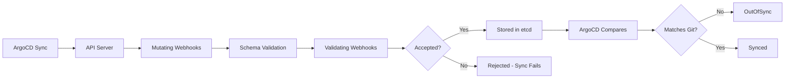

# How to Handle ArgoCD with Kubernetes Admission Webhooks

Author: [nawazdhandala](https://github.com/nawazdhandala)

Tags: ArgoCD, GitOps, Kubernetes, Webhooks, Security

Description: Learn how to configure ArgoCD to work smoothly with Kubernetes admission webhooks, handling conflicts from mutating and validating webhook controllers.

---

Kubernetes admission webhooks are a powerful extension point that can validate and mutate resources before they are persisted. But when you combine them with ArgoCD, you can run into problems. Mutating webhooks change resources after ArgoCD deploys them, causing perpetual OutOfSync states. Validating webhooks can reject ArgoCD sync operations. And webhook failures can block ArgoCD entirely.

Understanding how to make ArgoCD and admission webhooks work together is essential for production GitOps environments.

## How Admission Webhooks Interact with ArgoCD

When ArgoCD syncs an application, it sends resource manifests to the Kubernetes API server. The API server processes these through the admission pipeline.



The two main issues are:
1. **Mutating webhooks** change the resource after ArgoCD creates it, causing the live state to differ from Git
2. **Validating webhooks** reject the resource, causing sync failures

## Handling Mutating Webhooks

Mutating webhooks modify resources, and ArgoCD sees these modifications as drift from the desired state. The most common culprits are:

### Istio Sidecar Injection

Istio injects a sidecar proxy container, init containers, and several annotations into every pod.

```yaml
apiVersion: argoproj.io/v1alpha1
kind: Application
metadata:
  name: my-app
  namespace: argocd
spec:
  ignoreDifferences:
    - group: apps
      kind: Deployment
      jqPathExpressions:
        # Ignore injected sidecar container
        - '.spec.template.spec.containers[] | select(.name == "istio-proxy")'
        # Ignore injected init containers
        - '.spec.template.spec.initContainers[] | select(.name == "istio-init")'
        # Ignore injected volumes
        - '.spec.template.spec.volumes[] | select(.name | startswith("istio"))'
        # Ignore sidecar status annotation
        - .spec.template.metadata.annotations["sidecar.istio.io/status"]
        # Ignore injected labels
        - .spec.template.metadata.labels["security.istio.io/tlsMode"]
        - .spec.template.metadata.labels["service.istio.io/canonical-name"]
        - .spec.template.metadata.labels["service.istio.io/canonical-revision"]
  syncPolicy:
    syncOptions:
      # Do not overwrite ignored fields during sync
      - RespectIgnoreDifferences=true
```

### Vault Agent Injection

HashiCorp Vault's agent injector adds init containers and sidecar containers for secret injection.

```yaml
ignoreDifferences:
  - group: apps
    kind: Deployment
    jqPathExpressions:
      - '.spec.template.spec.containers[] | select(.name == "vault-agent")'
      - '.spec.template.spec.containers[] | select(.name == "vault-agent-init")'
      - '.spec.template.spec.initContainers[] | select(.name == "vault-agent-init")'
      - '.spec.template.spec.volumes[] | select(.name | startswith("vault"))'
      - .spec.template.metadata.annotations["vault.hashicorp.com/agent-inject-status"]
```

### Kyverno Policy Mutations

Kyverno can mutate resources to add labels, annotations, or default values.

```yaml
ignoreDifferences:
  - group: apps
    kind: Deployment
    jqPathExpressions:
      - .metadata.labels["policies.kyverno.io/last-applied"]
      - .metadata.annotations["policies.kyverno.io/last-applied"]
```

### Global Configuration for Common Webhooks

If your cluster has webhooks that affect all applications, configure the ignore rules globally.

```yaml
apiVersion: v1
kind: ConfigMap
metadata:
  name: argocd-cm
  namespace: argocd
data:
  # Global ignore rules for Istio-injected resources
  resource.customizations.ignoreDifferences.apps_Deployment: |
    jqPathExpressions:
      - '.spec.template.spec.containers[] | select(.name == "istio-proxy")'
      - '.spec.template.spec.initContainers[] | select(.name == "istio-init")'
      - '.spec.template.spec.volumes[] | select(.name | startswith("istio"))'
      - .spec.template.metadata.annotations["sidecar.istio.io/status"]
```

## Handling Validating Webhooks

Validating webhooks can reject ArgoCD syncs if the manifests do not meet the webhook's requirements. Common scenarios include:

### OPA Gatekeeper Rejections

```
sync error: admission webhook "validation.gatekeeper.sh" denied the request:
[container-must-have-limits] container "myapp" does not have resource limits
```

The fix is to update your Git manifests to comply with the policy.

```yaml
# Add resource limits to satisfy Gatekeeper policy
containers:
  - name: myapp
    image: myapp:v1.0
    resources:
      limits:
        cpu: 500m
        memory: 256Mi
      requests:
        cpu: 100m
        memory: 128Mi
```

### Kyverno Validation Failures

```
sync error: admission webhook "validate.kyverno.svc" denied the request:
resource Deployment/myapp was blocked due to the following policies:
require-labels: validation error: label 'app.kubernetes.io/name' is required
```

Again, update your manifests to include the required fields.

### Handling Webhook Failures During Sync

If a webhook server is down, it can block all ArgoCD syncs. The webhook's `failurePolicy` determines what happens.

```yaml
apiVersion: admissionregistration.k8s.io/v1
kind: ValidatingWebhookConfiguration
metadata:
  name: my-webhook
webhooks:
  - name: validate.example.com
    # "Fail" blocks operations if webhook is down (safer but can block ArgoCD)
    # "Ignore" allows operations to proceed if webhook is down
    failurePolicy: Fail
    # Add a timeout to prevent long waits
    timeoutSeconds: 10
```

For non-critical webhooks, consider setting `failurePolicy: Ignore` so that ArgoCD can continue syncing even if the webhook is unavailable.

## Excluding ArgoCD Resources from Webhooks

You may want to exclude the ArgoCD namespace from certain webhooks to prevent them from interfering with ArgoCD's own operations.

```yaml
apiVersion: admissionregistration.k8s.io/v1
kind: MutatingWebhookConfiguration
metadata:
  name: istio-sidecar-injector
webhooks:
  - name: sidecar-injector.istio.io
    namespaceSelector:
      matchExpressions:
        # Exclude the argocd namespace
        - key: kubernetes.io/metadata.name
          operator: NotIn
          values:
            - argocd
```

## Using Server-Side Diff to Handle Mutations

Server-side diff (available in ArgoCD v2.5+) significantly reduces false OutOfSync detections caused by webhooks. Enable it globally or per-application.

```yaml
# Enable globally
apiVersion: v1
kind: ConfigMap
metadata:
  name: argocd-cmd-params-cm
  namespace: argocd
data:
  controller.diff.server.side: "true"
```

Server-side diff asks the Kubernetes API server to compute the diff, which means it understands that mutating webhook additions are not drift from the original manifest.

## Ordering Webhook Installation with ArgoCD

If you use ArgoCD to deploy the webhook configurations themselves, use sync waves to ensure the webhook server is running before the webhook configuration is created.

```yaml
# Deploy the webhook server first (sync wave 0)
apiVersion: apps/v1
kind: Deployment
metadata:
  name: webhook-server
  annotations:
    argocd.argoproj.io/sync-wave: "0"
---
# Create the webhook configuration after the server is ready (sync wave 1)
apiVersion: admissionregistration.k8s.io/v1
kind: ValidatingWebhookConfiguration
metadata:
  name: my-webhook
  annotations:
    argocd.argoproj.io/sync-wave: "1"
```

If the webhook configuration is created before the server is running, all subsequent resource operations will fail (if `failurePolicy: Fail` is set).

## Debugging Webhook Issues

When ArgoCD syncs fail due to webhooks, use these debugging steps.

```bash
# Check the sync error in ArgoCD
argocd app get my-app

# Check webhook configurations
kubectl get validatingwebhookconfigurations
kubectl get mutatingwebhookconfigurations

# Check if the webhook server is running
kubectl get pods -l app=webhook-server -A

# Test a resource against the webhook manually
kubectl apply --dry-run=server -f manifest.yaml
```

The `--dry-run=server` flag sends the request through the full admission pipeline including webhooks, which helps you test whether a manifest will be accepted.

## Monitoring Webhook Health

Webhook failures can silently block ArgoCD deployments. Set up monitoring on both the webhook server availability and ArgoCD sync status. [OneUptime](https://oneuptime.com) can monitor your webhook endpoints and ArgoCD health, alerting you when webhook issues start affecting deployments.

Admission webhooks and ArgoCD can work together smoothly once you understand the interaction patterns. The key practices are: use `ignoreDifferences` for mutating webhook fields, ensure manifests comply with validating webhook policies, use server-side diff to reduce false positives, and monitor webhook health to catch failures early.
