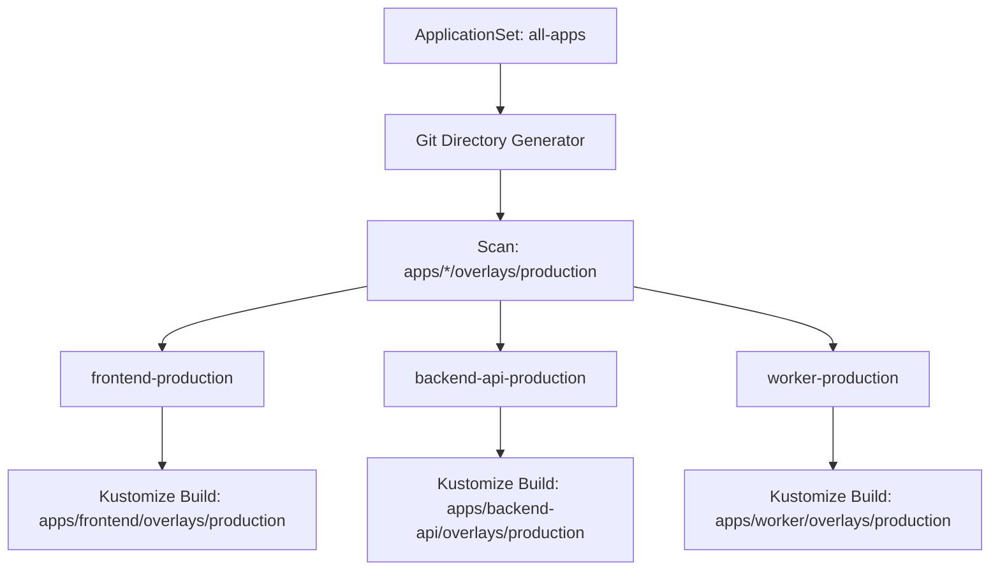

# How to Use Kustomize with ArgoCD ApplicationSets

Author: [nawazdhandala](https://github.com/nawazdhandala)

Tags: ArgoCD, GitOps, Kubernetes, Kustomize, ApplicationSet

Description: Learn how to combine Kustomize with ArgoCD ApplicationSets to automatically generate applications from Git directory structures, cluster lists.

---

ApplicationSets are ArgoCD's answer to "I need to deploy the same thing to 50 places and I do not want to write 50 Application manifests." When combined with Kustomize overlays, ApplicationSets can automatically discover your overlay directories, generate an ArgoCD Application for each one, and deploy them with Kustomize-specific overrides. Add a new overlay directory to Git and ArgoCD picks it up automatically.

This guide covers the most useful ApplicationSet generators for Kustomize workflows, from Git directory discovery to matrix combinations for multi-cluster deployments.

## Git Directory Generator

The Git directory generator scans a repository for directories matching a pattern and creates an Application for each one:

```yaml
apiVersion: argoproj.io/v1alpha1
kind: ApplicationSet
metadata:
  name: my-api-environments
  namespace: argocd
spec:
  generators:
    - git:
        repoURL: https://github.com/myorg/k8s-configs.git
        revision: main
        directories:
          - path: "apps/my-api/overlays/*"
  template:
    metadata:
      name: "my-api-{{path.basename}}"
    spec:
      project: default
      source:
        repoURL: https://github.com/myorg/k8s-configs.git
        targetRevision: main
        path: "{{path}}"
      destination:
        server: https://kubernetes.default.svc
        namespace: "{{path.basename}}"
      syncPolicy:
        automated:
          prune: true
          selfHeal: true
        syncOptions:
          - CreateNamespace=true
```

If your repository has:

```
apps/my-api/overlays/
  dev/
  staging/
  production/
```

The ApplicationSet creates three Applications:
- `my-api-dev` deploying from `apps/my-api/overlays/dev`
- `my-api-staging` deploying from `apps/my-api/overlays/staging`
- `my-api-production` deploying from `apps/my-api/overlays/production`

Add a new overlay directory and push to Git - a new Application appears automatically.

## Multi-Application Discovery

Discover all applications across all environments:

```yaml
apiVersion: argoproj.io/v1alpha1
kind: ApplicationSet
metadata:
  name: all-apps
  namespace: argocd
spec:
  generators:
    - git:
        repoURL: https://github.com/myorg/k8s-configs.git
        revision: main
        directories:
          # Match all production overlays
          - path: "apps/*/overlays/production"
          # Exclude specific apps
          - path: "apps/deprecated-*"
            exclude: true
  template:
    metadata:
      # path[1] is the app name (e.g., "frontend" from "apps/frontend/overlays/production")
      name: "{{path[1]}}-production"
    spec:
      project: production
      source:
        repoURL: https://github.com/myorg/k8s-configs.git
        targetRevision: main
        path: "{{path}}"
      destination:
        server: https://kubernetes.default.svc
        namespace: production
```



## Adding Kustomize Overrides

ApplicationSets can pass Kustomize-specific overrides in the template:

```yaml
apiVersion: argoproj.io/v1alpha1
kind: ApplicationSet
metadata:
  name: my-api-environments
  namespace: argocd
spec:
  generators:
    - list:
        elements:
          - env: dev
            namespace: dev
            imageTag: develop
            replicas: "1"
          - env: staging
            namespace: staging
            imageTag: "2.0.0-rc1"
            replicas: "2"
          - env: production
            namespace: production
            imageTag: "1.9.0"
            replicas: "3"
  template:
    metadata:
      name: "my-api-{{env}}"
    spec:
      source:
        repoURL: https://github.com/myorg/k8s-configs.git
        targetRevision: main
        path: "apps/my-api/overlays/{{env}}"
        kustomize:
          images:
            - "myorg/my-api:{{imageTag}}"
          commonLabels:
            environment: "{{env}}"
          commonAnnotations:
            deploy.myorg.com/replicas: "{{replicas}}"
      destination:
        server: https://kubernetes.default.svc
        namespace: "{{namespace}}"
```

## Cluster Generator with Kustomize

Deploy to multiple clusters with cluster-specific Kustomize overrides:

```yaml
apiVersion: argoproj.io/v1alpha1
kind: ApplicationSet
metadata:
  name: platform-services
  namespace: argocd
spec:
  generators:
    - clusters:
        selector:
          matchLabels:
            environment: production
  template:
    metadata:
      name: "platform-{{name}}"
    spec:
      source:
        repoURL: https://github.com/myorg/k8s-configs.git
        targetRevision: main
        path: infrastructure/platform/overlays/production
        kustomize:
          namePrefix: "{{name}}-"
          commonLabels:
            cluster: "{{name}}"
          commonAnnotations:
            cluster-url: "{{server}}"
      destination:
        server: "{{server}}"
        namespace: platform
```

## Matrix Generator

The matrix generator combines two generators to create applications for every combination. Deploy every app to every cluster:

```yaml
apiVersion: argoproj.io/v1alpha1
kind: ApplicationSet
metadata:
  name: all-apps-all-clusters
  namespace: argocd
spec:
  generators:
    - matrix:
        generators:
          # First generator: list of apps
          - git:
              repoURL: https://github.com/myorg/k8s-configs.git
              revision: main
              directories:
                - path: "apps/*/overlays/production"
          # Second generator: list of clusters
          - clusters:
              selector:
                matchLabels:
                  environment: production
  template:
    metadata:
      name: "{{path[1]}}-{{name}}"
    spec:
      source:
        repoURL: https://github.com/myorg/k8s-configs.git
        targetRevision: main
        path: "{{path}}"
        kustomize:
          commonLabels:
            cluster: "{{name}}"
      destination:
        server: "{{server}}"
        namespace: production
```

If you have 5 apps and 3 clusters, this creates 15 Applications.

## Git File Generator with Kustomize Config

Read configuration from JSON or YAML files in Git:

```yaml
apiVersion: argoproj.io/v1alpha1
kind: ApplicationSet
metadata:
  name: configured-apps
  namespace: argocd
spec:
  generators:
    - git:
        repoURL: https://github.com/myorg/k8s-configs.git
        revision: main
        files:
          - path: "apps/*/config.json"
  template:
    metadata:
      name: "{{app.name}}-{{app.environment}}"
    spec:
      source:
        repoURL: https://github.com/myorg/k8s-configs.git
        targetRevision: main
        path: "{{app.kustomizePath}}"
        kustomize:
          images:
            - "{{app.image}}:{{app.tag}}"
          namePrefix: "{{app.prefix}}"
      destination:
        server: "{{app.cluster}}"
        namespace: "{{app.namespace}}"
```

The config files:

```json
{
  "app": {
    "name": "frontend",
    "environment": "production",
    "kustomizePath": "apps/frontend/overlays/production",
    "image": "myorg/frontend",
    "tag": "2.1.0",
    "prefix": "",
    "cluster": "https://kubernetes.default.svc",
    "namespace": "production"
  }
}
```

## Sync Policy Per Environment

Use different sync policies based on the environment:

```yaml
apiVersion: argoproj.io/v1alpha1
kind: ApplicationSet
metadata:
  name: my-api-environments
  namespace: argocd
spec:
  generators:
    - list:
        elements:
          - env: dev
            autoSync: "true"
            prune: "true"
          - env: production
            autoSync: "false"
            prune: "false"
  template:
    metadata:
      name: "my-api-{{env}}"
    spec:
      source:
        path: "apps/my-api/overlays/{{env}}"
      # Note: syncPolicy cannot be conditionally set in templates
      # Use ArgoCD Projects to enforce sync policies instead
```

For production environments where you want manual sync, use ArgoCD Projects with sync windows instead of trying to template the sync policy.

## Handling ApplicationSet Updates

When an ApplicationSet is updated, it reconciles all generated Applications:

```bash
# Check the status of all generated applications
argocd appset get my-api-environments

# List all applications generated by the set
argocd app list -l app.kubernetes.io/instance=my-api-environments
```

## Troubleshooting

**Applications not being created**: Check that the directory pattern matches your repository structure:

```bash
# Verify the directory structure
git ls-tree -r --name-only main | grep "overlays"
```

**Template rendering errors**: Check the ApplicationSet controller logs:

```bash
kubectl logs -n argocd deploy/argocd-applicationset-controller
```

**Kustomize overrides not applying**: Verify the `kustomize` section in the template is correctly formatted. Test by creating a manual Application with the same settings.

For more on structuring repos for ArgoCD, see our [Kustomize repo structure guide](https://oneuptime.com/blog/post/2026-02-26-argocd-kustomize-repo-structure/view).
