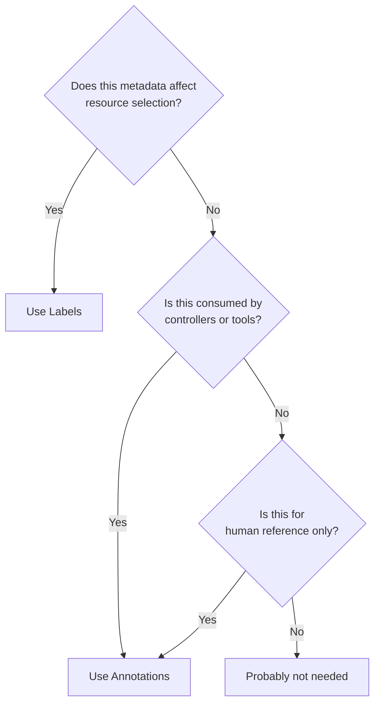

# How to Override Kustomize Common Annotations in ArgoCD

Author: [nawazdhandala](https://github.com/nawazdhandala)

Tags: ArgoCD, GitOps, Kubernetes, Kustomize

Description: Learn how to use Kustomize commonAnnotations overrides in ArgoCD to apply consistent annotations across all resources for metadata tracking, tooling integration, and compliance.

---

Annotations in Kubernetes carry metadata that does not affect resource identity or selection but is consumed by tools, controllers, and humans. Things like deployment timestamps, Git commit SHAs, monitoring configurations, and compliance tags live in annotations. Kustomize's `commonAnnotations` transformer applies annotations to every resource in one shot, and ArgoCD lets you inject additional annotations from the Application spec.

Unlike labels, annotations do not affect selectors, so they can be changed freely without breaking Deployments. This makes them safer to use for dynamic metadata.

## How commonAnnotations Work

Kustomize adds annotations to two places:

1. `metadata.annotations` on every resource
2. `spec.template.metadata.annotations` on Pod-containing resources (Deployments, StatefulSets, DaemonSets, Jobs)

```yaml
# overlays/production/kustomization.yaml
apiVersion: kustomize.config.k8s.io/v1beta1
kind: Kustomization

resources:
  - ../../base

commonAnnotations:
  app.myorg.com/owner: platform-team
  app.myorg.com/oncall: "#platform-oncall"
  app.myorg.com/runbook: "https://runbooks.myorg.com/api-server"
```

This applies to every resource: Deployments, Services, ConfigMaps, Secrets, Ingress, and everything else.

## Setting commonAnnotations in the ArgoCD Application Spec

ArgoCD supports annotation overrides directly in the Application:

```yaml
apiVersion: argoproj.io/v1alpha1
kind: Application
metadata:
  name: my-api
  namespace: argocd
spec:
  project: default
  source:
    repoURL: https://github.com/myorg/k8s-configs.git
    targetRevision: main
    path: apps/my-api/overlays/production
    kustomize:
      commonAnnotations:
        deploy.myorg.com/managed-by: argocd
        deploy.myorg.com/environment: production
        deploy.myorg.com/cluster: prod-us-east-1
  destination:
    server: https://kubernetes.default.svc
    namespace: production
```

Using the CLI:

```bash
# Set annotations via ArgoCD CLI
argocd app set my-api \
  --kustomize-common-annotation deploy.myorg.com/environment=production \
  --kustomize-common-annotation deploy.myorg.com/cluster=prod-us-east-1
```

## Practical Use Cases

### Git Metadata Tracking

Track which commit and branch produced the deployment:

```yaml
commonAnnotations:
  git.myorg.com/commit: "a1b2c3d4"
  git.myorg.com/branch: "main"
  git.myorg.com/repo: "myorg/k8s-configs"
```

In a CI pipeline, set these dynamically:

```bash
#!/bin/bash
# set-git-annotations.sh
COMMIT=$(git rev-parse --short HEAD)
BRANCH=$(git rev-parse --abbrev-ref HEAD)

argocd app set my-api \
  --kustomize-common-annotation "git.myorg.com/commit=${COMMIT}" \
  --kustomize-common-annotation "git.myorg.com/branch=${BRANCH}"
```

### Monitoring and Alerting Configuration

Configure Prometheus scraping and Datadog integrations:

```yaml
commonAnnotations:
  prometheus.io/scrape: "true"
  prometheus.io/port: "8080"
  prometheus.io/path: "/metrics"
  ad.datadoghq.com/tags: '{"team":"platform","service":"api-server"}'
```

Note: Prometheus annotations on Pod templates specifically drive service discovery. When applied through commonAnnotations, they appear on both the Deployment and the Pod template, which is exactly what Prometheus expects.

### Compliance and Audit Tags

Mark resources with compliance metadata:

```yaml
commonAnnotations:
  compliance.myorg.com/classification: internal
  compliance.myorg.com/data-sensitivity: high
  compliance.myorg.com/last-review: "2026-02-26"
  compliance.myorg.com/reviewer: "security-team"
```

### Ingress Controller Configuration

Annotations drive Ingress controller behavior. While these are typically set on the Ingress resource directly, commonAnnotations apply them everywhere:

```yaml
# Be careful - Ingress-specific annotations should go on the Ingress only
# Use patches instead of commonAnnotations for resource-specific annotations
```

For Ingress-specific annotations, use a patch instead:

```yaml
# overlays/production/ingress-patch.yaml
apiVersion: networking.k8s.io/v1
kind: Ingress
metadata:
  name: my-api
  annotations:
    nginx.ingress.kubernetes.io/ssl-redirect: "true"
    nginx.ingress.kubernetes.io/rate-limit: "100"
    cert-manager.io/cluster-issuer: letsencrypt-prod
```

## Pod Template Annotations

When commonAnnotations adds an annotation to `spec.template.metadata.annotations`, changing that annotation triggers a Pod rollout. This is because Kubernetes treats template annotation changes as a spec change.

This is useful for forcing rollouts:

```yaml
commonAnnotations:
  deploy.myorg.com/restart-trigger: "2026-02-26-hotfix-1"
```

Change the value to trigger a rolling restart of all Pods without changing the container image or config.

## Annotations vs Labels Decision Matrix



Guidelines:
- **Labels**: service selectors, network policies, pod affinity, monitoring targets
- **Annotations**: Git metadata, configuration for controllers, documentation links, compliance tags

## Combining with kustomization.yaml Annotations

When both the kustomization.yaml and the ArgoCD Application spec set commonAnnotations, they merge:

```yaml
# kustomization.yaml
commonAnnotations:
  team: platform
  tier: backend

# ArgoCD Application spec
kustomize:
  commonAnnotations:
    environment: production
    cluster: prod-1
```

The result includes all four annotations. If the same key appears in both, the ArgoCD spec value wins.

## ArgoCD-Managed Annotations

ArgoCD adds its own annotations to managed resources:

```yaml
annotations:
  # Added by ArgoCD for tracking
  kubectl.kubernetes.io/last-applied-configuration: "..."
```

Do not override ArgoCD's tracking annotations through commonAnnotations.

## Selective Annotation Application

If you need annotations only on specific resources (not all of them), do not use commonAnnotations. Use patches instead:

```yaml
# overlays/production/kustomization.yaml
patches:
  - target:
      kind: Deployment
    patch: |
      - op: add
        path: /metadata/annotations/deploy.myorg.com~1canary
        value: "true"
```

This adds the annotation only to Deployments, not to Services, ConfigMaps, or other resources.

## Verifying Annotations

Check annotation propagation:

```bash
# View all annotations on a resource
kubectl get deployment my-api -n production -o jsonpath='{.metadata.annotations}' | jq .

# Check pod template annotations
kubectl get deployment my-api -n production \
  -o jsonpath='{.spec.template.metadata.annotations}' | jq .

# View through ArgoCD
argocd app manifests my-api --source git | grep "annotations:" -A 10
```

For more on managing labels and annotations in Kustomize, see our [commonLabels and commonAnnotations guide](https://oneuptime.com/blog/post/2026-02-09-kustomize-commonlabels-annotations/view).
