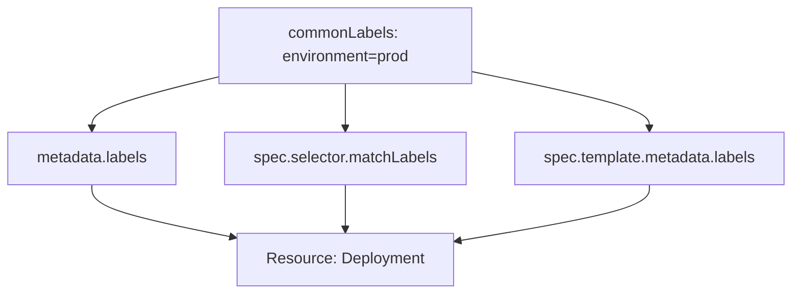

# How to Override Kustomize Common Labels in ArgoCD

Author: [nawazdhandala](https://github.com/nawazdhandala)

Tags: ArgoCD, GitOps, Kubernetes, Kustomize

Description: Learn how to use Kustomize commonLabels overrides in ArgoCD to apply consistent labels across all resources for service discovery, cost tracking, and organizational standards.

---

Labels in Kubernetes are not optional extras - they drive service selectors, network policies, monitoring targets, and cost allocation reports. When every resource in an application needs the same set of labels, Kustomize's `commonLabels` transformer applies them in one place instead of editing every manifest. ArgoCD extends this with the ability to inject labels from the Application spec, giving you an additional override layer.

This guide covers how commonLabels work with ArgoCD, the important differences between `commonLabels` and `labels`, selector implications, and patterns for production use.

## How commonLabels Work

Kustomize's `commonLabels` adds labels to three places on every resource:

1. `metadata.labels` - the resource's own labels
2. `spec.selector.matchLabels` - for Deployments, StatefulSets, DaemonSets, Jobs
3. `spec.template.metadata.labels` - for Pod template labels

This is powerful but has a critical implication: once a Deployment's `spec.selector.matchLabels` is set, it cannot be changed without recreating the Deployment. This makes commonLabels a "set once" decision for label keys used in selectors.



## Setting commonLabels in kustomization.yaml

Add labels in your overlay:

```yaml
# overlays/production/kustomization.yaml
apiVersion: kustomize.config.k8s.io/v1beta1
kind: Kustomization

resources:
  - ../../base

namespace: production

commonLabels:
  app.kubernetes.io/managed-by: argocd
  environment: production
  team: platform
  cost-center: engineering-123
```

## Setting commonLabels in the ArgoCD Application Spec

ArgoCD lets you set commonLabels directly in the Application resource:

```yaml
apiVersion: argoproj.io/v1alpha1
kind: Application
metadata:
  name: my-api
  namespace: argocd
spec:
  project: default
  source:
    repoURL: https://github.com/myorg/k8s-configs.git
    targetRevision: main
    path: apps/my-api/base
    kustomize:
      commonLabels:
        environment: production
        team: platform
        cost-center: engineering-123
  destination:
    server: https://kubernetes.default.svc
    namespace: production
```

Using the CLI:

```bash
# Set common labels via CLI
argocd app set my-api \
  --kustomize-common-label environment=production \
  --kustomize-common-label team=platform
```

## The Selector Problem

The most common mistake with commonLabels is changing them after initial deployment. Consider this scenario:

```yaml
# Initial deployment
commonLabels:
  version: v1

# Later you change to
commonLabels:
  version: v2
```

This fails because the Deployment's `spec.selector.matchLabels` changes from `version: v1` to `version: v2`, and Kubernetes does not allow selector changes on existing Deployments. You get an error:

```text
The Deployment "my-api" is invalid: spec.selector:
Invalid value: ... field is immutable
```

## Using labels Instead of commonLabels

Kustomize (v4.1.0+) offers the `labels` transformer that gives you more control over where labels are applied:

```yaml
# overlays/production/kustomization.yaml
apiVersion: kustomize.config.k8s.io/v1beta1
kind: Kustomization

resources:
  - ../../base

# Use 'labels' instead of 'commonLabels' for flexible label application
labels:
  - pairs:
      environment: production
      team: platform
    includeSelectors: false  # Do NOT add to selectors
    includeTemplates: true   # Add to pod template labels
```

With `includeSelectors: false`, these labels go on `metadata.labels` and `spec.template.metadata.labels` but NOT on `spec.selector.matchLabels`. This means you can change them later without breaking Deployments.

ArgoCD's `kustomize.commonLabels` in the Application spec always behaves like the old `commonLabels` (includes selectors). If you need the finer control of the `labels` transformer, put it in the kustomization.yaml file.

## Practical Patterns

### Cost Allocation Labels

Track cloud costs by team, project, and environment:

```yaml
commonLabels:
  cost-center: engineering-platform
  project: api-gateway
  environment: production
```

These labels propagate to Pods, which cloud cost management tools (like Kubecost) use to attribute compute costs.

### Service Discovery Labels

Prometheus uses labels to discover scrape targets:

```yaml
commonLabels:
  app.kubernetes.io/name: my-api
  app.kubernetes.io/component: backend
  prometheus.io/scrape: "true"
```

### Organizational Standards

Enforce company-wide labeling requirements:

```yaml
commonLabels:
  org.mycompany/team: platform-engineering
  org.mycompany/tier: tier-1
  org.mycompany/compliance: soc2
```

## Using with ApplicationSets

Apply different labels per cluster or environment using ApplicationSets:

```yaml
apiVersion: argoproj.io/v1alpha1
kind: ApplicationSet
metadata:
  name: my-api-environments
  namespace: argocd
spec:
  generators:
    - list:
        elements:
          - env: dev
            cluster: https://dev-cluster.example.com
            team: dev-team
          - env: staging
            cluster: https://staging-cluster.example.com
            team: qa-team
          - env: production
            cluster: https://prod-cluster.example.com
            team: platform
  template:
    metadata:
      name: "my-api-{{env}}"
    spec:
      source:
        repoURL: https://github.com/myorg/k8s-configs.git
        path: apps/my-api/overlays/{{env}}
        kustomize:
          commonLabels:
            environment: "{{env}}"
            managed-by: argocd
            team: "{{team}}"
      destination:
        server: "{{cluster}}"
        namespace: "{{env}}"
```

## Labels ArgoCD Adds Automatically

ArgoCD automatically adds its own labels to managed resources:

```yaml
labels:
  app.kubernetes.io/instance: my-api  # Application name
```

This label is used by ArgoCD to track which resources belong to which Application. Do not override it with commonLabels.

## Precedence Rules

When commonLabels are set in both the kustomization.yaml and the ArgoCD Application spec:

1. Labels from kustomization.yaml are applied first
2. Labels from the ArgoCD Application spec override any with the same key
3. ArgoCD's built-in tracking label (`app.kubernetes.io/instance`) is always added

```yaml
# kustomization.yaml: commonLabels: {env: from-file, team: alpha}
# ArgoCD spec: commonLabels: {env: from-argocd, cost: 123}
# Result: {env: from-argocd, team: alpha, cost: 123}
```

## Verifying Labels

Check that labels are applied correctly:

```bash
# View labels on all resources in an application
argocd app resources my-api --output wide

# Check labels on a specific resource
kubectl get deployment my-api -n production --show-labels

# Filter resources by label
kubectl get all -n production -l environment=production
```

For more on Kustomize label management, see our [commonLabels and commonAnnotations guide](https://oneuptime.com/blog/post/2026-02-09-kustomize-commonlabels-annotations/view).
