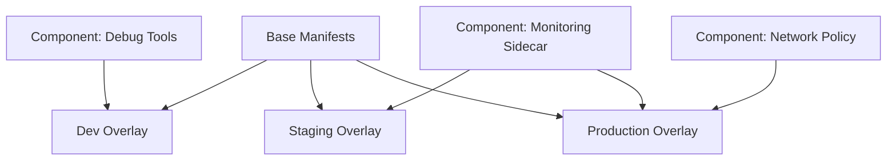

# How to Use Kustomize Components with ArgoCD

Author: [nawazdhandala](https://github.com/nawazdhandala)

Tags: ArgoCD, GitOps, Kubernetes, Kustomize

Description: Learn how to use Kustomize components with ArgoCD to create reusable, composable configuration modules that can be mixed and matched across different application overlays.

---

Kustomize overlays solve the multi-environment problem, but they create a new one: what if you need to add the same sidecar, the same monitoring config, or the same security policy to some overlays but not others? Copy-pasting patches across overlays defeats the purpose of Kustomize. Components solve this by providing reusable configuration fragments that any overlay can opt into.

ArgoCD deploys Kustomize components transparently since they are part of the `kustomize build` output. This guide covers creating components, wiring them into overlays, and deploying through ArgoCD.

## What Are Components

A Kustomize component is like an overlay, but instead of building on a base, it provides a set of patches and resources that can be composed into any overlay. Think of them as plugins: you include the ones you need, skip the ones you do not.



Components use `kind: Component` in their kustomization file:

```yaml
# components/monitoring-sidecar/kustomization.yaml
apiVersion: kustomize.config.k8s.io/v1alpha1
kind: Component

# Patches to inject the sidecar into any deployment
patches:
  - path: sidecar-patch.yaml
    target:
      kind: Deployment

# Additional resources the sidecar needs
resources:
  - service-monitor.yaml
```

## Creating a Monitoring Sidecar Component

This component adds a Prometheus exporter sidecar to every Deployment:

```yaml
# components/monitoring-sidecar/kustomization.yaml
apiVersion: kustomize.config.k8s.io/v1alpha1
kind: Component

patches:
  - path: sidecar-patch.yaml
    target:
      kind: Deployment
```

```yaml
# components/monitoring-sidecar/sidecar-patch.yaml
apiVersion: apps/v1
kind: Deployment
metadata:
  name: not-important  # Targets all Deployments via kustomization target
spec:
  template:
    metadata:
      annotations:
        prometheus.io/scrape: "true"
        prometheus.io/port: "9090"
    spec:
      containers:
        - name: metrics-exporter
          image: prom/statsd-exporter:v0.26.0
          ports:
            - containerPort: 9090
              name: metrics
          resources:
            requests:
              cpu: 10m
              memory: 32Mi
            limits:
              cpu: 50m
              memory: 64Mi
```

## Creating a Network Policy Component

This component adds a default-deny network policy and allows only required traffic:

```yaml
# components/network-policy/kustomization.yaml
apiVersion: kustomize.config.k8s.io/v1alpha1
kind: Component

resources:
  - default-deny.yaml
  - allow-ingress.yaml
```

```yaml
# components/network-policy/default-deny.yaml
apiVersion: networking.k8s.io/v1
kind: NetworkPolicy
metadata:
  name: default-deny-all
spec:
  podSelector: {}
  policyTypes:
    - Ingress
    - Egress
```

```yaml
# components/network-policy/allow-ingress.yaml
apiVersion: networking.k8s.io/v1
kind: NetworkPolicy
metadata:
  name: allow-ingress
spec:
  podSelector:
    matchLabels:
      app.kubernetes.io/name: my-api
  ingress:
    - from:
        - namespaceSelector:
            matchLabels:
              kubernetes.io/metadata.name: ingress-nginx
      ports:
        - port: 8080
  policyTypes:
    - Ingress
```

## Creating a Debug Tools Component

A component that adds debug containers for development environments:

```yaml
# components/debug-tools/kustomization.yaml
apiVersion: kustomize.config.k8s.io/v1alpha1
kind: Component

patches:
  - path: debug-patch.yaml
    target:
      kind: Deployment
```

```yaml
# components/debug-tools/debug-patch.yaml
apiVersion: apps/v1
kind: Deployment
metadata:
  name: not-important
spec:
  template:
    spec:
      containers:
        - name: debug
          image: nicolaka/netshoot:latest
          command: ["sleep", "infinity"]
          resources:
            requests:
              cpu: 10m
              memory: 32Mi
      # Enable sharing process namespace for debugging
      shareProcessNamespace: true
```

## Using Components in Overlays

Include components in an overlay using the `components` field:

```yaml
# overlays/dev/kustomization.yaml
apiVersion: kustomize.config.k8s.io/v1beta1
kind: Kustomization

resources:
  - ../../base

namespace: dev

# Include the debug tools component for dev
components:
  - ../../components/debug-tools

images:
  - name: myorg/my-api
    newTag: develop
```

```yaml
# overlays/production/kustomization.yaml
apiVersion: kustomize.config.k8s.io/v1beta1
kind: Kustomization

resources:
  - ../../base

namespace: production

# Include monitoring and network policy for production
components:
  - ../../components/monitoring-sidecar
  - ../../components/network-policy

images:
  - name: myorg/my-api
    newTag: "2.1.0"
```

## Directory Structure

The full project layout with components:

```
my-app/
  base/
    kustomization.yaml
    deployment.yaml
    service.yaml
  components/
    monitoring-sidecar/
      kustomization.yaml
      sidecar-patch.yaml
    network-policy/
      kustomization.yaml
      default-deny.yaml
      allow-ingress.yaml
    debug-tools/
      kustomization.yaml
      debug-patch.yaml
    resource-limits/
      kustomization.yaml
      limits-patch.yaml
  overlays/
    dev/
      kustomization.yaml
    staging/
      kustomization.yaml
    production/
      kustomization.yaml
```

## ArgoCD Application Configuration

No special ArgoCD configuration is needed. Point the Application at the overlay directory as usual:

```yaml
apiVersion: argoproj.io/v1alpha1
kind: Application
metadata:
  name: my-api-production
  namespace: argocd
spec:
  project: default
  source:
    repoURL: https://github.com/myorg/k8s-configs.git
    targetRevision: main
    path: my-app/overlays/production
  destination:
    server: https://kubernetes.default.svc
    namespace: production
  syncPolicy:
    automated:
      prune: true
      selfHeal: true
```

ArgoCD runs `kustomize build` on the overlay, which resolves all component references automatically.

## Feature Toggles with Components

Components work well as feature flags. Create a component for each optional feature and include it in overlays that need it:

```yaml
# components/rate-limiting/kustomization.yaml
apiVersion: kustomize.config.k8s.io/v1alpha1
kind: Component

resources:
  - rate-limit-config.yaml

patches:
  - path: envoy-sidecar-patch.yaml
    target:
      kind: Deployment
```

Toggle features per environment by including or excluding the component:

```yaml
# overlays/staging/kustomization.yaml - testing rate limiting
components:
  - ../../components/monitoring-sidecar
  - ../../components/rate-limiting  # Testing this feature

# overlays/production/kustomization.yaml - not yet
components:
  - ../../components/monitoring-sidecar
  # rate-limiting not included yet
```

## Component Ordering

When multiple components patch the same resource, order matters. Kustomize applies components in the order they are listed:

```yaml
components:
  - ../../components/monitoring-sidecar  # Applied first
  - ../../components/resource-limits     # Applied second, can override first
```

## Verifying Component Application

Preview the build output locally:

```bash
# Check what the overlay produces with components
kustomize build my-app/overlays/production

# Compare dev (with debug tools) vs production (with monitoring)
diff <(kustomize build my-app/overlays/dev) <(kustomize build my-app/overlays/production)
```

Through ArgoCD:

```bash
# Check the manifests ArgoCD will deploy
argocd app manifests my-api-production --source git
```

For more on Kustomize components, see our [reusable components guide](https://oneuptime.com/blog/post/2026-02-09-kustomize-components-reusable/view).
