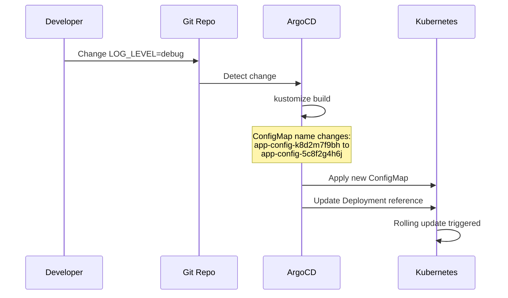

# How to Use Kustomize Generators with ArgoCD

Author: [nawazdhandala](https://github.com/nawazdhandala)

Tags: ArgoCD, GitOps, Kubernetes, Kustomize

Description: Learn how to use Kustomize configMapGenerator and secretGenerator with ArgoCD, including hash suffixes, generator options, and handling rolling updates triggered by config changes.

---

Kustomize generators create ConfigMaps and Secrets from files, literals, and environment variables during build time. Instead of writing ConfigMap YAML by hand, you point the generator at a properties file and it produces the ConfigMap for you. The killer feature is automatic hash suffixes - when the source data changes, the generated resource gets a new name, which triggers a rolling update of any Pod that references it.

ArgoCD handles generators transparently during `kustomize build`, but the hash suffix behavior requires understanding to avoid sync issues.

## ConfigMap Generator Basics

The `configMapGenerator` creates ConfigMaps from various sources:

```yaml
# kustomization.yaml
apiVersion: kustomize.config.k8s.io/v1beta1
kind: Kustomization

resources:
  - deployment.yaml

configMapGenerator:
  # From literal key-value pairs
  - name: app-config
    literals:
      - LOG_LEVEL=info
      - MAX_CONNECTIONS=100
      - CACHE_TTL=300

  # From a file
  - name: nginx-config
    files:
      - nginx.conf
      - mime.types

  # From an env file
  - name: env-config
    envs:
      - config.env

  # From a file with a custom key
  - name: tls-config
    files:
      - custom-key=tls.conf
```

The generated ConfigMap gets a hash suffix based on its content:

```yaml
# Output of kustomize build
apiVersion: v1
kind: ConfigMap
metadata:
  name: app-config-k8d2m7f9bh  # Hash suffix appended
data:
  LOG_LEVEL: info
  MAX_CONNECTIONS: "100"
  CACHE_TTL: "300"
```

## Secret Generator

The `secretGenerator` works the same way but creates Secrets:

```yaml
configMapGenerator:
  - name: app-config
    literals:
      - LOG_LEVEL=info

secretGenerator:
  - name: app-secrets
    literals:
      - DATABASE_PASSWORD=super-secret
      - API_KEY=sk-1234567890

  # From files
  - name: tls-certs
    files:
      - tls.crt
      - tls.key
    type: kubernetes.io/tls
```

Note: Storing plaintext secrets in Git is a bad practice. Use secretGenerator with encrypted files (SOPS) or use External Secrets Operator instead.

## How Hash Suffixes Work

When the generator content changes, the hash suffix changes, producing a new ConfigMap name. Kustomize automatically updates all references to the ConfigMap:



This solves the "ConfigMap changed but Pods did not restart" problem that plagues Kubernetes deployments.

## References Are Auto-Updated

Kustomize updates references in known fields:

```yaml
# deployment.yaml (before build)
apiVersion: apps/v1
kind: Deployment
metadata:
  name: my-api
spec:
  template:
    spec:
      containers:
        - name: api
          envFrom:
            - configMapRef:
                name: app-config  # Referenced by base name
      volumes:
        - name: nginx-conf
          configMap:
            name: nginx-config  # Referenced by base name
```

After build, both references update to include the hash:

```yaml
envFrom:
  - configMapRef:
      name: app-config-k8d2m7f9bh  # Updated with hash
volumes:
  - name: nginx-conf
    configMap:
      name: nginx-config-m5t6h8j2k4  # Updated with hash
```

## Disabling Hash Suffixes

Sometimes you do not want hash suffixes - for example, when external systems reference the ConfigMap by a fixed name:

```yaml
# kustomization.yaml
generatorOptions:
  disableNameSuffixHash: true  # Applies to all generators

configMapGenerator:
  - name: app-config
    literals:
      - LOG_LEVEL=info
```

Or disable per-generator:

```yaml
configMapGenerator:
  - name: app-config
    literals:
      - LOG_LEVEL=info
    options:
      disableNameSuffixHash: true  # Only this generator

  - name: nginx-config
    files:
      - nginx.conf
    # This generator still gets hash suffixes
```

## Generator Options

Control labels, annotations, and behavior across all generators:

```yaml
generatorOptions:
  disableNameSuffixHash: false
  labels:
    generated-by: kustomize
  annotations:
    config-version: "2026-02-26"
```

## ArgoCD Sync Behavior with Generators

When config data changes, the generator produces a new ConfigMap (new hash). ArgoCD sees two things:

1. A new ConfigMap resource (creates it)
2. An updated Deployment reference (triggers rolling update)
3. The old ConfigMap is now orphaned

With auto-prune enabled, ArgoCD deletes the old ConfigMap after the new one is deployed:

```yaml
# ArgoCD Application
apiVersion: argoproj.io/v1alpha1
kind: Application
metadata:
  name: my-api
  namespace: argocd
spec:
  source:
    repoURL: https://github.com/myorg/k8s-configs.git
    targetRevision: main
    path: apps/my-api/overlays/production
  destination:
    server: https://kubernetes.default.svc
    namespace: production
  syncPolicy:
    automated:
      prune: true      # Deletes old ConfigMaps
      selfHeal: true
```

Without auto-prune, old ConfigMaps accumulate and you need to clean them up manually.

## Using Generators in Overlays

Overlays can add to or override generators from the base:

```yaml
# base/kustomization.yaml
configMapGenerator:
  - name: app-config
    literals:
      - LOG_LEVEL=info
      - DB_HOST=localhost

# overlays/production/kustomization.yaml
configMapGenerator:
  - name: app-config
    behavior: merge  # Merge with base generator
    literals:
      - LOG_LEVEL=warn        # Override
      - DB_HOST=prod-db.svc   # Override
      - NEW_KEY=new-value     # Add new key
```

Behavior options:
- `create` (default) - Create a new generator, error if it already exists
- `merge` - Merge literals/files with the base generator
- `replace` - Completely replace the base generator's values

## Generating from Multiple Sources

Combine different sources in a single generator:

```yaml
configMapGenerator:
  - name: app-config
    # Literals
    literals:
      - APP_NAME=my-api
    # Files
    files:
      - config.json
    # Env file
    envs:
      - defaults.env
```

## Debugging Generator Output

Preview what the generator produces:

```bash
# Build and check the generated ConfigMaps
kustomize build overlays/production | grep -B2 -A10 "kind: ConfigMap"

# Check the hash values
kustomize build overlays/production | grep "name: app-config"

# Verify references are updated
kustomize build overlays/production | grep "configMapRef" -A1
```

## Common Issues with ArgoCD

**OutOfSync with no apparent changes**: If ArgoCD shows OutOfSync but you did not change anything, check if the generator input files have different line endings or whitespace. Even invisible changes produce a different hash.

**Too many old ConfigMaps**: Enable pruning in the sync policy. Without it, every config change leaves an orphaned ConfigMap.

**Generator not found in overlay**: When using `behavior: merge`, the generator name must match exactly between base and overlay.

For more on Kustomize ConfigMap generation, see our [configMapGenerator guide](https://oneuptime.com/blog/post/2026-02-09-kustomize-configmapgenerator/view).
