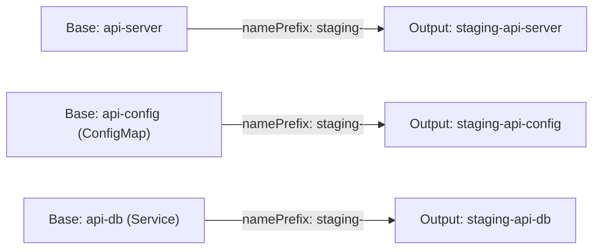

# How to Override Kustomize Name Prefix in ArgoCD

Author: [nawazdhandala](https://github.com/nawazdhandala)

Tags: ArgoCD, GitOps, Kubernetes, Kustomize

Description: Learn how to use Kustomize namePrefix overrides in ArgoCD to add prefixes to all resource names for multi-tenant deployments, environment isolation, and naming conventions.

---

When you deploy the same application multiple times in a cluster, resource names collide. A deployment named `api-server` cannot exist twice in the same namespace. Kustomize's `namePrefix` transformer solves this by prepending a string to every resource name, and ArgoCD lets you set this prefix both in your kustomization.yaml and directly in the Application spec.

This guide covers how namePrefix works, how to configure it in ArgoCD, practical use cases, and the gotchas around cross-resource references.

## How namePrefix Works

Kustomize's `namePrefix` prepends a string to the `metadata.name` of every resource in the build output. Critically, it also updates references between resources - so if a Service references a Deployment, both names get the prefix and the reference stays valid.



## Setting namePrefix in kustomization.yaml

The standard Kustomize approach puts the prefix in the overlay:

```yaml
# overlays/staging/kustomization.yaml
apiVersion: kustomize.config.k8s.io/v1beta1
kind: Kustomization

resources:
  - ../../base

namePrefix: staging-

namespace: shared
```

Given a base deployment:

```yaml
# base/deployment.yaml
apiVersion: apps/v1
kind: Deployment
metadata:
  name: api-server
spec:
  template:
    spec:
      containers:
        - name: api
          image: myorg/api-server:1.0.0
          envFrom:
            - configMapRef:
                name: api-config
```

And a base ConfigMap:

```yaml
# base/configmap.yaml
apiVersion: v1
kind: ConfigMap
metadata:
  name: api-config
data:
  LOG_LEVEL: info
```

After `kustomize build`, the output becomes:

```yaml
apiVersion: apps/v1
kind: Deployment
metadata:
  name: staging-api-server  # Prefixed
  namespace: shared
spec:
  template:
    spec:
      containers:
        - name: api
          image: myorg/api-server:1.0.0
          envFrom:
            - configMapRef:
                name: staging-api-config  # Reference also prefixed
---
apiVersion: v1
kind: ConfigMap
metadata:
  name: staging-api-config  # Prefixed
  namespace: shared
```

## Setting namePrefix in the ArgoCD Application Spec

ArgoCD lets you override the namePrefix directly in the Application resource:

```yaml
apiVersion: argoproj.io/v1alpha1
kind: Application
metadata:
  name: api-server-staging
  namespace: argocd
spec:
  project: default
  source:
    repoURL: https://github.com/myorg/k8s-configs.git
    targetRevision: main
    path: apps/api-server/base
    kustomize:
      namePrefix: staging-
  destination:
    server: https://kubernetes.default.svc
    namespace: shared
```

This approach applies the prefix at the ArgoCD level, meaning you can deploy the same base directory multiple times with different prefixes without creating separate overlay directories:

```yaml
# Deploy the same base for team-a
apiVersion: argoproj.io/v1alpha1
kind: Application
metadata:
  name: api-server-team-a
  namespace: argocd
spec:
  source:
    path: apps/api-server/base
    kustomize:
      namePrefix: team-a-
  destination:
    namespace: shared

---
# Deploy the same base for team-b
apiVersion: argoproj.io/v1alpha1
kind: Application
metadata:
  name: api-server-team-b
  namespace: argocd
spec:
  source:
    path: apps/api-server/base
    kustomize:
      namePrefix: team-b-
  destination:
    namespace: shared
```

## Setting namePrefix via the ArgoCD CLI

Override the prefix from the command line:

```bash
# Set namePrefix on an existing application
argocd app set api-server-staging --kustomize-name-prefix staging-

# Verify the setting
argocd app get api-server-staging -o json | jq '.spec.source.kustomize.namePrefix'

# Remove the prefix override
argocd app set api-server-staging --kustomize-name-prefix ""
```

## Multi-Tenant Deployments

namePrefix is particularly useful for deploying isolated instances in a shared namespace:

```yaml
# ApplicationSet that deploys per tenant
apiVersion: argoproj.io/v1alpha1
kind: ApplicationSet
metadata:
  name: api-server-tenants
  namespace: argocd
spec:
  generators:
    - list:
        elements:
          - tenant: acme-corp
          - tenant: globex-inc
          - tenant: initech
  template:
    metadata:
      name: "api-server-{{tenant}}"
    spec:
      source:
        repoURL: https://github.com/myorg/k8s-configs.git
        path: apps/api-server/base
        kustomize:
          namePrefix: "{{tenant}}-"
      destination:
        server: https://kubernetes.default.svc
        namespace: shared-apps
```

This creates three sets of resources: `acme-corp-api-server`, `globex-inc-api-server`, and `initech-api-server`, all in the same namespace.

## Cross-Resource Reference Handling

Kustomize automatically updates references in these fields when applying namePrefix:

- `spec.template.spec.containers[].envFrom[].configMapRef.name`
- `spec.template.spec.containers[].envFrom[].secretRef.name`
- `spec.template.spec.volumes[].configMap.name`
- `spec.template.spec.volumes[].secret.secretName`
- `spec.serviceName` in StatefulSets
- `spec.selector.matchLabels` (if using name-based selectors)
- `roleRef.name` in RoleBindings and ClusterRoleBindings

However, Kustomize does NOT automatically update references in:
- Custom resource definitions (CRDs) with custom fields
- Environment variable values that contain resource names
- Annotations or labels used for custom service discovery

For these cases, use Kustomize `replacements` to explicitly map the prefixed name:

```yaml
# overlays/staging/kustomization.yaml
namePrefix: staging-

replacements:
  - source:
      kind: ConfigMap
      name: api-config  # Original name (before prefix)
      fieldPath: metadata.name
    targets:
      - select:
          kind: Deployment
          name: api-server
        fieldPaths:
          - spec.template.spec.containers.[name=api].env.[name=CONFIG_MAP_NAME].value
```

## Combining namePrefix with nameSuffix

You can use both together for complex naming conventions:

```yaml
# overlays/staging/kustomization.yaml
namePrefix: staging-
nameSuffix: -v2

# Result: staging-api-server-v2
```

In the ArgoCD Application spec:

```yaml
kustomize:
  namePrefix: staging-
  nameSuffix: -v2
```

## Precedence Rules

When namePrefix is set in both the kustomization.yaml and the ArgoCD Application spec, the ArgoCD spec takes precedence. This means the kustomization.yaml value is replaced, not appended:

```yaml
# kustomization.yaml has: namePrefix: from-file-
# ArgoCD spec has: kustomize.namePrefix: from-argocd-
# Result: resources get "from-argocd-" prefix (not "from-argocd-from-file-")
```

If you want additive behavior, set the prefix only in one place.

## Debugging namePrefix Issues

Preview the rendered output to verify prefix application:

```bash
# Local preview
kustomize build overlays/staging | grep "name:"

# Through ArgoCD
argocd app manifests api-server-staging --source git | grep "name:"

# Check if references were updated correctly
argocd app diff api-server-staging
```

For more on Kustomize naming transformers, see our [namePrefix and nameSuffix guide](https://oneuptime.com/blog/post/2026-02-09-kustomize-nameprefix-namesuffix/view).
