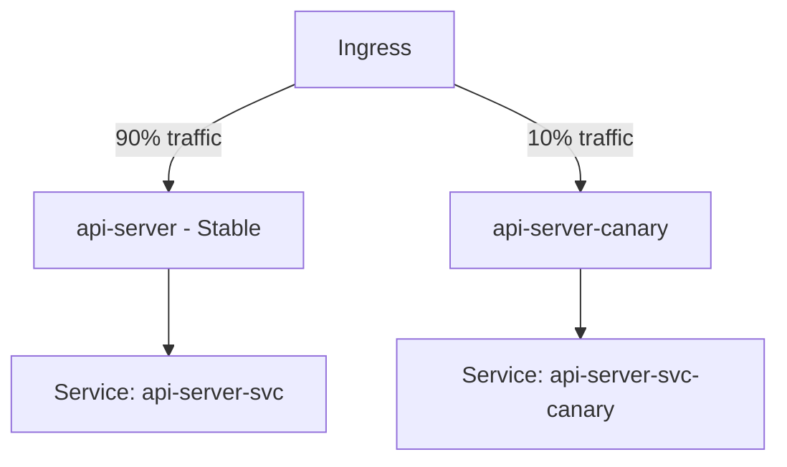

# How to Override Kustomize Name Suffix in ArgoCD

Author: [nawazdhandala](https://github.com/nawazdhandala)

Tags: ArgoCD, GitOps, Kubernetes, Kustomize

Description: Learn how to use Kustomize nameSuffix overrides in ArgoCD to append suffixes to resource names for versioning, canary deployments, and parallel environment testing.

---

While namePrefix adds a string before resource names, nameSuffix appends one after. This is useful for version-based deployments, A/B testing variants, canary releases, and situations where the suffix communicates the variant or version of a resource. ArgoCD supports nameSuffix overrides both in kustomization.yaml files and directly in the Application spec.

This guide covers practical uses of nameSuffix with ArgoCD, the mechanics of reference updates, and patterns for real-world deployment scenarios.

## How nameSuffix Works

Kustomize appends the suffix to `metadata.name` of every resource and updates cross-resource references automatically, just like namePrefix:

```yaml
# overlays/canary/kustomization.yaml
apiVersion: kustomize.config.k8s.io/v1beta1
kind: Kustomization

resources:
  - ../../base

nameSuffix: -canary
```

Given a base with `api-server` Deployment and `api-config` ConfigMap, the output becomes `api-server-canary` and `api-config-canary`.

## Setting nameSuffix in the ArgoCD Application Spec

Override nameSuffix directly in the Application resource without modifying Git:

```yaml
apiVersion: argoproj.io/v1alpha1
kind: Application
metadata:
  name: api-server-canary
  namespace: argocd
spec:
  project: default
  source:
    repoURL: https://github.com/myorg/k8s-configs.git
    targetRevision: main
    path: apps/api-server/base
    kustomize:
      nameSuffix: -canary
  destination:
    server: https://kubernetes.default.svc
    namespace: production
```

Using the CLI:

```bash
# Set nameSuffix on an existing application
argocd app set api-server-canary --kustomize-name-suffix -canary

# Verify
argocd app get api-server-canary -o json | jq '.spec.source.kustomize.nameSuffix'
```

## Use Case: Version-Based Deployments

Deploy multiple versions of an application side by side for testing:

```yaml
# Stable version
apiVersion: argoproj.io/v1alpha1
kind: Application
metadata:
  name: api-v1
  namespace: argocd
spec:
  source:
    path: apps/api-server/base
    kustomize:
      nameSuffix: -v1
      images:
        - myorg/api-server:1.0.0
  destination:
    namespace: production

---
# New version being tested
apiVersion: argoproj.io/v1alpha1
kind: Application
metadata:
  name: api-v2
  namespace: argocd
spec:
  source:
    path: apps/api-server/base
    kustomize:
      nameSuffix: -v2
      images:
        - myorg/api-server:2.0.0
  destination:
    namespace: production
```

This creates `api-server-v1` and `api-server-v2` Deployments in the same namespace, each with their own Services, ConfigMaps, and other resources.

## Use Case: Canary Alongside Stable

Run a canary deployment next to the stable version:



The stable deployment uses the base directly:

```yaml
# Stable - no suffix
apiVersion: argoproj.io/v1alpha1
kind: Application
metadata:
  name: api-server-stable
spec:
  source:
    path: apps/api-server/overlays/production
  destination:
    namespace: production
```

The canary adds a suffix:

```yaml
# Canary - with suffix
apiVersion: argoproj.io/v1alpha1
kind: Application
metadata:
  name: api-server-canary
spec:
  source:
    path: apps/api-server/overlays/production
    kustomize:
      nameSuffix: -canary
      images:
        - myorg/api-server:2.0.0-rc1
  destination:
    namespace: production
```

You need a traffic splitting mechanism (Istio VirtualService, Nginx canary annotations, or Argo Rollouts) to route traffic between the two.

## Use Case: Parallel Testing Environments

Spin up temporary environments with unique suffixes for pull request testing:

```bash
#!/bin/bash
# create-pr-env.sh - Create a temporary environment for a PR
PR_NUMBER=$1
SUFFIX="-pr-${PR_NUMBER}"

argocd app create "api-server${SUFFIX}" \
  --repo https://github.com/myorg/k8s-configs.git \
  --path apps/api-server/base \
  --dest-server https://kubernetes.default.svc \
  --dest-namespace "pr-testing" \
  --kustomize-name-suffix "${SUFFIX}" \
  --kustomize-image "myorg/api-server:pr-${PR_NUMBER}" \
  --sync-policy automated \
  --auto-prune

echo "PR environment deployed with suffix: ${SUFFIX}"
```

Clean up when the PR is closed:

```bash
# Cleanup script
argocd app delete "api-server-pr-${PR_NUMBER}" --cascade
```

## Reference Updates with nameSuffix

Like namePrefix, Kustomize updates known reference fields automatically. Given this base:

```yaml
# base/deployment.yaml
apiVersion: apps/v1
kind: Deployment
metadata:
  name: api-server
spec:
  template:
    spec:
      containers:
        - name: api
          envFrom:
            - configMapRef:
                name: api-config
            - secretRef:
                name: api-secrets
      volumes:
        - name: config-vol
          configMap:
            name: api-config
```

With `nameSuffix: -canary`, the output correctly updates:
- Deployment name: `api-server-canary`
- configMapRef.name: `api-config-canary`
- secretRef.name: `api-secrets-canary`
- volumes configMap.name: `api-config-canary`

## Combining with namePrefix

Use both transformers together:

```yaml
kustomize:
  namePrefix: team-a-
  nameSuffix: -v2
```

The resource `api-server` becomes `team-a-api-server-v2`.

## Fields That Are NOT Updated

Kustomize does not update resource name references in:
- Environment variable values (`env[].value`)
- Custom annotations containing resource names
- CRD fields that Kustomize does not know about
- Hardcoded DNS names in config files

For these, use explicit replacements:

```yaml
# kustomization.yaml
nameSuffix: -canary

replacements:
  - source:
      kind: Service
      name: api-server  # Pre-suffix name
      fieldPath: metadata.name
    targets:
      - select:
          kind: Deployment
        fieldPaths:
          - spec.template.spec.containers.[name=api].env.[name=SERVICE_NAME].value
```

## Precedence with ArgoCD

When nameSuffix is set in both the kustomization.yaml file and the ArgoCD Application spec, the ArgoCD spec value wins. The kustomization.yaml value is replaced entirely, not concatenated:

```yaml
# If kustomization.yaml has: nameSuffix: -from-file
# And ArgoCD spec has: kustomize.nameSuffix: -from-argocd
# Result: -from-argocd (not -from-file-from-argocd)
```

## Debugging

Preview the rendered names:

```bash
# Check locally
kustomize build overlays/canary/ | grep "name:" | head -20

# Through ArgoCD
argocd app manifests api-server-canary --source git | grep "name:"

# Diff against live state
argocd app diff api-server-canary
```

For a comprehensive look at naming transformers in Kustomize, see our [namePrefix and nameSuffix guide](https://oneuptime.com/blog/post/2026-02-09-kustomize-nameprefix-namesuffix/view).
