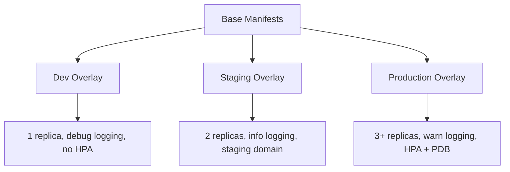

# How to Use Kustomize Overlays with ArgoCD for Multiple Environments

Author: [nawazdhandala](https://github.com/nawazdhandala)

Tags: ArgoCD, GitOps, Kubernetes, Kustomize

Description: Learn how to structure Kustomize overlays for dev, staging, and production environments and deploy each through separate ArgoCD applications with environment-specific configurations.

---

Every team needs to deploy the same application to multiple environments with different configurations. Dev gets one replica with debug logging. Staging mirrors production but with smaller resource limits. Production gets high availability with strict resource quotas. Kustomize overlays handle this perfectly, and ArgoCD makes deploying each overlay a separate, trackable operation.

This guide covers structuring overlays for multiple environments, connecting them to ArgoCD, managing environment-specific differences, and handling the promotion workflow from dev to production.

## Overlay Structure

The standard pattern uses a base directory with shared manifests and an overlay directory per environment:

```text
platform/
  base/
    kustomization.yaml
    deployment.yaml
    service.yaml
    configmap.yaml
    ingress.yaml
  overlays/
    dev/
      kustomization.yaml
      config-patch.yaml
      resource-patch.yaml
    staging/
      kustomization.yaml
      config-patch.yaml
      resource-patch.yaml
      ingress-patch.yaml
    production/
      kustomization.yaml
      config-patch.yaml
      resource-patch.yaml
      ingress-patch.yaml
      hpa.yaml
      pdb.yaml
```



## The Base

The base contains your canonical application definition with reasonable defaults:

```yaml
# base/kustomization.yaml
apiVersion: kustomize.config.k8s.io/v1beta1
kind: Kustomization

resources:
  - deployment.yaml
  - service.yaml
  - configmap.yaml
  - ingress.yaml

commonLabels:
  app.kubernetes.io/name: my-api
  app.kubernetes.io/part-of: platform
```

```yaml
# base/deployment.yaml
apiVersion: apps/v1
kind: Deployment
metadata:
  name: my-api
spec:
  replicas: 1
  selector:
    matchLabels:
      app.kubernetes.io/name: my-api
  template:
    metadata:
      labels:
        app.kubernetes.io/name: my-api
    spec:
      containers:
        - name: api
          image: myorg/my-api:latest
          ports:
            - containerPort: 8080
          resources:
            requests:
              cpu: 100m
              memory: 128Mi
            limits:
              cpu: 500m
              memory: 512Mi
          envFrom:
            - configMapRef:
                name: my-api-config
```

```yaml
# base/configmap.yaml
apiVersion: v1
kind: ConfigMap
metadata:
  name: my-api-config
data:
  LOG_LEVEL: "info"
  DB_HOST: "localhost"
  CACHE_TTL: "300"
```

## Dev Overlay

The dev overlay keeps things lightweight for fast iteration:

```yaml
# overlays/dev/kustomization.yaml
apiVersion: kustomize.config.k8s.io/v1beta1
kind: Kustomization

resources:
  - ../../base

namespace: dev

commonLabels:
  environment: dev

patches:
  - path: config-patch.yaml
  - path: resource-patch.yaml

images:
  - name: myorg/my-api
    newTag: develop
```

```yaml
# overlays/dev/config-patch.yaml
apiVersion: v1
kind: ConfigMap
metadata:
  name: my-api-config
data:
  LOG_LEVEL: "debug"
  DB_HOST: "postgres-dev.dev.svc"
  CACHE_TTL: "60"
```

```yaml
# overlays/dev/resource-patch.yaml
apiVersion: apps/v1
kind: Deployment
metadata:
  name: my-api
spec:
  replicas: 1
  template:
    spec:
      containers:
        - name: api
          resources:
            requests:
              cpu: 50m
              memory: 64Mi
            limits:
              cpu: 200m
              memory: 256Mi
```

## Production Overlay

Production adds high availability resources and stricter settings:

```yaml
# overlays/production/kustomization.yaml
apiVersion: kustomize.config.k8s.io/v1beta1
kind: Kustomization

resources:
  - ../../base
  - hpa.yaml
  - pdb.yaml

namespace: production

commonLabels:
  environment: production

commonAnnotations:
  oncall-team: platform-eng

patches:
  - path: config-patch.yaml
  - path: resource-patch.yaml
  - path: ingress-patch.yaml

images:
  - name: myorg/my-api
    newTag: "2.1.0"
```

```yaml
# overlays/production/hpa.yaml
apiVersion: autoscaling/v2
kind: HorizontalPodAutoscaler
metadata:
  name: my-api
spec:
  scaleTargetRef:
    apiVersion: apps/v1
    kind: Deployment
    name: my-api
  minReplicas: 3
  maxReplicas: 10
  metrics:
    - type: Resource
      resource:
        name: cpu
        target:
          type: Utilization
          averageUtilization: 70
```

```yaml
# overlays/production/pdb.yaml
apiVersion: policy/v1
kind: PodDisruptionBudget
metadata:
  name: my-api
spec:
  minAvailable: 2
  selector:
    matchLabels:
      app.kubernetes.io/name: my-api
```

## ArgoCD Applications for Each Environment

Create a separate ArgoCD Application per environment:

```yaml
# argocd/dev-application.yaml
apiVersion: argoproj.io/v1alpha1
kind: Application
metadata:
  name: my-api-dev
  namespace: argocd
  labels:
    environment: dev
    app: my-api
spec:
  project: development
  source:
    repoURL: https://github.com/myorg/k8s-configs.git
    targetRevision: main
    path: platform/overlays/dev
  destination:
    server: https://kubernetes.default.svc
    namespace: dev
  syncPolicy:
    automated:
      prune: true
      selfHeal: true
    syncOptions:
      - CreateNamespace=true
```

```yaml
# argocd/production-application.yaml
apiVersion: argoproj.io/v1alpha1
kind: Application
metadata:
  name: my-api-production
  namespace: argocd
  labels:
    environment: production
    app: my-api
spec:
  project: production
  source:
    repoURL: https://github.com/myorg/k8s-configs.git
    targetRevision: main
    path: platform/overlays/production
  destination:
    server: https://production-cluster.example.com
    namespace: production
  syncPolicy:
    automated:
      prune: true
      selfHeal: true
    syncOptions:
      - CreateNamespace=false  # Namespace pre-provisioned in prod
    retry:
      limit: 3
      backoff:
        duration: 30s
        factor: 2
```

## Version Promotion Workflow

To promote a new image version from dev to staging to production, update the image tag in each overlay:

```bash
# In overlays/dev/kustomization.yaml, the image is already on the new version
# After testing in dev, update staging:
cd platform/overlays/staging
```

Update the kustomization:

```yaml
# overlays/staging/kustomization.yaml
images:
  - name: myorg/my-api
    newTag: "2.2.0"  # Promoted from dev
```

Commit and push. ArgoCD syncs staging automatically. After validation, update production the same way.

For CI/CD automation:

```bash
#!/bin/bash
# promote.sh - Update image tag in an overlay
# Usage: ./promote.sh production 2.2.0

ENVIRONMENT=$1
VERSION=$2
OVERLAY_DIR="platform/overlays/${ENVIRONMENT}"

cd "${OVERLAY_DIR}"
kustomize edit set image "myorg/my-api:${VERSION}"
cd -

git add "${OVERLAY_DIR}/kustomization.yaml"
git commit -m "Promote my-api to ${VERSION} in ${ENVIRONMENT}"
git push origin main
```

## ArgoCD Project Isolation

Use ArgoCD Projects to enforce environment boundaries:

```yaml
# Dev project - more permissive
apiVersion: argoproj.io/v1alpha1
kind: AppProject
metadata:
  name: development
  namespace: argocd
spec:
  destinations:
    - namespace: dev
      server: https://kubernetes.default.svc
  sourceRepos:
    - https://github.com/myorg/k8s-configs.git
  clusterResourceWhitelist:
    - group: ""
      kind: Namespace

# Production project - restricted
---
apiVersion: argoproj.io/v1alpha1
kind: AppProject
metadata:
  name: production
  namespace: argocd
spec:
  destinations:
    - namespace: production
      server: https://production-cluster.example.com
  sourceRepos:
    - https://github.com/myorg/k8s-configs.git
  clusterResourceWhitelist: []  # No cluster-scoped resources
```

## Comparing Environments

Quickly check what differs between environments by building each overlay locally:

```bash
# Build each overlay and diff them
kustomize build platform/overlays/dev > /tmp/dev.yaml
kustomize build platform/overlays/production > /tmp/prod.yaml
diff /tmp/dev.yaml /tmp/prod.yaml
```

Or use ArgoCD to compare:

```bash
# Check what each app would deploy
argocd app diff my-api-dev
argocd app diff my-api-production
```

## Tips for Clean Overlays

1. Keep patches small and focused - one patch per concern (resources, config, scaling).
2. Use `images` in the overlay kustomization instead of patching the deployment for image changes.
3. Put environment-only resources (HPA, PDB, NetworkPolicy) directly in the overlay's `resources` list.
4. Avoid duplicating the entire base manifest in an overlay. Use strategic merge patches to change only what differs.

For more on Kustomize base and overlay patterns, check our [Kustomize inheritance guide](https://oneuptime.com/blog/post/2026-02-09-kustomize-base-overlay-inheritance/view).
