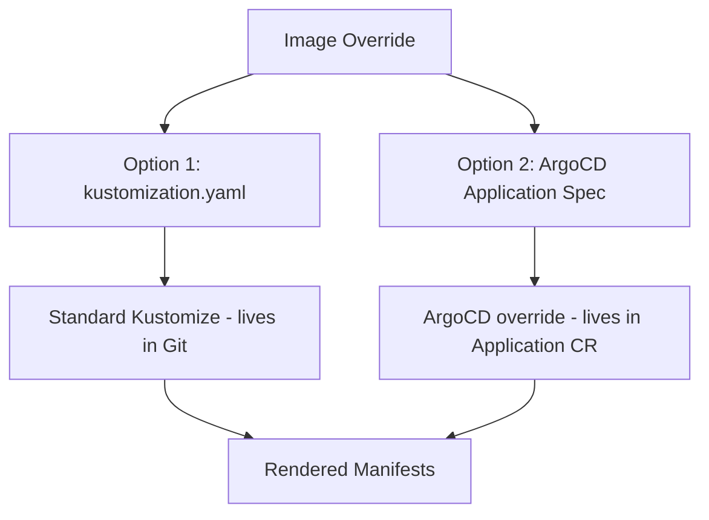

# How to Override Kustomize Images in ArgoCD

Author: [nawazdhandala](https://github.com/nawazdhandala)

Tags: ArgoCD, GitOps, Kubernetes, Kustomize

Description: Learn how to override container image names and tags in Kustomize applications managed by ArgoCD using both the Application spec and kustomization.yaml images field.

---

Changing container image tags is the most common operation in any deployment pipeline. When your CI builds a new image and tags it `v2.3.1`, you need that tag to flow through to Kubernetes without editing deployment manifests directly. Kustomize provides the `images` transformer for this, and ArgoCD adds its own image override mechanism on top. Understanding both approaches - and when to use which - prevents confusion and keeps your GitOps workflow clean.

## Two Ways to Override Images

ArgoCD gives you two distinct paths for overriding images in Kustomize applications:

1. **In the kustomization.yaml file** (Git-based, standard Kustomize)
2. **In the ArgoCD Application spec** (ArgoCD-specific override)



## Method 1: Override in kustomization.yaml

This is the standard Kustomize approach. Add an `images` section to your overlay's kustomization.yaml:

```yaml
# overlays/production/kustomization.yaml
apiVersion: kustomize.config.k8s.io/v1beta1
kind: Kustomization

resources:
  - ../../base

namespace: production

images:
  # Change the tag for an existing image
  - name: myorg/backend-api
    newTag: "2.3.1"

  # Change both the registry and tag
  - name: myorg/frontend
    newName: ghcr.io/myorg/frontend
    newTag: "1.5.0"

  # Change only the image name (different registry)
  - name: nginx
    newName: myregistry.example.com/nginx
    newTag: "1.25-alpine"

  # Use a digest instead of a tag for immutable references
  - name: myorg/worker
    digest: sha256:abc123def456...
```

The base deployment references the original image name:

```yaml
# base/deployment.yaml
apiVersion: apps/v1
kind: Deployment
metadata:
  name: backend-api
spec:
  template:
    spec:
      containers:
        - name: api
          image: myorg/backend-api:latest  # Kustomize replaces this
```

Kustomize matches the `name` field against the image reference in the container spec (ignoring the tag) and replaces it with `newName` and/or `newTag`.

## Method 2: Override in ArgoCD Application Spec

ArgoCD lets you override images directly in the Application resource without modifying the Git repository:

```yaml
apiVersion: argoproj.io/v1alpha1
kind: Application
metadata:
  name: backend-api
  namespace: argocd
spec:
  project: default
  source:
    repoURL: https://github.com/myorg/k8s-configs.git
    targetRevision: main
    path: apps/backend-api/overlays/production
    kustomize:
      images:
        - myorg/backend-api:2.3.1
        - myorg/frontend=ghcr.io/myorg/frontend:1.5.0
  destination:
    server: https://kubernetes.default.svc
    namespace: production
```

The syntax for ArgoCD's `kustomize.images` follows these patterns:

```yaml
kustomize:
  images:
    # Change tag only: original-image:new-tag
    - myorg/backend-api:2.3.1

    # Change image name and tag: original=new-image:new-tag
    - nginx=myregistry.example.com/nginx:1.25-alpine

    # Use digest: original-image@sha256:digest
    - myorg/worker@sha256:abc123def456

    # Change name only: original=new-image
    - myorg/frontend=ghcr.io/myorg/frontend
```

## Which Method to Use

The kustomization.yaml approach keeps everything in Git, maintaining a full audit trail. Every image change is a Git commit. This is the recommended approach for most teams.

The ArgoCD Application spec approach is useful for:
- CI/CD pipelines that update the running application directly via the ArgoCD API
- Image promoter tools like Argo CD Image Updater
- Cases where you want to separate image versions from configuration

```bash
# Update image via ArgoCD CLI (uses the Application spec approach)
argocd app set backend-api \
  --kustomize-image myorg/backend-api:2.3.1

# Verify the override was applied
argocd app get backend-api -o json | jq '.spec.source.kustomize.images'
```

## Using ArgoCD Image Updater

ArgoCD Image Updater automates image tag updates by watching container registries for new tags. It works by modifying the ArgoCD Application's `kustomize.images` field:

```yaml
apiVersion: argoproj.io/v1alpha1
kind: Application
metadata:
  name: backend-api
  namespace: argocd
  annotations:
    # Tell Image Updater which images to watch
    argocd-image-updater.argoproj.io/image-list: >
      api=myorg/backend-api
    # Use semver strategy to pick latest semantic version
    argocd-image-updater.argoproj.io/api.update-strategy: semver
    # Only consider tags matching this constraint
    argocd-image-updater.argoproj.io/api.allow-tags: "regexp:^\\d+\\.\\d+\\.\\d+$"
spec:
  source:
    path: apps/backend-api/overlays/production
    kustomize:
      images:
        - myorg/backend-api:2.3.1  # Image Updater updates this
```

## Multiple Containers in a Single Pod

When a Pod has multiple containers (sidecars, init containers), specify the image name precisely:

```yaml
# base/deployment.yaml
spec:
  template:
    spec:
      initContainers:
        - name: migrations
          image: myorg/db-migrations:latest
      containers:
        - name: api
          image: myorg/backend-api:latest
        - name: envoy-sidecar
          image: envoyproxy/envoy:v1.28.0
```

Override each independently:

```yaml
# overlays/production/kustomization.yaml
images:
  - name: myorg/backend-api
    newTag: "2.3.1"
  - name: myorg/db-migrations
    newTag: "2.3.1"
  - name: envoyproxy/envoy
    newTag: "v1.29.0"
```

## CI Pipeline Integration

A typical CI pipeline updates the image tag after building:

```bash
#!/bin/bash
# update-image.sh - Called by CI after successful image build
# Usage: ./update-image.sh myorg/backend-api 2.3.1 production

IMAGE=$1
TAG=$2
ENVIRONMENT=$3

OVERLAY_DIR="apps/backend-api/overlays/${ENVIRONMENT}"

# Navigate to overlay and use kustomize edit
cd "${OVERLAY_DIR}"
kustomize edit set image "${IMAGE}:${TAG}"

# Commit the change
cd -
git add "${OVERLAY_DIR}/kustomization.yaml"
git commit -m "Update ${IMAGE} to ${TAG} in ${ENVIRONMENT}"
git push origin main

# ArgoCD picks up the change automatically
```

## Verifying Image Overrides

After ArgoCD syncs, verify the correct images are deployed:

```bash
# Check the live manifests through ArgoCD
argocd app manifests backend-api --source live | grep "image:"

# Or check directly with kubectl
kubectl get deployment backend-api -n production -o jsonpath='{.spec.template.spec.containers[*].image}'
```

## Troubleshooting

**Image not being overridden**: The `name` in the images transformer must match the image reference in the container spec exactly (without the tag). If the base uses `docker.io/myorg/backend-api` but you specify `myorg/backend-api`, it may not match depending on the Kustomize version.

**ArgoCD shows OutOfSync after image override**: If you use both the kustomization.yaml and ArgoCD spec approaches simultaneously, they can conflict. Pick one method and stick with it.

**Digest vs tag conflicts**: If the kustomization.yaml specifies a digest and the ArgoCD spec specifies a tag, the behavior depends on which override takes precedence. The ArgoCD Application spec overrides take priority over kustomization.yaml values.

For more on managing images in Kustomize, see our [Kustomize images tag management guide](https://oneuptime.com/blog/post/2026-02-09-kustomize-images-tag-management/view).
