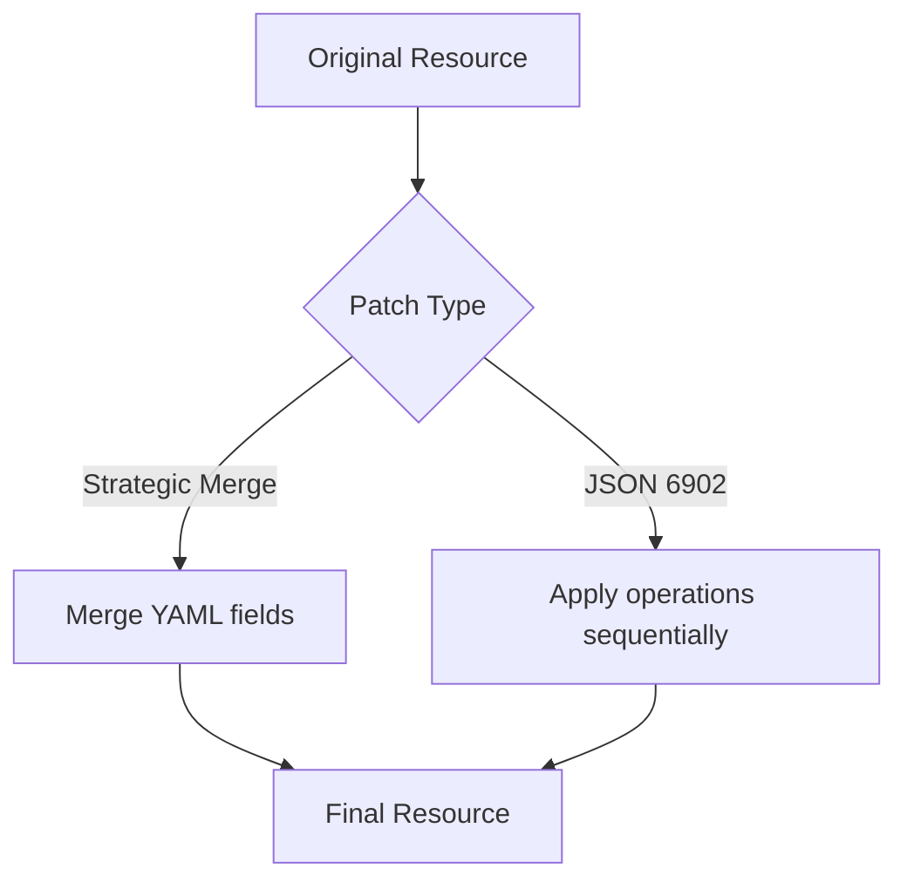

# How to Use Kustomize Patches with ArgoCD

Author: [nawazdhandala](https://github.com/nawazdhandala)

Tags: ArgoCD, GitOps, Kubernetes, Kustomize

Description: A comprehensive guide to using Kustomize patches with ArgoCD, covering strategic merge patches, JSON 6902 patches, inline patches, and target selectors for precise resource modifications.

---

Patches are the core mechanism Kustomize uses to modify resources without duplicating entire manifests. When you need to change three fields in a 50-line Deployment, you write a 10-line patch instead of copying the whole file. ArgoCD processes these patches during `kustomize build` and applies the final merged output to your cluster.

This guide covers every type of Kustomize patch, how to target specific resources, inline vs file-based patches, and real-world patterns that work well with ArgoCD.

## Patch Types in Kustomize

Kustomize supports two patch formats:

1. **Strategic Merge Patches** - YAML that merges with the target resource, following Kubernetes-aware merge strategies
2. **JSON 6902 Patches** - An ordered list of operations (add, remove, replace, move, copy, test) applied sequentially



## Strategic Merge Patches

The most common patch type. You write a partial resource that gets merged into the target:

```yaml
# overlays/production/kustomization.yaml
apiVersion: kustomize.config.k8s.io/v1beta1
kind: Kustomization

resources:
  - ../../base

patches:
  - path: resource-limits-patch.yaml
```

```yaml
# overlays/production/resource-limits-patch.yaml
apiVersion: apps/v1
kind: Deployment
metadata:
  name: my-api  # Must match the target resource name
spec:
  replicas: 3
  template:
    spec:
      containers:
        - name: api  # Must match the container name
          resources:
            requests:
              cpu: 500m
              memory: 512Mi
            limits:
              cpu: "2"
              memory: 2Gi
```

This patch only changes replicas and resource limits. Everything else in the base Deployment remains unchanged.

## JSON 6902 Patches

For operations that strategic merge cannot handle - like removing a field, replacing array elements by index, or adding to specific positions:

```yaml
# overlays/production/kustomization.yaml
patches:
  - target:
      kind: Deployment
      name: my-api
    patch: |
      - op: replace
        path: /spec/replicas
        value: 3
      - op: add
        path: /spec/template/spec/containers/0/env/-
        value:
          name: PRODUCTION
          value: "true"
      - op: remove
        path: /spec/template/spec/containers/0/env/2
```

JSON 6902 operations:
- `add` - Add a value at the specified path
- `remove` - Remove the value at the path
- `replace` - Replace the value at the path
- `move` - Move a value from one path to another
- `copy` - Copy a value from one path to another
- `test` - Verify a value exists (fails the build if not)

## Inline Patches

Instead of separate files, write patches inline in the kustomization:

```yaml
# overlays/production/kustomization.yaml
apiVersion: kustomize.config.k8s.io/v1beta1
kind: Kustomization

resources:
  - ../../base

patches:
  # Inline strategic merge patch
  - patch: |
      apiVersion: apps/v1
      kind: Deployment
      metadata:
        name: my-api
      spec:
        replicas: 3
        template:
          spec:
            containers:
              - name: api
                resources:
                  limits:
                    cpu: "2"
                    memory: 2Gi

  # Inline JSON 6902 patch with target
  - target:
      kind: Service
      name: my-api
    patch: |
      - op: replace
        path: /spec/type
        value: LoadBalancer
```

Inline patches are good for small, one-line changes. File-based patches are better for larger modifications.

## Target Selectors

Target selectors let you apply one patch to multiple resources:

```yaml
patches:
  # Apply to all Deployments
  - target:
      kind: Deployment
    patch: |
      apiVersion: apps/v1
      kind: Deployment
      metadata:
        name: not-used  # Name is ignored when target selector is used
      spec:
        template:
          metadata:
            annotations:
              sidecar.istio.io/inject: "true"

  # Apply to all resources with a specific label
  - target:
      labelSelector: "tier=frontend"
    patch: |
      - op: add
        path: /metadata/annotations/cdn.myorg.com~1enabled
        value: "true"

  # Apply to a specific resource by name and kind
  - target:
      kind: Deployment
      name: my-api
      namespace: production
    path: resource-patch.yaml

  # Apply to all resources of a specific group
  - target:
      group: apps
      version: v1
      kind: Deployment
    path: deployment-defaults.yaml
```

Target selector fields:
- `group` - API group (e.g., `apps`, `batch`, `""` for core)
- `version` - API version (e.g., `v1`)
- `kind` - Resource kind
- `name` - Resource name (supports regex with `|` separator)
- `namespace` - Resource namespace
- `labelSelector` - Label-based selection
- `annotationSelector` - Annotation-based selection

## Patching Multiple Containers

When a Pod has multiple containers, strategic merge patches match by container name:

```yaml
# This patch only modifies the 'api' container, leaves others untouched
apiVersion: apps/v1
kind: Deployment
metadata:
  name: my-api
spec:
  template:
    spec:
      containers:
        - name: api  # Matches by name
          resources:
            limits:
              cpu: "2"
        - name: sidecar  # Matches by name
          resources:
            limits:
              cpu: "500m"
```

With JSON 6902, reference containers by array index:

```yaml
# Replace resources on the first container (index 0)
- op: replace
  path: /spec/template/spec/containers/0/resources/limits/cpu
  value: "2"
```

## Deleting Fields with Strategic Merge

To delete a field using strategic merge, set it to `null`:

```yaml
apiVersion: apps/v1
kind: Deployment
metadata:
  name: my-api
spec:
  template:
    spec:
      containers:
        - name: api
          # Remove the liveness probe
          livenessProbe: null
```

To delete a specific item from a list, use the `$patch: delete` directive:

```yaml
apiVersion: apps/v1
kind: Deployment
metadata:
  name: my-api
spec:
  template:
    spec:
      containers:
        - name: debug-sidecar
          $patch: delete  # Removes this container from the list
```

## ArgoCD Application Example

The ArgoCD Application just points to the overlay. No special configuration is needed for patches:

```yaml
apiVersion: argoproj.io/v1alpha1
kind: Application
metadata:
  name: my-api-production
  namespace: argocd
spec:
  project: default
  source:
    repoURL: https://github.com/myorg/k8s-configs.git
    targetRevision: main
    path: apps/my-api/overlays/production
  destination:
    server: https://kubernetes.default.svc
    namespace: production
  syncPolicy:
    automated:
      prune: true
      selfHeal: true
```

## Debugging Patches

When patches do not apply as expected:

```bash
# Build locally and inspect the output
kustomize build overlays/production | grep -A 20 "kind: Deployment"

# Compare base vs overlay output
diff <(kustomize build base) <(kustomize build overlays/production)

# Check specific resource through ArgoCD
argocd app manifests my-api-production --source git | grep -A 20 "kind: Deployment"
```

Common mistakes:
- Strategic merge patch has wrong `metadata.name` - does not match any resource
- JSON 6902 path uses wrong array index
- Container name mismatch in strategic merge
- Forgetting that `~1` is the escape for `/` in JSON pointer paths (e.g., `annotations/app.kubernetes.io~1name`)

For more on Kustomize patching techniques, see our [strategic merge patches guide](https://oneuptime.com/blog/post/2026-02-09-kustomize-strategic-merge-patches/view) and [JSON 6902 patches guide](https://oneuptime.com/blog/post/2026-02-09-kustomize-json-6902-patches/view).
