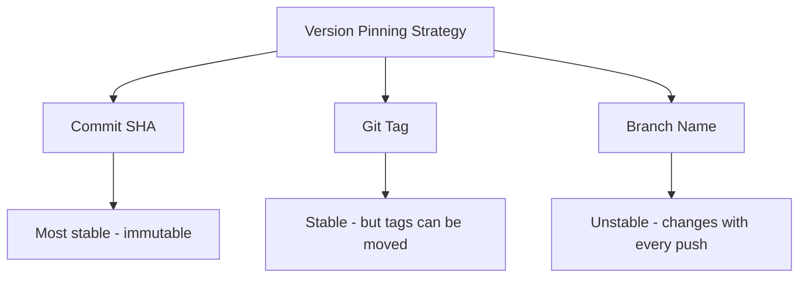

# How to Handle Kustomize Remote Bases in ArgoCD

Author: [nawazdhandala](https://github.com/nawazdhandala)

Tags: ArgoCD, GitOps, Kubernetes, Kustomize

Description: Learn how to use Kustomize remote bases from Git repositories with ArgoCD, including URL formats, version pinning, authentication, and load restrictor configuration.

---

Kustomize remote bases let you reference kustomization directories from other Git repositories as your base layer. Instead of copying shared manifests into every project, you point to a central repository and build on top of it with overlays. This promotes reuse across teams and projects. ArgoCD supports remote bases but requires specific configuration for authentication and load restrictions.

This guide covers remote base syntax, version pinning, private repo access through ArgoCD, and the security considerations.

## What Are Remote Bases

A remote base is a `resources` entry that points to a directory in a remote Git repository instead of a local path:

```yaml
# kustomization.yaml
apiVersion: kustomize.config.k8s.io/v1beta1
kind: Kustomization

resources:
  # Local base
  - ../base

  # Remote base from GitHub
  - https://github.com/myorg/shared-manifests//base/microservice?ref=v2.1.0
```

Kustomize clones the remote repository, checks out the specified reference, and uses the specified directory as a base.

## URL Format

The remote base URL follows this pattern:

```text
https://<host>/<owner>/<repo>//<path>?ref=<tag-or-branch-or-sha>
```

The double slash `//` separates the repository URL from the path within the repository:

```yaml
resources:
  # Path within the repo comes after //
  - https://github.com/myorg/platform-base//k8s/base?ref=v1.0.0

  # Root of the repo (no path after //)
  - https://github.com/myorg/platform-base?ref=v1.0.0

  # Specific subdirectory with tag
  - https://github.com/myorg/platform-base//services/api/base?ref=v2.3.0

  # Using a branch
  - https://github.com/myorg/platform-base//k8s/base?ref=main

  # Using a commit SHA
  - https://github.com/myorg/platform-base//k8s/base?ref=a1b2c3d4
```

## SSH URLs

For private repositories accessed via SSH:

```yaml
resources:
  - git@github.com:myorg/platform-base.git//k8s/base?ref=v1.0.0
```

Or using the ssh:// scheme:

```yaml
resources:
  - ssh://git@github.com/myorg/platform-base.git//k8s/base?ref=v1.0.0
```

## Version Pinning

Always pin remote bases to a specific version for reproducible builds:

```yaml
# Good - pinned to a tag
resources:
  - https://github.com/myorg/platform-base//k8s/base?ref=v2.1.0

# Good - pinned to a commit SHA (most immutable)
resources:
  - https://github.com/myorg/platform-base//k8s/base?ref=a1b2c3d4e5f6

# Risky - tracks a branch (can change without notice)
resources:
  - https://github.com/myorg/platform-base//k8s/base?ref=main

# Dangerous - no ref specified (uses default branch HEAD)
resources:
  - https://github.com/myorg/platform-base//k8s/base
```



## ArgoCD Load Restrictor Configuration

By default, Kustomize restricts file access to prevent loading resources from outside the kustomization root. Remote bases require relaxing this restriction:

```yaml
# argocd-cm ConfigMap
apiVersion: v1
kind: ConfigMap
metadata:
  name: argocd-cm
  namespace: argocd
data:
  kustomize.buildOptions: "--load-restrictor LoadRestrictionsNone"
```

Without this, you get errors like:

```text
security; file 'https://github.com/...' is not in or below '/tmp/...'
```

## ArgoCD Authentication for Private Repos

When remote bases point to private repositories, ArgoCD's repo server needs access. Register the repository with ArgoCD:

```bash
# Add a private repo with HTTPS credentials
argocd repo add https://github.com/myorg/platform-base.git \
  --username git \
  --password <token>

# Add with SSH key
argocd repo add git@github.com:myorg/platform-base.git \
  --ssh-private-key-path ~/.ssh/id_rsa
```

Or declaratively:

```yaml
# Repository credential secret
apiVersion: v1
kind: Secret
metadata:
  name: platform-base-repo
  namespace: argocd
  labels:
    argocd.argoproj.io/secret-type: repository
type: Opaque
stringData:
  type: git
  url: https://github.com/myorg/platform-base.git
  username: git
  password: ghp_xxxxxxxxxxxxxxxxxxxx
```

For credential templates that match multiple repos:

```yaml
apiVersion: v1
kind: Secret
metadata:
  name: github-creds
  namespace: argocd
  labels:
    argocd.argoproj.io/secret-type: repo-creds
type: Opaque
stringData:
  type: git
  url: https://github.com/myorg
  username: git
  password: ghp_xxxxxxxxxxxxxxxxxxxx
```

## Practical Example: Shared Microservice Base

A central team maintains a standard microservice base:

```yaml
# In the shared repo: platform-base/k8s/microservice/kustomization.yaml
apiVersion: kustomize.config.k8s.io/v1beta1
kind: Kustomization

resources:
  - deployment.yaml
  - service.yaml
  - service-account.yaml
  - network-policy.yaml

commonLabels:
  managed-by: platform-team
```

Individual teams build on this base:

```yaml
# In the team repo: my-api/overlays/production/kustomization.yaml
apiVersion: kustomize.config.k8s.io/v1beta1
kind: Kustomization

resources:
  - https://github.com/myorg/platform-base//k8s/microservice?ref=v2.1.0
  - hpa.yaml
  - pdb.yaml

namePrefix: my-api-
namespace: production

images:
  - name: app
    newName: myorg/my-api
    newTag: "3.0.0"

patches:
  - path: resource-patch.yaml
```

The ArgoCD Application:

```yaml
apiVersion: argoproj.io/v1alpha1
kind: Application
metadata:
  name: my-api-production
  namespace: argocd
spec:
  source:
    repoURL: https://github.com/myorg/my-api-configs.git
    targetRevision: main
    path: overlays/production
  destination:
    server: https://kubernetes.default.svc
    namespace: production
  syncPolicy:
    automated:
      prune: true
      selfHeal: true
```

## Caching Behavior

ArgoCD's repo server caches cloned repositories. When a remote base is pinned to a branch, the cache may serve stale content. Force a refresh:

```bash
# Hard refresh forces re-cloning
argocd app get my-api-production --hard-refresh
```

For tag-based pins, caching is not a problem since tags point to fixed commits.

## Updating Remote Base Versions

When the shared base releases a new version, update the `ref` in your kustomization:

```bash
# Update the remote base version
cd overlays/production
# Edit kustomization.yaml to change ?ref=v2.1.0 to ?ref=v2.2.0

git add kustomization.yaml
git commit -m "Update platform-base to v2.2.0"
git push
```

ArgoCD detects the change and syncs with the new base version.

## Troubleshooting

**Clone failures**: Check that the repo server can reach the remote repository. Test from inside the pod:

```bash
kubectl exec -n argocd deploy/argocd-repo-server -- \
  git ls-remote https://github.com/myorg/platform-base.git
```

**Authentication errors**: Verify credentials are registered correctly:

```bash
argocd repo list
argocd repo get https://github.com/myorg/platform-base.git
```

**Slow builds**: Remote bases require cloning, which adds latency. Pin to tags or SHAs to leverage ArgoCD's cache effectively.

For more on Kustomize remote bases, see our [remote bases from Git repositories guide](https://oneuptime.com/blog/post/2026-02-09-kustomize-remote-bases-git/view).
