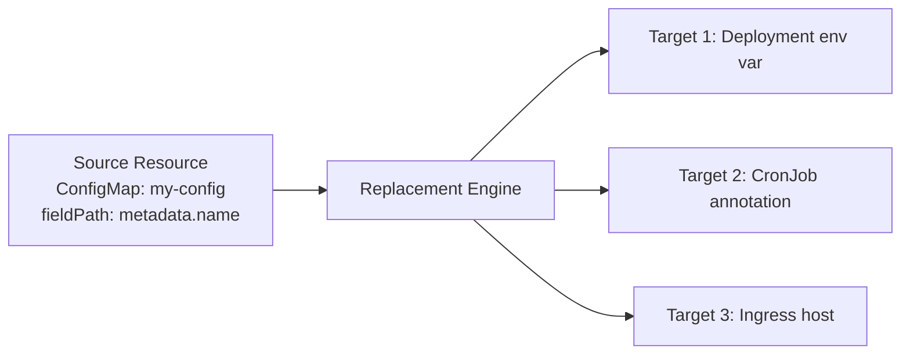

# How to Use Kustomize Replacements with ArgoCD

Author: [nawazdhandala](https://github.com/nawazdhandala)

Tags: ArgoCD, GitOps, Kubernetes, Kustomize

Description: Learn how to use Kustomize replacements with ArgoCD to dynamically substitute values across resources, replacing the deprecated vars feature with a more powerful alternative.

---

Kustomize `replacements` let you copy a value from one resource and inject it into another. Need the Service name from one manifest to appear as an environment variable in a Deployment? Need the ConfigMap name (including any hash suffix) to appear in an annotation? Replacements handle cross-resource value propagation that patches cannot.

Replacements replaced the deprecated `vars` feature in Kustomize 4.5.0+ with a more explicit, debuggable mechanism. ArgoCD processes replacements as part of the standard `kustomize build`, so no special configuration is needed.

## How Replacements Work

A replacement has two parts:
1. **Source** - Where the value comes from
2. **Targets** - Where the value gets injected



## Basic Replacement Example

Copy a Service's cluster IP into a Deployment's environment variable:

```yaml
# kustomization.yaml
apiVersion: kustomize.config.k8s.io/v1beta1
kind: Kustomization

resources:
  - deployment.yaml
  - service.yaml
  - configmap.yaml

replacements:
  - source:
      kind: Service
      name: my-api
      fieldPath: metadata.name
    targets:
      - select:
          kind: Deployment
          name: my-api
        fieldPaths:
          - spec.template.spec.containers.[name=api].env.[name=SERVICE_NAME].value
```

Given this Deployment:

```yaml
# deployment.yaml
apiVersion: apps/v1
kind: Deployment
metadata:
  name: my-api
spec:
  template:
    spec:
      containers:
        - name: api
          image: myorg/my-api:1.0.0
          env:
            - name: SERVICE_NAME
              value: PLACEHOLDER  # This gets replaced
```

After `kustomize build`, the `SERVICE_NAME` value becomes `my-api` (the Service's metadata.name). If namePrefix or nameSuffix is applied, the replacement picks up the transformed name automatically.

## Replacing with Nested Field Values

Pull values from deep within a resource:

```yaml
replacements:
  # Copy the ConfigMap's data field value into a Deployment env var
  - source:
      kind: ConfigMap
      name: app-config
      fieldPath: data.DATABASE_HOST
    targets:
      - select:
          kind: Deployment
          name: my-api
        fieldPaths:
          - spec.template.spec.containers.[name=api].env.[name=DB_HOST].value

  # Copy the image tag from one Deployment to another
  - source:
      kind: Deployment
      name: my-api
      fieldPath: spec.template.spec.containers.[name=api].image
    targets:
      - select:
          kind: CronJob
          name: my-api-cleanup
        fieldPaths:
          - spec.jobTemplate.spec.template.spec.containers.[name=cleanup].image
```

## Using Replacements with namePrefix

One of the most powerful uses: when namePrefix changes resource names, replacements propagate the new names to fields Kustomize does not automatically update:

```yaml
# kustomization.yaml
namePrefix: staging-

replacements:
  # The ConfigMap name (including prefix) goes into the env var
  - source:
      kind: ConfigMap
      name: app-config  # Original name - replacement resolves the prefixed name
      fieldPath: metadata.name
    targets:
      - select:
          kind: Deployment
          name: my-api
        fieldPaths:
          - spec.template.spec.containers.[name=api].env.[name=CONFIG_MAP_NAME].value

  # The Service name goes into an annotation
  - source:
      kind: Service
      name: my-api
      fieldPath: metadata.name
    targets:
      - select:
          kind: Deployment
          name: my-api
        fieldPaths:
          - metadata.annotations.app\.myorg\.com/service-name
```

After build, the Deployment gets:
- `CONFIG_MAP_NAME=staging-app-config`
- annotation `app.myorg.com/service-name: staging-my-api`

## Target Selection Options

Target selectors can filter which resources receive the replacement:

```yaml
replacements:
  - source:
      kind: ConfigMap
      name: shared-config
      fieldPath: data.LOG_LEVEL
    targets:
      # Apply to all Deployments
      - select:
          kind: Deployment
        fieldPaths:
          - spec.template.spec.containers.[name=app].env.[name=LOG_LEVEL].value

      # Reject specific resources
      - select:
          kind: Deployment
        reject:
          - name: special-app  # This Deployment is skipped
        fieldPaths:
          - spec.template.spec.containers.[name=worker].env.[name=LOG_LEVEL].value
```

## Replacing Partial Strings

Use `options.delimiter` to replace part of a string:

```yaml
replacements:
  - source:
      kind: ConfigMap
      name: app-config
      fieldPath: data.APP_VERSION
    targets:
      - select:
          kind: Deployment
          name: my-api
        fieldPaths:
          - spec.template.spec.containers.[name=api].image
        options:
          delimiter: ":"
          index: 1  # Replace the part after the colon (the tag)
```

If the image is `myorg/my-api:old-tag` and the ConfigMap has `APP_VERSION: 2.0.0`, the result is `myorg/my-api:2.0.0`.

## Complex Field Path Syntax

Field paths support array indexing by name:

```yaml
# Select container by name
spec.template.spec.containers.[name=api].image

# Select env var by name
spec.template.spec.containers.[name=api].env.[name=MY_VAR].value

# Select volume by name
spec.template.spec.volumes.[name=config-vol].configMap.name

# Select port by name
spec.ports.[name=http].port
```

## ArgoCD Application

No special ArgoCD configuration needed. Point to the overlay as usual:

```yaml
apiVersion: argoproj.io/v1alpha1
kind: Application
metadata:
  name: my-api
  namespace: argocd
spec:
  source:
    repoURL: https://github.com/myorg/k8s-configs.git
    targetRevision: main
    path: apps/my-api/overlays/production
  destination:
    server: https://kubernetes.default.svc
    namespace: production
```

ArgoCD runs `kustomize build` which processes all replacements before applying.

## Migrating from vars to replacements

If you have existing `vars` configurations, here is the conversion:

```yaml
# Old vars syntax (deprecated)
vars:
  - name: SERVICE_NAME
    objref:
      kind: Service
      name: my-api
      apiVersion: v1
    fieldref:
      fieldpath: metadata.name

configurations:
  - params.yaml

# New replacements syntax
replacements:
  - source:
      kind: Service
      name: my-api
      fieldPath: metadata.name
    targets:
      - select:
          kind: Deployment
          name: my-api
        fieldPaths:
          - spec.template.spec.containers.[name=api].env.[name=SERVICE_NAME].value
```

The key difference: `vars` used `$(VAR_NAME)` placeholders in resources. Replacements use explicit field paths to specify exactly where the value goes. Replacements are more verbose but much easier to debug because you can see exactly what maps where.

## Debugging Replacements

```bash
# Build and check the output
kustomize build overlays/production | grep -B2 -A2 "SERVICE_NAME"

# Verbose build output
kustomize build overlays/production --stack-trace 2>&1
```

Common errors:
- `fieldPath not found` - The source resource does not have the specified field
- `unable to find target` - No resource matches the target selector
- `array index out of bounds` - The field path array selector does not match

For more on Kustomize replacements, see our [replacements for advanced field substitution guide](https://oneuptime.com/blog/post/2026-02-09-kustomize-replacements-substitution/view).
