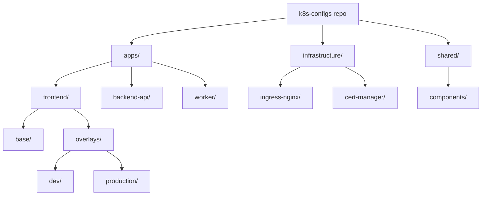

# How to Structure Kustomize Repos for ArgoCD Multi-Environment

Author: [nawazdhandala](https://github.com/nawazdhandala)

Tags: ArgoCD, GitOps, Kubernetes, Kustomize

Description: Learn how to structure your Kustomize Git repositories for ArgoCD multi-environment deployments, covering monorepo vs polyrepo layouts, directory conventions, and scaling patterns.

---

Repository structure is the foundation of a good GitOps workflow. Get it right and adding new applications or environments is trivial. Get it wrong and you end up with copy-pasted manifests, broken overlays, and merge conflicts on every pull request. The structure must serve both Kustomize (which needs clear base-overlay relationships) and ArgoCD (which needs clear paths for each Application).

This guide covers proven repository layouts, from simple single-app repos to enterprise-scale monorepos managing hundreds of applications across multiple clusters.

## Layout Principles

Before choosing a structure, consider these requirements:

1. **Each ArgoCD Application needs a single path** - one directory per deployable unit
2. **Bases should be shared, not duplicated** - overlays reference a common base
3. **Environment differences should be minimal and obvious** - the diff between dev and prod should be small
4. **New applications should follow a template** - adding an app should not require guesswork

## Layout 1: Single Application

For a single application with multiple environments:

```
my-api/
  base/
    kustomization.yaml
    deployment.yaml
    service.yaml
    configmap.yaml
  overlays/
    dev/
      kustomization.yaml
      patches/
        replicas.yaml
        resources.yaml
    staging/
      kustomization.yaml
      patches/
        replicas.yaml
        resources.yaml
    production/
      kustomization.yaml
      patches/
        replicas.yaml
        resources.yaml
        hpa.yaml
```

ArgoCD Applications:

```yaml
# One Application per environment
- name: my-api-dev
  path: my-api/overlays/dev

- name: my-api-staging
  path: my-api/overlays/staging

- name: my-api-production
  path: my-api/overlays/production
```

## Layout 2: Multi-Application Monorepo

For multiple applications in a single repository:

```
k8s-configs/
  apps/
    frontend/
      base/
        kustomization.yaml
        deployment.yaml
        service.yaml
      overlays/
        dev/
          kustomization.yaml
        production/
          kustomization.yaml
    backend-api/
      base/
        kustomization.yaml
        deployment.yaml
        service.yaml
      overlays/
        dev/
          kustomization.yaml
        production/
          kustomization.yaml
    worker/
      base/
        kustomization.yaml
        deployment.yaml
      overlays/
        dev/
          kustomization.yaml
        production/
          kustomization.yaml
  infrastructure/
    ingress-nginx/
      base/
        kustomization.yaml
      overlays/
        production/
          kustomization.yaml
    cert-manager/
      base/
        kustomization.yaml
      overlays/
        production/
          kustomization.yaml
  shared/
    components/
      monitoring-sidecar/
        kustomization.yaml
      network-policy/
        kustomization.yaml
```



## Layout 3: Environment-First Structure

Instead of organizing by application first, organize by environment. This layout works well when you want to see everything deployed to a specific environment in one place:

```
k8s-configs/
  bases/
    frontend/
      kustomization.yaml
      deployment.yaml
      service.yaml
    backend-api/
      kustomization.yaml
      deployment.yaml
      service.yaml
  environments/
    dev/
      frontend/
        kustomization.yaml  # References ../../bases/frontend
      backend-api/
        kustomization.yaml  # References ../../bases/backend-api
    staging/
      frontend/
        kustomization.yaml
      backend-api/
        kustomization.yaml
    production/
      frontend/
        kustomization.yaml
      backend-api/
        kustomization.yaml
```

ArgoCD path per application per environment: `environments/production/frontend`

## Layout 4: Multi-Cluster Structure

When deploying to multiple clusters:

```
k8s-configs/
  apps/
    frontend/
      base/
        kustomization.yaml
      overlays/
        cluster-us-east/
          dev/
            kustomization.yaml
          production/
            kustomization.yaml
        cluster-eu-west/
          dev/
            kustomization.yaml
          production/
            kustomization.yaml
```

Or flatten the cluster and environment into one level:

```
k8s-configs/
  apps/
    frontend/
      base/
        kustomization.yaml
      overlays/
        us-east-dev/
          kustomization.yaml
        us-east-prod/
          kustomization.yaml
        eu-west-dev/
          kustomization.yaml
        eu-west-prod/
          kustomization.yaml
```

## ArgoCD Application Definitions

Store ArgoCD Application manifests alongside the configs or in a separate directory:

```
k8s-configs/
  argocd/
    app-of-apps.yaml         # Parent application
    applications/
      frontend-dev.yaml
      frontend-production.yaml
      backend-api-dev.yaml
      backend-api-production.yaml
  apps/
    frontend/
      ...
    backend-api/
      ...
```

The parent Application of Apps pattern:

```yaml
# argocd/app-of-apps.yaml
apiVersion: argoproj.io/v1alpha1
kind: Application
metadata:
  name: app-of-apps
  namespace: argocd
spec:
  source:
    repoURL: https://github.com/myorg/k8s-configs.git
    targetRevision: main
    path: argocd/applications
  destination:
    server: https://kubernetes.default.svc
    namespace: argocd
```

## Shared Bases Across Applications

When multiple applications share common resources, create a shared base:

```
k8s-configs/
  shared/
    bases/
      microservice/
        kustomization.yaml   # Standard deployment, service, SA
        deployment.yaml
        service.yaml
        serviceaccount.yaml
      web-app/
        kustomization.yaml   # Standard web app with ingress
        deployment.yaml
        service.yaml
        ingress.yaml
  apps/
    frontend/
      base/
        kustomization.yaml   # Resources: ../../shared/bases/web-app
      overlays/
        production/
          kustomization.yaml
    backend-api/
      base/
        kustomization.yaml   # Resources: ../../shared/bases/microservice
      overlays/
        production/
          kustomization.yaml
```

## Scaling to Many Applications

For organizations with 50+ applications, use ApplicationSets to generate ArgoCD Applications from the directory structure:

```yaml
apiVersion: argoproj.io/v1alpha1
kind: ApplicationSet
metadata:
  name: all-apps
  namespace: argocd
spec:
  generators:
    - git:
        repoURL: https://github.com/myorg/k8s-configs.git
        revision: main
        directories:
          # Match all overlay directories
          - path: "apps/*/overlays/production"
  template:
    metadata:
      # Extract app name from path
      name: "{{path.basename}}-{{path[2]}}"
    spec:
      source:
        repoURL: https://github.com/myorg/k8s-configs.git
        targetRevision: main
        path: "{{path}}"
      destination:
        server: https://kubernetes.default.svc
        namespace: "{{path[2]}}"
```

This automatically creates an ArgoCD Application for every `apps/*/overlays/production` directory.

## File Naming Conventions

Consistency matters at scale:

```
base/
  kustomization.yaml       # Always this exact filename
  deployment.yaml          # Named by resource kind
  service.yaml
  configmap.yaml
  ingress.yaml
  hpa.yaml
overlays/
  production/
    kustomization.yaml
    patches/
      replicas.yaml        # Named by what they change
      resources.yaml
      ingress-host.yaml
```

## Common Mistakes

**Too many levels of nesting**: Three levels deep (app/overlay/env) is the practical maximum. More than that makes paths confusing.

**Mixing application code with configs**: Keep Kubernetes manifests in a separate repository from application source code. This allows different access controls and review processes.

**No shared components**: If every app has its own copy of the same monitoring sidecar patch, refactor into a shared component.

**Inconsistent naming**: Some apps use `overlays/prod`, others use `overlays/production`. Pick one and enforce it.

For more on ArgoCD ApplicationSets with Kustomize, see our [Kustomize with ApplicationSets guide](https://oneuptime.com/blog/post/2026-02-26-argocd-kustomize-applicationsets/view).
