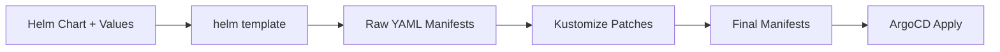

# How to Use kustomized-helm Plugin with ArgoCD

Author: [nawazdhandala](https://github.com/nawazdhandala)

Tags: ArgoCD, GitOps, Kubernetes, Helm, Kustomize

Description: Learn how to use the kustomized-helm plugin to combine Helm template rendering with Kustomize post-processing in ArgoCD for flexible deployments.

---

One of the most requested features in the ArgoCD community is the ability to render a Helm chart and then apply Kustomize patches on top of the output. ArgoCD natively supports Helm and Kustomize separately, but combining them in a single pipeline requires a Config Management Plugin. The kustomized-helm pattern solves this by running `helm template` first, then piping the result through `kustomize build`.

This approach is extremely useful when you need to deploy third-party Helm charts but want to make modifications that the chart's values file does not support - like adding custom labels, injecting sidecars, or patching resources with strategic merge patches.

## Why Combine Helm and Kustomize?

Helm charts are great for packaging applications, but they only expose the configuration options the chart author decided to include. When you need to:

- Add custom annotations to every resource in a Helm chart
- Inject sidecar containers that the chart does not support
- Override specific fields that are not exposed as Helm values
- Apply organization-wide patches to third-party charts
- Add additional resources alongside the chart output

Kustomize patches give you surgical control over the rendered output without forking the chart. The kustomized-helm plugin chains these two tools together.



## Setting Up the Plugin

### Plugin Configuration

Create the plugin definition:

```yaml
# plugin.yaml
apiVersion: argoproj.io/v1alpha1
kind: ConfigManagementPlugin
metadata:
  name: kustomized-helm
spec:
  version: v1.0
  init:
    command: [sh, -c]
    args:
      - |
        # If there is no Chart.yaml but there is a helmChart in kustomization
        # let kustomize handle the helm inflation
        if [ ! -f "Chart.yaml" ] && grep -q "helmCharts" kustomization.yaml 2>/dev/null; then
          echo "Using kustomize helm inflation mode"
          exit 0
        fi

        # Standard mode: build Helm dependencies first
        if [ -f "Chart.yaml" ]; then
          helm dependency build . 2>/dev/null || true
        fi
  generate:
    command: [sh, -c]
    args:
      - |
        # Mode 1: kustomize handles everything (helmCharts in kustomization.yaml)
        if [ ! -f "Chart.yaml" ] && grep -q "helmCharts" kustomization.yaml 2>/dev/null; then
          kustomize build . --enable-helm
          exit 0
        fi

        # Mode 2: helm template then kustomize
        # Determine the release name
        RELEASE_NAME=${ARGOCD_APP_NAME:-release}
        NAMESPACE=${ARGOCD_APP_NAMESPACE:-default}

        # Find values files
        VALUES_ARGS=""
        for f in values.yaml values-*.yaml; do
          if [ -f "$f" ]; then
            VALUES_ARGS="$VALUES_ARGS -f $f"
          fi
        done

        # Render Helm chart to a temporary directory
        mkdir -p /tmp/helm-output
        helm template "$RELEASE_NAME" . \
          --namespace "$NAMESPACE" \
          $VALUES_ARGS \
          --include-crds \
          > /tmp/helm-output/all.yaml

        # If there is a kustomization.yaml, use it
        # Otherwise just output the Helm result
        if [ -f "kustomization.yaml" ]; then
          # Create a kustomization that references the Helm output
          # if it does not already reference it
          if ! grep -q "helm-output" kustomization.yaml; then
            cp kustomization.yaml /tmp/helm-output/
            cd /tmp/helm-output
            kustomize edit add resource all.yaml 2>/dev/null || true
          fi
          kustomize build /tmp/helm-output
        else
          cat /tmp/helm-output/all.yaml
        fi
  discover:
    find:
      # Match directories that have both Chart.yaml and kustomization.yaml
      glob: "**/kustomization.yaml"
```

### Building the Sidecar Image

The sidecar needs both Helm and Kustomize installed:

```dockerfile
FROM alpine:3.19

# Install Helm
RUN apk add --no-cache curl bash git && \
    curl -fsSL https://raw.githubusercontent.com/helm/helm/main/scripts/get-helm-3 | bash

# Install Kustomize
RUN curl -fsSL https://raw.githubusercontent.com/kubernetes-sigs/kustomize/master/hack/install_kustomize.sh | bash && \
    mv kustomize /usr/local/bin/

# Copy ArgoCD CMP server
COPY --from=quay.io/argoproj/argocd:v2.10.0 \
    /usr/local/bin/argocd-cmp-server \
    /usr/local/bin/argocd-cmp-server

# Plugin configuration
COPY plugin.yaml /home/argocd/cmp-server/config/plugin.yaml

USER 999
ENTRYPOINT ["/usr/local/bin/argocd-cmp-server"]
```

### Adding to repo-server

```yaml
# kustomization.yaml for repo-server patch
apiVersion: apps/v1
kind: Deployment
metadata:
  name: argocd-repo-server
  namespace: argocd
spec:
  template:
    spec:
      containers:
        - name: kustomized-helm
          image: my-registry/argocd-kustomized-helm:v1.0
          securityContext:
            runAsNonRoot: true
            runAsUser: 999
          resources:
            requests:
              memory: "256Mi"
              cpu: "200m"
            limits:
              memory: "1Gi"
              cpu: "1000m"
          volumeMounts:
            - name: var-files
              mountPath: /var/run/argocd
            - name: plugins
              mountPath: /home/argocd/cmp-server/plugins
            - name: cmp-tmp
              mountPath: /tmp
            # Mount Helm cache for chart dependencies
            - name: helm-cache
              mountPath: /home/argocd/.cache/helm
      volumes:
        - name: helm-cache
          emptyDir: {}
```

## Repository Structure

Here is what a typical project using kustomized-helm looks like:

```
my-nginx-deployment/
  Chart.yaml           # Helm chart metadata (can reference remote chart)
  values.yaml          # Helm values
  kustomization.yaml   # Kustomize overlays applied after Helm render
  patches/
    add-labels.yaml    # Strategic merge patch
    inject-sidecar.yaml
```

### Chart.yaml

```yaml
# Chart.yaml - reference a remote Helm chart
apiVersion: v2
name: nginx-custom
version: 0.1.0
dependencies:
  - name: nginx
    version: "15.x.x"
    repository: https://charts.bitnami.com/bitnami
```

### values.yaml

```yaml
# values.yaml - standard Helm values
nginx:
  replicaCount: 3
  service:
    type: ClusterIP
    port: 80
  resources:
    requests:
      memory: "128Mi"
      cpu: "100m"
```

### kustomization.yaml

```yaml
# kustomization.yaml - patches applied after Helm render
apiVersion: kustomize.config.k8s.io/v1beta1
kind: Kustomization

# The Helm output will be added as a resource automatically
# by the plugin. Or you can reference it explicitly:
# resources:
#   - all.yaml

# Add common labels to all resources
commonLabels:
  team: platform
  cost-center: engineering

# Add common annotations
commonAnnotations:
  app.kubernetes.io/managed-by: argocd-kustomized-helm

# Apply patches
patches:
  # Add a sidecar container to the deployment
  - target:
      kind: Deployment
      name: ".*nginx.*"
    patch: |
      apiVersion: apps/v1
      kind: Deployment
      metadata:
        name: placeholder
      spec:
        template:
          spec:
            containers:
              - name: log-forwarder
                image: fluent/fluent-bit:latest
                resources:
                  requests:
                    memory: "64Mi"
                    cpu: "50m"

  # Modify the service to add extra annotations
  - target:
      kind: Service
    patch: |
      apiVersion: v1
      kind: Service
      metadata:
        name: placeholder
        annotations:
          service.beta.kubernetes.io/aws-load-balancer-internal: "true"
```

## Creating the ArgoCD Application

```yaml
apiVersion: argoproj.io/v1alpha1
kind: Application
metadata:
  name: nginx-production
  namespace: argocd
spec:
  project: default
  source:
    repoURL: https://github.com/myorg/k8s-configs.git
    targetRevision: main
    path: apps/nginx-production
    plugin:
      name: kustomized-helm
      env:
        - name: HELM_RELEASE_NAME
          value: nginx-prod
  destination:
    server: https://kubernetes.default.svc
    namespace: nginx
  syncPolicy:
    automated:
      prune: true
      selfHeal: true
    syncOptions:
      - CreateNamespace=true
```

## Alternative: Using ArgoCD Multi-Source

Since ArgoCD v2.6, you can achieve a similar result using multi-source applications without a plugin. However, the kustomized-helm plugin approach is still preferred when:

- You need Kustomize patches to modify specific Helm-rendered resources
- Your kustomization references the Helm output as a resource
- You want a single source of truth in one directory
- Your patches are tightly coupled to the Helm chart version

The multi-source approach works better when the Helm chart and Kustomize overlays live in separate repositories.

## Troubleshooting Common Issues

**Helm dependencies not resolving**: Make sure the init command runs `helm dependency build` and that the sidecar has network access to the Helm repository.

**Kustomize patch not matching**: Verify that the target resource name in your patch matches exactly what Helm generates. Run `helm template` locally to check the exact names.

**Empty output**: Check that the generate command's logic correctly handles your directory structure. Add `set -x` at the top of the generate script for verbose logging during debugging.

```bash
# Debug locally by simulating what the plugin does
cd my-nginx-deployment/
helm dependency build .
helm template my-release . -f values.yaml > /tmp/all.yaml
cp kustomization.yaml /tmp/
cd /tmp
kustomize build .
```

## Summary

The kustomized-helm plugin bridges the gap between Helm's packaging power and Kustomize's patching flexibility. By chaining `helm template` with `kustomize build`, you get full control over third-party Helm charts without forking them. This pattern is one of the most popular CMP use cases in the ArgoCD ecosystem, and for good reason - it solves a real pain point that teams hit as soon as they start deploying third-party software at scale.
