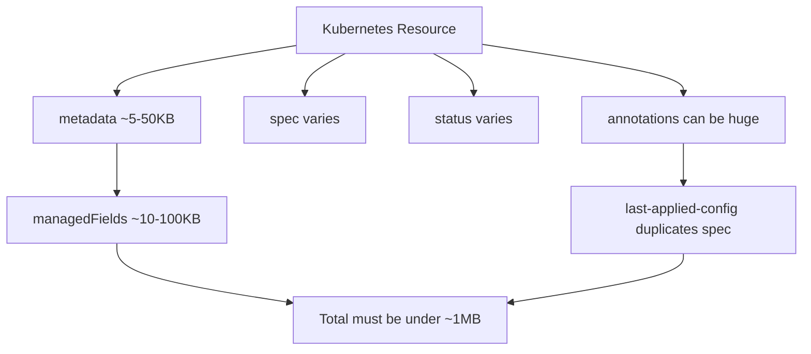

# How to Handle Large Application Manifests Over 1MB in ArgoCD

Author: [nawazdhandala](https://github.com/nawazdhandala)

Tags: ArgoCD, GitOps, Kubernetes, Performance, Troubleshooting

Description: Learn how to manage large application manifests that exceed the 1MB etcd size limit in ArgoCD, including splitting strategies, compression, and architectural patterns.

---

Kubernetes stores all resources in etcd, and etcd has a hard limit of approximately 1.5MB per key-value pair. The practical limit for a Kubernetes resource is about 1MB after encoding overhead. When ArgoCD generates or manages manifests that approach this limit, you run into errors during sync, and applications fail to deploy. This guide covers why this happens and how to work around it.

## Understanding the Size Limit

The etcd size limit applies to the serialized form of any Kubernetes resource. This includes the entire resource - metadata, spec, status, annotations, and managed fields. Several things can push a resource past this limit:

- Large ConfigMaps or Secrets with embedded configuration files
- Helm releases with extensive template output stored in release Secrets
- Resources with the `kubectl.kubernetes.io/last-applied-configuration` annotation (which duplicates the entire spec)
- ArgoCD Application resources that manage hundreds of child resources (the status field grows large)
- CRD instances with complex status sections



## Detecting Size Issues

Before you hit the limit, you can measure resource sizes.

```bash
# Check the size of a specific resource in bytes
kubectl get configmap large-config -n default -o json | wc -c

# Find the largest resources in a namespace
for kind in configmap secret deployment service; do
  kubectl get "$kind" -n default -o json | \
    jq -r ".items[] | \"\(.metadata.name): \(. | tostring | length) bytes\"" | \
    sort -t: -k2 -n -r | head -5
  echo "--- $kind ---"
done

# Check the size of an ArgoCD Application resource
kubectl get application my-app -n argocd -o json | wc -c
```

When a resource exceeds the limit, you will see errors like:

```text
rpc error: code = ResourceExhausted desc = trying to send message larger than max
```

Or:

```text
etcd: request is too large
```

## Strategy 1: Split Large ConfigMaps and Secrets

The most common cause of oversized resources is large ConfigMaps. Split them into smaller pieces.

```yaml
# Instead of one giant ConfigMap
# apiVersion: v1
# kind: ConfigMap
# metadata:
#   name: app-config
# data:
#   nginx.conf: |
#     ... 500KB of config ...
#   app-settings.json: |
#     ... 300KB of settings ...

# Split into multiple ConfigMaps
apiVersion: v1
kind: ConfigMap
metadata:
  name: app-config-nginx
data:
  nginx.conf: |
    # Just the nginx config here
    worker_processes auto;
    events {
      worker_connections 1024;
    }
    http {
      # ... nginx configuration ...
    }

---
apiVersion: v1
kind: ConfigMap
metadata:
  name: app-config-settings
data:
  app-settings.json: |
    {
      "database": { "host": "db.example.com" },
      "cache": { "host": "redis.example.com" }
    }
```

Then mount them separately in your Deployment.

```yaml
apiVersion: apps/v1
kind: Deployment
metadata:
  name: my-app
spec:
  template:
    spec:
      containers:
        - name: app
          image: myapp:v1
          volumeMounts:
            - name: nginx-config
              mountPath: /etc/nginx
            - name: app-settings
              mountPath: /app/config
      volumes:
        - name: nginx-config
          configMap:
            name: app-config-nginx
        - name: app-settings
          configMap:
            name: app-config-settings
```

## Strategy 2: Use External Configuration Storage

For very large configuration data, store it outside of Kubernetes entirely.

```yaml
# Use an init container to fetch config from S3 or a config service
apiVersion: apps/v1
kind: Deployment
metadata:
  name: my-app
spec:
  template:
    spec:
      initContainers:
        - name: fetch-config
          image: amazon/aws-cli:2.13.0
          command:
            - sh
            - -c
            - |
              # Download large config files from S3
              aws s3 cp s3://my-config-bucket/nginx.conf /config/nginx.conf
              aws s3 cp s3://my-config-bucket/app-settings.json /config/app-settings.json
          volumeMounts:
            - name: config-volume
              mountPath: /config
          env:
            - name: AWS_REGION
              value: us-east-1
      containers:
        - name: app
          image: myapp:v1
          volumeMounts:
            - name: config-volume
              mountPath: /app/config
      volumes:
        - name: config-volume
          emptyDir: {}
```

## Strategy 3: Reduce Helm Release Secret Size

Helm stores release information in Secrets, and these can grow very large with complex charts. ArgoCD uses Helm as a manifest generator, so this is less of an issue than with standalone Helm. However, if you are using ArgoCD to manage Helm releases that were originally installed with Helm, the release Secrets can be problematic.

```bash
# Check the size of Helm release secrets
kubectl get secrets -n default -l "owner=helm" -o json | \
  jq -r '.items[] | "\(.metadata.name): \(. | tostring | length) bytes"' | \
  sort -t: -k2 -n -r

# Reduce Helm history to minimize stored releases
# In your ArgoCD Application
```

```yaml
apiVersion: argoproj.io/v1alpha1
kind: Application
metadata:
  name: my-helm-app
  namespace: argocd
spec:
  source:
    repoURL: https://charts.example.com
    chart: my-chart
    targetRevision: 1.0.0
    helm:
      # Limit revision history to reduce secret size
      parameters:
        - name: revisionHistoryLimit
          value: "3"
```

## Strategy 4: Remove the last-applied-configuration Annotation

The `kubectl.kubernetes.io/last-applied-configuration` annotation stores a complete copy of the manifest. For large resources, this can nearly double the size.

```yaml
# Enable server-side apply to avoid the annotation entirely
apiVersion: argoproj.io/v1alpha1
kind: Application
metadata:
  name: my-app
  namespace: argocd
spec:
  syncPolicy:
    syncOptions:
      - ServerSideApply=true
```

Or strip it from existing resources.

```bash
# Remove the annotation from a specific resource
kubectl annotate configmap large-config \
  kubectl.kubernetes.io/last-applied-configuration- \
  -n default
```

For a deeper dive on this annotation, see [handling last applied configuration annotation issues](https://oneuptime.com/blog/post/2026-02-26-argocd-last-applied-configuration-issues/view).

## Strategy 5: Split ArgoCD Applications

When a single ArgoCD Application manages hundreds of resources, its status section grows large. Split it into smaller applications using the App of Apps pattern or ApplicationSets.

```yaml
# Instead of one massive application
# Split by component or microservice

# App of Apps parent
apiVersion: argoproj.io/v1alpha1
kind: Application
metadata:
  name: platform
  namespace: argocd
spec:
  project: default
  source:
    repoURL: https://github.com/org/platform.git
    targetRevision: main
    path: apps  # Contains Application manifests for each component
  destination:
    server: https://kubernetes.default.svc
    namespace: argocd

---
# Each child application manages a smaller set of resources
# apps/frontend.yaml
apiVersion: argoproj.io/v1alpha1
kind: Application
metadata:
  name: frontend
  namespace: argocd
spec:
  project: default
  source:
    repoURL: https://github.com/org/platform.git
    targetRevision: main
    path: manifests/frontend
  destination:
    server: https://kubernetes.default.svc
    namespace: frontend

---
# apps/backend.yaml
apiVersion: argoproj.io/v1alpha1
kind: Application
metadata:
  name: backend
  namespace: argocd
spec:
  project: default
  source:
    repoURL: https://github.com/org/platform.git
    targetRevision: main
    path: manifests/backend
  destination:
    server: https://kubernetes.default.svc
    namespace: backend
```

For more on this pattern, see [ArgoCD Helm App of Apps pattern](https://oneuptime.com/blog/post/2026-02-26-argocd-helm-app-of-apps-pattern/view).

## Strategy 6: Reduce managedFields Size

Kubernetes tracks field ownership in `metadata.managedFields`, and this can grow substantial when many controllers touch a resource. While you cannot directly control this, using server-side apply consistently with a single field manager minimizes it.

```bash
# Check how much space managedFields takes
kubectl get deployment my-app -o json | jq '.metadata.managedFields | tostring | length'

# If multiple managers are listed, consolidate
kubectl get deployment my-app -o json | jq '[.metadata.managedFields[].manager]'
```

## Strategy 7: Use Binary Data Compression

For ConfigMaps and Secrets that contain binary or compressible data, use the `binaryData` field with base64-encoded compressed content.

```yaml
apiVersion: v1
kind: ConfigMap
metadata:
  name: compressed-config
binaryData:
  # Store gzip-compressed config data
  # Generate with: gzip -c config.json | base64
  config.json.gz: H4sIAAAAAAAAA6tWKkktLlGyUlAqS8wpTgUA...
```

Then decompress in an init container or in the application itself.

```yaml
initContainers:
  - name: decompress
    image: busybox:1.36
    command:
      - sh
      - -c
      - |
        # Decompress the config file
        gunzip -c /compressed/config.json.gz > /config/config.json
    volumeMounts:
      - name: compressed
        mountPath: /compressed
      - name: config
        mountPath: /config
```

## Monitoring Resource Sizes

Set up monitoring to catch resources approaching the limit before they fail.

```bash
# Script to find resources over 500KB (warning threshold)
#!/bin/bash
THRESHOLD=512000  # 500KB in bytes
for ns in $(kubectl get ns -o jsonpath='{.items[*].metadata.name}'); do
  for kind in configmap secret; do
    kubectl get "$kind" -n "$ns" -o json 2>/dev/null | \
      jq -r ".items[] | select((. | tostring | length) > $THRESHOLD) | \"WARNING: $kind/\(.metadata.name) in $ns is \(. | tostring | length) bytes\"" 2>/dev/null
  done
done
```

## Summary

The 1MB etcd limit is a hard constraint that requires architectural thinking. Split large ConfigMaps into smaller pieces, use external storage for very large configuration data, enable server-side apply to eliminate the last-applied-configuration annotation bloat, and break monolithic ArgoCD Applications into smaller ones. The best approach depends on what is eating the space - use the diagnostic commands above to find the culprit, then apply the matching strategy.
