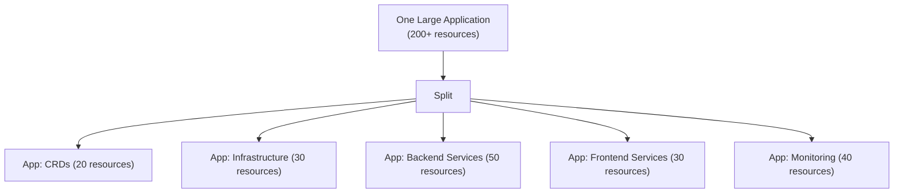

# How to Handle Large Kustomize Overlays in ArgoCD

Author: [nawazdhandala](https://github.com/nawazdhandala)

Tags: ArgoCD, GitOps, Kubernetes, Kustomize, Performance

Description: Learn how to manage large Kustomize overlays in ArgoCD, including performance optimization, resource limits, splitting strategies, and handling builds that produce hundreds of resources.

---

Small Kustomize overlays with 10 resources build in milliseconds and sync without issues. But when your overlay grows to 200+ resources - maybe a full platform stack with dozens of Deployments, Services, ConfigMaps, CRDs, and custom resources - ArgoCD starts struggling. Builds take longer, the repo server runs out of memory, the UI becomes slow to load the resource tree, and sync operations time out.

This guide covers the practical techniques for managing large Kustomize overlays in ArgoCD, from performance tuning to structural changes that reduce the problem at its source.

## Symptoms of Large Overlay Problems

You know your overlay is too large when:

- ArgoCD shows "ComparisonError" intermittently due to timeouts
- The repo server pod gets OOMKilled
- The UI takes 10+ seconds to load the application resource tree
- Sync operations time out before completing
- `argocd app diff` takes a long time to return

## Measuring the Problem

First, quantify the size of your overlay:

```bash
# Count the number of resources generated
kustomize build overlays/production | grep "^kind:" | wc -l

# Measure the total YAML size
kustomize build overlays/production | wc -c

# Measure build time
time kustomize build overlays/production > /dev/null

# Check resource counts per kind
kustomize build overlays/production | grep "^kind:" | sort | uniq -c | sort -rn
```

As a rough guide:
- Under 50 resources: No issues expected
- 50 to 200 resources: Watch for performance, consider splitting
- 200+ resources: Likely need splitting or performance tuning

## Strategy 1: Split Into Multiple Applications

The most effective approach is breaking one large overlay into smaller, independently syncable applications:



Restructure your Kustomize layout:

```text
platform/
  crds/
    base/
      kustomization.yaml
    overlays/
      production/
        kustomization.yaml
  infrastructure/
    base/
      kustomization.yaml    # ingress, cert-manager configs
    overlays/
      production/
        kustomization.yaml
  backend/
    base/
      kustomization.yaml    # API, workers, background jobs
    overlays/
      production/
        kustomization.yaml
  frontend/
    base/
      kustomization.yaml    # Web apps, static assets
    overlays/
      production/
        kustomization.yaml
  monitoring/
    base/
      kustomization.yaml    # Prometheus, Grafana, alerting
    overlays/
      production/
        kustomization.yaml
```

Create separate ArgoCD Applications with sync waves to control ordering:

```yaml
apiVersion: argoproj.io/v1alpha1
kind: Application
metadata:
  name: platform-crds
  annotations:
    argocd.argoproj.io/sync-wave: "-2"
spec:
  source:
    path: platform/crds/overlays/production
  # ...

---
apiVersion: argoproj.io/v1alpha1
kind: Application
metadata:
  name: platform-infrastructure
  annotations:
    argocd.argoproj.io/sync-wave: "-1"
spec:
  source:
    path: platform/infrastructure/overlays/production
  # ...

---
apiVersion: argoproj.io/v1alpha1
kind: Application
metadata:
  name: platform-backend
  annotations:
    argocd.argoproj.io/sync-wave: "0"
spec:
  source:
    path: platform/backend/overlays/production
  # ...
```

## Strategy 2: Tune ArgoCD Repo Server Resources

If splitting is not immediately feasible, increase the repo server's resources:

```yaml
apiVersion: apps/v1
kind: Deployment
metadata:
  name: argocd-repo-server
  namespace: argocd
spec:
  template:
    spec:
      containers:
        - name: repo-server
          resources:
            requests:
              cpu: "1"
              memory: 1Gi
            limits:
              cpu: "2"
              memory: 4Gi
          env:
            # Increase the exec timeout for large builds
            - name: ARGOCD_EXEC_TIMEOUT
              value: "300s"
```

## Strategy 3: Increase Timeouts

Configure ArgoCD to allow more time for large builds:

```yaml
# argocd-cm ConfigMap
apiVersion: v1
kind: ConfigMap
metadata:
  name: argocd-cm
  namespace: argocd
data:
  # Timeout for exec commands (kustomize build)
  exec.timeout: "300"

  # Timeout for repo server operations
  timeout.reconciliation: "300s"
```

## Strategy 4: Repo Server Scaling

Run multiple repo server replicas to handle concurrent builds:

```yaml
apiVersion: apps/v1
kind: Deployment
metadata:
  name: argocd-repo-server
  namespace: argocd
spec:
  replicas: 3  # Scale horizontally
  template:
    spec:
      containers:
        - name: repo-server
          env:
            # Enable parallel manifest generation
            - name: ARGOCD_REPO_SERVER_PARALLELISM_LIMIT
              value: "5"
```

## Strategy 5: Optimize Kustomize Build

Reduce build time by optimizing the Kustomize configuration:

### Remove Unnecessary Generators

ConfigMap and Secret generators with hash suffixes force ArgoCD to diff every resource on every check:

```yaml
# If hash suffixes cause issues, disable them
generatorOptions:
  disableNameSuffixHash: true
```

### Reduce Patch Complexity

Many small patches are slower than fewer larger patches:

```yaml
# Instead of 20 small patches
patches:
  - path: patch1.yaml
  - path: patch2.yaml
  # ... 18 more

# Combine into fewer files
patches:
  - path: deployment-patches.yaml   # All deployment patches in one file
  - path: service-patches.yaml      # All service patches in one file
```

### Avoid Remote Bases in Large Overlays

Remote bases require Git clones, adding significant time:

```yaml
# Slow: remote base cloned every build
resources:
  - https://github.com/myorg/shared-base//k8s?ref=v1.0.0

# Faster: local copy or Git submodule
resources:
  - ../../shared-base/k8s
```

## Strategy 6: Use Server-Side Diff

ArgoCD 2.5+ supports server-side diff, which offloads comparison to the Kubernetes API server:

```yaml
apiVersion: argoproj.io/v1alpha1
kind: Application
metadata:
  name: large-platform
  annotations:
    argocd.argoproj.io/compare-options: ServerSideDiff=true
spec:
  # ...
```

This reduces memory usage in the ArgoCD application controller for large applications.

## Strategy 7: Resource Tracking Optimization

For very large applications, switch to annotation-based tracking:

```yaml
# argocd-cm ConfigMap
data:
  application.resourceTrackingMethod: annotation
```

Annotation-based tracking is more efficient for applications with many resources because it does not rely on label matching.

## Monitoring Build Performance

Track build times to catch regressions:

```bash
# Check repo server metrics
kubectl port-forward -n argocd svc/argocd-repo-server 8084:8084

# Prometheus metrics endpoint
curl http://localhost:8084/metrics | grep argocd_repo_server

# Key metrics to watch:
# argocd_repo_server_git_request_duration_seconds
# argocd_repo_server_git_request_total
```

Set up alerts for builds that take longer than expected:

```yaml
# Prometheus alert
- alert: ArgocdSlowBuild
  expr: |
    histogram_quantile(0.95, argocd_repo_server_git_request_duration_seconds_bucket) > 60
  for: 5m
  labels:
    severity: warning
  annotations:
    summary: "ArgoCD builds taking longer than 60 seconds"
```

## When to Split vs When to Tune

| Scenario | Recommendation |
|----------|---------------|
| 50 to 100 resources, occasional timeouts | Increase resources and timeouts |
| 100 to 200 resources, frequent timeouts | Split into 2 to 3 applications |
| 200+ resources | Split into logical domains |
| Resources from multiple teams | Always split by team ownership |
| Resources with different sync frequencies | Split by update frequency |
| CRDs mixed with workloads | Always separate CRDs |

The long-term solution is always to split. Tuning buys time but does not solve the fundamental scaling issue.

## Verifying After Optimization

After making changes, verify improvement:

```bash
# Measure sync time
time argocd app sync my-app

# Check for OOMKilled events
kubectl get events -n argocd --field-selector reason=OOMKilling

# Monitor repo server memory usage
kubectl top pod -n argocd -l app.kubernetes.io/component=repo-server
```

For more on structuring your Kustomize repos effectively, see our [repository structure guide](https://oneuptime.com/blog/post/2026-02-26-argocd-kustomize-repo-structure/view).
