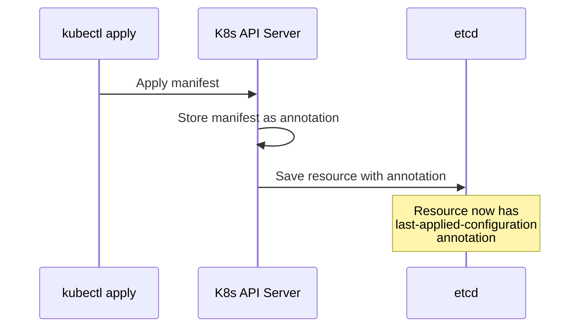
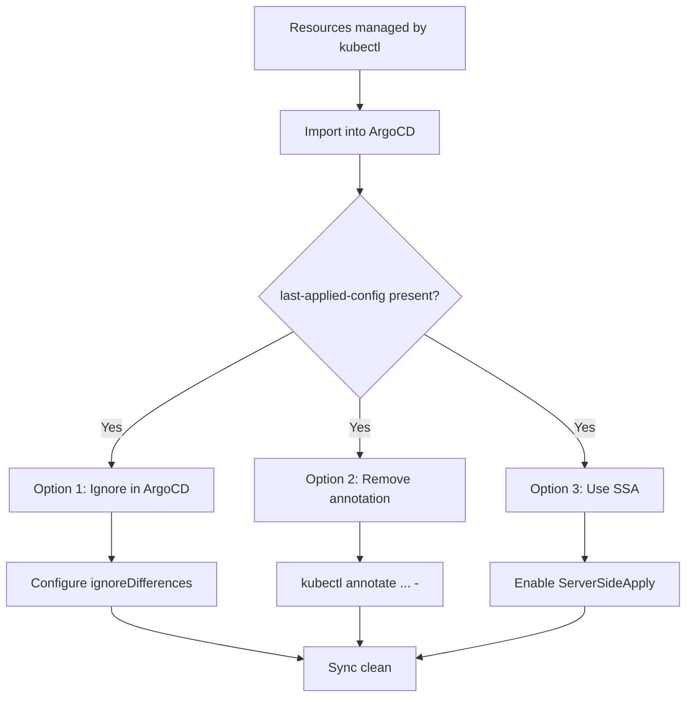

# How to Handle last-applied-configuration Annotation Diffs in ArgoCD

Author: [nawazdhandala](https://github.com/nawazdhandala)

Tags: ArgoCD, GitOps, Kubernetes, Annotations, Diff Customization

Description: Learn how to resolve the kubectl.kubernetes.io/last-applied-configuration annotation causing false OutOfSync status in ArgoCD applications.

---

One of the most frequent sources of diff noise in ArgoCD is the `kubectl.kubernetes.io/last-applied-configuration` annotation. This annotation is a relic of client-side apply, and it stores a full JSON copy of the last configuration applied using `kubectl apply`. When ArgoCD manages resources that were previously managed by `kubectl`, or when someone runs `kubectl apply` alongside ArgoCD, this annotation creates persistent OutOfSync warnings.

This guide explains what the annotation is, why it causes problems, and multiple strategies to handle it.

## What Is last-applied-configuration?

When you run `kubectl apply`, Kubernetes stores the entire manifest you applied as a JSON string in the annotation `kubectl.kubernetes.io/last-applied-configuration`. This is how client-side apply calculates three-way merge diffs on subsequent applies.

```bash
# Look at the annotation on a resource
kubectl get deployment my-app -o jsonpath='{.metadata.annotations.kubectl\.kubernetes\.io/last-applied-configuration}' | jq '.'
```

The annotation contains a full JSON representation of the resource, which can be thousands of characters long.



## Why It Causes Problems in ArgoCD

ArgoCD does not add this annotation when it applies resources. It uses its own tracking mechanism. But if the annotation already exists on a resource, or if someone manually runs `kubectl apply` on a resource ArgoCD manages, the annotation content may not match what ArgoCD expects.

The problems manifest in several ways:

1. **Initial migration**: You move from kubectl-managed resources to ArgoCD. All resources have the annotation, but ArgoCD's desired state does not include it
2. **Manual intervention**: An engineer runs `kubectl apply` to hotfix something. The annotation gets updated with their changes
3. **Different serialization**: ArgoCD and kubectl may serialize the same manifest differently, causing the annotation contents to mismatch even when the actual resource configuration is identical
4. **Growing diff size**: The annotation contains the entire previous manifest, so the diff output becomes enormous and hard to read

## Solution 1: Ignore the Annotation with JSON Pointer

The simplest fix is to tell ArgoCD to ignore this annotation in diffs.

### Per-Application

```yaml
apiVersion: argoproj.io/v1alpha1
kind: Application
metadata:
  name: my-app
spec:
  source:
    repoURL: https://github.com/myorg/my-app.git
    targetRevision: main
    path: k8s
  destination:
    server: https://kubernetes.default.svc
    namespace: default
  ignoreDifferences:
    - group: "*"
      kind: "*"
      jsonPointers:
        - /metadata/annotations/kubectl.kubernetes.io~1last-applied-configuration
```

Note the `~1` escape for the forward slash in the annotation key.

### System-Level (Recommended)

Since this annotation affects all resource types, configure it globally:

```yaml
apiVersion: v1
kind: ConfigMap
metadata:
  name: argocd-cm
  namespace: argocd
data:
  resource.customizations.ignoreDifferences.all: |
    jsonPointers:
      - /metadata/annotations/kubectl.kubernetes.io~1last-applied-configuration
```

This applies to every resource ArgoCD manages across all applications.

## Solution 2: Remove the Annotation

If you want to clean up rather than ignore, you can strip the annotation from existing resources:

```bash
# Remove from a single resource
kubectl annotate deployment my-app kubectl.kubernetes.io/last-applied-configuration-

# Remove from all Deployments in a namespace
kubectl get deployments -n production -o name | \
  xargs -I {} kubectl annotate {} kubectl.kubernetes.io/last-applied-configuration-

# Remove from all resources in a namespace (use with caution)
for kind in deployment service configmap secret; do
  kubectl get $kind -n production -o name | \
    xargs -I {} kubectl annotate {} kubectl.kubernetes.io/last-applied-configuration-
done
```

After removing the annotation, ArgoCD should sync cleanly. However, if anyone runs `kubectl apply` again, the annotation comes back.

## Solution 3: Use Server-Side Apply

Server-side apply does not use the `last-applied-configuration` annotation. Instead, it uses the `managedFields` metadata for three-way merge diffs. Switching ArgoCD to server-side apply eliminates this problem entirely:

```yaml
apiVersion: argoproj.io/v1alpha1
kind: Application
metadata:
  name: my-app
spec:
  source:
    repoURL: https://github.com/myorg/my-app.git
    targetRevision: main
    path: k8s
  destination:
    server: https://kubernetes.default.svc
    namespace: default
  syncPolicy:
    syncOptions:
      - ServerSideApply=true
```

With server-side apply enabled, ArgoCD creates resources without the `last-applied-configuration` annotation and uses field ownership for merging.

## Solution 4: Use Server-Side Diff

Even without switching to server-side apply for sync operations, you can enable server-side diff for comparison only:

```yaml
apiVersion: argoproj.io/v1alpha1
kind: Application
metadata:
  name: my-app
  annotations:
    argocd.argoproj.io/compare-options: ServerSideDiff=true
spec:
  source:
    repoURL: https://github.com/myorg/my-app.git
    targetRevision: main
    path: k8s
  destination:
    server: https://kubernetes.default.svc
    namespace: default
```

Server-side diff naturally handles the `last-applied-configuration` annotation because it compares the dry-run result against the live state, and neither side includes the annotation in the comparison.

## Solution 5: Prevent Manual kubectl apply

The root cause is often people running `kubectl apply` on resources ArgoCD manages. Prevent this with RBAC:

```yaml
# ClusterRole that prevents apply on ArgoCD-managed resources
apiVersion: rbac.authorization.k8s.io/v1
kind: ClusterRole
metadata:
  name: no-direct-apply
rules:
  - apiGroups: ["apps"]
    resources: ["deployments"]
    verbs: ["get", "list", "watch"]  # No create, update, patch
```

Alternatively, use an admission webhook like OPA Gatekeeper to reject `kubectl apply` operations on resources with ArgoCD tracking labels:

```yaml
apiVersion: templates.gatekeeper.sh/v1
kind: ConstraintTemplate
metadata:
  name: preventdirectapply
spec:
  crd:
    spec:
      names:
        kind: PreventDirectApply
  targets:
    - target: admission.k8s.gatekeeper.sh
      rego: |
        package preventdirectapply
        violation[{"msg": msg}] {
          input.review.object.metadata.labels["app.kubernetes.io/managed-by"] == "argocd"
          input.review.userInfo.username != "system:serviceaccount:argocd:argocd-application-controller"
          msg := "Direct modifications to ArgoCD-managed resources are not allowed"
        }
```

## Migration Strategy: kubectl to ArgoCD

When migrating resources from kubectl management to ArgoCD management:



Recommended migration steps:

1. Add the global ignore rule for `last-applied-configuration` to `argocd-cm`
2. Import resources into ArgoCD applications
3. Verify sync status is clean
4. Optionally remove the annotations from cluster resources
5. Optionally switch to server-side apply for a permanent solution

## Handling the Annotation in CI/CD

If your CI/CD pipeline uses `kubectl apply` before ArgoCD takes over:

```bash
# Apply with kubectl but then remove the annotation
kubectl apply -f manifest.yaml
kubectl annotate deployment my-app \
  kubectl.kubernetes.io/last-applied-configuration- \
  --overwrite

# Or better: use kubectl create --save-config=false
kubectl create -f manifest.yaml --save-config=false
```

## Debugging

If you have configured the ignore rule but still see diffs:

```bash
# Check if the annotation is the source of the diff
argocd app diff my-app 2>&1 | grep "last-applied"

# Verify your ignore rule is in the ConfigMap
kubectl get cm argocd-cm -n argocd -o yaml | grep "last-applied"

# Hard refresh the application
argocd app get my-app --hard-refresh

# Check if there are other diff sources
argocd app diff my-app
```

The `last-applied-configuration` annotation is one of those annoying migration artifacts that bites every team transitioning from kubectl to ArgoCD. The fastest fix is the global ignore rule in `argocd-cm`. The cleanest long-term fix is server-side apply. Either way, this should not be something your team wastes time investigating repeatedly.
