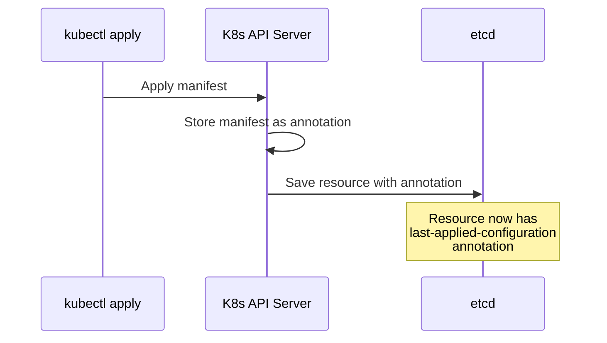
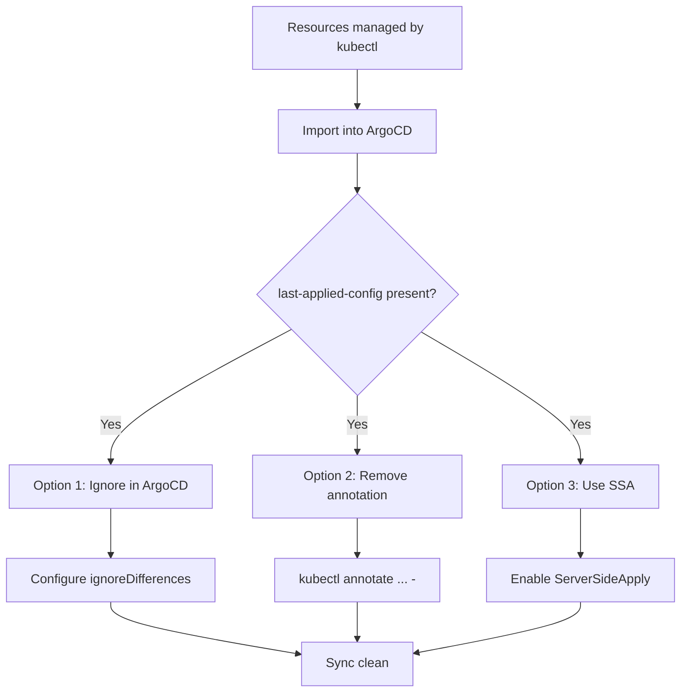

# How to Handle last-applied-configuration Annotation Diffs in ArgoCD

Author: [nawazdhandala](https://github.com/nawazdhandala)

Tags: ArgoCD, GitOps, Kubernetes, Annotation, Diff Customization

Description: Learn how to resolve the kubectl.kubernetes.io/last-applied-configuration annotation causing false OutOfSync status in ArgoCD applications.

---

One source of diff noise in ArgoCD is the `kubectl.kubernetes.io/last-applied-configuration` annotation. This annotation is used by client-side apply, and it stores a full JSON copy of the last configuration applied using `kubectl apply`. When ArgoCD manages resources that were previously managed by `kubectl`, or when someone runs `kubectl apply` alongside ArgoCD, this annotation can make diff output noisy or influence ArgoCD's legacy three-way diff behavior.

This guide explains what the annotation is, why it causes problems, and multiple strategies to handle it.

## What Is last-applied-configuration?

When you run `kubectl apply`, Kubernetes stores the entire manifest you applied as a JSON string in the annotation `kubectl.kubernetes.io/last-applied-configuration`. This is how client-side apply calculates three-way merge diffs on subsequent applies.

```bash
# Look at the annotation on a resource

kubectl get deployment my-app -o jsonpath='{.metadata.annotations.kubectl\.kubernetes\.io/last-applied-configuration}' | jq '.'
```

The annotation contains a full JSON representation of the resource, which can be thousands of characters long.


```mermaid
sequenceDiagram
    participant User as kubectl apply
    participant API as K8s API Server
    participant etcd as etcd

    User->>API: Apply manifest
    API->>API: Store manifest as annotation
    API->>etcd: Save resource with annotation
    Note over etcd: Resource now has<br/>last-applied-configuration<br/>annotation
```

## Why It Causes Problems in ArgoCD

By default, ArgoCD applies resources with client-side `kubectl apply`, which relies on this annotation to store the previous applied state. ArgoCD also uses its own resource tracking mechanism to decide which resources belong to an application. If the annotation already exists on a resource, becomes stale, or is updated by someone manually running `kubectl apply` on a resource ArgoCD manages, the annotation content can make comparisons harder to understand.

The problems manifest in several ways:

1. **Initial migration**: You move from kubectl-managed resources to ArgoCD. Existing resources may have stale or very large last-applied annotations
2. **Manual intervention**: An engineer runs `kubectl apply` to hotfix something. The annotation gets updated with their changes
3. **Different serialization**: Tools may serialize the same manifest differently, causing the annotation contents to look different even when the actual resource configuration is identical
4. **Growing diff size**: The annotation contains the entire previous manifest, so the diff output becomes enormous and hard to read

## Solution 1: Ignore the Annotation with JSON Pointer

If the annotation itself is showing up as a diff, tell ArgoCD to ignore it in comparisons.

### Per-Application

```yaml
apiVersion: argoproj.io/v1alpha1
kind: Application
metadata:
  name: my-app
spec:
  source:
    repoURL: https://github.com/myorg/my-app.git
    targetRevision: main
    path: k8s
  destination:
    server: https://kubernetes.default.svc
    namespace: default
  ignoreDifferences:
    - group: "*"
      kind: "*"
      jsonPointers:
        - /metadata/annotations/kubectl.kubernetes.io~1last-applied-configuration
```

Note the `~1` escape for the forward slash in the annotation key.

### System-Level (Recommended)

Since this annotation can appear on many resource types, configure it globally:

```yaml
apiVersion: v1
kind: ConfigMap
metadata:
  name: argocd-cm
  namespace: argocd
data:
  resource.customizations.ignoreDifferences.all: |
    jsonPointers:
      - /metadata/annotations/kubectl.kubernetes.io~1last-applied-configuration
```

This applies to every resource ArgoCD manages across all applications.

## Solution 2: Remove the Annotation

If you want to clean up rather than ignore, you can strip the annotation from existing resources:

```bash
# Remove from a single resource
kubectl annotate deployment my-app kubectl.kubernetes.io/last-applied-configuration-

# Remove from all Deployments in a namespace
kubectl get deployments -n production -o name | \
  xargs -I {} kubectl annotate {} kubectl.kubernetes.io/last-applied-configuration-

# Remove from all resources in a namespace (use with caution)
for kind in deployment service configmap secret; do
  kubectl get $kind -n production -o name | \
    xargs -I {} kubectl annotate {} kubectl.kubernetes.io/last-applied-configuration-
done
```

After removing the annotation, ArgoCD can recreate it during a normal client-side apply sync. If anyone runs `kubectl apply` again, the annotation also comes back.

## Solution 3: Use Server-Side Apply

Server-side apply does not use the `last-applied-configuration` annotation for apply state. Instead, it uses `managedFields` metadata for field ownership. Switching ArgoCD to server-side apply avoids the annotation size limit and removes the client-side apply dependency on this annotation:

```yaml
apiVersion: argoproj.io/v1alpha1
kind: Application
metadata:
  name: my-app
spec:
  source:
    repoURL: https://github.com/myorg/my-app.git
    targetRevision: main
    path: k8s
  destination:
    server: https://kubernetes.default.svc
    namespace: default
  syncPolicy:
    syncOptions:
      - ServerSideApply=true
```

With server-side apply enabled, ArgoCD applies resources with `kubectl apply --server-side --force-conflicts` and uses field ownership for merging.

## Solution 4: Use Server-Side Diff

Even without switching to server-side apply for sync operations, you can enable server-side diff for comparison only:

```yaml
apiVersion: argoproj.io/v1alpha1
kind: Application
metadata:
  name: my-app
  annotations:
    argocd.argoproj.io/compare-options: ServerSideDiff=true
spec:
  source:
    repoURL: https://github.com/myorg/my-app.git
    targetRevision: main
    path: k8s
  destination:
    server: https://kubernetes.default.svc
    namespace: default
```

Server-side diff avoids relying on the `last-applied-configuration` annotation for comparison because it compares the server-side dry-run result against the live state.

## Solution 5: Prevent Manual kubectl apply

The root cause is often people running `kubectl apply` on resources ArgoCD manages. Kubernetes RBAC cannot distinguish `kubectl apply` from other create, update, or patch operations, but you can remove direct write permissions for those resources:

```yaml
# ClusterRole that prevents direct writes to deployments
apiVersion: rbac.authorization.k8s.io/v1
kind: ClusterRole
metadata:
  name: deployment-read-only
rules:
  - apiGroups: ["apps"]
    resources: ["deployments"]
    verbs: ["get", "list", "watch"]  # No create, update, patch
```

Alternatively, use an admission webhook like OPA Gatekeeper to reject direct write operations on resources with ArgoCD tracking labels:

```yaml
apiVersion: templates.gatekeeper.sh/v1
kind: ConstraintTemplate
metadata:
  name: preventdirectapply
spec:
  crd:
    spec:
      names:
        kind: PreventDirectApply
      validation:
        openAPIV3Schema:
          type: object
  targets:
    - target: admission.k8s.gatekeeper.sh
      rego: |
        package preventdirectapply
        violation[{"msg": msg}] {
          input.review.object.metadata.labels["app.kubernetes.io/instance"]
          input.review.userInfo.username != "system:serviceaccount:argocd:argocd-application-controller"
          msg := "Direct modifications to ArgoCD-managed resources are not allowed"
        }
---
apiVersion: constraints.gatekeeper.sh/v1beta1
kind: PreventDirectApply
metadata:
  name: prevent-direct-apply
spec:
  match:
    kinds:
      - apiGroups: ["apps"]
        kinds: ["Deployment"]
```

## Migration Strategy: kubectl to ArgoCD

When migrating resources from kubectl management to ArgoCD management:


```mermaid
flowchart TD
    A[Resources managed by kubectl] --> B[Import into ArgoCD]
    B --> C{last-applied-config present?}
    C -->|Yes| D[Option 1: Ignore in ArgoCD]
    C -->|Yes| E[Option 2: Remove annotation]
    C -->|Yes| F[Option 3: Use SSA]
    D --> G[Configure ignoreDifferences]
    E --> H[kubectl annotate ... -]
    F --> I[Enable ServerSideApply]
    G --> J[Sync clean]
    H --> J
    I --> J
```

Recommended migration steps:

1. Add the global ignore rule for `last-applied-configuration` to `argocd-cm`
2. Import resources into ArgoCD applications
3. Verify sync status is clean
4. Optionally remove the annotations from cluster resources
5. Optionally switch to server-side apply so ArgoCD no longer depends on the annotation for apply state

## Handling the Annotation in CI/CD

If your CI/CD pipeline uses `kubectl apply` before ArgoCD takes over:

```bash
# Apply with kubectl but then remove the annotation
kubectl apply -f manifest.yaml
kubectl annotate deployment my-app \
  kubectl.kubernetes.io/last-applied-configuration- \
  --overwrite

# Or, when creating a new resource only, use kubectl create without saving apply state
kubectl create -f manifest.yaml --save-config=false
```

## Debugging

If you have configured the ignore rule but still see diffs:

```bash
# Check if the annotation is the source of the diff
argocd app diff my-app 2>&1 | grep "last-applied"

# Verify your ignore rule is in the ConfigMap
kubectl get cm argocd-cm -n argocd -o yaml | grep "last-applied"

# Hard refresh the application
argocd app get my-app --hard-refresh

# Check if there are other diff sources
argocd app diff my-app
```

The `last-applied-configuration` annotation is one of those annoying migration artifacts that bites every team transitioning from kubectl to ArgoCD. The fastest fix is the global ignore rule in `argocd-cm`. The cleanest long-term fix is server-side apply. Either way, this should not be something your team wastes time investigating repeatedly.
