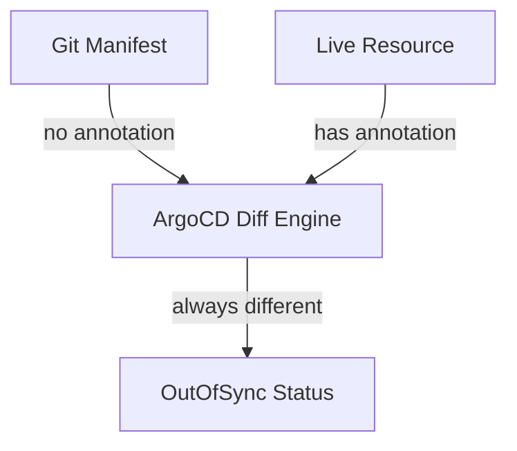

# How to Handle Last Applied Configuration Annotation Issues in ArgoCD

Author: [nawazdhandala](https://github.com/nawazdhandala)

Tags: ArgoCD, GitOps, Kubernetes, Troubleshooting, Configuration Management

Description: Learn how to diagnose and fix issues with the kubectl.kubernetes.io/last-applied-configuration annotation when using ArgoCD for GitOps deployments.

---

The `kubectl.kubernetes.io/last-applied-configuration` annotation is a legacy mechanism that kubectl uses to track what was last applied to a resource. When ArgoCD manages resources, this annotation can cause unexpected behavior - phantom diffs, bloated resources, and sync conflicts. This post explains why these problems happen and how to fix them.

## What Is the Last Applied Configuration Annotation

When you run `kubectl apply -f resource.yaml`, kubectl stores the entire content of the manifest in an annotation called `kubectl.kubernetes.io/last-applied-configuration`. It uses this annotation to compute three-way diffs on the next apply.

The annotation looks like this on a Deployment:

```yaml
metadata:
  annotations:
    kubectl.kubernetes.io/last-applied-configuration: |
      {"apiVersion":"apps/v1","kind":"Deployment","metadata":{"name":"my-app",
      "namespace":"default"},"spec":{"replicas":3,"selector":{"matchLabels":
      {"app":"my-app"}},"template":{"metadata":{"labels":{"app":"my-app"}},
      "spec":{"containers":[{"name":"app","image":"myimage:v1.2.3"}]}}}}
```

This annotation can grow quite large for complex resources. It contains the entire previous manifest as a JSON blob.

## Why This Causes Problems with ArgoCD

ArgoCD has its own diffing engine that compares the desired state in Git against the live state in the cluster. It does not need the `last-applied-configuration` annotation. However, this annotation creates several issues.

### Problem 1: Phantom Diffs

ArgoCD detects the annotation as a difference between the desired state (your Git manifest, which does not contain this annotation) and the live state (which has the annotation from a previous kubectl apply). This makes the application appear perpetually out of sync.



### Problem 2: Resource Size Bloat

The annotation stores a full copy of the manifest as JSON. For resources with large ConfigMaps, complex Deployments, or many containers, this annotation can add significant size - sometimes pushing resources close to the etcd 1MB limit.

### Problem 3: Stale Data

If someone manually applies a resource with kubectl after ArgoCD has been managing it, the annotation now contains data that does not match either Git or the actual live state. This creates a three-way confusion where ArgoCD, kubectl, and the actual state all disagree.

## Solution 1: Ignore the Annotation in ArgoCD

The simplest fix is to tell ArgoCD to ignore this annotation when computing diffs.

```yaml
apiVersion: argoproj.io/v1alpha1
kind: Application
metadata:
  name: my-app
  namespace: argocd
spec:
  project: default
  source:
    repoURL: https://github.com/org/repo.git
    targetRevision: main
    path: manifests
  destination:
    server: https://kubernetes.default.svc
    namespace: default
  ignoreDifferences:
    # Ignore the last-applied-configuration annotation globally
    - group: "*"
      kind: "*"
      jsonPointers:
        - /metadata/annotations/kubectl.kubernetes.io~1last-applied-configuration
```

To apply this globally across all applications, use the ArgoCD ConfigMap.

```yaml
apiVersion: v1
kind: ConfigMap
metadata:
  name: argocd-cm
  namespace: argocd
data:
  # Global ignore for last-applied-configuration annotation
  resource.customizations.ignoreDifferences.all: |
    jsonPointers:
      - /metadata/annotations/kubectl.kubernetes.io~1last-applied-configuration
```

Note the `~1` in the JSON pointer. This is the escaped form of `/` in JSON Pointer notation (RFC 6901).

## Solution 2: Switch to Server-Side Apply

Server-side apply does not use the `last-applied-configuration` annotation at all. Instead, it uses the `managedFields` metadata that is built into the Kubernetes API server. Switching to SSA eliminates the entire class of problems.

```yaml
apiVersion: argoproj.io/v1alpha1
kind: Application
metadata:
  name: my-app
  namespace: argocd
spec:
  project: default
  source:
    repoURL: https://github.com/org/repo.git
    targetRevision: main
    path: manifests
  destination:
    server: https://kubernetes.default.svc
    namespace: default
  syncPolicy:
    syncOptions:
      # Switch to server-side apply
      - ServerSideApply=true
```

For more details on SSA and how to handle its own conflict model, see [handling server-side apply conflicts in ArgoCD](https://oneuptime.com/blog/post/2026-02-26-argocd-server-side-apply-conflicts/view).

## Solution 3: Strip the Annotation from Existing Resources

If you want to clean up existing resources, you can remove the annotation. This is especially useful during a migration from kubectl-managed to ArgoCD-managed resources.

```bash
# Remove the annotation from a single resource
kubectl annotate deployment my-app \
  kubectl.kubernetes.io/last-applied-configuration- \
  --namespace default

# Remove from all deployments in a namespace
kubectl get deployments -n default -o name | while read deploy; do
  kubectl annotate "$deploy" \
    kubectl.kubernetes.io/last-applied-configuration- \
    -n default
done

# Remove from all resources of any kind in a namespace
for kind in deployment service configmap secret ingress; do
  kubectl get "$kind" -n default -o name 2>/dev/null | while read resource; do
    kubectl annotate "$resource" \
      kubectl.kubernetes.io/last-applied-configuration- \
      -n default 2>/dev/null
  done
done
```

After stripping the annotation, trigger a sync in ArgoCD to reconcile.

```bash
argocd app sync my-app --prune=false
```

## Solution 4: Use a Resource Hook to Clean Annotations

You can set up a PreSync hook that strips the annotation before ArgoCD applies changes.

```yaml
apiVersion: batch/v1
kind: Job
metadata:
  name: strip-last-applied
  namespace: default
  annotations:
    argocd.argoproj.io/hook: PreSync
    argocd.argoproj.io/hook-delete-policy: HookSucceeded
spec:
  template:
    spec:
      serviceAccountName: annotation-cleaner
      containers:
        - name: cleaner
          image: bitnami/kubectl:1.28
          command:
            - /bin/sh
            - -c
            - |
              # Remove last-applied-configuration from all deployments
              kubectl get deployments -n default -o name | while read d; do
                kubectl annotate "$d" \
                  kubectl.kubernetes.io/last-applied-configuration- \
                  -n default 2>/dev/null || true
              done
      restartPolicy: Never
  backoffLimit: 1
```

## Preventing the Annotation from Being Created

The root cause is usually someone running `kubectl apply` on a resource that ArgoCD manages. Here are strategies to prevent this.

### Enforce GitOps-Only Changes

Use Kubernetes RBAC to restrict direct kubectl apply access.

```yaml
# ClusterRole that prevents direct apply on ArgoCD-managed namespaces
apiVersion: rbac.authorization.k8s.io/v1
kind: ClusterRole
metadata:
  name: read-only-managed
rules:
  - apiGroups: ["*"]
    resources: ["*"]
    verbs: ["get", "list", "watch"]
    # No create, update, patch, delete
```

### Use an Admission Webhook to Block kubectl Apply

A validating webhook can reject client-side applies on resources that have ArgoCD tracking labels.

```yaml
apiVersion: admissionregistration.k8s.io/v1
kind: ValidatingWebhookConfiguration
metadata:
  name: block-direct-apply
webhooks:
  - name: block.kubectl.apply
    rules:
      - apiGroups: ["apps"]
        apiVersions: ["v1"]
        operations: ["UPDATE"]
        resources: ["deployments"]
    clientConfig:
      service:
        name: apply-blocker
        namespace: kube-system
        path: /validate
    admissionReviewVersions: ["v1"]
    sideEffects: None
```

### Use kubectl create Instead of apply

For one-off resources that do not need declarative management, use `kubectl create` or `kubectl replace` instead of `kubectl apply`. These commands do not create the last-applied-configuration annotation.

```bash
# This creates the annotation
kubectl apply -f resource.yaml

# These do NOT create the annotation
kubectl create -f resource.yaml
kubectl replace -f resource.yaml
```

## Diagnosing Annotation-Related Issues

When you suspect the annotation is causing problems, check for it directly.

```bash
# Check if a resource has the annotation
kubectl get deployment my-app -o jsonpath='{.metadata.annotations}' | jq 'keys'

# Check the size of the annotation
kubectl get deployment my-app -o json | \
  jq '.metadata.annotations["kubectl.kubernetes.io/last-applied-configuration"] | length'

# Find all resources with the annotation in a namespace
kubectl get all -n default -o json | \
  jq -r '.items[] | select(.metadata.annotations["kubectl.kubernetes.io/last-applied-configuration"] != null) | .kind + "/" + .metadata.name'
```

## Summary

The `last-applied-configuration` annotation is a holdover from client-side apply that causes friction with ArgoCD. The cleanest long-term solution is to switch to server-side apply, which eliminates the annotation entirely. In the short term, configure `ignoreDifferences` globally to suppress the phantom diffs, and strip existing annotations from resources ArgoCD manages. Most importantly, enforce a workflow where all changes go through Git so the annotation never gets created in the first place.
